# VTT.PROTOCOL-ASG-001 — Ciclo de Asignación y Cierre de Tarea

| Campo | Valor |
|---|---|
| **Código** | `VTT.PROTOCOL-ASG-001` |
| **Título** | Ciclo de Asignación y Cierre de Tarea |
| **Versión** | 1.2.0 |
| **Fecha** | 2026-05-14 |
| **Autor** | PM Martin Rivas |
| **Aplica a** | TL (ejecutor principal), PJM (proveedor de inputs), Agentes ejecutores, PM (aprobación terminal), SA (reviewer opcional) |
| **Estado** | Aprobado para uso |
| **Tipo** | Genérico VTT — aplica a cualquier proyecto y cualquier fase del SDLC |
| **Reglas aplicables (Nivel 0)** | Ver `00.Rules/rules_catalog.json` — `query_rules.py --simulate-task <TASK_ID>` |
| **Modelo de worktrees** | Por rol (no por tarea). Cada rol incluido TL tiene worktree dedicado + workspace VSCode. Ver `GUIA_WORKTREES_MEMORY_SERVICE.md` v2.1 |

---

## Tabla de Contenido

1. [Propósito](#1-propósito)
2. [Campo de Aplicación](#2-campo-de-aplicación)
3. [Responsabilidades](#3-responsabilidades)
4. [Definiciones](#4-definiciones)
5. [Procedimiento](#5-procedimiento)
   - 5.0 [FASE 0 — Pre-requisitos](#50-fase-0--pre-requisitos)
   - 5.1 [FASE 1 — Planificación del sprint](#51-fase-1--planificación-del-sprint)
   - 5.2 [FASE 2 — Asignación](#52-fase-2--asignación)
   - 5.3 [FASE 3 — Ejecución del agente](#53-fase-3--ejecución-del-agente)
   - 5.4 [FASE 3.5 — Sub-ciclo de Issue](#54-fase-35--sub-ciclo-de-issue)
   - 5.5 [FASE 4 — Cierre con Modelo Dinámico](#55-fase-4--cierre-con-modelo-dinámico)
   - 5.6 [FASE 5 — Cierre del Sprint](#56-fase-5--cierre-del-sprint)
6. [Referencias Cruzadas](#6-referencias-cruzadas)
7. [Resumen de Revisiones](#7-resumen-de-revisiones)
8. [Anexos](#anexos)

---

## 1. Propósito

Establecer el proceso normativo completo para asignar tareas a agentes, ejecutarlas, revisarlas y cerrarlas en VTT bajo el modelo dinámico V4 con trazabilidad completa de TrackableItems, evidencias y devlog.

El protocol cubre el ciclo end-to-end desde que el TL recibe el handoff del PJM (con `SETUP_S[N]`, `HANDOFF_TL_S[N]`, `CLOSURE_S[N]` ya generados) hasta que el sprint cierra con todas las firmas y la aprobación terminal del PM.

## 2. Campo de Aplicación

Aplica a:

- Cualquier proyecto que use VTT como sistema de gestión
- Cualquier fase del SDLC (Discovery, Planning, Analysis, Design, Development, Testing, Deploy, Operations)
- Cualquier sprint del proyecto (no se limita a Development)
- Cualquier rol de agente ejecutor (BE, DB, FE, DO, QA, DL, UX, AR, SA)

No aplica a:

- Generación del Handoff PM→PJM (ver `SOP_GENERACION_HO_PJM`)
- Generación del trío de documentos por el PJM (ver `SOP_GENERACION_SPRINT_DOCS`)
- Procesos internos del backend VTT (código de plataforma)

## 3. Responsabilidades

### 3.1 PM (Product Manager)
- Aprobar terminalmente cada tarea (`task_completed → task_approved`)
- Aprobar el sprint completo (firma APR-S[N])
- Resolver escalaciones del TL
- Mantener el HO Master actualizado

### 3.2 PJM (Project Manager)
- Generar y entregar al TL los 3 documentos del sprint: `SETUP_S[N]`, `HANDOFF_TL_S[N]`, `CLOSURE_S[N]`
- Notificar al TL cuando los documentos están listos (trigger de FASE 0)
- Coordinar el calendario de sprints y dependencias inter-sprint

### 3.3 TL (Tech Lead) — Ejecutor principal del Protocol
- Validar HO completo y coherente
- Planificar el sprint y crear estructura VTT (Release/Sprint/Deliveries/Tasks)
- Generar BRIEFs y ASSIGNMENTs según LL-005 (desde código real, no desde handoff)
- Asignar tareas a agentes con CAs y TIs vinculados
- Hacer code review con aplicación del modelo dinámico
- Firmar stage development al cierre de sprint

### 3.4 Agentes ejecutores (BE, DB, FE, DO, QA, DL, UX, AR, SA)
- Leer ASSIGNMENT + BRIEF + OPERATIVO antes de iniciar
- Ejecutar el workflow del ASSIGNMENT (15 pasos del template v3.1)
- Registrar devlog entries y reportar CAs durante ejecución
- Generar manifest v1.0 al finalizar
- Reportar bloqueantes como Issues si los hay

### 3.5 SA (Solution Analyst) — Reviewer opcional
- Revisar ASSIGNMENTs cuando el TL lo solicite (proyectos críticos)
- Validar coherencia contra documentos de Analysis y Design

### 3.6 AR (Architect) y DL (Design Lead)
- Firmar stages de integración y diseño respectivamente al cierre de sprint
- Solo participan si el sprint los involucra

## 4. Definiciones

**HO (Handoff):** documento que transfiere contexto y plan de acción de un rol a otro.

**HANDOFF_TL_S[N]:** documento que el PJM entrega al TL al inicio del sprint N. Contiene briefs por agente, dependencias, CAs verificables, gates de aprobación.

**SETUP_S[N]:** script Python que el TL ejecuta para crear la estructura VTT del sprint (Release, Sprint, Deliveries, Tasks, Dependencias).

**CLOSURE_S[N]:** template de evidencia que el TL llena al cierre del sprint con firmas API.

**BRIEF:** diseño original inmutable de una tarea. Generado por el PJM o TL en FASE 1.

**ASSIGNMENT:** snapshot del estado del proyecto al asignar la tarea — incluye API/recursos disponibles desde el código real (LL-005).

**SKL-REPORT-01:** formato estándar de reporte de entrega del agente al cerrar su workflow.

**APR-TL:** comentario formal del TL al aprobar el code review de una tarea.

**Modelo dinámico:** conjunto de 4 acciones del cierre — crear TIs detectados, vincular evidencias con marker, resolver devlog entries, registrar en manifest.

**TI (TrackableItem):** RF, ADR, NFR, Assumption, Constraint, BR, UC, US, tech_debt — items trackeables en VTT.

**CA (Acceptance Criterion):** criterio bloqueante que la tarea debe cumplir para aprobarse.

**Review Gate:** validación VTT (`canProceedToReview`) que verifica que la tarea puede pasar a review.

**Issue:** bloqueante reportado por un agente que requiere intervención de otro rol.

**Manifest:** JSON auditable de la tarea cerrada. v1.0 = agente al cerrar, v1.5 = TL al aprobar.

**LL-005:** lección aprendida — el ASSIGNMENT debe llenarse desde artefactos verificados del código real, no desde el handoff del PM.

**PROC-MANIFEST-01:** lección aprendida — el manifest debe generarse AL FINAL del workflow para evitar campos null.

## 5. Procedimiento

El ciclo completo tiene **47 pasos** organizados en **6 fases secuenciales** + **1 sub-ciclo opcional** (Issue).

```
FASE 0   →  FASE 1   →  FASE 2   →  FASE 3   →  FASE 4   →  FASE 5
Pre-     Planifi-     Asigna-    Ejecu-      Cierre      Cierre
requis.  cación       ción       ción        tarea       Sprint
                                 agente

         FASE 3.5 (sub-ciclo opcional cuando hay Issue)
```

### 5.0 FASE 0 — Pre-requisitos

> **Trigger de inicio:** PJM notifica al TL que `HANDOFF_TL_S[N].md` está listo en el repo.

5.0.1 TL recibe notificación del PJM con ruta del HANDOFF_TL_S[N] → **[ACTIVIDAD]** → invoca `SKL-COMMENT-01` (acuse de recibo)

5.0.2 TL valida inputs completos del HO (briefs por agente, dependencias, CAs verificables, gates) → **[PROCESO]** → ver `VTT.WORKFLOW-ASG-001.001_validar_inputs_handoff`

5.0.3 ¿HO completo y coherente? → **[DECISIÓN]**
- **NO** → TL notifica al PJM con lista de faltantes/inconsistencias → STOP hasta que PJM corrija
- **SÍ** → continuar

5.0.4 TL valida gate de entrada del sprint (si N>1: CIERRE-S[N-1] firmado por TL, AR, DL si aplica, y APR-S[N-1] por PM) → **[ACTIVIDAD]** → invoca `SKL-QUERY-03`

5.0.5 ¿Gate de entrada cumplido? → **[DECISIÓN]**
- **NO** → escalar al PM, esperar firmas pendientes
- **SÍ** → continuar a FASE 1

### 5.1 FASE 1 — Planificación del sprint

5.1.1 TL analiza el HO: extrae scope, roles activos, milestones, riesgos del sprint → **[PROCESO]** → ver `VTT.WORKFLOW-ASG-001.002_analizar_handoff`

5.1.2 TL determina datos de las tareas (deliverables, horas, complejidad, dependencias) desde `HANDOFF §5` y `§7 VTT Planning Data` → **[PROCESO]** → ver `VTT.WORKFLOW-ASG-001.003_determinar_datos_tareas`

5.1.3 ¿Es S1 (primer sprint del proyecto)? → **[DECISIÓN]**
- **SÍ** → setup proyecto completo (Release + Sprint + Deliveries + SETUP-S1)
- **NO** → solo setup del sprint (Sprint + Deliveries + SETUP-S[N])

5.1.4 TL ejecuta `SETUP_S[N].md` (script Python provisto por PJM): crear Release/Sprint/Deliveries/Tasks/Dependencias → **[PROCESO]** → ver `VTT.WORKFLOW-ASG-001.004_setup_sprint_vtt`

5.1.5 TL mueve tarea SETUP-S[N] a `in_progress`, ejecuta y valida, luego cierra → **[ACTIVIDAD]** → invoca `SKL-STATUS-01` + `SKL-STATUS-02` + `SKL-STATUS-03`

5.1.6 TL mapea dependencias del sprint (cross-sprint desde `CONTEXTO_S[N-1]` + intra-sprint del HO §6) → **[PROCESO]** → ver `VTT.WORKFLOW-ASG-001.005_mapear_dependencias`

5.1.7 TL crea tareas del sprint en VTT con dependencias + asocia a Deliveries → **[PROCESO]** → ver `VTT.WORKFLOW-ASG-001.006_crear_tareas_sprint`

5.1.8 ¿Grafo de dependencias correcto (0 huérfanas, 0 hojas, cadena válida)? → **[DECISIÓN]**
- **NO** → corregir antes de continuar
- **SÍ** → continuar

5.1.9 TL genera BRIEFs (uno por tarea) y los sube como attachments → **[PROCESO]** → ver `VTT.WORKFLOW-ASG-001.007_generar_subir_briefs`

### 5.2 FASE 2 — Asignación

> **Regla de oro:** UNA tarea a la vez. No asignar batch salvo autorización explícita del PM.

5.2.1 TL selecciona siguiente tarea a asignar según orden de dependencias → **[ACTIVIDAD]** → invoca `SKL-QUERY-05`

5.2.2 ¿Dependencias upstream de la tarea están en `task_approved` o `task_completed`? → **[DECISIÓN]**
- **NO** → esperar — no asignar
- **SÍ** → continuar

5.2.3 TL analiza dependencias de **datos** de la tarea (docs fuente reales en código/repo, no en el brief) → **[PROCESO]** → ver `VTT.WORKFLOW-ASG-001.008_analizar_dependencias_datos`

5.2.4 ¿Inputs de datos disponibles y verificados (LL-005)? → **[DECISIÓN]**
- **NO** → bloquear tarea (`task_on_hold`) + crear ISSUE + escalar al PM
- **SÍ** → continuar

5.2.5 TL genera ASSIGNMENT desde artefactos reales — NO desde el HO → **[PROCESO]** → ver `VTT.WORKFLOW-ASG-001.009_generar_assignment`

5.2.6 TL crea Criterios de Aceptación en VTT (DoD + integración + acceptance) → **[ACTIVIDAD]** → invoca `SKL-TRACK-02`

5.2.7 TL vincula TrackableItems heredados (implements/related_to del brief) → **[ACTIVIDAD]** → invoca `SKL-TRACK-01`

5.2.8 TL sube ASSIGNMENT como attachment `fileType=assignment` → **[ACTIVIDAD]** → invoca `SKL-ATTACH-01`

5.2.9 TL asigna la tarea al agente (PATCH `assignedToId`) → **[ACTIVIDAD]** → invoca `SKL-TASK-03`

5.2.10 **TL verifica worktree del rol del agente** (PROC-COORD-01) → **[ACTIVIDAD]**
   - Los worktrees son **por rol, no por tarea** — pre-creados una vez por proyecto
   - Ubicación estándar: `.vtt/worktrees/<repo>-<rol>/`
     - `.vtt/worktrees/backend-be/`, `.vtt/worktrees/backend-do/`, `.vtt/worktrees/backend-db/`, ...
     - `.vtt/worktrees/project-tl/`, `.vtt/worktrees/project-pm/`, ...
   - Si el worktree del rol del agente NO existe (rol nuevo en el proyecto) → crear:
     ```
     git worktree add ../.vtt/worktrees/<repo>-<rol> -b <stem>/<rol>
     ```
   - El agente reutilizará este worktree para todas sus tareas (cambia de branch dentro del mismo worktree)
   - **Razón:** evitar pérdida de código por `git checkout` cross-agente (incidente MS-286)
   - Ver `GUIA_WORKTREES_MEMORY_SERVICE.md` v2.1 para detalle

5.2.11 **TL genera execution_manifest.json para la tarea** → **[ACTIVIDAD]**
   - Path: `.vtt/manifests/[TASK_ID].execution.json` (copia del template `_template.execution.json`)
   - Contenido clave que el TL llena:
     - `taskId`, `title`, `sprint`, `phase`
     - `repos[]` — qué repos toca la tarea (backend, project, frontend, api)
     - `agents[]` — un objeto por agente involucrado con:
       - `agentId`, `agentUuid`, `role`
       - `repoId`, `branch: feature/<TASK_ID>`, `assignedWorkdir: .vtt/worktrees/<repo>-<rol>`
       - **`allowedPaths`** (paths del repo que el agente PUEDE tocar)
       - **`deniedPaths`** (paths que el agente NO debe tocar: `.env`, `.vtt/**`, `node_modules/**`, etc.)
       - `expectedOutputs` (reports, diffs, manifests esperados)
     - `rules` — `commitPattern`, `noDirectMergeToMain`, etc.
     - `integration` — estrategia (`pr_per_agent`, `consolidated_by: TL`)
   - **Output:** archivo JSON local en `.vtt/manifests/<TASK_ID>.execution.json`
   - El agente lo lee antes de empezar para conocer sus límites operativos

5.2.12 **TL consulta Reglas aplicables** (Nivel 0) → **[ACTIVIDAD]** → ejecuta `python 00.Rules/query_rules.py --simulate-task [TASK_ID]`
   - Lista las reglas activas que el agente debe respetar
   - Filtra por: scope, phase, role, task_criteria, capabilities
   - Output va embebido en el mensaje al agente (paso siguiente)

5.2.13 TL genera mensaje al agente y lo postea como comment → **[ACTIVIDAD]** → invoca `SKL-MESSAGE-01` (auto vía `scripts/gen_mensaje.py --post`)
   - Incluye:
     - **Worktree asignado**: `.vtt/worktrees/<repo>-<rol>/` (no por tarea)
     - **Branch a crear**: `feature/<TASK_ID>` desde `origin/main`
     - **execution_manifest path**: `.vtt/manifests/<TASK_ID>.execution.json` (debe leerse antes de empezar)
     - **Workspace VSCode**: `.vtt/workspaces/<repo>-<rol>.code-workspace` (abrir esta ventana)
     - **Lista de Reglas aplicables** del paso 5.2.12

> **Nota operativa:** Cuando hay N agentes activos en paralelo, el equipo abre N ventanas VSCode simultáneamente (una por workspace de rol). El TL también opera en su propia ventana con su workspace `.vtt/workspaces/project-tl.code-workspace`. No hay "ventana coordinadora central".

### 5.3 FASE 3 — Ejecución del agente

> **Esta fase ocurre fuera del TL, pero el Protocol la refleja para trazabilidad.**

5.3.1 Agente lee mensaje + ASSIGNMENT + BRIEF + OPERATIVO de su rol → **[ACTIVIDAD]** → invoca `SKL-AUTH-01` + lectura de archivos
   - **Verifica las Reglas aplicables** listadas en el mensaje (referencia a 00.Rules)

5.3.2 **Agente verifica que está en su worktree de rol** (PROC-COORD-01) → **[ACTIVIDAD]**
   - El agente abre la ventana VSCode con su workspace: `.vtt/workspaces/<repo>-<rol>.code-workspace`
   - Verifica directorio: `cd .vtt/worktrees/<repo>-<rol>` (path fijo del rol, no del TASK_ID)
   - Verifica branch:
     ```
     git status                # debe estar en main o branch limpia
     git checkout main && git pull
     git checkout -b feature/<TASK_ID> origin/main
     ```
   - PROHIBIDO: `git checkout` en clones base, clonar de nuevo, trabajar en worktree de otro rol

5.3.2.b **Agente lee su execution_manifest.json** → **[ACTIVIDAD]**
   - Path: `.vtt/manifests/<TASK_ID>.execution.json` (generado por TL en 5.2.11)
   - Extrae para SU `agentId`:
     - `allowedPaths` — archivos que PUEDE tocar
     - `deniedPaths` — archivos que NO debe tocar
     - `expectedOutputs` — qué debe producir
     - `rules.commitPattern` — formato exacto de commits
   - Si su `agentId` NO aparece en el manifest → escalar al TL inmediatamente
   - Si toca archivos fuera de `allowedPaths` durante ejecución → escalar al TL

5.3.3 Agente mueve tarea a `task_in_progress` → **[ACTIVIDAD]** → invoca `SKL-STATUS-01`

5.3.4 Agente ejecuta el workflow del ASSIGNMENT (15 pasos del `TEMPLATE_ASIGNACION_TAREARev.md` v3.1) → **[PROCESO]** → ver workflow del template
   - Durante ejecución, agente registra **devlog entries** con los 6 status válidos:
     - `pending` (default — entry recién creado)
     - `acknowledged` (TL/PM tomó conocimiento)
     - `in_progress` (se está trabajando)
     - `resolved` (resuelto — `resolution` REQUERIDO)
     - `deferred` (diferido a otra fase — `deferredToPhaseId` REQUERIDO)
     - `wont_fix` (no se va a corregir — `resolution` REQUERIDO con justificación)
   - Entries con `severity=critical|high` y `status=pending` bloquean el Review Gate

5.3.5 **Agente revisa Living Documents impactados** → **[PROCESO]** → ver `VTT.WORKFLOW-ASG-001.017_revisar_living_documents`
   - Para cada LD del catálogo del proyecto (ej. LD-01 a LD-15 en Memory Service):
     - **¿Esta tarea modifica algo que afecta al LD?**
     - SÍ → actualizar el LD + registrar Document Impact (paso 5.3.6)
     - NO → declarar "sin cambios" en devlog `observation`
   - Catálogo de LDs del proyecto: ver `LIVING_DOCUMENTS_[PROYECTO].md`

5.3.6 **Agente registra Document Impacts** → **[ACTIVIDAD]** → POST `/api/tasks/:id/document-impacts`
   - Para cada documento afectado: `{documentSourceId, impactType: added|modified|removed|referenced, description}`
   - Tipos:
     - `added` — nuevo archivo creado
     - `modified` — archivo existente cambió
     - `removed` — archivo eliminado
     - `referenced` — el código nuevo referencia este doc (sin modificarlo)
   - **Gotcha conocido (DEBT-INFRA-VTT-01):** endpoint exige `documentSourceId` no accesible al DO → workaround: declarar via devlog `observation` con detalle

5.3.7 **Agente ejecuta Hardcode Check** → **[ACTIVIDAD]**
   - Comando estándar: `grep -rn '<patrones de secretos>' src/ --exclude-dir=.git --exclude-dir=node_modules`
   - Patrones: passwords, API keys, tokens, service keys, JWT secrets, DB strings
   - Resultados:
     - **0 findings críticos/altos** → continuar
     - **N findings reales** → corregir antes de in_review
     - **N False Positives** (ej. comandos `grep` auto-referenciales dentro de docs) → justificar en devlog `decision` con detalle de cada FP
   - Sin Hardcode Check ejecutado → bloquea Review Gate

5.3.8 ¿Agente encontró un bloqueante? → **[DECISIÓN]**
- **SÍ** → invocar FASE 3.5 (Sub-ciclo de Issue)
- **NO** → continuar

5.3.9 Agente entrega: reporta CAs (`PATCH /criteria/:cid`) → posteo SKL-REPORT-01 como comment → mueve tarea a `task_in_review` → genera manifest v1.0 → **[PROCESO]** → ver `VTT.WORKFLOW-ASG-001.010_entrega_agente`
   - SKL-REPORT-01 incluye obligatoriamente:
     - **Living Documents declarados** (LDs modificados + LDs "sin cambios")
     - **Document Impacts registrados** (lista de impactType + path)
     - **Hardcode Check** (findings totales, críticos/altos = 0, FPs justificados con devlog id)
     - Devlog entries por status (resolved/pending count)

### 5.4 FASE 3.5 — Sub-ciclo de Issue

> **Solo se activa si el agente encuentra un bloqueante. No es parte del flujo normal.**

5.4.1 Agente crea Issue en VTT con tipo + severidad → **[ACTIVIDAD]** → invoca `SKL-ISSUE-01`

5.4.2 Agente solicita on_hold + PM/TL pone tarea en `task_on_hold` (`PUT /on-hold` con `x-user-id`) → **[ACTIVIDAD]** → invoca `SKL-STATUS-05`

5.4.3 TL recibe issue, analiza, clasifica severidad (S1-S4) y decide acción → **[PROCESO]** → ver `VTT.WORKFLOW-ASG-001.011_analizar_issue`

5.4.4 ¿Issue requiere tarea correctiva nueva? → **[DECISIÓN]**
- **SÍ** → crear tarea fix con `sourceIssueId` (apunta a este Issue)
- **NO** → resolver issue directamente (ej. acción del PM, ajuste de scope)

5.4.5 La tarea fix sigue el ciclo completo de este Protocol (recursión) → **[PROCESO]** → recursión a 5.2

5.4.6 Cuando todas las Issues de la tarea original se resuelven, el sistema VTT hace auto-resume: tarea vuelve a `previousStatus` (típicamente `task_in_review` o `task_in_progress`) → **[ACTIVIDAD]** (sistema VTT)

5.4.7 TL notifica al agente original que puede continuar (si on_hold ocurrió antes de in_review) → **[ACTIVIDAD]** → invoca `SKL-COMMENT-01`

5.4.8 Agente original retoma desde el paso donde se bloqueó y continúa hasta 5.3.5

### 5.5 FASE 4 — Cierre con Modelo Dinámico

> **Trigger:** tarea en `task_in_review` con manifest v1.0 + SKL-REPORT-01 posteados.

5.5.1 TL verifica Review Gate (`canProceedToReview=true`, 0 blockers) → **[ACTIVIDAD]** → invoca `SKL-TRACK-04`

5.5.2 ¿Review Gate OK? → **[DECISIÓN]**
- **NO** → devolver con feedback al agente (`task_rejected` con razón) — NO cerrar
- **SÍ** → continuar

5.5.3 TL verifica Acceptance Criteria (todos en `met` con evidencia válida) → **[ACTIVIDAD]** → invoca `SKL-QUERY-03`

5.5.4 TL verifica attachments (`brief`, `assignment`, `devlog`, `code_logic`/placeholder, `manifest v1.0`) → **[ACTIVIDAD]** → invoca `SKL-QUERY-03`

5.5.5 TL verifica PRs en GitHub (state=OPEN, mergeable=MERGEABLE, sin conflictos) → **[ACTIVIDAD]** → invoca `SKL-GIT-04` (lectura)

5.5.5.b **TL verifica disciplina de worktree del agente** (Paso 4b — PROC-CIERRE v2.1) → **[ACTIVIDAD]**
   - Confirmar que el agente trabajó en el worktree correcto:
     ```
     cd .vtt/worktrees/<repo>-<rol>
     git status                         # branch feature/<TASK_ID> activa
     git log --oneline -5               # commits del agente
     ```
   - Confirmar que el **diff respeta `allowedPaths`** del execution_manifest:
     ```
     git diff main...feature/<TASK_ID> --name-only
     # cada path debe estar en allowedPaths del manifest
     ```
   - Confirmar **no hay cross-contamination** con worktrees de otros roles:
     ```
     git worktree list                  # cada worktree en su branch propia
     ```
   - Si hay archivos fuera de `allowedPaths` → rechazar (`task_rejected`) + escalar a TL Ejecutor
   - Si la branch desapareció del worktree del agente → algo se rompió → escalar

5.5.6 **TL verifica Living Documents declarados** por el agente → **[ACTIVIDAD]**
   - Cada LD impactado debe tener su Document Impact registrado en VTT (o devlog observation con workaround)
   - LDs declarados "sin cambios" deben tener devlog `observation` con justificación
   - Si falta declaración de un LD que la tarea claramente toca → rechazar y devolver

5.5.7 **TL verifica Hardcode Check** → **[ACTIVIDAD]**
   - Findings críticos/altos = 0
   - FPs justificados con devlog `decision` (verificar que el devlog existe y la justificación es válida)
   - Si hay finding crítico no resuelto → rechazar

5.5.8 TL verifica contenido técnico contra SPEC + ASSIGNMENT (curl real a endpoints BE, grep en repo, etc.) → **[PROCESO]** → ver `VTT.WORKFLOW-ASG-001.012_code_review_tecnico`

5.5.9 ¿Code review aprobado? → **[DECISIÓN]**
- **NO** → devolver con feedback (`task_rejected`) — registrar findings
- **SÍ** → continuar a aplicar modelo dinámico

5.5.10 TL aplica **Modelo Dinámico** (las 4 acciones de cierre) → **[PROCESO]** → ver `VTT.WORKFLOW-ASG-001.013_aplicar_modelo_dinamico`
   - 5.5.10.a Crear TIs detectados por el agente (tech_debts, items para trackeo)
   - 5.5.10.b Vincular TIs nuevos a la tarea (`related_to`)
   - 5.5.10.c Agregar evidencias a TIs vinculadas con marker `[TASK:MS-XXX] [SPRINT:SX]`
   - 5.5.10.d Resolver devlog entries pendientes con los 6 status válidos:
     - `pending → resolved` (con `resolution`)
     - `pending → deferred` (con `deferredToPhaseId`)
     - `pending → wont_fix` (con `resolution` justificando)
     - Acknowledged / in_progress son intermedios usados durante ejecución

5.5.11 TL postea **APR-TL comment** con resumen del modelo dinámico aplicado → **[ACTIVIDAD]** → invoca `SKL-COMMENT-03` + `VTT.TEMPLATE-APR-001`

5.5.12 TL mueve tarea a `task_completed` (`PATCH /status` con `reason`) → **[ACTIVIDAD]** → invoca `SKL-STATUS-03`

5.5.13 TL actualiza manifest a **v1.5** con `review.tl_review` + `delivery.dynamic_model_actions` → **[PROCESO]** → ver `VTT.WORKFLOW-ASG-001.014_actualizar_manifest_v15`

5.5.14 TL valida cierre (devlog all resolved, evidencias con marker, manifest subido) → **[ACTIVIDAD]** → invoca `SKL-QUERY-03`

5.5.15 **TL valida cumplimiento de Reglas auto_detect** → **[ACTIVIDAD]**
   - Para cada regla con `markers.auto_detect=true` del catálogo aplicable a la tarea
   - Ejecuta el `auto_detect_query` (ej. `diff(src_tree, code_logic_tree)`, `grep 'console.log' on diff`, etc.)
   - Si detecta violación → registrar en `rule_violations` (futuro IMPROVE-004) o agregar finding al manifest
   - Reglas que bloquean Review Gate ya fueron filtradas en 5.5.1

5.5.16 TL notifica al PM para aprobación terminal (`task_approved`) → **[ACTIVIDAD]** → invoca `SKL-COMMENT-01`

5.5.17 PM mueve tarea a `task_approved` (`PATCH /status` con `changedBy=PM`) → **[ACTIVIDAD]** → invoca `SKL-STATUS-04` (PM)

5.5.18 **Cleanup branch local en worktree del agente** (Paso 9 — PROC-CIERRE v2.1) → **[ACTIVIDAD]**
   - Solo después de que la tarea esté en `task_approved` Y los PRs estén mergeados a main
   - Deja el worktree del agente limpio para su próxima tarea:
     ```
     cd .vtt/worktrees/<repo>-<rol>
     git checkout main
     git pull
     git branch -d feature/<TASK_ID>            # borrar branch local
     ```
   - **(Opcional)** archivar el execution_manifest:
     ```
     mv .vtt/manifests/<TASK_ID>.execution.json .vtt/manifests/archived/
     ```
   - **NO se borra el worktree** (es por rol, persiste entre tareas)
   - El agente reutiliza el mismo worktree para su siguiente tarea

### 5.6 FASE 5 — Cierre del Sprint

> **Trigger:** todas las tareas del sprint están en `task_approved`.

5.6.1 TL verifica que todas las tareas del sprint están aprobadas → **[ACTIVIDAD]** → invoca `SKL-QUERY-04`

5.6.2 TL ejecuta tarea **TL-S[N]-REV** (Code Review) con firma API → **[PROCESO]** → ver `VTT.WORKFLOW-ASG-001.015_firma_stage_development`

5.6.3 AR ejecuta firma de stage `integration` → **[ACTIVIDAD]** → fuera de este Protocol (AR opera independiente)

5.6.4 ¿Sprint tiene FE? → **[DECISIÓN]**
- **SÍ** → DL firma stage `design`
- **NO** → saltar firma DL (justificar en CLOSURE)

5.6.5 TL ejecuta tarea **CIERRE-S[N]** llenando `CLOSURE_S[N].md` con métricas, firmas y milestone GO/NO-GO → **[PROCESO]** → ver `VTT.WORKFLOW-ASG-001.016_cierre_sprint_closure` + `VTT.TEMPLATE-CLO-001`

5.6.6 TL espera APR-S[N] del PM (firma terminal del sprint) → **[ACTIVIDAD]**

5.6.7 PM aprueba APR-S[N] (mueve tarea APR-S[N] a `task_completed`) → **[ACTIVIDAD]** (fuera de este Protocol)

5.6.8 Sprint S[N] CERRADO → TL notifica al PJM para iniciar preparación de S[N+1] → **[ACTIVIDAD]** → invoca `SKL-COMMENT-01`

> **Fin del Protocol.** El siguiente sprint reinicia desde FASE 0.

---

## 6. Referencias Cruzadas

### Workflows del Protocol (Nivel 3 — Sub-procesos)

| Código | Título | Invocado en |
|---|---|---|
| `VTT.WORKFLOW-ASG-001.001` | Validar inputs del handoff | 5.0.2 |
| `VTT.WORKFLOW-ASG-001.002` | Analizar handoff y extraer scope | 5.1.1 |
| `VTT.WORKFLOW-ASG-001.003` | Determinar datos de tareas individuales | 5.1.2 |
| `VTT.WORKFLOW-ASG-001.004` | Setup inicial — Crear estructura VTT | 5.1.4 |
| `VTT.WORKFLOW-ASG-001.005` | Mapear dependencias del sprint | 5.1.6 |
| `VTT.WORKFLOW-ASG-001.006` | Crear tareas del sprint con deps + Deliveries | 5.1.7 |
| `VTT.WORKFLOW-ASG-001.007` | Generar y subir BRIEFs | 5.1.9 |
| `VTT.WORKFLOW-ASG-001.008` | Analizar dependencias de datos por tarea | 5.2.3 |
| `VTT.WORKFLOW-ASG-001.009` | Generar ASSIGNMENT desde código real | 5.2.5 |
| `VTT.WORKFLOW-ASG-001.010` | Entrega del agente (referencia) | 5.3.5 |
| `VTT.WORKFLOW-ASG-001.011` | Analizar Issue y decidir acción | 5.4.3 |
| `VTT.WORKFLOW-ASG-001.012` | Code review técnico | 5.5.6 |
| `VTT.WORKFLOW-ASG-001.013` | Aplicar Modelo Dinámico al cierre | 5.5.8 |
| `VTT.WORKFLOW-ASG-001.014` | Actualizar manifest a v1.5 | 5.5.11 |
| `VTT.WORKFLOW-ASG-001.015` | Firma de stage development | 5.6.2 |
| `VTT.WORKFLOW-ASG-001.016` | Cierre de sprint CLOSURE | 5.6.5 |
| `VTT.WORKFLOW-ASG-001.017` | Revisar Living Documents impactados | 5.3.5 |
| `VTT.WORKFLOW-ASG-001.018` | Registrar Document Impacts | 5.3.6 |
| `VTT.WORKFLOW-ASG-001.019` | Ejecutar Hardcode Check | 5.3.7 |
| `VTT.WORKFLOW-ASG-001.020` | Verificar worktree por rol del agente | 5.2.10 |
| `VTT.WORKFLOW-ASG-001.021` | Generar execution_manifest.json | 5.2.11 |
| `VTT.WORKFLOW-ASG-001.022` | Agente lee execution_manifest y verifica allowedPaths | 5.3.2.b |
| `VTT.WORKFLOW-ASG-001.023` | Verificar disciplina de worktree (TL Reviewer) | 5.5.5.b |
| `VTT.WORKFLOW-ASG-001.024` | Cleanup branch local post-aprobación | 5.5.18 |

### Skills referenciadas (Nivel 2)

| Código | Uso |
|---|---|
| `SKL-AUTH-01` | Obtener JWT en cualquier paso |
| `SKL-COMMENT-01` | Acuses de recibo, notificaciones |
| `SKL-COMMENT-03` | APR-TL |
| `SKL-QUERY-03` | Detalle de tarea |
| `SKL-QUERY-04` | Avance de fases |
| `SKL-QUERY-05` | Estado de fase asignable |
| `SKL-STATUS-01..06` | Cambios de status |
| `SKL-ATTACH-01` | Subir attachments |
| `SKL-TASK-03` | Asignar tarea a agente |
| `SKL-TRACK-01..04` | TrackableItems, CAs, Review Gate |
| `SKL-ISSUE-01` | Crear Issue |
| `SKL-GIT-04` | PR en GitHub |
| `SKL-MESSAGE-01` | Generar mensaje al agente (auto) |
| `SKL-DYNAMIC-MODEL-01` | Cierre con modelo dinámico |
| `SKL-MANIFEST-01` | Actualizar manifest v1.0/v1.5 |

### Templates referenciados

| Código | Uso |
|---|---|
| `TEMPLATE_BRIEF_LARGE.md` | Generación de BRIEFs (5.1.9) |
| `TEMPLATE_ASIGNACION_TAREARev.md` v3.1 | Generación de ASSIGNMENTs (5.2.5) |
| `VTT.TEMPLATE-CFL-001` | Reporte de CAs por agente (5.3.3) |
| `VTT.TEMPLATE-APR-001` | APR-TL comment (5.5.9) |
| `VTT.TEMPLATE-CLO-001` | CLOSURE_S[N] (5.6.5) |
| `TEMPLATE_HANDOFF_TL_V2.1.md` | HO PJM → TL (input de 5.0.1) |

### Protocols upstream

| Protocol | Genera input para este Protocol |
|---|---|
| `SOP_GENERACION_HO_PJM.md` (PM → PJM) | HO Master |
| `SOP_GENERACION_SPRINT_DOCS.md` (PJM → TL) | `HANDOFF_TL_S[N]`, `SETUP_S[N]`, `CLOSURE_S[N]` (trigger de 5.0.1) |

### Documentos de soporte

| Documento | Uso |
|---|---|
| `MAPA_DEPENDENCIAS_ENTREGABLES.md` | Validación de inputs en 5.2.3 |
| `PROCESO_ANALISIS_DEPENDENCIAS_ASSIGNMENT.md` | Detalle del 5.2.3 |
| `CODE_REVIEW_GUIDE_V1.1.md` | Detalle del 5.5.6 |
| `METODOLOGIA_CIERRE_SPRINT_FASE.md` | Detalle del 5.6 |
| `VTT_PLATFORM_GAPS_2026-05-13.md` | Workarounds aplicados en 5.5.10 |
| `SOP-LD-01_living_documents.md` | Detalle del 5.3.5 (Living Documents) |
| `LIVING_DOCUMENTS_[PROYECTO].md` | Catálogo de LDs del proyecto (5.3.5) |
| `GUIA_WORKTREES_MEMORY_SERVICE.md` v2.1 | Modelo de worktrees por rol + 7 workspaces VSCode |
| `GUIA_ASIGNACION_TAREA_TL_EJECUTOR.md` v2.1 | Cheatsheet del TL al asignar (Paso 8.5) |
| `GUIA_REVISION_TAREA_TL_REVIEWER.md` v2.1 | Cheatsheet del TL al cerrar (Paso 5b + Paso 16) |
| `PROCESO_ASIGNACION_TAREAS_v3.md` v3.1 | Paso 7b (execution_manifest) |
| `PROCESO_CIERRE_TAREA_v2.md` v2.1 (header dice v2.0) | Paso 4b (disciplina worktree) + Paso 9 (cleanup) |
| `GUIA_MANIFEST_PARA_AGENTES.md` v2.0 | Manifest v1.0 (agente) |
| `.vtt/manifests/_template.execution.json` | Template del execution_manifest |

### Sistema de Reglas (Nivel 0)

| Recurso | Path | Uso |
|---|---|---|
| Catálogo de reglas | `00.Rules/rules_catalog.json` | Consultar reglas aplicables en 5.2.11 |
| Catálogo de capabilities | `00.Rules/capabilities_catalog.json` | Validar permisos del agente |
| Catálogo de roles | `00.Rules/roles_catalog.json` | RBAC base de doc_sec_02 |
| Motor de filtros | `00.Rules/query_rules.py` | Ejecutar en 5.2.11 y 5.5.15 |
| Documentación | `00.Rules/README.md` | Modelo de 8 niveles + 4 actor types + 7 markers |

### Reglas

| Regla | Aplicación |
|---|---|
| **LL-005** | Llenar ASSIGNMENT desde código real, no desde HO (5.2.5) |
| **PROC-MANIFEST-01** | Manifest AL FINAL del workflow (5.5.13) |
| **PROC-COORD-01** | Worktree dedicado por agente (5.2.10, 5.3.2) — evita pérdida de código por checkout cross-agente |
| **R1 LL-001** | UNA tarea a la vez salvo autorización PM (FASE 2) |

### Reglas del Nivel 0 que aplican obligatoriamente al ciclo

Reglas extraídas del catálogo `rules_catalog.json` que cualquier ejecución de este Protocol DEBE respetar:

| Regla | Aplica en |
|---|---|
| `RULE-AGENT-001` Worktree dedicado (PROC-COORD-01) | 5.2.10, 5.3.2 |
| `RULE-VTT-008` Analizar deps datos antes de ASSIGNMENT (LL-005) | 5.2.3, 5.2.5 |
| `RULE-VTT-004` Manifest AL FINAL (PROC-MANIFEST-01) | 5.5.13 |
| `RULE-CODE-001` UN `.LOGIC.md` por archivo de código | 5.3.4 |
| `RULE-DELIV-001` 5 entregables obligatorios | 5.3.9 |
| `RULE-VTT-002` `resolution` requerido al resolver devlog | 5.5.10.d |
| `RULE-VTT-003` Marker `[TASK:MS-XXX] [SPRINT:SX]` en evidencias | 5.5.10.c |
| `RULE-VTT-001` Devlog critical/high pending bloquea Review Gate | 5.5.1 |
| `RULE-ABAC-007` `tasks.approve` solo HUMAN | 5.5.17 (PM) |
| `RULE-ABAC-009` Agente nunca aprueba | 5.5.17 (no agente) |
| `RULE-DATA-001` Prohibido mockear datos | 5.3.4 |
| `RULE-GIT-004` Prohibido commit a main | 5.3.4 |

Lista completa: ejecutar `query_rules.py --simulate-task <TASK_ID>` (35-40 reglas activas para una tarea típica).

## 7. Resumen de Revisiones

| Versión | Fecha | Editor | Cambios |
|---|---|---|---|
| 1.0.0 | 2026-05-13 | PM Martin Rivas | Versión inicial. Consolida 16 pasos del ciclo completo (asignación + cierre) con modelo dinámico aplicado. Reemplaza secciones cierre de `PROCESO_ASIGNACION_TAREAS.md` v1.6 (legacy). Integra lecciones MS-283/284/285. |
| 1.1.0 | 2026-05-13 | PM Martin Rivas | Agregadas 7 features faltantes: (1) Living Documents en 5.3.5 + 5.5.6, (2) Document Impacts en 5.3.6, (3) Hardcode Check en 5.3.7 + 5.5.7, (4) Status devlog completo (6 status) en 5.3.4 + 5.5.10.d, (5) Worktree PROC-COORD-01 en 5.2.10 + 5.3.2, (6) Reglas aplicables (Nivel 0) en 5.2.11 + 5.5.15, (7) Anexo H apuntando a deliverables_catalog.json. +4 Workflows nuevos (017-020). |
| 1.2.0 | 2026-05-14 | PM Martin Rivas | **Cambio de modelo de worktrees**: de "por tarea" a "**por rol**". Cada rol (incluido TL) tiene worktree fijo + workspace VSCode dedicado. N ventanas VSCode una por rol activo. **Nuevo artefacto: `execution_manifest.json`** generado por TL al asignar (define allowedPaths, deniedPaths, expectedOutputs por agente). Pasos nuevos: 5.2.11 (TL genera manifest), 5.3.2.b (agente lee manifest), 5.5.5.b (TL verifica disciplina worktree — Paso 4b PROC-CIERRE v2.1), 5.5.18 (cleanup branch post-aprobación — Paso 9 PROC-CIERRE v2.1). +4 Workflows (021-024). |

---

## Anexos

### Anexo A — Diagrama de flujo end-to-end (mermaid)

```mermaid
flowchart TD
    START([🟢 Trigger: PJM notifica TL])

    F0_1[5.0 TL valida inputs del HO]
    F0_D1{HO completo?}
    F0_REJ[Notificar PJM con faltantes]
    F0_2[5.0.4 Validar gate de entrada sprint]
    F0_D2{Gate OK?}

    F1_1[5.1 Analizar HO]
    F1_2[5.1.2 Determinar datos tareas]
    F1_D1{Es S1?}
    F1_3a[5.1.4a Setup Release+Sprint]
    F1_3b[5.1.4b Setup Sprint solo]
    F1_4[5.1.5 Ejecutar SETUP-S_N_]
    F1_5[5.1.6 Mapear dependencias]
    F1_6[5.1.7 Crear tareas]
    F1_D2{Grafo OK?}
    F1_7[5.1.9 Generar BRIEFs]

    F2_LOOP[5.2 Asignación UNA tarea]
    F2_D1{Deps upstream OK?}
    F2_1[5.2.3 Analizar deps datos]
    F2_D2{Inputs OK?}
    F2_REJ[Bloquear + ISSUE]
    F2_2[5.2.5 Generar ASSIGNMENT]
    F2_3[5.2.6 Crear CAs]
    F2_4[5.2.7 Vincular TIs]
    F2_5[5.2.8-9 Subir + Asignar]
    F2_6[5.2.10 Mensaje al agente]

    F3_1[5.3 Agente ejecuta workflow]
    F3_D1{Bloqueante?}
    F35[5.4 FASE 3.5 Issue]
    F3_2[5.3.5 Agente entrega in_review]

    F4_1[5.5.1 Verificar Review Gate]
    F4_D1{Gate OK?}
    F4_REJ[task_rejected con feedback]
    F4_2[5.5.3-5 Verificar CAs, attachments, PRs]
    F4_3[5.5.6 Code review técnico]
    F4_D2{Aprobado?}
    F4_4[5.5.8 Aplicar Modelo Dinámico]
    F4_5[5.5.9 APR-TL comment]
    F4_6[5.5.10 Status task_completed]
    F4_7[5.5.11 Manifest v1.5]
    F4_8[5.5.13 Notificar PM]
    F4_9[5.5.14 PM aprueba task_approved]

    F5_D1{Todas tareas approved?}
    F5_1[5.6.2 Firma TL stage development]
    F5_2[5.6.3 Firma AR integration]
    F5_D2{Sprint tiene FE?}
    F5_3[5.6.4 Firma DL design]
    F5_4[5.6.5 CIERRE-S_N_]
    F5_5[5.6.6 APR-S_N_ PM]
    F5_END[Sprint cerrado]

    START --> F0_1 --> F0_D1
    F0_D1 -->|No| F0_REJ
    F0_D1 -->|Sí| F0_2 --> F0_D2
    F0_D2 -->|No| F0_REJ
    F0_D2 -->|Sí| F1_1 --> F1_2 --> F1_D1
    F1_D1 -->|Sí S1| F1_3a --> F1_4
    F1_D1 -->|No| F1_3b --> F1_4
    F1_4 --> F1_5 --> F1_6 --> F1_D2
    F1_D2 -->|No| F1_6
    F1_D2 -->|Sí| F1_7 --> F2_LOOP --> F2_D1
    F2_D1 -->|No| F2_LOOP
    F2_D1 -->|Sí| F2_1 --> F2_D2
    F2_D2 -->|No| F2_REJ
    F2_D2 -->|Sí| F2_2 --> F2_3 --> F2_4 --> F2_5 --> F2_6 --> F3_1 --> F3_D1
    F3_D1 -->|Sí| F35 --> F3_1
    F3_D1 -->|No| F3_2 --> F4_1 --> F4_D1
    F4_D1 -->|No| F4_REJ --> F3_1
    F4_D1 -->|Sí| F4_2 --> F4_3 --> F4_D2
    F4_D2 -->|No| F4_REJ
    F4_D2 -->|Sí| F4_4 --> F4_5 --> F4_6 --> F4_7 --> F4_8 --> F4_9 --> F5_D1
    F5_D1 -->|No| F2_LOOP
    F5_D1 -->|Sí| F5_1 --> F5_2 --> F5_D2
    F5_D2 -->|Sí FE| F5_3 --> F5_4
    F5_D2 -->|No FE| F5_4
    F5_4 --> F5_5 --> F5_END
```



### Anexo B — Inputs genéricos del Protocol (mapeo por fase)

> El Protocol pide **8 inputs genéricos**. Cada fase del SDLC los materializa en documentos concretos.

| Input genérico | Qué contiene | Producto en Discovery | Producto en Planning | Producto en Design | Producto en Development |
|---|---|---|---|---|---|
| INPUT-A | Estimación de esfuerzo | `0.X.X budget` | `1.X.X resource_estimates` | `3B.9.1 estimates` | `3B.9.1 estimates` |
| INPUT-B | Lista de deliverables | `0.X.X scope` | `1.X.X feature_list` | `3B.9.3 task_breakdown` | `3B.9.3 task_breakdown` |
| INPUT-C | Calendario / timeline | `0.X.X roadmap` | `1.X.X timeline` | `3B.9.9 capacity_plan` | `3B.9.9 capacity_plan` |
| INPUT-D | Mapa de dependencias | `0.X.X stakeholders` | `1.X.X dependency_map` | `3B.9.7 deps_map` | `3B.9.7 deps_map` |
| INPUT-E | Contexto previo | — (primer sprint) | Fase 0 outputs | Fase 1 outputs | `CONTEXTO_S[N-1]` |
| INPUT-F | Metodologías base | `01_PM_PROCESO_*` | `METODOLOGIA_*` | `METODOLOGIA_*` | `METODOLOGIA_EJECUCION_SPRINTS_V1.1.md` |
| INPUT-G | Riesgos cuantificados | `0.X.X risks` | `1.X.X risk_register` | `3B.9.6 risk_adjusted` | `3B.9.6 risk_adjusted` |
| INPUT-H | Templates aplicables | `TEMPLATE_*` | `TEMPLATE_*` | `TEMPLATE_*` | `TEMPLATE_BRIEF_LARGE` + `TEMPLATE_ASIGNACION_TAREARev` |

### Anexo C — Inventario de Templates referenciados

Ver `INVENTARIO_DOCUMENTOS_VTT.md` §7 (Templates) para la lista completa actualizada.

Templates clave del Protocol:

```
$VTT_PLATFORM/03.templates/normativa/
├── VTT.TEMPLATE-CLO-001_closure_sprint.md
├── VTT.TEMPLATE-CFL-001_criteria_fulfillment.md
└── VTT.TEMPLATE-APR-001_apr_tl_comment.md

$VTT_PLATFORM/03.templates/tarea/
├── TEMPLATE_BRIEF_LARGE.md
├── TEMPLATE_ASIGNACION_TAREARev.md  (v3.1)
├── TEMPLATE_DEVELOPMENT_LOG.md
└── TEMPLATE_CODE_LOGIC_ACTUALIZADO.md

$VTT_PLATFORM/03.templates/handoff/
├── TEMPLATE_HANDOFF_TL_V2.1.md
├── TEMPLATE_DEVLOG_V1.1.md
└── CODE_REVIEW_GUIDE_V1.1.md
```

### Anexo D — Inventario de Workflows derivados

16 Workflows derivan de este Protocol. Lista en §6 Referencias Cruzadas.

**Status de implementación al 2026-05-13:**

| Workflow | Status |
|---|---|
| Todos los 16 | ⚪ Pendientes de generar — se crearán al implementar el Protocol en producción |

### Anexo E — Diagrama upstream (origen del trigger)

```
TL completa 3B.9.x (Design Technical)
       ↓
PM ejecuta SOP_GENERACION_HO_PJM
       ↓ produce HO Master
PJM ejecuta SOP_GENERACION_SPRINT_DOCS
       ↓ produce SETUP_S[N] + HANDOFF_TL_S[N] + CLOSURE_S[N]
       ↓ notifica al TL
TL ejecuta VTT.PROTOCOL-ASG-001 ← AQUÍ EMPIEZA ESTE PROTOCOL (5.0)
```

### Anexo F — Checklist de calidad del Protocol

Antes de ejecutar este Protocol en producción, verificar:

```
[ ] HO recibido del PJM con los 3 documentos (HANDOFF + SETUP + CLOSURE)
[ ] Gate de entrada del sprint cumplido (firmas S[N-1] si N>1)
[ ] CONTEXTO_S[N-1].md disponible (si N>1)
[ ] Templates referenciados disponibles en virtual-teams-setup
[ ] Skills referenciadas disponibles
[ ] TL tiene token JWT válido (SKL-AUTH-01)
[ ] PM disponible para aprobaciones terminales del sprint
```

### Anexo I — Estructura de infraestructura `.vtt/` (modelo de worktrees por rol)

Cada proyecto que opera bajo este Protocol mantiene una carpeta `.vtt/` en la **raíz del workspace del proyecto** (un nivel arriba de los repos):

```
<proyecto>/                                ← raíz del workspace (ej. memory-service/)
├── .vtt/                                  ← infraestructura git (NO se commitea a ningún repo)
│   ├── worktrees/                         ← 1 worktree por rol
│   │   ├── backend-be/                    ← BE Engineer trabaja aquí
│   │   ├── backend-do/                    ← DevOps Engineer
│   │   ├── backend-db/                    ← DB Engineer
│   │   ├── backend-qa/                    ← QA Engineer
│   │   ├── project-tl/                    ← Tech Lead
│   │   ├── project-pm/                    ← Product Manager
│   │   ├── project-sa/                    ← Solution Analyst
│   │   └── ... (un worktree por cada rol activo)
│   ├── workspaces/                        ← 1 .code-workspace por rol
│   │   ├── backend-be.code-workspace
│   │   ├── backend-do.code-workspace
│   │   ├── backend-db.code-workspace
│   │   ├── project-tl.code-workspace
│   │   ├── project-pm.code-workspace
│   │   └── legacy/                        ← workspaces obsoletos
│   └── manifests/                         ← execution_manifest por tarea
│       ├── _template.execution.json       ← template base
│       ├── MS-XXX.execution.json          ← copia editada por TL (por tarea)
│       └── archived/                      ← manifests archivados tras task_approved
│
├── memory-service-backend/                ← clon base (lectura/diagnóstico, NO se trabaja aquí)
├── memory-service-project/                ← clon base
└── memory-service-frontend/               ← clon base (si aplica)
```

**Operación con N ventanas VSCode:**

- Cada rol activo abre **su propia ventana VSCode** apuntando a su `.code-workspace`
- El TL **también opera en ventana propia** (`.vtt/workspaces/project-tl.code-workspace`) — no es "coordinador externo"
- N agentes activos = N ventanas VSCode simultáneas
- No hay sesión de chat central — cada ventana tiene su propio chat con su agente

**Reglas de oro:**

- ❌ NO hacer `git checkout` en clones base (`memory-service-backend/`, `memory-service-project/`)
- ❌ NO trabajar en worktree de otro rol
- ✅ Cada agente trabaja **solamente** en `.vtt/worktrees/<repo>-<rol>/`
- ✅ Worktrees son permanentes (no se borran al cerrar tarea)
- ✅ Branch (`feature/<TASK_ID>`) se crea dentro del worktree y se borra al merge

**Setup inicial (una vez por proyecto):**

```bash
# Para cada rol activo del proyecto
cd memory-service-backend
git worktree add ../.vtt/worktrees/backend-be -b stem/be origin/main
cd ../memory-service-project
git worktree add ../.vtt/worktrees/project-tl -b stem/tl origin/main
# ... etc
```

Ver `GUIA_WORKTREES_MEMORY_SERVICE.md` v2.1 para setup completo.

---

### Anexo H — Documentos de fases previas referenciados (catálogo SDLC)

Las tareas asignadas por este Protocol consumen artefactos producidos por fases anteriores del SDLC. Para evitar drift, este Anexo **referencia** el catálogo único de deliverables sin duplicar la lista.

**Fuente única:**
```
00-platform/02.normativa/catalogs/deliverables/deliverables_catalog.json
```

**Cómo consultarlo:**

```python
import json
with open("00-platform/02.normativa/catalogs/deliverables/deliverables_catalog.json") as f:
    catalog = json.load(f)

# Listar deliverables por fase
phase_04 = [d for d in catalog["deliverables"] if d["phase_key"] == "04"]

# Buscar deliverable específico por ID
target = next((d for d in catalog["deliverables"] if d["id"] == "3B.2.5"), None)

# Filtrar por rol responsable
db_deliverables = [d for d in catalog["deliverables"] if "Database" in d.get("responsible_role","")]
```

**Cobertura del catálogo:**

| Fase | Phase Key | Deliverables |
|---|---|---|
| 0 Discovery | `00` | 22 |
| 1 Planning | `01` | 33 |
| 2 Analysis | `02` | 47 |
| 3A Design UX/UI | `3A` | 72 |
| 3B Design Technical | `3B` | 73 |
| 4 Development | `04` | 78 |
| 5 Testing | `05` | 52 |
| 6 Deploy | `06` | 38 |
| 7 Operations | `07` | 23 |
| **Total** | — | **438** |

**Deliverables más críticos al asignar tareas (referencias rápidas):**

| ID | Nombre | Fase | Por qué importa al ejecutar ASG-001 |
|---|---|---|---|
| 3B.2.1 | Folder Structure | 3B | Estructura de carpetas — paso 5.3.4 |
| 3B.2.2 | Coding Standards | 3B | Reglas que aplican al código entregado |
| 3B.2.3 | Design Patterns | 3B | Patrones a usar al implementar |
| 3B.2.5 | Naming Conventions | 3B | Aplicación al nombrar archivos/funciones |
| 3B.2.6 | Error Handling Strategy | 3B | Reglas para `try/catch` en código |
| 3B.4.x | API Design | 3B | Contrato de endpoints (paso 5.2.5 ASSIGNMENT) |
| 3B.7.x | Security Plan | 3B | Aplica a `RULE-FORBID-002`, secrets handling |
| 3B.8.x | Infrastructure Plan | 3B | Setup del worktree + puertos (5.2.10) |
| 3B.9.x | Technical Estimates | 3B | Input de horas/SP del HO PJM→TL |

**Política de uso del catálogo:**

- El catálogo evoluciona — **no copiar** rows fijas en este Protocol
- Usar `phase_key`, `id` o `responsible_role` para filtrar dinámicamente
- Al detectar un deliverable nuevo que aplica al ASG-001, agregar al `deliverables_catalog.json` (no duplicar aquí)

**Documentos especiales del catálogo SDLC referenciados por este Protocol:**

- Los `DICCIONARIO_FASE_*.md` (43 archivos) describen cada deliverable con: inputs requeridos, dependencias, sucesores, audiencia, secciones esperadas, criterios de completitud, anti-patterns
- Ver `02.normativa/catalogs/deliverables/PROMPT_CONTINUACION_DICCIONARIO.md` para el formato

**Migración futura (IMPROVE-006):**

Los 438 deliverables se convertirán en reglas del Nivel 0 (criterios de completitud → `RULE-DELIV-XXX-NNN`). Ver IMPROVE-006 cuando se cree.

---

### Anexo G — Métricas del Protocol

| Métrica | Target | Cómo medir |
|---|---|---|
| Tiempo FASE 0 (validación HO) | ≤30 min | Desde notificación PJM hasta inicio FASE 1 |
| Tiempo FASE 1 (planificación sprint) | ≤2 h | Desde inicio hasta SETUP-S[N] cerrado |
| Tiempo FASE 2 por tarea (asignación) | ≤30 min | Desde selección hasta mensaje posteado |
| Tiempo FASE 4 por tarea (cierre) | ≤30 min | Desde verificación gate hasta manifest v1.5 |
| % CAs en `met` al cierre | 100% (required) | `criteria_summary.met / criteria_summary.total` |
| % devlog resolved al cierre | 100% | Conteo de entries con `status=resolved` |
| % tareas con modelo dinámico aplicado | 100% | `manifest.review.tl_review.verifications.dynamic_model_applied` |
| Ciclos de rechazo por tarea | ≤1 | Veces que TL movió a `task_rejected` |

---

| Editor | Dueño | Última Actualización |
|---|---|---|
| PM Martin Rivas | PM Martin Rivas | 2026-05-13 |

**Versión:** 1.2.0 — Modelo de worktrees por rol (no por tarea) + execution_manifest + N ventanas VSCode + Pasos PROC-CIERRE v2.1 (4b verificación disciplina, 9 cleanup post-aprobación)
**Estado:** Aprobado para uso

*Versión más reciente en `virtual-teams-setup`. No controlada si se imprime.*
