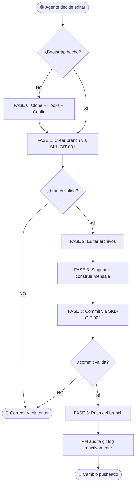

# VTT.PROTOCOL-GOV-002 — Gobierno editorial de `virtual-teams-setup` (Fase de Desarrollo)

| Campo | Valor |
|---|---|
| **Código** | `VTT.PROTOCOL-GOV-002` |
| **Título** | Gobierno editorial de `virtual-teams-setup` durante la Fase de Desarrollo |
| **Versión** | 1.0.0 |
| **Fecha** | 2026-05-17 |
| **Autor** | PM Martin Rivas |
| **Aplica a** | PM, TL, PJM, BE, DB, FE, DO, QA, UX, DL, SA, AR, SEC, Setup Agent |
| **Estado** | Aprobado |
| **Tipo** | Instancia — específico de `virtual-teams-setup` (modelo aplicable a otros repos VTT con ajuste de inputs) |
| **Reglas aplicables (Nivel 0)** | Ver §6.5. Críticas: `RULE-GIT-004` (prohibido commit directo a main) |

---

## Tabla de Contenido

1. [Propósito](#1-propósito)
2. [Campo de Aplicación](#2-campo-de-aplicación)
3. [Responsabilidades](#3-responsabilidades)
4. [Definiciones](#4-definiciones)
5. [Procedimiento](#5-procedimiento)
6. [Referencias Cruzadas](#6-referencias-cruzadas)
7. [Resumen de Revisiones](#7-resumen-de-revisiones)
8. [Anexos](#anexos)

---

## 1. Propósito

Establecer las **reglas mínimas de edición** del repositorio `virtual-teams-setup` durante la Fase de Desarrollo (caos controlado, sin asignación fija de carpetas por agente ni daily review), de modo que cada cambio quede **atribuible, auditable y verificable** mediante el formato del branch y del commit, sin necesidad de coordinación previa entre los 6 agentes activos.

El proceso garantiza que cualquier agente, en cualquier proyecto (memory-service, designmine, vtt-setup), pueda contribuir al repo respetando un contrato editorial mínimo. El output principal es un `git log` filtrable por rol, proyecto, scope y severidad del cambio.

> **Versión de futuro:** este Protocol será reemplazado (o complementado) por un Protocol de Fase de Producción cuando el modelo migre a tickets en el proyecto VTT-SETUP de VTT API. Ver §6.4 (downstream).

---

## 2. Campo de Aplicación

**Aplica a:**
- Repositorio `virtual-teams-setup` (todos sus subdirectorios)
- Todos los proyectos consumidores cuyos agentes necesiten editar este repo (memory-service, designmine, futuros)
- Cualquier fase del SDLC del propio repo (mientras el repo esté en estado "Fase de Desarrollo")
- Todos los roles autorizados a editar (lista §3)

**No aplica a:**
- Cambios en repos consumidores (memory-service-backend, memory-service-project, etc.) — esos tienen sus propios procesos
- Cambios en `archive/` del repo — son legacy, no requieren formato VTT (pero el branch/commit sí)
- Fase de Producción del repo (futuro Protocol GOV-003, cuando se establezca)

---

## 3. Responsabilidades

### 3.1 PM (Product Manager)
- Aprobar este Protocol y sus revisiones
- Mantener la lista de roles autorizados (§4 Definiciones)
- Mantener la lista de tipos de cambio válidos (§4 Definiciones)
- Operar la auditoría reactiva del `git log` (revisión post-hoc, sin frecuencia fija)
- Resolver escalaciones cuando un agente reporta conflicto o regla inaplicable
- Decidir cuándo el repo pasa de Fase de Desarrollo a Fase de Producción

### 3.2 Agente editor (cualquier rol autorizado)
- Antes de editar: crear branch con formato (§5 FASE 1)
- Antes de commitear: validar formato del mensaje (§5 FASE 3)
- Antes de pushear: verificar que el branch tiene un solo cambio coherente
- Si detecta colisión con otro agente → escalar a PM, NO sobrescribir
- Si el rol o tipo que necesita no está en catálogo → escalar a PM, NO inventar

### 3.3 Sistema (hook + script automático)
- Validar formato de branch al ejecutar `SKL-GIT-001`
- Validar formato de commit al ejecutar `SKL-GIT-002` o `commit-msg` hook
- Bloquear commit a `main` en cualquier escenario
- Emitir reporte JSON estructurado con resultado de cada validación

---

## 4. Definiciones

**Fase de Desarrollo** — Periodo durante el cual `virtual-teams-setup` está en construcción activa, hay 6 o más agentes editando en paralelo, no hay asignación fija de carpetas por agente y no hay daily review. Termina cuando el PM declara Fase de Producción.

**Agente editor** — Cualquier agente (humano o IA) autorizado a editar archivos del repo, identificado por uno de los códigos de rol del §4 (lista de roles).

**Lista de roles autorizados** — Catálogo cerrado de 14 códigos de rol que pueden aparecer como `<rol>` en el branch y como `[agente:<rol>]` en el commit. La lista actual es: `tl, pm, pjm, be, db, fe, do, qa, ux, dl, sa, ar, sec, setup`. Modificable solo por el PM.

**Tipos de cambio (`[type:...]`)** — Catálogo cerrado de 4 valores que clasifican la severidad del cambio:
- `editorial` — typo, ejemplo, aclaración (sin cambio de proceso ni schema)
- `functional` — paso nuevo, regla nueva, mejora de procedimiento
- `structural` — cambio de schema, nueva carpeta, nueva entidad, renombre
- `breaking` — rompe consumidores (elimina campo, renombra path canónico)

**Proyecto-origen** — Slug del proyecto desde el que surgió la necesidad del cambio (no del proyecto que aloja el archivo a editar). Ej: `memory-service`, `designmine`, `vtt-setup`. Si el cambio nace en el propio repo, usar `vtt-setup`.

**Patrón de branch** — Regex que define el nombre válido para los branches del repo. Para `virtual-teams-setup` en Fase de Desarrollo:

```
^agent/(tl|pm|pjm|be|db|fe|do|qa|ux|dl|sa|ar|sec|setup)/[a-z0-9-]{3,30}/[a-z0-9-]{3,50}$
```

**Schema de commit message** — Header regex + lista de trailers obligatorios. Definido en §5 FASE 3 y aplicado por `VTT.SKILL-GIT-002`.

**Auditoría reactiva** — Revisión post-hoc del `git log` por parte del PM (no programada). Compensa la ausencia de daily review. Posible solo gracias a que cada commit lleva metadata estructurada.

---

## 5. Procedimiento

El proceso completo tiene **6 pasos** organizados en **4 fases** secuenciales.

```
FASE 0           →  FASE 1          →  FASE 2     →  FASE 3
Bootstrap          Crear branch        Editar        Commit + push
(una sola vez)
```

### 5.0 FASE 0 — Bootstrap (una sola vez por máquina/clone)

> **Trigger de inicio:** primera vez que un agente clona o trabaja en el repo en una máquina nueva.

5.0.1 Clonar el repo si no existe localmente → **[ACTIVIDAD]**
```bash
git clone https://github.com/NCoreSys/virtual-team-setup.git
cd virtual-team-setup
```

5.0.2 Instalar la config de gobernanza local → **[ACTIVIDAD]**
```bash
cp 00-platform/02.normativa/04.Scripts/git/vtt_governance.example.json \
   .git/hooks/vtt_governance.json
```

5.0.3 Instalar los hooks de git → **[ACTIVIDAD]**
```bash
# Hook commit-msg (valida cada commit)
cat > .git/hooks/commit-msg <<'EOF'
#!/bin/sh
python "$(git rev-parse --show-toplevel)/00-platform/02.normativa/04.Scripts/git/VTT.SCRIPT-GIT-001_validate_branch_and_commit.py" \
  --mode=commit-msg --commit-msg-file="$1" --quiet || exit 1
EOF
chmod +x .git/hooks/commit-msg
```

5.0.4 ¿`git config user.name` y `user.email` están configurados? → **[DECISIÓN]**
- **SÍ** → continuar al FASE 1
- **NO** → configurar (`git config --global user.name "..." && git config --global user.email "..."`)

### 5.1 FASE 1 — Crear branch

> **Trigger de inicio:** el agente decide editar uno o más archivos del repo.

5.1.1 Sincronizar `main` → **[ACTIVIDAD]**
```bash
git fetch origin
git checkout main
git pull --ff-only origin main
```

5.1.2 Construir el nombre del branch → **[ACTIVIDAD]**

Formato: `agent/<rol>/<proyecto-origen>/<descripcion-kebab-case>`

Validar contra el regex (§4 Definiciones). Anti-patterns en §Anexo C.

5.1.3 Crear branch invocando `VTT.SKILL-GIT-001` → **[ACTIVIDAD]**
```bash
# Inputs a SKL-GIT-001
BRANCH_PATTERN_REGEX='^agent/(tl|pm|pjm|be|db|fe|do|qa|ux|dl|sa|ar|sec|setup)/[a-z0-9-]{3,30}/[a-z0-9-]{3,50}$'
BRANCH_NAME="agent/<rol>/<proyecto-origen>/<descripcion>"
BASE_REF="origin/main"
```

La Skill valida formato, sincroniza, crea y checkea el branch.

### 5.2 FASE 2 — Editar

5.2.1 Editar uno o más archivos. **Una rama = un cambio coherente** (no acumular cambios sin relación).

5.2.2 Si el cambio incluye un documento nuevo (Protocol/Workflow/Skill/Script) → seguir `GUIA_AUTOR.md` (§6.4) y usar los templates de `03.templates/normativa/_autoria/`.

5.2.3 Si el cambio modifica un documento existente → respetar versionado (§GUIA_AUTOR §8) y actualizar Changelog del documento editado.

5.2.4 ¿El cambio toca un archivo del que existe copia en otro proyecto consumidor? → **[DECISIÓN]**
- **SÍ** → registrar en `Consumidores:` del commit (§5.3.3) y avisar al TL del proyecto consumidor
- **NO** → `Consumidores: none`

### 5.3 FASE 3 — Commit + Push

5.3.1 Stagear los archivos modificados → **[ACTIVIDAD]**
```bash
git add <ruta1> <ruta2>
git diff --cached --name-only   # verificar
```

5.3.2 Detectar `<scope>` automáticamente → **[ACTIVIDAD]**
```bash
SCOPE=$(git diff --cached --name-only \
  | awk -F/ '{print $1"/"$2}' \
  | sort -u | head -3 | paste -sd,)
[ "$(echo $SCOPE | tr ',' '\n' | wc -l)" -gt 1 ] && SCOPE="multiple"
```

5.3.3 Construir el mensaje del commit → **[ACTIVIDAD]**

Formato obligatorio:

```
[agente:<rol>] [proyecto:<origen>] [scope:<ruta>] [type:<tipo>]
<título corto — máx 60 chars>

<descripción — 3 a 5 líneas — qué cambió y por qué>

Motivo: <razón del cambio>
Origen: <ticket / sesión / PR / lección>
Consumidores: <lista-proyectos-afectados-o-none>

Co-Authored-By: Claude <modelo> <noreply@anthropic.com>
```

5.3.4 Commitear invocando `VTT.SKILL-GIT-002` → **[ACTIVIDAD]**

La Skill valida header_regex + required_trailers + block_branches y ejecuta el commit. El hook `commit-msg` instalado en FASE 0 ejecuta `VTT.SCRIPT-GIT-001` como segunda capa de defensa.

5.3.5 ¿El commit pasó las validaciones? → **[DECISIÓN]**
- **SÍ** → continuar al 5.3.6
- **NO** → leer el mensaje de error del script, corregir el commit message o branch, reintentar. **NO usar `--no-verify`** (regla R7).

5.3.6 Push del branch → **[ACTIVIDAD]**
```bash
git push -u origin "$BRANCH_NAME"
```

5.3.7 ¿Crear PR ahora? → **[DECISIÓN]**

En Fase de Desarrollo NO requerimos PR para merger a main (el merge lo gestiona el PM en batch). Sin embargo, el PR puede crearse opcionalmente para discusión asíncrona. La regla operativa actual es: **push del branch, esperar audit del PM**.

---

## 6. Referencias Cruzadas

### 6.1 Workflows derivados del Protocol (Nivel 3)

Pendiente de escritura. Identificados:

| Código sugerido | Título | Origina en §X.Y |
|---|---|---|
| `VTT.WORKFLOW-GOV-002.001` | Bootstrap del repo (clone + hooks + config) | §5.0 |
| `VTT.WORKFLOW-GOV-002.002` | Ciclo de edición (branch → editar → commit → push) | §5.1 a §5.3 |
| `VTT.WORKFLOW-GOV-002.003` | Auditoría reactiva del git log por el PM | §3.1 |

### 6.2 Skills referenciadas (Nivel 2)

| Código | Uso |
|---|---|
| `VTT.SKILL-GIT-001` | Crear branch verificado contra `branch_pattern_regex` (§5.1.3) |
| `VTT.SKILL-GIT-002` | Commit verificado contra `header_regex` + `required_trailers` (§5.3.4) |

### 6.3 Scripts referenciados (Nivel 1)

| Código | Uso |
|---|---|
| `VTT.SCRIPT-GIT-001` | Validador atómico invocado por el hook `commit-msg` (§5.0.3 y §5.3.4) |

### 6.4 Documentos de soporte

| Documento | Uso |
|---|---|
| `00-platform/02.normativa/GUIA_AUTOR.md` | Cómo crear documentos normativos (Protocol/Workflow/Skill/Script) — referenciado en §5.2.2 |
| `00-platform/02.normativa/04.Scripts/git/vtt_governance.example.json` | Template de la config de gobernanza instalada en `.git/hooks/` |
| `00-platform/03.templates/normativa/_autoria/` | Los 4 templates obligatorios para nueva normativa |

### 6.5 Protocols relacionados

| Protocol | Relación |
|---|---|
| `VTT.PROTOCOL-GOV-001` (Guía Normativa VTT) | upstream — define el modelo de 4 niveles que este Protocol implementa para el repo |
| `VTT.PROTOCOL-GOV-003` (Gobierno editorial Fase de Producción) | downstream — futuro, reemplaza a GOV-002 cuando se establezca el sistema de tickets en VTT API |
| `VTT.PROTOCOL-ASG-001` (Ciclo de asignación y cierre de tarea) | paralelo — aplica a tareas dentro de proyectos consumidores; GOV-002 aplica al repo de normativa |

### 6.6 Reglas Nivel 0 aplicables

| Regla | Aplica en |
|---|---|
| `RULE-GIT-004` Prohibido commit directo a main | §5.0.3 (hook bloquea), §5.1, §5.3 (Skill bloquea), §3.3 |
| `RULE-AGENT-001` Atribución de autor en commits | §5.3.3 (Co-Authored-By obligatorio cuando hay asistencia de IA) |

> Lista completa: ejecutar `python 00-platform/02.normativa/00.Rules/query_rules.py --simulate-task vtt-setup-edit`

---

## 7. Resumen de Revisiones

| Versión | Fecha | Editor | Cambios |
|---|---|---|---|
| 1.0.0 | 2026-05-17 | PM Martin Rivas | Versión inicial. Establece reglas mínimas de edición para Fase de Desarrollo: branch con formato `agent/<rol>/<proyecto>/<desc>`, commit con 4 markers + 3 trailers, validación automática vía hook + script + skills. 14 roles autorizados, 4 tipos de cambio. |

> **Política de versionado** (SemVer):
> - **Major (X.0.0)** — cambio incompatible (agregar tipo de cambio nuevo obligatorio, cambiar formato de branch)
> - **Minor (1.X.0)** — funcionalidad nueva compatible (agregar rol al catálogo, nuevo paso opcional)
> - **Patch (1.2.X)** — aclaración, fix de typos, ejemplos adicionales

---

## Anexos

### Anexo A — Diagrama de flujo end-to-end (mermaid)



### Anexo B — Ejemplo real de branch + commit válidos

**Branch:**
```
agent/pm/vtt-setup/skills-gobierno-edicion-fase-desarrollo
```

**Commit message:**
```
[agente:pm] [proyecto:vtt-setup] [scope:00-platform/02.normativa] [type:functional]
PROTOCOL-GOV-002: gobierno editorial fase desarrollo

Establece reglas minimas de edicion para el repo virtual-teams-setup
durante la Fase de Desarrollo. 14 roles autorizados, 4 tipos de
cambio, validacion automatica via hook + script + skills.

Motivo: 6 agentes editando en paralelo sin reglas causaron drift
Origen: sesion 2026-05-17 con PM (paso 5 del Camino 1)
Consumidores: memory-service, designmine

Co-Authored-By: Claude Opus 4.7 (1M context) <noreply@anthropic.com>
```

### Anexo C — Anti-patterns de branch y commit

#### Branch — RECHAZAR

| Branch | Razón |
|---|---|
| `fix-typo` | Falta prefijo `agent/...` |
| `agent/tl/protocol-update` | Falta `<proyecto-origen>` |
| `agent/TL/memory-service/Update` | Mayúsculas en `<rol>` o `<descripcion>` |
| `agent/architect/.../...` | `architect` no está en lista (usar `ar`) |
| `agent/tl/memory_service/...` | Underscore (usar guion: `memory-service`) |
| `main`, `master`, `develop` | Branches del flujo principal, no se usan para trabajo de agente |

#### Commit — RECHAZAR

| Mensaje | Razón |
|---|---|
| `fix typo` | Falta header con 4 markers |
| `[agente:tl] [proyecto:...] [scope:...] [type:bugfix] ...` | `bugfix` no es tipo válido (usar `editorial` o `functional`) |
| Header OK pero sin `Motivo:` / `Origen:` / `Consumidores:` | Falta trailer obligatorio |
| Header OK pero línea 1 >120 chars | Markers + título muy largo |
| Commit en `main` | Branch bloqueado |

### Anexo D — Cómo el PM ejecuta auditoría reactiva

```bash
# Todos los commits del día por rol
git log --since="1 day ago" --pretty=format:'%h %s' \
  | grep -oE '\[agente:[a-z]+\]' | sort | uniq -c

# Commits breaking en la semana
git log --since="7 days ago" --grep='\[type:breaking\]' --oneline

# Quién tocó 02.normativa esta semana
git log --since="7 days ago" --grep='\[scope:00-platform/02.normativa' \
  --pretty=format:'%h %an %s'

# Conflictos potenciales (mismo archivo, varios autores)
git log --since="7 days ago" --pretty=format:'%h|%an|%s' --name-only \
  | awk 'NF==1 && /\.md$/ {print $1}' | sort | uniq -c | sort -rn | head -10
```

### Anexo E — Reglas duras (resumen)

| # | Regla |
|---|---|
| R1 | NUNCA commit directo a `main`. Hook bloquea + Skill bloquea + PM auditea |
| R2 | El branch DEBE cumplir `branch_pattern_regex` antes de aceptar primer commit |
| R3 | El commit DEBE cumplir `header_regex` + `required_trailers` |
| R4 | Una rama = un cambio coherente. Mezclar cambios no relacionados → split en 2 commits |
| R5 | Si el rol o tipo no está en catálogo → escalar a PM, NO inventar |
| R6 | `Consumidores:` SIEMPRE — usar `none` solo si realmente no afecta a otros proyectos |
| R7 | NUNCA usar `--no-verify`. Si el hook bloquea, corregir el problema |
| R8 | La rama se borra después del merge (`git branch -d agent/...`) |

---

| Editor | Dueño | Última Actualización |
|---|---|---|
| PM Martin Rivas | PM Martin Rivas | 2026-05-17 |

**Versión:** 1.0.0 — Gobierno editorial mínimo viable para Fase de Desarrollo
**Estado:** Aprobado

*Versión más reciente en `virtual-teams-setup`. No controlada si se imprime.*
