# VTT.PROTOCOL-HO-001 — Generación del Handoff Operativo

| Campo | Valor |
|---|---|
| **Código** | `VTT.PROTOCOL-HO-001` |
| **Título** | Generación del Handoff Operativo (HO end-to-end) |
| **Versión** | 1.0.0 |
| **Fecha** | 2026-06-01 |
| **Autor** | PM Martin Rivas |
| **Aplica a** | PM (ejecutor principal), PM Revisor, AR, TL, DB, BE, SEC, DO, SA, PJM, agentes Claude/OpenAI participantes |
| **Estado** | Aprobado para uso |
| **Tipo** | Genérico VTT — aplica a cualquier proyecto y cualquier tipo de feature (proyecto nuevo, feature en sistema operando, refactor mayor) |
| **Reglas aplicables (Nivel 0)** | Ver `00.Rules/rules_catalog.json` — `query_rules.py --simulate-task <ID>` |
| **Sub-sistemas que absorbe** | REVMA-SPEC + Paquete técnico 3B.1–3B.8 + Dictámenes cross-rol + Implementation Plan 3B.9 + HO Maestro + Paquete operativo por sprint |
| **Deprecation policy** | Reemplaza los Protocols separados `HOPJM-001`, `SPRINT-001`, `PT-001`, `OB-001`, `IPL-001` (en `_pending-migration/`). Esos quedan en estado Deprecated al aprobar este Protocol |

---

## Tabla de Contenido

1. [Propósito](#1-propósito)
2. [Campo de Aplicación](#2-campo-de-aplicación)
3. [Responsabilidades](#3-responsabilidades)
4. [Definiciones](#4-definiciones)
5. [Procedimiento](#5-procedimiento)
   - 5.0 [FASE 0 — Preparación de inputs](#50-fase-0--preparación-de-inputs)
   - 5.1 [FASE 1 — Revisión multiagente de METODOLOGIA + SPEC](#51-fase-1--revisión-multiagente-de-metodologia--spec)
   - 5.2 [FASE 2 — Producción del paquete técnico fundacional (3B.1–3B.8)](#52-fase-2--producción-del-paquete-técnico-fundacional-3b13b8)
   - 5.3 [FASE 3 — Validación cross-rol del paquete técnico](#53-fase-3--validación-cross-rol-del-paquete-técnico)
   - 5.4 [FASE 4 — Producción del Implementation Plan (3B.9)](#54-fase-4--producción-del-implementation-plan-3b9)
   - 5.5 [FASE 5 — HO Maestro PM → PJM](#55-fase-5--ho-maestro-pm--pjm)
   - 5.6 [FASE 6 — Paquete operativo por sprint (PJM → TL)](#56-fase-6--paquete-operativo-por-sprint-pjm--tl)
6. [Referencias Cruzadas](#6-referencias-cruzadas)
7. [Resumen de Revisiones](#7-resumen-de-revisiones)
8. [Anexos](#anexos)

---

## 1. Propósito

Establecer el proceso normativo único y completo para producir el **Handoff Operativo (HO)** que el Tech Lead consume al inicio de cada bloque/feature para arrancar el ciclo de ejecución (`PROTOCOL-ASG-001`).

El Protocol cubre el ciclo end-to-end desde que la feature queda aprobada en su par **METODOLOGIA + SPEC** (output de la conversación analítica PM ↔ stakeholders) hasta que el TL recibe el paquete operativo completo del PJM (HO Maestro + N handoffs por rol activo + SETUP + CLOSURE + INDEX_PAQUETE_OPERATIVO + referencias a metodologías y guías cross-sprint).

Este Protocol **reemplaza** al modelo previo de 7 Protocols separados que cubrían cada uno una fase aislada del upstream. La consolidación responde a una observación operativa: las 6 fases internas no son procesos independientes — son etapas secuenciales de un mismo ciclo productivo con propósito único (producir el HO).

**Output principal del proceso completo:** un paquete operativo entregado al TL que le permite arrancar `PROTOCOL-ASG-001` sin tener que regresar al PM ni al PJM con dudas.

---

## 2. Campo de Aplicación

**Aplica a:**

- Cualquier proyecto que use VTT como sistema de gestión.
- Cualquier feature nueva, refactor mayor o bloque de scope que requiera planificación end-to-end.
- Cualquier tipo de input: proyecto desde cero (Camino A), proyecto con SPEC consolidada (Camino B), feature en sistema operando con repo existente (Camino C).
- Cualquier composición de equipo: el PM determina al inicio qué cadena de roles entra al ciclo (mínimo TL; opcionalmente AR, DB, BE, FE, DL, UX, SEC, DO, QA, SA).

**No aplica a:**

- Generación de la METODOLOGIA + SPEC iniciales — esa conversación analítica entre PM y stakeholders es input externo al Protocol (FASE 0 solo registra que esos artefactos existen, no los produce).
- Preflight del TL contra la API real de VTT — eso es responsabilidad del ciclo de tarea `ASG-001 §5.0`.
- Materialización en VTT (cargar Release/Sprint/Delivery/Task/TIs/CAs/dependencias) — eso pertenece al ciclo de tarea `ASG-001` y se ejecuta cuando el TL ya tiene el HO en mano.
- Ejecución técnica de las tareas materializadas — `ASG-001 §5.3` en adelante.

---

## 3. Responsabilidades

### 3.1 PM (Product Manager) — Ejecutor principal del Protocol

- Producir/custodiar METODOLOGIA + SPEC de la feature (input externo a este Protocol, pero requisito de FASE 0).
- Determinar la cadena de roles que entra al ciclo (qué agentes revisan, qué agentes producen cada 3B.X, qué dictámenes son obligatorios).
- Operar como **bus de mensajes humano** entre PM Revisor (OpenAI) y agentes generadores (Claude) durante todas las iteraciones REVMA.
- Aprobar terminalmente el paquete técnico al cierre de FASE 3 (dictámenes cross-rol).
- Aprobar el Implementation Plan 3B.9 v1.4 al cierre de FASE 4.
- Emitir el HO Maestro al PJM al cierre de FASE 5.
- Aprobar el paquete operativo por sprint generado por el PJM al cierre de FASE 6.
- Resolver `external_blockers` que aparezcan durante el ciclo (credenciales, decisiones, autorizaciones).

### 3.2 PM Revisor (modelo distinto al de los agentes generadores — típicamente OpenAI)

- Auditar cada documento producido por los agentes generadores (Claude) según el ciclo REVMA-001.
- Emitir mensajes correctivos al agente generador cuando detecta gaps, contradicciones o incumplimiento de la SPEC base.
- Dictaminar APROBADO / DEVUELTO en cada vuelta.
- Respetar el límite de 3 vueltas aspiracional (escapes operativos válidos cuando el contenido lo justifica — ver §5.1.5).

### 3.3 AR (Solution Architect)

- Producir **3B.1 Solution Architecture** en FASE 2 (raíz del paquete técnico).
- Producir **3B.5 Sequence Diagrams** (junto con TL/BE).
- Producir **3B.6 ADRs** (junto con TL).
- Producir **3B.7 Security Plan** (junto con SEC).
- Emitir **REVIEW_AR_CROSS_MODULE** en FASE 3 — validación de consistencia entre todos los 3B.X.

### 3.4 TL (Tech Lead)

- Producir **3B.2 Code Architecture** en FASE 2.
- Co-producir **3B.5 Sequence Diagrams** y **3B.6 ADRs**.
- Producir **Implementation Plan 3B.9** completo en FASE 4 (10 subsecciones), incluyendo el pivote 3B.9.3 Task Breakdown y el 3B.9.10 Routing Index.
- Aplicar el algoritmo de 7 preguntas (`WORKFLOW-HO-001.014`) a cada `dep_technical` candidata.
- Participar en el ciclo iterativo v1.0 → v1.4 del Task Breakdown con cruce PM/TL (FASE 4).
- Emitir **DICTAMEN_TL** en FASE 3.
- Recibir el paquete operativo al cierre de FASE 6 y acusar recibo al PJM (cierra el Protocol).

### 3.5 DB (Database Engineer)

- Producir **3B.3 Database Design** en FASE 2.
- Emitir **DICTAMEN_DB** en FASE 3.

### 3.6 BE (Backend Engineer)

- Producir **3B.4 API Design** en FASE 2.
- Co-producir **3B.5 Sequence Diagrams** con AR/TL.
- Emitir **DICTAMEN_BE** en FASE 3.

### 3.7 SEC (Security)

- Co-producir **3B.7 Security Plan** con AR.
- Participar como revisor en FASE 1 si la feature toca superficie de seguridad.

### 3.8 DO (DevOps)

- Producir **3B.8 Infrastructure Plan** en FASE 2.

### 3.9 SA (Solution Analyst) — opcional según composición

- Emitir **REVISION_SA_FUNCIONAL** en FASE 3 — validación funcional del paquete técnico contra la SPEC base.
- Participar como revisor adicional en FASE 1 si el PM lo solicita.

### 3.10 PJM (Project Manager) — Ejecutor de FASE 6

- Recibir HO Maestro al cierre de FASE 5.
- Producir el paquete operativo por sprint en FASE 6: N handoffs por rol activo (TL/DL/FE/QA según composición), SETUP, CLOSURE, INDEX_PAQUETE_OPERATIVO.
- Inyectar tareas de calidad por sprint que materialicen las guías cross-sprint (Code Review, Testing, Integration Audit).
- Mantener cada documento producido por sprint sincronizado en `.md` (humano) y `.json` (script) cuando aplique.
- Someter el paquete operativo a revisión SA si el PM lo solicita.

### 3.11 Agentes generadores (Claude — instancias distintas al PM Revisor)

- Producir los documentos asignados por el PM según la cadena de roles del bloque.
- Recibir y aplicar correcciones emitidas por el PM Revisor en cada vuelta REVMA.
- Versionar correctamente sus outputs (v1.0 → v1.1 → ...) durante el ciclo iterativo.
- Escalar al PM cuando detecten que un comentario downstream rompe la SPEC base (backfeed legítimo).

---

## 4. Definiciones

**HO (Handoff Operativo):** paquete completo que el TL recibe para arrancar el ciclo de ejecución. Incluye HO Maestro PM→PJM, paquete operativo por sprint, referencias a metodologías y guías cross-sprint. Es el output final del Protocol.

**METODOLOGIA + SPEC:** par de documentos producidos por el PM en conversación con stakeholders, antes del trigger del Protocol. METODOLOGIA está en lenguaje humano flexible; SPEC contiene contratos técnicos ejecutables. Su solapamiento intencional es por diseño, no duplicación.

**PM Revisor:** instancia de modelo IA distinta a la de los agentes generadores (típicamente OpenAI vs. Claude). Audita documentos sin haberlos producido. Su separación deliberada garantiza independencia.

**REVMA (Revisión Multiagente):** ciclo de revisión Claude ↔ OpenAI con el PM como bus de mensajes humano. 3 vueltas aspiracional. Aplicado fractalmente: a SPEC inicial, a cada 3B.X individual, al paquete 3B.9, y a cada documento del paquete operativo PJM. Detallado en `WORKFLOW-HO-001.001`.

**Cadena de roles:** composición específica de la feature definida por el PM en FASE 0. Determina qué agentes producen cada 3B.X, qué dictámenes son obligatorios en FASE 3 y qué handoffs por rol genera el PJM en FASE 6. No es fija — varía por feature.

**Paquete técnico fundacional:** los 8 documentos 3B.1 a 3B.8 producidos en FASE 2 según tabla de ownership canónica (§5.2.1).

**Dictamen (rol):** documento formal emitido por un rol técnico (BE/DB/TL) al cierre de FASE 3 que valida que el paquete técnico es ejecutable desde su perspectiva. Formato: `DICTAMEN_<ROL>_<BLOQUE>_v1.0.md`.

**REVIEW_AR_CROSS_MODULE:** validación específica del AR que verifica consistencia cross-módulo del paquete técnico (boundaries, integraciones, no contradicciones entre 3B.X).

**REVISION_SA_FUNCIONAL:** validación específica del SA que verifica coherencia funcional del paquete técnico contra la SPEC base (que ningún 3B.X haya derivado en algo que la SPEC no aprueba).

**Implementation Plan 3B.9:** conjunto de 10 subsecciones que consolidan la planificación ejecutable del bloque. Pivote: 3B.9.3 Task Breakdown. Salida crítica: 3B.9.10 Routing Index. Ciclo iterativo formal v1.0 → v1.4 con cruce PM/TL.

**Pivote 3B.9.3 (Task Breakdown):** la subsección que actúa como fuente de verdad del Implementation Plan. Si está mal, los 9 documentos derivados están mal. Por eso pasa por algoritmo de auditoría (7 preguntas) + cruce PM/TL.

**Routing Index 3B.9.10:** mapa de cada deliverable ✅ a su spec source (documento 3B + sección + decisiones + docs para el agente). 5 columnas obligatorias. Sin él, el PJM no puede emitir handoffs sin inventar contenido técnico.

**4 dimensiones de dependencia (en Task Breakdown):** `dep_technical` (consumido por VTT) + `dep_role` (consumido por PJM) + `gate_release` (consumido por DevOps+PM) + `external_blockers` (consumido por PM/PJM). Cada campo tiene consumidor único — no mezclar.

**Algoritmo de 7 preguntas técnicas (§5.4.6):** método canónico para auditar cada `dep_technical` candidata. Si al menos una respuesta es SÍ con evidencia → conservar. Si todas son NO → eliminar (es continuidad-rol disfrazada).

**Ciclo iterativo v1.0 → v1.4 (§5.4.8):** secuencia canónica de versiones del Task Breakdown que combina algoritmo + cruce humano. v1.4 es la versión emitible al PM Maestro.

**HO Maestro PM → PJM:** documento producido por el PM en FASE 5 con 13-17 secciones obligatorias que consolida todo el upstream técnico en plan operativo. Sin Routing Index 3B.9.10 completo, el HO NO se emite (gate duro de §5.5.4).

**Paquete operativo por sprint:** conjunto de documentos que el PJM produce por sprint en FASE 6: handoffs por rol activo (no fijo en 4 — varía), SETUP_S[N], CLOSURE_S[N], INDEX_PAQUETE_OPERATIVO_BLOQUE.

**INDEX_PAQUETE_OPERATIVO_BLOQUE:** documento síntesis de todos los sprints del bloque producido por el PJM al cierre de FASE 6. Es el último artefacto antes de entregar al TL.

**Tareas inyectadas por el PJM:** tareas de calidad que el PJM materializa por sprint para que las 3 guías cross-sprint (Code Review, Testing, Integration Audit) se ejecuten realmente y no queden como documentación sin enforcement. Catálogo en `WORKFLOW-HO-001.029`.

**3 caminos posibles (§5.2.0):** Camino A (proyecto desde cero con análisis SDLC completo), Camino B (con SPEC consolidada), Camino C (feature en sistema operando con repo existente — 2 pistas paralelas). El PM elige el camino en FASE 0.

**Doble output sincronizado (.md + .json):** convención obligatoria a partir de FASE 4 — cada documento del 3B.9.x y del paquete operativo PJM se mantiene en versión markdown (humana) y versión JSON (machine-readable). Sin sincronización, la auto-materialización VTT no funciona.

**Backfeed legítimo:** cuando un agente downstream detecta que cumplir su tarea rompe la SPEC base, escala al PM. La SPEC se actualiza y vuelve al ciclo REVMA. No es retrabajo — es corrección upstream.

---

## 5. Procedimiento

El ciclo completo tiene **6 fases secuenciales** + ciclos REVMA internos en cada fase aplicable.

```
FASE 0   →  FASE 1   →  FASE 2   →  FASE 3   →  FASE 4   →  FASE 5   →  FASE 6
Prepara-   REVMA       Paquete    Validación  Implemen-  HO Maestro Paquete
ción       SPEC +      técnico    cross-rol   tation     PM → PJM   operativo
inputs     METODOL.    3B.1–3B.8  (dictá-     Plan 3B.9             PJM → TL
                                  menes)      (10 subs)
```

Cada fase tiene su trigger de inicio, sub-pasos, decisiones (gates) y trigger de salida. Las fases que producen documentos invocan **WORKFLOW-HO-001.001 (REVMA)** una o más veces para auditar cada output.

### 5.0 FASE 0 — Preparación de inputs

> **Trigger de inicio:** PM completa conversación analítica con stakeholders y tiene en su poder los borradores de METODOLOGIA + SPEC de la feature.

5.0.1 PM confirma que existen los dos artefactos de input → **[ACTIVIDAD]**

- METODOLOGIA_<FEATURE>_v<X>.md (lenguaje humano, flexible)
- SPEC_<FEATURE>_v<X>.md (contratos técnicos)

5.0.2 PM determina la **cadena de roles** que entra al ciclo de esta feature → **[PROCESO]** → ver `WORKFLOW-HO-001.002_determinar_cadena_roles`

- Selección obligatoria mínima: TL.
- Selección típica según tipo: AR + TL + DB + BE para backend puro; + DL + UX + FE si hay UI; + SEC si hay superficie crítica; + DO si hay despliegue nuevo; + QA si hay testing formal.
- La cadena determina: quién produce cada 3B.X, qué dictámenes son obligatorios en FASE 3, qué handoffs por rol genera el PJM en FASE 6.

5.0.3 PM elige el **camino de construcción del paquete técnico** según los inputs disponibles → **[DECISIÓN]**

- **Camino A** (sin SPEC consolidada): inputs son 16 docs de Fase 1+2 SDLC + ANALISIS_FASES_COMPLETO (catálogo 438). Aplica a proyectos desde cero con análisis SDLC formal. Raramente aplica en operación VTT real.
- **Camino B** (con SPEC consolidada): inputs son SPEC + METODOLOGIA + ANALISIS_FASES_COMPLETO + Project Schedule + Risk Register. Aplica cuando PM + stakeholders ya hicieron análisis mental. Caso típico en VTT.
- **Camino C** (feature en sistema operando): inputs son SPEC + METODOLOGIA + repo existente + ANALISIS_FASES_COMPLETO. Aplica cuando se construye una feature dentro de código vivo. Activa 2 pistas paralelas en FASE 2 (extracción desde SPEC + análisis del repo actual).

5.0.4 PM setea **PM Revisor** en modelo distinto (típicamente OpenAI) → **[ACTIVIDAD]**

- Pasa METODOLOGIA + SPEC + composición de la cadena de roles.
- Acuerda formato de mensajes (estructura del dictamen APROBADO/DEVUELTO).

5.0.5 PM registra la **decisión inicial del bloque** en un documento de trazabilidad → **[ACTIVIDAD]** → invoca `VTT.SKILL-ATTACH-001`

- Documento: `DECISION_BLOQUE_<NOMBRE>_v1.0.md`.
- Contenido: nombre del bloque, cadena de roles, camino elegido (A/B/C), referencia a METODOLOGIA + SPEC, fecha de arranque.

5.0.6 ¿FASE 0 completa? → **[DECISIÓN]**

- **NO** → resolver lo faltante.
- **SÍ** → continuar a FASE 1.

> **Gate de salida de FASE 0:** existen METODOLOGIA + SPEC + cadena de roles definida + camino elegido + PM Revisor seteado + documento DECISION_BLOQUE registrado.

---

### 5.1 FASE 1 — Revisión multiagente de METODOLOGIA + SPEC

> **Trigger de inicio:** FASE 0 completa.
>
> **Propósito de FASE 1:** confirmar que METODOLOGIA + SPEC son sólidas antes de invertir en el paquete técnico. Un error aquí se propaga a las 5 fases siguientes.

5.1.1 PM activa **ciclo REVMA-SPEC** → **[PROCESO]** → ver `WORKFLOW-HO-001.001_ciclo_revma`

- Input: METODOLOGIA + SPEC borradores.
- Actores: PM Revisor (audita), agentes generadores Claude de la cadena, PM como bus.

5.1.2 Para cada agente revisor de la cadena (orden definido por PM) → **[LOOP]**

- PM Revisor genera mensaje "qué revisar / qué entregar" para el agente N.
- PM transporta el mensaje + adjunta METODOLOGIA + SPEC al agente N en Claude.
- Agente N revisa, devuelve archivo de observaciones + mensaje de entrega.
- PM transporta ambos outputs de vuelta al PM Revisor.
- PM Revisor dictamina:
  - **APROBADO** → siguiente agente de la cadena.
  - **DEVUELTO con correcciones** → loop sobre el mismo agente (máx. 3 vueltas).

5.1.3 ¿Algún agente downstream emitió observación que afecta SPEC base? → **[DECISIÓN]**

- **SÍ** → activar **backfeed legítimo** → PM toma observaciones, actualiza SPEC + METODOLOGIA → la cadena se reinicia desde el agente afectado o desde el principio según gravedad.
- **NO** → continuar al siguiente agente de la cadena.

5.1.4 Cuando la cadena completa firma APROBADO → **[ACTIVIDAD]**

- METODOLOGIA + SPEC quedan en estado **aprobadas**.
- Se versionan a v1.<final>.
- Se mueven las versiones intermedias a `Versiones deprecadas/`.

5.1.5 Regla operativa del límite de 3 vueltas → **[REGLA]**

- El límite de 3 vueltas por agente es **aspiracional**, no absoluto.
- Si una feature genuinamente requiere más vueltas (ej. SPEC_MULTITENANT_RBAC llegó a v1.7 por complejidad real del scope), el PM puede autorizar excepción documentada.
- Si las vueltas exceden 3 por **redacción cosmética o detalles de versionado**, el PM debe escalar al PM Revisor y cortar el ciclo — eso es señal de revisor mal calibrado, no de SPEC mala.

5.1.6 Gate de salida de FASE 1 → **[DECISIÓN]**

- METODOLOGIA + SPEC aprobadas por TODOS los revisores de la cadena.
- Backfeeds resueltos.
- Versionado final aplicado.
- → continuar a FASE 2.

> **Output de FASE 1:** METODOLOGIA + SPEC versionadas y aprobadas como input formal del paquete técnico.

---

### 5.2 FASE 2 — Producción del paquete técnico fundacional (3B.1–3B.8)

> **Trigger de inicio:** FASE 1 completa con METODOLOGIA + SPEC aprobadas.

5.2.0 Si camino C → activar pistas paralelas → **[DECISIÓN]**

- **Pista A — Extracción desde SPEC** (una vez): se generan documentos 3B sintéticos a partir de SPEC. Detalle en `WORKFLOW-HO-001.005_extraccion_desde_spec`.
- **Pista B — Análisis del repo actual** (una vez): se generan documentos `3B.X_actual_*` que capturan estado vigente del código. Detalle en `WORKFLOW-HO-001.006_analisis_repo_actual`.
- Ambas pistas se ejecutan en paralelo y convergen en 5.2.1.

5.2.1 Tabla canónica de ownership de los 3B.X → **[REGLA OPERATIVA]**

| Código | Documento | Productor primario | Co-productores |
|---|---|---|---|
| 3B.1 | Solution Architecture | **AR** | TL |
| 3B.2 | Code Architecture | **TL** | (BE, FE si UI) |
| 3B.3 | Database Design | **DB** | TL |
| 3B.4 | API Design | **BE** | TL |
| 3B.5 | Sequence Diagrams | **TL** | AR, BE |
| 3B.6 | ADRs | **TL** | AR |
| 3B.7 | Security Plan | **SEC** | AR |
| 3B.8 | Infrastructure Plan | **DO** | TL |

5.2.2 Orden topológico de producción (no negociable) → **[REGLA OPERATIVA]**

```
3B.1 (raíz)
   ↓
3B.2 (depende de 3B.1)
3B.3 (depende de SPEC + 3B.1)
3B.4 (depende de SPEC + 3B.1 + 3B.2)
   ↓
3B.5 (depende de 3B.1 + 3B.2 + 3B.4)
3B.6 (depende de SPEC + 3B.1 — en paralelo con 3B.2–3B.5)
3B.7 (depende de SPEC + 3B.1 + 3B.4 — después de 3B.4)
3B.8 (depende de SPEC + 3B.1 + 3B.6 — después de 3B.6)
```

5.2.3 Para cada 3B.X según el orden topológico → **[LOOP]**

- Productor primario inicia generación del documento.
- → invoca **WORKFLOW-HO-001.001_ciclo_revma** sobre el documento (PM Revisor + cadena de roles aplicable).
- Itera versiones (v1.0 → v1.1 → ... según rondas REVMA).
- Cuando PM Revisor APRUEBA → 3B.X queda firmado y disponible como input para los siguientes 3B.X.

5.2.4 Si durante 3B.X se detecta gap o contradicción en SPEC → **[DECISIÓN]**

- → activar **backfeed legítimo** a FASE 1.
- PM actualiza SPEC, el ciclo REVMA-SPEC se reactiva sobre el delta.
- Una vez SPEC actualizada y aprobada → regresar al 3B.X que disparó el backfeed.

5.2.5 ¿Los 8 documentos están aprobados? → **[DECISIÓN]**

- **NO** → continuar con los pendientes.
- **SÍ** → continuar a FASE 3.

> **Output de FASE 2:** 8 documentos 3B.1–3B.8 versionados y aprobados, listos para validación cross-rol.

---

### 5.3 FASE 3 — Validación cross-rol del paquete técnico

> **Trigger de inicio:** FASE 2 completa con 3B.1–3B.8 aprobados.
>
> **Propósito de FASE 3:** validar que el paquete técnico es ejecutable desde la perspectiva de cada rol que va a consumirlo, antes de invertir en el Implementation Plan. Detectar gaps cross-módulo que ninguna revisión 1-a-1 puede ver.

5.3.1 PM convoca a los roles técnicos para emitir dictamen → **[ACTIVIDAD]**

- Dictámenes obligatorios (según composición de la cadena):
  - **DICTAMEN_TL** — TL valida que el paquete es coherente, que las decisiones cross-fase no se contradicen, y que tiene visibilidad para producir 3B.9.
  - **DICTAMEN_DB** — DB valida que 3B.3 es ejecutable y consistente con 3B.4 (endpoints que consumen las tablas).
  - **DICTAMEN_BE** — BE valida que 3B.4 es implementable contra 3B.2 (estructura) y 3B.3 (schema).
- Dictámenes opcionales según rol activo: DICTAMEN_DO si DO está en cadena, DICTAMEN_FE si FE está en cadena, etc.

5.3.2 AR emite **REVIEW_AR_CROSS_MODULE** → **[PROCESO]** → ver `WORKFLOW-HO-001.011_emitir_review_ar`

- Validaciones obligatorias:
  - Boundaries entre módulos son consistentes.
  - Integraciones declaradas en 3B.1 están reflejadas en 3B.4 y 3B.8.
  - ADRs (3B.6) no se contradicen con decisiones implícitas de 3B.2–3B.8.
  - Security (3B.7) cubre todas las superficies expuestas en 3B.4.

5.3.3 SA emite **REVISION_SA_FUNCIONAL** si está en cadena → **[PROCESO]** → ver `WORKFLOW-HO-001.012_emitir_revision_sa`

- Validaciones obligatorias:
  - El paquete técnico cubre todos los RF declarados en SPEC.
  - El paquete técnico respeta todos los NFR de SPEC (performance, security, scalability).
  - No hay derivas de scope (3B.X no agregó funcionalidad que SPEC no aprueba).
  - Si SPEC quedó vaga en algún punto, el paquete técnico no lo resolvió arbitrariamente — se documentó como decisión que requiere ratificación PM.

5.3.4 PM consolida los dictámenes y reviews → **[ACTIVIDAD]**

- Si todos los dictámenes son APROBADO sin observaciones bloqueantes → continuar a 5.3.6.
- Si hay dictámenes con observaciones menores → registrar como **PAQUETE_TRAZABILIDAD_BLOQUE** (deuda documentada que se levanta en FASE 4 o se difiere a otro bloque).
- Si hay dictámenes con observaciones bloqueantes → 5.3.5.

5.3.5 Resolución de observaciones bloqueantes → **[LOOP]**

- Para cada observación bloqueante, el PM activa el rol responsable del 3B.X afectado.
- El rol corrige el 3B.X → activa `WORKFLOW-HO-001.001_ciclo_revma` sobre el delta.
- Una vez la observación queda resuelta y firmada → el dictamen del rol que la levantó vuelve a emitirse como APROBADO.
- Cuando todos los dictámenes son APROBADO sin bloqueantes → continuar a 5.3.6.

5.3.6 PM produce **PAQUETE_TRAZABILIDAD_BLOQUE** → **[PROCESO]** → ver `WORKFLOW-HO-001.013_consolidar_paquete_trazabilidad`

- Consolida: dictámenes firmados, review AR, revisión SA (si aplica), observaciones diferidas, decisiones cerradas referenciadas a la SPEC.
- Output: `PAQUETE_TRAZABILIDAD_BLOQUE_<NOMBRE>_v1.0.md`.

5.3.7 Gate de salida de FASE 3 → **[DECISIÓN]**

- Todos los dictámenes obligatorios firmados APROBADO.
- REVIEW_AR_CROSS_MODULE firmado.
- REVISION_SA_FUNCIONAL firmada (si aplica).
- PAQUETE_TRAZABILIDAD_BLOQUE consolidado.
- → continuar a FASE 4.

> **Output de FASE 3:** paquete técnico validado cross-rol + PAQUETE_TRAZABILIDAD_BLOQUE.

---

### 5.4 FASE 4 — Producción del Implementation Plan (3B.9)

> **Trigger de inicio:** FASE 3 completa con paquete técnico validado y trazabilidad consolidada.
>
> **Propósito de FASE 4:** transformar el paquete técnico en un Implementation Plan ejecutable con Task Breakdown estructurado en 4 dimensiones de dependencia, calibrado con velocity histórica, y con Routing Index completo. **Esta es la fase más crítica del Protocol** porque el output alimenta directamente FASE 5 (HO Maestro) y FASE 6 (paquete operativo).

5.4.1 Convención de doble output sincronizado (.md + .json) → **[REGLA OPERATIVA]**

- A partir de esta fase, **cada documento del 3B.9.x se mantiene en dos formatos sincronizados**:
  - `.md` — versión humana para revisión.
  - `.json` — versión machine-readable para consumo de scripts (futura materialización VTT en `ASG-001`).
- Cuando se actualiza una versión (v1.0 → v1.1), AMBOS archivos se actualizan en el mismo commit.
- Sin sincronización, la auto-materialización VTT downstream no funciona.

5.4.2 Orden de producción de las 10 subsecciones del 3B.9 → **[REGLA OPERATIVA]**

```
PASO 1 — Pivote único
   3B.9.3 Task Breakdown ← se produce primero (fuente de verdad)

PASO 2 — Derivados directos (solo necesitan 3B.9.3)
   3B.9.1 Scope Baseline
   3B.9.2 WBS
   3B.9.5 Complexity Analysis
   3B.9.8 Migration & Rollout Plan

PASO 3 — Derivados compuestos (necesitan 2+ del paso 2)
   3B.9.4 Dependency Map         ← 3B.9.3 + 3B.9.9
   3B.9.6 Risk-Adjusted Estimates ← 3B.9.3 + 3B.9.5
   3B.9.7 Capacity Plan          ← 3B.9.3 + 3B.9.4 + 3B.9.9
   3B.9.9 Scheduling Inputs      ← 3B.9.3 + 3B.9.4

PASO 4 — Salida crítica
   3B.9.10 Routing Index         ← 3B.9.3 + paquete técnico completo
```

5.4.3 TL produce **3B.9.3 Task Breakdown v1.0** → **[PROCESO]** → ver `WORKFLOW-HO-001.014_producir_task_breakdown`

- Input: ANALISIS_FASES_COMPLETO + SPEC + 3B.1–3B.8 + PAQUETE_TRAZABILIDAD.
- Decisión por deliverable: ✅ aplica / ⚪ opcional / ❌ no aplica (con referencia a ADR o decisión de SPEC).
- Estimación: SP + horas + complejidad LOW/MEDIUM/HIGH/VERY HIGH.
- Asignación: rol primario.
- Dependencias: declaradas en **4 dimensiones** (`dep_technical` + `dep_role` + `gate_release` + `external_blockers`).

5.4.4 Convención de las 4 dimensiones de dependencia (no negociable) → **[REGLA OPERATIVA]**

| Campo | Consumidor | Bloquea VTT |
|---|---|---|
| `dep_technical` | Sistema VTT | **Sí** |
| `dep_role` | PJM scheduler | No |
| `gate_release` | DevOps + PM | No (solo gobierna deploy) |
| `external_blockers` | PM resuelve / PJM monitorea | No |

> **Regla absoluta:** NO usar la frase `S0X cerrado` en `dep_technical`. Si una tarea realmente depende del cierre de un sprint, eso es `gate_release`. Origen: `RULE-DEP-001`.

5.4.5 TL aplica **WORKFLOW-HO-001.014_auditoria_dep_technical** sobre cada `dep_technical` candidata → **[PROCESO]**

- El workflow ejecuta el **algoritmo canónico de 7 preguntas técnicas** (ver §5.4.6).
- Output por par (tarea, dep candidata): CONSERVAR / ELIMINAR / PENDIENTE.

5.4.6 Las 7 preguntas técnicas canónicas del algoritmo → **[REGLA OPERATIVA]**

| # | Pregunta | Tipo de evidencia |
|---|---|---|
| 1 | ¿Mi tarea importa un tipo o contrato definido en esa otra tarea? | `import` TypeScript, interfaces, type aliases |
| 2 | ¿Mi tarea consume un servicio/middleware/policy producido por esa otra tarea? | Llamada explícita, uso en pipeline |
| 3 | ¿Mi tarea modifica el mismo archivo que esa otra tarea? | Mismo path en `archivos_afectados` |
| 4 | ¿Mi tarea extiende un schema con FK al entregable de esa otra tarea? | FK Prisma a tabla creada en la otra |
| 5 | ¿Mi tarea depende del orden estricto de migraciones? | Cadena formal documentada en 3B.8 |
| 6 | ¿Mi tarea consume un seed producido por esa otra tarea? | Lookup contra filas seedadas |
| 7 | ¿Mi tarea monta routes que requieren controllers/services ya creados? | `routes/index.ts` referencia controllers |

**Regla de decisión:**
- Si al menos una respuesta es SÍ con evidencia concreta → conservar en `dep_technical`.
- Si TODAS son NO → eliminar (es continuidad-rol disfrazada, ya está representada en `dep_role`).
- Si hay duda semántica sobre contenido del entregable → marcar PENDIENTE y documentar la pregunta concreta.

5.4.7 TL produce el **JSON del Task Breakdown v1.0** sincronizado con el .md → **[ACTIVIDAD]**

- Schema: definido en `WORKFLOW-HO-001.020_emitir_json_task_breakdown` (referencia §6 esquema canónico).
- Cada tarea como objeto JSON con: `task_id`, `sprint`, `modulo`, `titulo`, `owner`, `rol`, `esfuerzo`, las **4 dimensiones de dependencias**, `criterio_aceptacion`, `evidencia`, `archivos_afectados`, `spec_source`, `seccion`, `adr_decision`.

5.4.8 Ciclo iterativo PM/TL del Task Breakdown → **[PROCESO]** → ver `WORKFLOW-HO-001.015_ciclo_iterativo_task_breakdown`

```
v1.0 (TL emite Task Breakdown inicial con algoritmo §5.4.6 aplicado)
  ↓
v1.1 (TL/PM reconcilia horas, gates, baseline numérico)
  ↓
v1.2 (TL aplica modelo de 4 dimensiones — primera pasada)
  ↓
v1.3 (TL Claude reaplica algoritmo §5.4.6 caso por caso — auditoría fina)
  ↓
v1.4 (PM cruza v1.3 con TL del proyecto — mejoras seguras + conflictos documentados)
  ↓
v1.5+ (solo si quedan conflictos semánticos pendientes — resolución puntual)
```

5.4.9 Métrica de salud del cruce → **[REGLA OPERATIVA]**

- Al cierre de v1.4, si quedan **más del 20% de items como conflicto pendiente** → el cruce falló, rehacer auditoría algorítmica (v1.3) con más cuidado.
- Conflictos agrupados conceptualmente (misma pregunta semántica subyacente afecta N items) cuentan como UNO para esta métrica.

5.4.10 Resolución de conflictos pendientes → **[REGLA OPERATIVA]**

- **NO** votar por mayoría.
- **NO** elegir "postura más conservadora" (agregar dep "por las dudas" reintroduce bloqueos artificiales).
- **NO** delegar al sistema VTT (no resuelve semántica).
- **SÍ** identificar pregunta semántica concreta sobre contenido del entregable → TL del proyecto inspecciona archivo/seed/migración → aplicar en v1.5+ puntual.

5.4.11 TL produce las 9 subsecciones derivadas (3B.9.1, 3B.9.2, 3B.9.4–9.9) según orden topológico → **[PROCESO]** → ver `WORKFLOW-HO-001.016_producir_derivados_3b9`

- Cada subsección se versiona con su .md y su .json sincronizados.
- Cada subsección se invoca contra **WORKFLOW-HO-001.001_ciclo_revma** con el PM Revisor como auditor.

5.4.12 TL produce el **3B.9.10 Routing Index v1.0** → **[PROCESO]** → ver `WORKFLOW-HO-001.017_producir_routing_index`

- 5 columnas obligatorias (no negociable):
  - Deliverable ID
  - Nombre
  - Spec Source (documento 3B donde está la spec)
  - Sección (sección específica dentro del doc)
  - Docs para el agente (lista de docs que el agente debe leer)
- Una fila por cada deliverable ✅ del 3B.9.3.
- Sin Routing Index completo → FASE 5 NO puede emitir HO Maestro (gate duro §5.5.4).

5.4.13 TL calibra estimaciones con velocity histórica si está disponible → **[PROCESO]** → ver `WORKFLOW-HO-001.018_calibrar_con_velocity`

- Si VELOCITY_HISTORICA_<PROYECTO>.md existe → leer FV por tipo de deliverable y ajustar estimaciones del 3B.9.3.
- Si no hay velocity histórica → TL estima desde catálogo + juicio, marca proyecto como "primera iteración sin calibración".

5.4.14 Gate de salida de FASE 4 → **[DECISIÓN]**

- Task Breakdown v1.4 aprobado por PM + TL.
- 9 subsecciones derivadas producidas y firmadas.
- Routing Index completo (100% de deliverables ✅ tienen fila — 0 ausencias).
- Doble output .md + .json sincronizado en todas las subsecciones.
- Conflictos pendientes <20% (o agrupados como ≤1 conceptual).
- → continuar a FASE 5.

> **Output de FASE 4:** Implementation Plan 3B.9 completo (10 subsecciones .md + .json) + Routing Index 3B.9.10 listo para alimentar el HO Maestro.

---

### 5.5 FASE 5 — HO Maestro PM → PJM

> **Trigger de inicio:** FASE 4 completa con Implementation Plan + Routing Index aprobados.
>
> **Propósito de FASE 5:** consolidar el upstream técnico completo en un documento que el PJM consume para producir el paquete operativo por sprint sin tener que regresar al PM o al TL con dudas.

5.5.1 PM activa **WORKFLOW-HO-001.021_producir_ho_maestro** → **[PROCESO]**

- Input: 3B.9 completo + Routing Index + PAQUETE_TRAZABILIDAD + SPEC + OPERATIVO del proyecto.

5.5.2 PM ejecuta validación inicial del paquete técnico recibido → **[ACTIVIDAD]**

Verifica:
- Versión + fecha de cada subsección.
- Secciones presentes en 3B.9 (las 10).
- Existencia de Routing Index 3B.9.10.
- Conteos reconciliados (suma horas por sprint = total; suma por rol = total).
- Baseline funcional, distribución DB interna, esfuerzo DevOps, buffers y diferidos están separados (regla §5.5.6).

5.5.3 PM verifica **gate duro del Routing Index** → **[DECISIÓN]**

- Para cada tarea de 3B.9.3, valida que exista fila correspondiente en 3B.9.10.
- Si falta UNA fila → **DEVOLVER A TL** (no completar manualmente — origen `RULE-HO-001`).
- Si están todas → continuar.

5.5.4 PM extrae datos del paquete técnico para el HO → **[ACTIVIDAD]**

Categorías a extraer:
- Contexto del bloque, alcance incluido y excluido.
- Decisiones cerradas (D-<XX>-NN).
- Módulos, sprints, owners, roles.
- Estimaciones, critical path, paralelismo.
- Gates, dependencias (4 dimensiones), riesgos, contingencias.
- Pendientes y diferidos clasificados (P0 / GATE / DIFERIDO).
- Reglas de escalación.

5.5.5 PM clasifica pendientes según severidad → **[REGLA OPERATIVA]**

| Clasificación | Regla |
|---|---|
| **P0** | Impide emitir HO. Resolver antes de continuar. |
| **GATE** | No impide HO, pero bloquea un gate futuro. Anotar con owner y momento. |
| **DIFERIDO** | Fuera del alcance actual. Mover a backlog de bloque siguiente. |

5.5.6 PM aplica regla de **separación matemática** del HO → **[REGLA OPERATIVA]**

Para evitar sumar dos veces, el HO mantiene separados:
- Baseline funcional.
- Distribución DB interna.
- DevOps OPER.
- TL Review (horas).
- AR Audit (horas).
- QA (horas).
- Buffers de riesgo.
- Diferidos.

5.5.7 PM redacta el HO Maestro con secciones obligatorias → **[PROCESO]** → ver `WORKFLOW-HO-001.022_redactar_ho_maestro`

Secciones obligatorias mínimas (la versión completa usa 13-17 secciones según template):

1. Perfil y rol operativo del PJM
2. Contexto del bloque
3. Estado actual + lo que se completó
4. Decisiones cerradas
5. **Routing Index referenciado** (cómo usarlo + ejemplo concreto)
6. Plan de sprints (una sub-sección por sprint con tabla deliverables + gate)
7. Dependencias (las 4 dimensiones del Task Breakdown)
8. Critical path
9. Paralelismo
10. Riesgos cuantificados
11. Contingencias
12. DoD resumido
13. Pendientes GATE
14. Diferidos
15. Equipo y horas por rol
16. Reglas de escalación
17. Primera acción exacta del PJM

5.5.8 Condición de emisión del HO → **[DECISIÓN]**

El HO se emite si:
- No hay pendientes P0.
- Pendientes GATE tienen owner y momento de bloqueo.
- Diferidos están separados del scope actual.
- Routing Index está referenciado y completo.
- No se duplican SPECs completas (se referencian, no se inlinean).
- No se inventa contenido técnico (todo se cita).

Si falla cualquier condición → resolver antes de continuar a FASE 6.

5.5.9 PM emite HO Maestro como artefacto consolidado → **[ACTIVIDAD]**

- Documento: `HO_PM_PJM_<BLOQUE>_v1.0.md`.
- PM entrega al PJM junto con: `3B.9` completo, Routing Index, metodologías obligatorias (5), templates obligatorios, guías cross-sprint (3) cuando apliquen.

5.5.10 Gate de salida de FASE 5 → **[DECISIÓN]**

- HO Maestro emitido y entregado al PJM.
- 6 artefactos del paquete entregados (HO + 3B.9 + Routing Index + Metodologías + Templates + Guías).
- → continuar a FASE 6.

> **Output de FASE 5:** HO Maestro + paquete de inputs completo entregados al PJM.

---

### 5.6 FASE 6 — Paquete operativo por sprint (PJM → TL)

> **Trigger de inicio:** PJM recibió HO Maestro + paquete de inputs de FASE 5.
>
> **Propósito de FASE 6:** que el PJM produzca el paquete operativo por sprint que el TL ejecuta sin tener que regresar a preguntar al PM o al PJM. Si el TL tiene que preguntar algo, el paquete operativo falló.

5.6.1 PJM ejecuta **WORKFLOW-HO-001.024_recopilar_inputs_pjm** → **[PROCESO]**

- Verifica que recibió los 6 artefactos completos.
- Si falta alguno → solicita al PM antes de generar nada (`RULE-HO-001-PJM-NOGEN`).

5.6.2 PJM analiza el scope del bloque y de cada sprint → **[PROCESO]** → ver `WORKFLOW-HO-001.025_analizar_scope_sprint`

- Extrae del 3B.9.9 Capacity Plan: deliverables asignados por sprint.
- Por cada deliverable, lee 3B.9.3 Task Breakdown para obtener detalle.
- Identifica roles activos por sprint (input para definir handoffs).
- Mapea dependencias cross-sprint e intra-sprint.

5.6.3 PJM determina **handoffs por rol activo** (no fijo en 4) → **[REGLA OPERATIVA]**

- La regla operativa real **no es "4 handoffs fijos"** sino **"un handoff por cada rol activo del sprint"**.
- Sprint con solo BE+DB → 2 handoffs (TL + QA).
- Sprint con UI nueva → 4 handoffs (TL + DL + FE + QA).
- Sprint con seguridad nueva → puede agregar SEC.
- El PM determinó la composición de la cadena en FASE 0; el PJM aplica por sprint.

5.6.4 PJM produce **SETUP_S[N]** por cada sprint → **[PROCESO]** → ver `WORKFLOW-HO-001.026_producir_setup_sprint`

- Script Python con pasos secuenciales para que el TL ejecute la creación de estructura VTT del sprint.
- NO se ejecuta dentro de este Protocol (eso es ASG-001). Solo se produce el documento ejecutable.

5.6.5 PJM produce **HANDOFF_<ROL>_S[N]** por cada rol activo del sprint → **[PROCESO]** → ver `WORKFLOW-HO-001.027_producir_handoff_rol`

- Estructura obligatoria del handoff (6 secciones canónicas mínimas):
  1. Tareas del Sprint (tabla formal: ID, agente, estimado, complejidad, categoría)
  2. Dependencias entre tareas (FS, las 4 dimensiones cuando aplique)
  3. VTT Planning Data (lista para cargar al sistema)
  4. Documentos Dinámicos a actualizar
  5. DoD por rol
  6. Gates de aprobación
- **Estado de gate explícito en header**: 🟢 READY (puede arrancar) / 🟠 BLOCKED (espera condición Y).
- **Regla absoluta:** seguir `TEMPLATE_HANDOFF_<ROL>_v<X>.md` sin reinterpretar, sin resumir, sin eliminar secciones (`RULE-TEMPLATE-001`).

5.6.6 PJM produce **CLOSURE_S[N]** por cada sprint → **[PROCESO]** → ver `WORKFLOW-HO-001.028_producir_closure_sprint`

- Template de evidencia con secciones obligatorias para cierre formal con firmas API (TL, AR, QA, DL si UI).

5.6.7 PJM inyecta **tareas de calidad** por sprint que materializan las 3 guías cross-sprint → **[PROCESO]** → ver `WORKFLOW-HO-001.029_inyectar_tareas_calidad`

Catálogo canónico de tareas inyectadas por sprint:

| Familia | Tareas | Origen |
|---|---|---|
| Code Review | TL-XXX (por área), CR-XXX (PRs >500 LOC), AR-XXX (PRs con ADR) | CODE_REVIEW_GUIDE |
| Testing | QA-001 (Test Plan), QA-002 (BE), QA-003 (FE), QA-004 (QA-FLOW E2E), QA-005 (Regression) | TESTING_GUIDE |
| Integration Audit | AR-001 (audit sprint completo) | INTEGRATION_AUDIT_CHECKLIST |
| Cierre | TL-S[N]-REV, AR-S[N], QA-S[N], DL-S[N]-REV si UI, CIERRE-S[N], APR-S[N] | METODOLOGIA_CIERRE |

5.6.8 Para cada documento producido por el PJM (SETUP, HANDOFFs, CLOSURE) → **[LOOP]**

- → invoca **WORKFLOW-HO-001.001_ciclo_revma** con SA como revisor (o PM Revisor si SA no está en cadena).
- Aplica las 4 metodologías base del PJM como criterios de validación:
  - METODOLOGIA_SETUP_PROYECTOS_VTT (estructura general).
  - METODOLOGIA_SETUP_FASE (estructura del SETUP).
  - METODOLOGIA_SETUP_PLAN_VTT (grafo sin huérfanos ni hojas — verificable por script).
  - METODOLOGIA_EJECUCION_SPRINTS_V1.1 (estructura de los handoffs).
  - METODOLOGIA_CIERRE_SPRINT_FASE (estructura del CLOSURE).

5.6.9 Convención de **doble output sincronizado** aplicada al paquete operativo → **[REGLA OPERATIVA]**

- Cada documento del PJM mantiene .md + .json sincronizados (mismo patrón que FASE 4).
- El JSON del paquete operativo es lo que `ASG-001` consumirá downstream para materializar tareas en VTT vía script.

5.6.10 PJM produce **INDEX_PAQUETE_OPERATIVO_<BLOQUE>** → **[PROCESO]** → ver `WORKFLOW-HO-001.030_producir_index_paquete_operativo`

- Documento síntesis del bloque que indexa todos los sprints generados.
- Estructura: lista de sprints + nombre + objetivo + roles activos + handoffs generados + referencia a SETUP/CLOSURE.

5.6.11 PJM presenta paquete operativo completo al PM para aprobación terminal del bloque → **[ACTIVIDAD]**

- Paquete entregado:
  - INDEX_PAQUETE_OPERATIVO_<BLOQUE>.
  - Por sprint: SETUP_S[N], todos los HANDOFF_<ROL>_S[N], CLOSURE_S[N].
  - Doble output .md + .json sincronizado.

5.6.12 ¿PM aprueba el paquete operativo? → **[DECISIÓN]**

- **NO** → PJM aplica observaciones → vuelve a 5.6.4 con el sprint o documento afectado.
- **SÍ** → PJM entrega al TL.

5.6.13 PJM entrega paquete operativo al TL → **[ACTIVIDAD]** → invoca `VTT.SKILL-COMMENT-001`

- Mensaje formal con ruta del paquete operativo, primer sprint a ejecutar, recordatorio de que `ASG-001` arranca cuando el TL acuse recibo.

5.6.14 TL acusa recibo → **[ACTIVIDAD]**

- → invoca `VTT.SKILL-COMMENT-001`.
- Confirma que tiene paquete operativo completo y que no necesita aclaraciones del PM ni del PJM.

5.6.15 Gate de salida de FASE 6 → **[DECISIÓN — FIN DEL PROTOCOL]**

- Paquete operativo entregado al TL.
- TL acusó recibo.
- → **FIN DEL PROTOCOL-HO-001**.
- El TL puede ahora arrancar `PROTOCOL-ASG-001` con el primer sprint.

> **Output final de FASE 6 y del Protocol completo:** TL en posesión del HO operativo completo, listo para iniciar el ciclo de tarea sin regresar al PM ni al PJM.

---

## 6. Referencias Cruzadas

### Workflows derivados (Nivel 3 — a producir en sesiones siguientes)

| Código | Título | Invocado en |
|---|---|---|
| `VTT.WORKFLOW-HO-001.001` | Ciclo REVMA — revisión multiagente Claude/OpenAI con 3 vueltas | 5.1.1, 5.2.3, 5.4.11, 5.6.8 (invocaciones múltiples — uso fractal) |
| `VTT.WORKFLOW-HO-001.002` | Determinar cadena de roles del bloque | 5.0.2 |
| `VTT.WORKFLOW-HO-001.003` | Seleccionar camino A/B/C según inputs disponibles | 5.0.3 |
| `VTT.WORKFLOW-HO-001.004` | Setear PM Revisor en modelo distinto | 5.0.4 |
| `VTT.WORKFLOW-HO-001.005` | Extracción desde SPEC (pista A del camino C) | 5.2.0 |
| `VTT.WORKFLOW-HO-001.006` | Análisis del repo actual (pista B del camino C) | 5.2.0 |
| `VTT.WORKFLOW-HO-001.007` | Producir 3B.1 Solution Architecture | 5.2.3 (rol AR) |
| `VTT.WORKFLOW-HO-001.008` | Producir 3B.2 Code Architecture | 5.2.3 (rol TL) |
| `VTT.WORKFLOW-HO-001.009` | Producir 3B.3 Database Design | 5.2.3 (rol DB) |
| `VTT.WORKFLOW-HO-001.010` | Producir 3B.4..3B.8 (uno por subsección) | 5.2.3 |
| `VTT.WORKFLOW-HO-001.011` | Emitir REVIEW_AR_CROSS_MODULE | 5.3.2 |
| `VTT.WORKFLOW-HO-001.012` | Emitir REVISION_SA_FUNCIONAL | 5.3.3 |
| `VTT.WORKFLOW-HO-001.013` | Consolidar PAQUETE_TRAZABILIDAD_BLOQUE | 5.3.6 |
| `VTT.WORKFLOW-HO-001.014` | Producir Task Breakdown + auditoría 7 preguntas (algoritmo canónico) | 5.4.3, 5.4.5 |
| `VTT.WORKFLOW-HO-001.015` | Ciclo iterativo Task Breakdown v1.0 → v1.4 | 5.4.8 |
| `VTT.WORKFLOW-HO-001.016` | Producir 9 derivados del 3B.9 (.1, .2, .4–.9) | 5.4.11 |
| `VTT.WORKFLOW-HO-001.017` | Producir Routing Index 3B.9.10 con 5 columnas | 5.4.12 |
| `VTT.WORKFLOW-HO-001.018` | Calibrar estimaciones con velocity histórica | 5.4.13 |
| `VTT.WORKFLOW-HO-001.019` | Producir JSON del Implementation Plan sincronizado con .md | 5.4.1, 5.4.7 |
| `VTT.WORKFLOW-HO-001.020` | Emitir JSON canónico del Task Breakdown | 5.4.7 |
| `VTT.WORKFLOW-HO-001.021` | Producir HO Maestro PM → PJM | 5.5.1 |
| `VTT.WORKFLOW-HO-001.022` | Redactar 13-17 secciones del HO Maestro | 5.5.7 |
| `VTT.WORKFLOW-HO-001.023` | Validar gate duro del Routing Index (5.5.3) | 5.5.3 |
| `VTT.WORKFLOW-HO-001.024` | Recopilar inputs del PJM | 5.6.1 |
| `VTT.WORKFLOW-HO-001.025` | Analizar scope por sprint | 5.6.2 |
| `VTT.WORKFLOW-HO-001.026` | Producir SETUP_S[N] | 5.6.4 |
| `VTT.WORKFLOW-HO-001.027` | Producir HANDOFF_<ROL>_S[N] | 5.6.5 |
| `VTT.WORKFLOW-HO-001.028` | Producir CLOSURE_S[N] | 5.6.6 |
| `VTT.WORKFLOW-HO-001.029` | Inyectar tareas de calidad por sprint (catálogo canónico) | 5.6.7 |
| `VTT.WORKFLOW-HO-001.030` | Producir INDEX_PAQUETE_OPERATIVO_<BLOQUE> | 5.6.10 |

### Skills referenciadas (Nivel 2)

| Código | Uso |
|---|---|
| `VTT.SKILL-AUTH-001` | Obtener JWT VTT |
| `VTT.SKILL-ATTACH-001` | Subir documentos como attachment al sistema |
| `VTT.SKILL-COMMENT-001` | Comentarios formales entre roles (acuse de recibo PJM→TL) |

### Templates referenciados

| Código | Uso |
|---|---|
| `TEMPLATE_BRIEF_LARGE` | Plantilla de brief de tarea (alimenta FASE 6) |
| `TEMPLATE_HANDOFF_TL_v2.1` | HANDOFF_TL del PJM al TL |
| `TEMPLATE_HANDOFF_DL_v1.1` | HANDOFF_DL del PJM al DL (cuando hay UI) |
| `TEMPLATE_HANDOFF_FE_v1.1` | HANDOFF_FE del PJM al FE (cuando hay UI) |
| `TEMPLATE_HANDOFF_QA_v1.1` | HANDOFF_QA del PJM al QA |
| `TEMPLATE_HO_PM_PJM` | HO Maestro PM → PJM (a formalizar) |
| `TEMPLATE_DICTAMEN_<ROL>` | Dictámenes cross-rol de FASE 3 (a formalizar) |
| `TEMPLATE_REVIEW_AR_CROSS_MODULE` | Review AR de FASE 3 (a formalizar) |
| `TEMPLATE_REVISION_SA_FUNCIONAL` | Revisión SA de FASE 3 (a formalizar) |
| `TEMPLATE_PAQUETE_TRAZABILIDAD` | Trazabilidad de FASE 3 (a formalizar) |

### Metodologías obligatorias (patrimonio de plataforma — viajan como referencia)

| Documento | Custodia | Uso |
|---|---|---|
| `METODOLOGIA_SETUP_PROYECTOS_VTT` | PM | Setup inicial de proyecto en VTT |
| `METODOLOGIA_SETUP_FASE` | PJM | Estructura del SETUP por fase/bloque |
| `METODOLOGIA_SETUP_PLAN_VTT` | PJM | Reglas del grafo (sin huérfanos, sin hojas, verificable) |
| `METODOLOGIA_EJECUCION_SPRINTS_V1.1` | PJM | Estructura de los 4-N handoffs por sprint, 4 firmas |
| `METODOLOGIA_CIERRE_SPRINT_FASE` | PJM | Cierre formal de sprint y de fase/bloque con firmas API |

### Guías cross-sprint (patrimonio de plataforma — estables, viajan como referencia)

| Documento | Uso |
|---|---|
| `CODE_REVIEW_GUIDE_V1.1` | Proceso de Code Review escalado por tamaño de PR |
| `INTEGRATION_AUDIT_CHECKLIST_V1.1` | Proceso de Integration Audit por AR |
| `TESTING_GUIDE_V1.1` | Pirámide de testing, cobertura mínima, herramientas |

### Sistema de Reglas (Nivel 0)

| Recurso | Path | Uso |
|---|---|---|
| Catálogo de reglas | `00.Rules/rules_catalog.json` | Reglas Nivel 0 aplicables al ciclo |
| Motor de filtros | `00.Rules/query_rules.py` | Validación de reglas durante el ciclo |

### Reglas del Nivel 0 que aplican obligatoriamente a este Protocol

| Regla | Aplica en |
|---|---|
| `RULE-DEP-001` Prohibido `S0X cerrado` en `dep_technical` | 5.4.4 |
| `RULE-DEP-002` `dep_technical` debe poder señalarse a Task ID concreto | 5.4.4, 5.4.6 |
| `RULE-DEP-003` `external_blockers` con autor responsable entre paréntesis | 5.4.4 |
| `RULE-HO-001` Sin Routing Index completo → devolver al TL | 5.5.3 |
| `RULE-HO-002` Spec Source del Routing Index NO se inventa | 5.4.12 |
| `RULE-TEMPLATE-001` Templates de handoff se siguen sin reinterpretar | 5.6.5 |
| `RULE-PJM-NOGEN` PJM no genera nada sin todos los inputs | 5.6.1 |
| `RULE-REV-001` 3 vueltas REVMA aspiracional con escapes documentables | 5.1.5 |
| `RULE-REV-002` Conflictos pendientes >20% → rehacer auditoría | 5.4.9 |
| `RULE-SYNC-001` .md + .json sincronizados desde FASE 4 | 5.4.1, 5.6.9 |
| `RULE-ABAC-007` `tasks.approve` solo HUMAN | 5.6.12 (PM aprueba) |

### Protocols upstream

| Protocol | Genera input para este Protocol |
|---|---|
| (Conversación analítica PM ↔ stakeholders) | METODOLOGIA + SPEC borradores (input de FASE 0) |

### Protocols downstream

| Protocol | Consume output de este Protocol |
|---|---|
| `VTT.PROTOCOL-ASG-001` | Recibe paquete operativo + ejecuta preflight + materialización + ciclo de tarea |

### Documentos de soporte

| Documento | Uso |
|---|---|
| `ANALISIS_FASES_COMPLETO_PARA_PM.md` | Catálogo SDLC de 438 deliverables — input de FASE 4 |
| `GUIA_METODOLOGICA_DEPENDENCIAS_TAREAS_2026-05-31.md` v1.1 | Algoritmo §11 + Proceso §12 (referencia normativa de FASE 4) |

### Protocols deprecados por este (a marcar `🟤 Deprecated` al aprobar este Protocol)

| Protocol previo | Razón de deprecación |
|---|---|
| `VTT.PROTOCOL-HOPJM-001` (en `_pending-migration/`) | Absorbido como FASE 5 |
| `VTT.PROTOCOL-SPRINT-001` (en `_pending-migration/`) | Absorbido como FASE 6 |
| `VTT.PROTOCOL-PT-001` (en `_pending-migration/`) | Absorbido como FASE 2 |
| `VTT.PROTOCOL-OB-001` (en `_pending-migration/`) | Absorbido como FASE 2 camino C |
| `VTT.PROTOCOL-IPL-001` (en `_pending-migration/`) | Absorbido como FASE 4 |
| `VTT.PROTOCOL-REVMA-001` (en `_pending-migration/`) | Absorbido como `WORKFLOW-HO-001.001` invocado fractalmente |
| `VTT.PROTOCOL-PRE-001` (en `_pending-migration/`) | NO absorbido — pertenece a `ASG-001` (fuera de alcance de este Protocol) |
| `VTT.PROTOCOL-MAT-001` (en `_pending-migration/`) | NO absorbido — pertenece a `ASG-001` (fuera de alcance de este Protocol) |

---

## 7. Resumen de Revisiones

| Versión | Fecha | Editor | Cambios |
|---|---|---|---|
| 1.0.0 | 2026-06-01 | PM Martin Rivas | Versión inicial. Consolida 6 fases del upstream completo (REVMA-SPEC + Paquete técnico 3B.1-3B.8 + Dictámenes cross-rol + Implementation Plan 3B.9 + HO Maestro + Paquete operativo PJM). Reemplaza el modelo previo de 7 Protocols separados (HOPJM/SPRINT/PT/OB/IPL/PRE/MAT). NO incluye preflight ni materialización (esos pertenecen a `ASG-001`). Absorbe SOP_GENERACION_HO_PJM v2.0, PROCESO_02_PM_REVISOR, GUIA_METODOLOGICA_DEPENDENCIAS_TAREAS v1.1, las 5 metodologías de plataforma y las 3 guías cross-sprint como referencias normativas. Declara 30 Workflows derivados a producir en sesiones siguientes. |

---

## Anexos

### Anexo A — Diagrama end-to-end (mermaid)

```mermaid
flowchart TD
    START([🟢 Trigger: METODOLOGIA + SPEC borradores existen])

    F0[FASE 0: Preparación de inputs]
    F0_D{¿FASE 0 completa?}

    F1[FASE 1: REVMA SPEC + METODOLOGIA]
    F1_D{¿Cadena firmó APROBADO?}

    F2[FASE 2: Paquete técnico 3B.1-3B.8]
    F2_LOOP{¿8 docs aprobados?}
    F2_BACK[Backfeed a FASE 1 si rompe SPEC]

    F3[FASE 3: Dictámenes + Reviews cross-rol]
    F3_D{¿Trazabilidad consolidada?}

    F4[FASE 4: Implementation Plan 3B.9]
    F4_PIVOT[Producir 3B.9.3 Pivote]
    F4_AUDIT[Auditar deps - algoritmo 7 preguntas]
    F4_ITER[Ciclo v1.0 → v1.4 con cruce PM/TL]
    F4_DERIV[Producir 9 derivados + Routing Index]
    F4_D{¿Routing Index completo + JSON sincronizado?}

    F5[FASE 5: HO Maestro PM → PJM]
    F5_GATE{¿Gate duro Routing Index OK?}
    F5_DEV[Devolver al TL]

    F6[FASE 6: Paquete operativo por sprint PJM]
    F6_INYECT[Inyectar tareas de calidad]
    F6_REV[REVMA por cada doc PJM con SA]
    F6_PM{¿PM aprueba paquete?}
    F6_END[PJM entrega al TL → TL acusa recibo]

    END([🟣 FIN: TL puede arrancar ASG-001])

    START --> F0 --> F0_D
    F0_D -->|NO| F0
    F0_D -->|SÍ| F1 --> F1_D
    F1_D -->|NO| F1
    F1_D -->|SÍ| F2 --> F2_LOOP
    F2_LOOP -->|gap en SPEC| F2_BACK --> F1
    F2_LOOP -->|NO completo| F2
    F2_LOOP -->|SÍ| F3 --> F3_D
    F3_D -->|observación bloqueante| F2
    F3_D -->|SÍ| F4 --> F4_PIVOT --> F4_AUDIT --> F4_ITER --> F4_DERIV --> F4_D
    F4_D -->|NO| F4_ITER
    F4_D -->|SÍ| F5 --> F5_GATE
    F5_GATE -->|fila faltante| F5_DEV --> F4_DERIV
    F5_GATE -->|SÍ| F6 --> F6_INYECT --> F6_REV --> F6_PM
    F6_PM -->|NO| F6
    F6_PM -->|SÍ| F6_END --> END

    style F4_PIVOT fill:#fff3cd,color:#000
    style F5_GATE fill:#f8d7da,color:#000
    style F6_END fill:#d4edda,color:#000
```



### Anexo B — Tabla de ownership canónica del paquete técnico (sin duplicar §5.2.1)

Ver §5.2.1 del cuerpo del Protocol.

### Anexo C — Esquema JSON canónico del Task Breakdown

Cada tarea del 3B.9.3 se representa en JSON con esta forma mínima:

```json
{
  "task_id": "TSK-S02-R1-01",
  "sprint": "S02",
  "nodo": "R1",
  "modulo": "RBAC",
  "titulo": "Organization.ownerId + OrganizationMember + migración R1",
  "owner": "DB",
  "rol": "DB",
  "esfuerzo": "3h",

  "dep_technical": ["TSK-S01-A1-01"],
  "dep_role": ["db_engineer"],
  "gate_release": "GATE-S02",
  "external_blockers": [],

  "criterio_aceptacion": "...",
  "evidencia": "...",
  "archivos_afectados": "...",
  "spec_source": "3B.3 v1.2",
  "seccion": "§3.5",
  "adr_decision": "D-RBAC-10",
  "control_sec": "SEC-C-21, SEC-C-59",
  "migracion": "M-R1",
  "entregable": "Migración R1"
}
```

Fuente normativa: `GUIA_METODOLOGICA_DEPENDENCIAS_TAREAS_2026-05-31.md` §6.

### Anexo D — Esquema JSON canónico del Routing Index

```json
{
  "deliverable_id": "4.3.1",
  "nombre": "API Endpoints",
  "spec_source": "3B.4.2_endpoints_list.md",
  "seccion": "completo — 11 endpoints, SLA <500ms",
  "decisiones_aplicables": ["D-XXX-07", "D-XXX-05"],
  "docs_para_agente": ["3B.4.2", "3B.4.1", "3B.4.3", "3B.5.3", "3B.2.1"]
}
```

### Anexo E — Inputs genéricos del Protocol (mapeo por camino)

| Input genérico | Camino A (sin SPEC) | Camino B (con SPEC) | Camino C (sistema operando) |
|---|---|---|---|
| Scope | Fase 1 SDLC: 1.2.1, 1.2.3 | SPEC §scope | SPEC §scope + análisis repo |
| Análisis funcional | Fase 2 SDLC (2.1, 2.4, 2.5) | SPEC consolidada | SPEC + extracción repo |
| NFR | Fase 2 SDLC: 2.2.x | SPEC §NFR | SPEC §NFR |
| Catálogo de deliverables | ANALISIS_FASES_COMPLETO (438) | ANALISIS_FASES_COMPLETO (438) | ANALISIS_FASES_COMPLETO (438) |
| Schedule | 1.5.1 Project Schedule | 1.5.1 Project Schedule | 1.5.1 Project Schedule |
| Risk Register | 1.4.1 Risk Register | 1.4.1 Risk Register | 1.4.1 Risk Register |
| Repo existente | — | — | Repo del proyecto |

### Anexo F — Catálogo de tareas inyectadas por el PJM en FASE 6

Ver §5.6.7 del cuerpo del Protocol para el catálogo canónico.

### Anexo G — Métricas del Protocol

| Métrica | Target | Cómo medir |
|---|---|---|
| Tiempo FASE 1 (REVMA SPEC) | ≤3 vueltas por agente de la cadena | Conteo de iteraciones por agente |
| Tiempo FASE 2 (paquete técnico) | Acorde a complejidad | Días desde inicio hasta cierre de 8 docs |
| Tiempo FASE 3 (dictámenes) | ≤2 días por dictamen | Desde solicitud hasta firma |
| Conflictos pendientes al cierre de FASE 4 (v1.4) | <20% | `conflictos / total items revisados` |
| Cobertura del Routing Index | 100% (gate duro §5.5.3) | `filas en 3B.9.10 / deliverables ✅ en 3B.9.3` |
| Sincronización .md ↔ .json | 100% | Verificación por script |
| Re-trabajo de FASE 6 | ≤1 ciclo de observaciones del PM | Veces que PM devuelve el paquete operativo |

### Anexo H — Anti-patterns a evitar (extraídos del PROCESO 02 PM Revisor §13)

| # | Anti-pattern | Consecuencia |
|---|---|---|
| 1 | Handoff genérico (tabla `ID \| tarea \| horas \| dep`) | No es plan operativo — es inventario sin valor agregado |
| 2 | Metadata como descripción | El TL no puede operar con eso |
| 3 | Reparación downstream (handoff incompleto → briefs improvisados) | La corrección debe ser upstream, no parche local |
| 4 | Mezcla de procesos (PJM materializa + asigna) | PJM solo genera. Materialización y asignación son de `ASG-001` |
| 5 | Inventar contenido técnico ausente del Routing Index | Rompe trazabilidad y propaga error a N sprints |
| 6 | Sumar dos veces esfuerzos internos en el HO | Distorsiona capacidad real, rompe planificación |
| 7 | Usar `S0X cerrado` en `dep_technical` | Bloquea agentes artificialmente, viola `RULE-DEP-001` |

### Anexo I — Estructura del paquete final entregado al TL

```
<proyecto>/_project-management/Fases/<BLOQUE>/
├── DECISION_BLOQUE_<NOMBRE>_v1.0.md             ← FASE 0
├── METODOLOGIA_<FEATURE>_v<X>.md                ← FASE 1 aprobada
├── SPEC_<FEATURE>_v<X>.md                       ← FASE 1 aprobada
├── 3B.1_SOLUTION_ARCHITECTURE_v<X>.md           ← FASE 2
├── 3B.2_CODE_ARCHITECTURE_v<X>.md               ← FASE 2
├── 3B.3_DATABASE_DESIGN_v<X>.md                 ← FASE 2
├── 3B.4_API_DESIGN_v<X>.md                      ← FASE 2
├── 3B.5_SEQUENCE_DIAGRAMS_v<X>.md               ← FASE 2
├── 3B.6_ADRS_v<X>.md                            ← FASE 2
├── 3B.7_SECURITY_PLAN_v<X>.md                   ← FASE 2
├── 3B.8_INFRASTRUCTURE_PLAN_v<X>.md             ← FASE 2
├── DICTAMEN_BE_<BLOQUE>_v1.0.md                 ← FASE 3
├── DICTAMEN_DB_<BLOQUE>_v1.0.md                 ← FASE 3
├── DICTAMEN_TL_<BLOQUE>_v1.0.md                 ← FASE 3
├── REVIEW_AR_<BLOQUE>_CROSS_MODULE_v1.0.md      ← FASE 3
├── REVISION_SA_FUNCIONAL_<BLOQUE>_v1.0.md       ← FASE 3 (si SA)
├── PAQUETE_TRAZABILIDAD_<BLOQUE>_v1.0.md        ← FASE 3
├── 3B.9_IMPLEMENTATION_PLAN_v1.4.md             ← FASE 4 (10 subs)
├── 3B.9.3_TASK_BREAKDOWN_v1.4.json              ← FASE 4 (sincronizado)
├── 3B.9.10_ROUTING_INDEX_v1.4.json              ← FASE 4 (sincronizado)
├── HO_PM_PJM_<BLOQUE>_IMPLEMENTACION_v1.0.md    ← FASE 5
├── Sprints/
│   ├── SETUP_BLOQUE_<NOMBRE>_v1.0.md            ← FASE 6
│   ├── INDEX_PAQUETE_OPERATIVO_<BLOQUE>.md      ← FASE 6
│   ├── HANDOFF_TL_S00.md, HANDOFF_TL_S01.md ... ← FASE 6 (uno por sprint)
│   ├── HANDOFF_<otro_rol>_S0N.md ...            ← FASE 6 (según roles activos)
│   ├── CLOSURE_S00.md, CLOSURE_S01.md ...       ← FASE 6
│   └── *.json sincronizados                      ← FASE 6 (doble output)
└── Versiones deprecadas/                         ← versiones previas archivadas
```

---

| Editor | Dueño | Última Actualización |
|---|---|---|
| PM Martin Rivas | PM Martin Rivas | 2026-06-01 |

**Versión:** 1.0.0 — Protocol consolidado de generación end-to-end del HO operativo (6 fases internas, reemplaza 7 Protocols previos)

**Estado:** Aprobado para uso

*Versión más reciente en `virtual-teams-setup`. No controlada si se imprime.*
