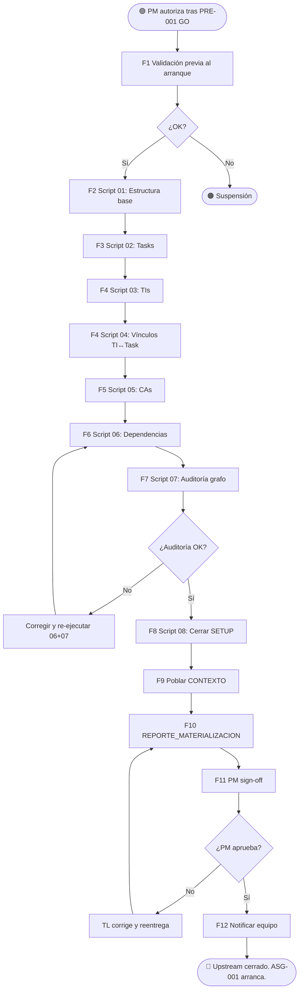

# VTT.PROTOCOL-MAT-001 — Materialización en VTT

| Campo | Valor |
|---|---|
| **Código** | `VTT.PROTOCOL-MAT-001` |
| **Título** | Materialización del Paquete Operativo en VTT (Release/Sprints/Deliveries/Tasks/TIs/CAs/Dependencias) |
| **Versión** | 1.0.0 |
| **Fecha** | 2026-05-31 |
| **Autor** | TW-OPS |
| **Dueño** | PM Governance / Process Owner VTT |
| **Aplica a** | TL (ejecutor principal), DB / BE / DevOps (consumidores del CONTEXTO), PM (sign-off del REPORTE_MATERIALIZACION) |
| **Estado** | Aprobado |
| **Tipo** | Genérico VTT — protocolo de cierre del upstream y arranque del downstream |
| **Reglas aplicables (Nivel 0)** | Ver `00.Rules/rules_catalog.json` |
| **Invoca** | `VTT.PROTOCOL-PRE-001` como prerequisito (no se ejecuta sin preflight aprobado) |
| **Es invocado por** | TL al recibir autorización del PM tras dictamen GO de `PRE-001` |

---

## Tabla de Contenido

1. [Propósito](#1-propósito)
2. [Campo de Aplicación](#2-campo-de-aplicación)
3. [Trigger de Inicio y Condiciones de Fin](#3-trigger-de-inicio-y-condiciones-de-fin)
4. [Responsabilidades](#4-responsabilidades)
5. [Definiciones](#5-definiciones)
6. [Artefactos de Entrada y de Salida](#6-artefactos-de-entrada-y-de-salida)
7. [Orden Operativo de Materialización](#7-orden-operativo-de-materialización)
8. [Procedimiento](#8-procedimiento)
9. [Auditoría del Grafo](#9-auditoría-del-grafo)
10. [Reglas de Aplicabilidad](#10-reglas-de-aplicabilidad)
11. [Referencias Cruzadas](#11-referencias-cruzadas)
12. [Resumen de Revisiones](#12-resumen-de-revisiones)
13. [Anexos](#anexos)

---

## 1. Propósito

Establecer el proceso normativo por el cual el TL **materializa el paquete operativo del PJM** (aprobado por preflight) **en el backend de VTT**: crea Release, Sprints, Deliveries, Tasks, Trackable Items, Criterios de Aceptación, vínculos TI↔Task, dependencias, y produce el `CONTEXTO_<bloque>.md` poblado con UUIDs reales + el `REPORTE_MATERIALIZACION_TL` para sign-off del PM.

Este es el **último Protocol del upstream**. Cuando termina, el equipo downstream puede invocar `VTT.PROTOCOL-ASG-001` con tareas reales en VTT para iniciar asignaciones.

> **Regla de oro:** la materialización es **reproducible vía scripts** (no manual click-by-click). Cada script es idempotente, auditable y reanudable. Si falla a mitad, se reanuda sin duplicar.

---

## 2. Campo de Aplicación

**Aplica a:**

- TL al ejecutar materialización post-preflight aprobado.
- Cualquier bloque/release/sprint con paquete operativo del PJM validado.
- Cualquier proyecto VTT con backend operativo y endpoints documentados.

**No aplica a:**

- Materializaciones manuales sin paquete operativo formal (no recomendadas).
- Re-materializaciones idempotentes que solo agregan tareas nuevas (estas usan subset de `MAT-001`).
- Limpieza/borrado de bloques materializados (proceso aparte).

---

## 3. Trigger de Inicio y Condiciones de Fin

### 3.1 Trigger de inicio

El Protocol arranca cuando:

1. PM autoriza la materialización tras dictamen GO de `VTT.PROTOCOL-PRE-001`.
2. PM autoriza GO con corrección local — el TL usa el SETUP corregido como base.
3. Re-materialización autorizada tras fallo previo.

### 3.2 Condición de fin (éxito)

El Protocol termina exitosamente cuando se cumplen **todas** estas condiciones:

1. Todas las entidades del paquete (Release + Sprints + Deliveries + Tasks + TIs + CAs + dependencias) están materializadas en VTT con UUIDs reales.
2. Auditoría del grafo confirma: origen único, final único, 0 huérfanos, 0 hojas abiertas, 0 ciclos, convergencias correctas.
3. `CONTEXTO_<bloque>.md` está poblado con UUIDs reales y vive en su path canónico.
4. `REPORTE_MATERIALIZACION_TL_<bloque>.md` está escrito con métricas, deudas y próximas acciones.
5. SETUP-BLOQUE-X (el gate origen) está cerrado en VTT con devlog adjunto.
6. PM autorizó el cierre (sign-off del reporte).

### 3.3 Condición de fin (suspensión)

El Protocol se suspende si:

1. API VTT no responde durante ejecución (Nginx caído, backend down).
2. Bug bloqueante encontrado durante materialización que requiere fix de BE.
3. Inconsistencia entre paquete y API descubierta tarde (no detectada en preflight) que afecta materialización masiva.
4. JWT expira y no se puede renovar.

---

## 4. Responsabilidades

### 4.1 TL — Ejecutor principal

- Recibir autorización PM tras preflight GO.
- Producir y ejecutar scripts secuenciales (01..NN) que materializan cada nivel.
- Auditar el grafo al final.
- Poblar `CONTEXTO_<bloque>.md` con UUIDs reales.
- Escribir `REPORTE_MATERIALIZACION_TL_<bloque>.md` para sign-off PM.
- Cerrar SETUP-BLOQUE-X con devlog completo.
- Documentar bugs/deudas encontradas durante materialización.

### 4.2 PM — Aprobador del sign-off

- Recibir `REPORTE_MATERIALIZACION_TL`.
- Validar métricas (tareas materializadas, vínculos TI, CAs, dependencias).
- Aprobar SETUP-BLOQUE-X en VTT (mover a `task_approved`).
- Activar arranque del downstream (`ASG-001` para tareas individuales).

### 4.3 BE / DB / DevOps — Receptores del CONTEXTO

- NO participan en `MAT-001` directamente.
- Reciben el `CONTEXTO_<bloque>.md` poblado para empezar a operar sobre IDs reales cuando llegue su turno en `ASG-001`.

### 4.4 Coordinador (PM Governance / Process Owner)

- Mantener registro de scripts ejecutados y sus resultados.
- Coordinar con DevOps si surge bloqueo de entorno.
- Notificar al equipo cuando materialización está aprobada.

---

## 5. Definiciones

**Materialización:** ejecución de scripts que crean entidades en el backend de VTT a partir del paquete operativo del PJM. Es la transición de "documentos en disco" a "datos en BD".

**Idempotencia:** propiedad de los scripts por la cual ejecutarlos N veces produce el mismo resultado que ejecutarlos 1 vez. Si una entidad ya existe, el script la reusa en lugar de duplicar.

**Reanudabilidad:** propiedad de los scripts por la cual si fallan a mitad, se pueden re-ejecutar y continúan desde donde quedaron usando los outputs intermedios persistidos.

**Auditoría del grafo:** verificación final de que el grafo de tareas materializado cumple las invariantes: origen único, final único, 0 huérfanos, 0 hojas abiertas, 0 ciclos.

**CONTEXTO poblado:** versión del template `CONTEXTO_<bloque>_TEMPLATE.md` con todos los placeholders `___` reemplazados por UUIDs reales devueltos por la API.

**REPORTE_MATERIALIZACION:** documento que el TL entrega al PM con:
- Resumen ejecutivo (métricas: N tareas, N TIs, N CAs, N deps).
- Estructura creada (UUIDs de Phase, Release, Sprints, Deliveries).
- Trazabilidad (TIs, vínculos, CAs).
- Resultado de auditoría del grafo.
- Cumplimiento de instrucciones PM.
- Cierre de SETUP-BLOQUE-X.
- Deudas y observaciones registradas (bugs API, gaps).
- Próximas acciones.

**Deuda registrada:** bug del backend o gap operativo descubierto durante materialización. Se documenta con owner y se reporta para fix posterior. NO bloquea cierre del Protocol si tiene workaround aplicado.

**Scripts secuenciales 01..NN:** convención de naming para los scripts de materialización. Ejecutan en orden, cada uno produce un output JSON que el siguiente consume.

---

## 6. Artefactos de Entrada y de Salida

### 6.1 Artefactos de entrada

| # | Artefacto | Producido por | Obligatorio |
|---|---|---|---|
| 1 | Paquete operativo completo del PJM (incluida versión corregida si hubo corrección local) | PJM vía `SPRINT-001` + TL local (si aplica) | ✅ |
| 2 | `REPORTE_PREFLIGHT_TL` con dictamen GO o GO local | TL vía `PRE-001` | ✅ |
| 3 | Autorización del PM (comentario en VTT o mensaje formal) | PM | ✅ |
| 4 | `CONTEXTO_<bloque>_TEMPLATE.md` (sin poblar) | PJM | ✅ |
| 5 | JWT service token TL vigente | DevOps / Auth | ✅ |
| 6 | Routing Index (3B.9.10) accesible | TL vía `IPL-001` | ✅ |

### 6.2 Artefactos de salida

| # | Artefacto | Path canónico sugerido | Obligatorio |
|---|---|---|---|
| 1 | Scripts ejecutados (01..NN) | `<dir-tmp>/bloque<X>-materializacion/scripts/` | ✅ |
| 2 | Outputs JSON intermedios (estructura, tasks_mapping, ti_mapping, audit_report, status) | `<dir-tmp>/bloque<X>-materializacion/*.json` | ✅ |
| 3 | `CONTEXTO_<bloque>.md` poblado con UUIDs reales | Path canónico del paquete operativo del PJM | ✅ |
| 4 | `REPORTE_MATERIALIZACION_TL_<bloque>.md` | `_project-management/materializacion/REPORTE_MATERIALIZACION_TL_<bloque>.md` | ✅ |
| 5 | Devlog adjunto a SETUP-BLOQUE-X | Attachment en VTT del task SETUP | ✅ |
| 6 | Code Logic adjunto a SETUP-BLOQUE-X | Attachment en VTT del task SETUP | ✅ |
| 7 | Estructura materializada en VTT (BD) | Sistema VTT | ✅ (acción downstream) |
| 8 | Registro de deudas y observaciones | Sección del REPORTE | ✅ |

---

## 7. Orden Operativo de Materialización

> El TL ejecuta los scripts en este orden. Cada uno produce un JSON que el siguiente consume. Si un script falla, se reanuda desde el punto exacto usando el JSON disponible.

### 7.1 Pipeline de 8 scripts (referencia operativa)

| # | Script | Crea / Hace | Output |
|---|---|---|---|
| 01 | `01_create_structure.py` | Phase + Release + Sprints + Deliveries + SETUP-BLOQUE-X | `01_structure_output.json` |
| 02 | `02_create_tasks.py` | Tasks funcionales + TL-Review + AR-Audit + DevOps + CIERRE | `02_tasks_mapping.json` |
| 03 | `03_create_trackable_items.py` | TIs (RFs, NFRs, ADRs, Risks, BRs) | `03_ti_mapping.json` |
| 04 | `04_link_ti_to_tasks.py` | Vínculos TI↔Task con linkType | output append a `03_ti_mapping.json` |
| 05 | `05_create_criteria.py` | Criterios de Aceptación por tarea | `05_criteria_mapping.json` |
| 06 | `06_create_dependencies.py` | Dependencias entre tasks | `06_dependencies.json` |
| 07 | `07_audit_graph.py` | Verifica grafo y produce reporte de auditoría | `07_audit_report.json` |
| 08 | `08_close_setup.py` | Cierra SETUP-BLOQUE-X con devlog + code_logic + transiciones | `08_setup_status.json` |

### 7.2 Idempotencia por script

Cada script al iniciar:
1. Lee el JSON de su output esperado (si existe).
2. Verifica qué entidades ya fueron creadas previamente.
3. Solo crea las faltantes.
4. Actualiza el JSON con los nuevos UUIDs.

### 7.3 Atómico vs no atómico

- **Phase + Release + Sprints + SETUP** → preferir crear en una sola sesión (no atómico pero rara vez falla).
- **Tasks** → batch idempotente, puede dividirse por sprint.
- **TIs** → batch idempotente.
- **Vínculos TI↔Task** → idempotentes pero verificar antes de crear (evita duplicación).
- **CAs** → idempotentes por título por tarea.
- **Dependencias** → idempotentes pero el orden importa: crear desde leaf hacia root o usar lookup forward.

---

## 8. Procedimiento

### 8.1 FASE 1 — Validación previa al arranque

#### 8.1.1 TL confirma autorización PM → **[DECISIÓN]**

- Dictamen GO o GO local del `PRE-001`.
- Comentario / mensaje explícito del PM autorizando.

Si falta autorización → suspender hasta recibir.

#### 8.1.2 TL prepara entorno de scripts → **[ACTIVIDAD]**

- Carpeta temporal: `<dir-tmp>/bloque<X>-materializacion/`.
- Subcarpeta `scripts/` con los 8 scripts.
- JWT TL vigente exportado a variable.
- Paths a CONTEXTO_TEMPLATE + SETUP + Routing Index disponibles.

#### 8.1.3 TL verifica acceso vivo a API → **[DECISIÓN]**

- `curl GET /api/auth/me` → 200 con identidad TL.
- `curl GET /api/projects/<id>` → 200.

Si falla → suspender.

### 8.2 FASE 2 — Script 01: Estructura base

#### 8.2.1 TL ejecuta `01_create_structure.py` → **[ACTIVIDAD]**

Crea:
- Phase (si no existe).
- Release del bloque.
- N Sprints bajo el Release.
- N Deliveries (uno por sprint o por módulo según paquete).
- Vínculo Delivery↔Sprint (si la API lo soporta vía PATCH/PUT; si no, se difiere a SETUP del Task).
- SETUP-BLOQUE-X (task origen) en estado `task_pending`.

Output: `01_structure_output.json` con todos los UUIDs.

#### 8.2.2 TL verifica que `01_structure_output.json` tiene todos los UUIDs esperados → **[DECISIÓN]**

### 8.3 FASE 3 — Script 02: Tasks

#### 8.3.1 TL ejecuta `02_create_tasks.py` → **[ACTIVIDAD]**

Crea todas las tareas del paquete:
- Funcionales (TSK-*) según Task Breakdown.
- TL-Review por sprint.
- AR-Audit por sprint (si aplica GAP-GOV-AR).
- QA por sprint (según handoffs QA).
- DevOps (DO-NN).
- CIERRE-S[N] por sprint.
- CIERRE-BLOQUE-X (task final).

Cada task se crea con:
- title, description, statusId, priorityId, complexity, category, assigneeId, estimatedHours, tags, metadata con `taskIdPlan`, createdBy.
- sprintId vía `Task.sprintId` directo (si VTT-746 está operativo) o vía `Delivery.sprintId` legacy.
- deliveryId asociado vía `POST /api/deliveries/{id}/tasks/{taskId}`.

Output: `02_tasks_mapping.json` con `taskIdPlan → VTT-NNN → sprintId → deliveryId → assigneeRole`.

#### 8.3.2 TL verifica conteo total esperado → **[DECISIÓN]**

- Tareas materializadas = tareas esperadas según INDEX del paquete.

### 8.4 FASE 4 — Script 03 + 04: Trackable Items

#### 8.4.1 TL ejecuta `03_create_trackable_items.py` → **[ACTIVIDAD]**

Crea TIs según paquete: RFs, RNFs, ADRs, Risks, Business Rules. Mapea tipos no estándar (ej. `proc` → `business_rule` si typeCode no válido).

Output: `03_ti_mapping.json` con `<TI_code> → UUID`.

#### 8.4.2 TL ejecuta `04_link_ti_to_tasks.py` → **[ACTIVIDAD]**

Crea vínculos TI↔Task con `linkType` (`implements`, `supports`, `depends_on`, `related_to`, `blocks`).

Append a `03_ti_mapping.json`.

### 8.5 FASE 5 — Script 05: Criterios de Aceptación

#### 8.5.1 TL ejecuta `05_create_criteria.py` → **[ACTIVIDAD]**

Crea CAs por tarea según paquete:
- CAs base por sprint.
- CAs DevOps operativos.
- CAs TL-Review.
- CAs AR-Audit (4 por sprint).
- CAs CIERRE.

**Regla:** usar `POST /api/tasks/{id}/criteria` para crear. NO usar `PATCH /api/tasks/{id}/criteria/{cid}` con campo `evidence` para registrar fulfillment después (bug VTT-778 conocido). Para evidencia → `POST /api/tasks/{id}/criteria/{cid}/fulfillments`.

Output: `05_criteria_mapping.json`.

### 8.6 FASE 6 — Script 06: Dependencias

#### 8.6.1 TL ejecuta `06_create_dependencies.py` → **[ACTIVIDAD]**

Crea dependencias entre tasks usando los UUIDs del `02_tasks_mapping.json`.

Dependencias críticas:
- SETUP-BLOQUE-X → todas las tareas iniciales del primer sprint.
- Convergencias entre sprints (ej. CIERRE-S03 + CIERRE-S04 → TSK-S05-I1-01).
- TL-Review-S[N] → AR-Audit-S[N] → CIERRE-S[N].
- CIERRE-S[N] → primera tarea de S[N+1].
- CIERRE-S[ÚLTIMO] → CIERRE-BLOQUE-X.

Output: `06_dependencies.json`.

### 8.7 FASE 7 — Script 07: Auditoría del grafo

#### 8.7.1 TL ejecuta `07_audit_graph.py` → **[ACTIVIDAD]**

Construye grafo desde `02_tasks_mapping.json` + `06_dependencies.json` y verifica:

- Nodo origen único = SETUP-BLOQUE-X.
- Nodo final único = CIERRE-BLOQUE-X.
- 0 nodos huérfanos (sin dependencia de entrada, excepto SETUP).
- 0 nodos hoja (sin dependencia de salida, excepto CIERRE final).
- 0 ciclos.
- Convergencias explícitas correctas.

Output: `07_audit_report.json`.

#### 8.7.2 ¿Auditoría OK? → **[DECISIÓN]**

- **Sí:** continuar a FASE 8.
- **No:** corregir dependencias faltantes o tareas mal conectadas. Re-ejecutar 06 + 07.

### 8.8 FASE 8 — Script 08: Cierre del SETUP-BLOQUE-X

#### 8.8.1 TL produce DEVLOG_SETUP → **[ACTIVIDAD]**

Documenta:
- Decisiones tomadas durante materialización.
- Workarounds aplicados a bugs API.
- Sustituciones (ej. typeCode `proc` → `business_rule`).
- Métricas finales.

#### 8.8.2 TL produce CODE_LOGIC_SETUP → **[ACTIVIDAD]**

Documenta lógica de los 8 scripts (qué hace cada uno, idempotencia, reanudabilidad).

#### 8.8.3 TL ejecuta `08_close_setup.py` → **[ACTIVIDAD]**

- Asigna SETUP-BLOQUE-X al TL.
- Adjunta DEVLOG_SETUP.md como attachment.
- Adjunta CODE_LOGIC_SETUP.md como attachment.
- Mueve task: `task_pending` → `task_in_progress` → `task_in_review` → `task_completed`.
- Verifica que tareas downstream quedaron desbloqueadas (las que dependen solo de SETUP).

Output: `08_setup_status.json`.

### 8.9 FASE 9 — CONTEXTO poblado

#### 8.9.1 TL puebla `CONTEXTO_<bloque>.md` con UUIDs reales → **[ACTIVIDAD]**

Reemplaza todos los `___` del template con UUIDs reales de los JSON outputs.

#### 8.9.2 TL valida que CONTEXTO está completo → **[DECISIÓN]**

- Phase, Release, Sprints, Deliveries: UUIDs en su lugar.
- Tareas Gate y Cierre: códigos VTT-NNN.
- Tareas TL-Review, AR-Audit, Funcionales, DevOps: códigos VTT-NNN.
- TIs: cantidades por tipo.
- Agentes: UUIDs por rol.

### 8.10 FASE 10 — Reporte de Materialización

#### 8.10.1 TL produce `REPORTE_MATERIALIZACION_TL_<bloque>.md` → **[ACTIVIDAD]**

Secciones obligatorias:

1. Resumen ejecutivo (métricas: Phase, Release, Sprints, Deliveries, Tasks, TIs, vínculos, CAs, deps, auditoría grafo).
2. Estructura creada (UUIDs).
3. Trazabilidad (TIs por tipo, vínculos, CAs por sprint).
4. Grafo de dependencias (auditoría + convergencia explícita + cadena de gates).
5. Cumplimiento de instrucciones PM (tabla instrucción/estado/evidencia).
6. Cierre de SETUP-BLOQUE-X (pasos verificados).
7. Deudas y observaciones registradas (bugs API, gaps).
8. Próximas acciones (#, quién, qué, bloqueante de).
9. Artefactos generados (paths).

#### 8.10.2 TL entrega reporte al PM → **[ACTIVIDAD]**

### 8.11 FASE 11 — Sign-off PM

#### 8.11.1 PM revisa reporte → **[ACTIVIDAD]**

#### 8.11.2 PM autoriza cierre → **[DECISIÓN]**

- **Sí:** PM mueve SETUP-BLOQUE-X a `task_approved` en VTT.
- **No:** PM solicita ajustes; TL corrige y reentrega.

### 8.12 FASE 12 — Notificación al equipo

#### 8.12.1 Coordinador notifica al PJM y al equipo → **[ACTIVIDAD]**

Mensaje:
- Path del `CONTEXTO_<bloque>.md` poblado.
- Path del `REPORTE_MATERIALIZACION_TL`.
- Confirmación: "Materialización aprobada. PJM puede distribuir HANDOFF_TL_S00 al equipo. TL activa assignments según VTT.PROTOCOL-ASG-001."

#### 8.12.2 Fin del Protocol → **[ACTIVIDAD]**

Upstream cerrado. Downstream arranca (`ASG-001` para asignaciones individuales).

---

## 9. Auditoría del Grafo

### 9.1 Invariantes obligatorias

| # | Invariante | Cómo se verifica |
|---|---|---|
| AUD-1 | Origen único = SETUP-BLOQUE-X | Único nodo sin entrada |
| AUD-2 | Final único = CIERRE-BLOQUE-X | Único nodo sin salida |
| AUD-3 | 0 huérfanos | Cada nodo (excepto SETUP) tiene ≥1 entrada |
| AUD-4 | 0 hojas abiertas | Cada nodo (excepto CIERRE final) tiene ≥1 salida |
| AUD-5 | 0 ciclos | DFS/Topological sort no detecta back-edge |
| AUD-6 | Convergencias correctas | Cada convergencia declarada en el paquete está materializada |
| AUD-7 | Cada Task ID del paquete está en VTT | Mapping `taskIdPlan → VTT-NNN` completo |
| AUD-8 | Cada task tiene sprintId | Vía `Task.sprintId` o `Delivery.sprintId` |

### 9.2 Correcciones automáticas vs manuales

- **Auto:** si una task quedó sin sprintId, intentar deducir desde `metadata.sprint` y aplicar `POST /api/sprints/{id}/tasks`.
- **Manual:** dependencias mal modeladas → revisar paquete + corregir + re-ejecutar script 06.

### 9.3 Output de auditoría

`07_audit_report.json` contiene:

```json
{
  "nodes_total": <N>,
  "edges_total": <M>,
  "origin_node": "<VTT-NNN>",
  "final_node": "<VTT-NNN>",
  "orphans": [],
  "open_leaves": [],
  "cycles": [],
  "convergences": [...],
  "missing_taskIdPlan": [],
  "summary": "PASS" | "FAIL"
}
```

---

## 10. Reglas de Aplicabilidad

### 10.1 Reglas UNIVERSALES

| # | Regla |
|---|---|
| U-01 | Preflight aprobado obligatorio antes de invocar `MAT-001`. |
| U-02 | Materialización vía scripts reproducibles. NO manual click-by-click. |
| U-03 | Scripts idempotentes y reanudables. |
| U-04 | Auditoría del grafo obligatoria antes de cerrar SETUP-BLOQUE-X. |
| U-05 | `CONTEXTO_<bloque>.md` poblado con UUIDs reales antes de notificar al equipo. |
| U-06 | `REPORTE_MATERIALIZACION_TL` obligatorio para sign-off PM. |
| U-07 | Deudas/bugs descubiertos durante materialización se registran en el reporte con owner. |
| U-08 | SETUP-BLOQUE-X se cierra solo después de auditoría PASS + devlog + code_logic adjuntos. |
| U-09 | El downstream (`ASG-001`) NO arranca hasta que PM apruebe el sign-off. |

### 10.2 Reglas CONFIGURABLES

| # | Regla | Configuración por proyecto |
|---|---|---|
| C-01 | Path de scripts y outputs JSON | Por proyecto. Default sugerido: `<dir-tmp>/bloque<X>-materializacion/`. |
| C-02 | Número de scripts del pipeline | Default: 8. Proyecto puede ajustar si su API requiere más pasos. |
| C-03 | Nivel de paralelización entre scripts | Default: serial. Proyecto puede paralelizar 03 y 05 si su backend lo soporta. |
| C-04 | Patrón de naming del CONTEXTO | Por proyecto. |
| C-05 | Ruta canónica del REPORTE_MATERIALIZACION | Por proyecto. |
| C-06 | Convenciones de assigneeId vs assignedTo | Por proyecto. Verificar API real. |

### 10.3 Reglas CONDICIONALES

| # | Regla | Condición |
|---|---|---|
| CD-01 | Vincular Delivery↔Sprint vía PATCH/PUT | Endpoint disponible. Si no (404), usar `Task.sprintId` directo. |
| CD-02 | AR-Audit en script 02 | GAP-GOV-AR aprobado por PM. |
| CD-03 | typeCode `proc` → `business_rule` | typeCode `proc` no válido en catálogo del proyecto. |
| CD-04 | Reanudación desde script intermedio | Falla previa con JSON output ya producido. |
| CD-05 | Re-ejecución parcial | Solo se agregan tareas nuevas a estructura existente. |

### 10.4 Reglas RETIRADAS

Ninguna. Primer Protocol formal de materialización.

---

## 11. Referencias Cruzadas

### Protocols relacionados

| Protocol | Relación | Estado |
|---|---|---|
| `VTT.PROTOCOL-PRE-001` | **Prerequisito.** No se invoca `MAT-001` sin preflight GO. | VIGENTE (1.0.0) |
| `VTT.PROTOCOL-SPRINT-001` | Upstream. Paquete operativo materializado aquí. | VIGENTE (2.0.0) |
| `VTT.PROTOCOL-HOPJM-001` | Upstream indirecto. HO Maestro define expectativas materializadas. | VIGENTE (2.0.1) |
| `VTT.PROTOCOL-IPL-001` | Provee Routing Index que `MAT-001` materializa como vínculos TI↔Task. | VIGENTE (1.0.0) |
| `VTT.PROTOCOL-ASG-001` | **Downstream directo.** Se activa tras sign-off de `MAT-001`. | VIGENTE (1.8.1) |

### Templates referenciados

| Template | Uso |
|---|---|
| Template `CONTEXTO_<bloque>_TEMPLATE.md` | Producido por PJM. TL puebla. |
| Template `REPORTE_MATERIALIZACION_TL.md` | Estructura mínima §8.10.1. Ejemplo real: Bloque 1.A del proyecto VTT. |
| Template `DEVLOG_SETUP.md` | Por proyecto. |
| Template `CODE_LOGIC_SETUP.md` | Por proyecto. |

### Scripts referenciados (no Protocol, son SKILL/SCRIPT)

| Script | Uso |
|---|---|
| `01_create_structure.py` | Phase + Release + Sprints + Deliveries + SETUP gate. |
| `02_create_tasks.py` | Todas las tasks del paquete. |
| `03_create_trackable_items.py` | TIs. |
| `04_link_ti_to_tasks.py` | Vínculos TI↔Task. |
| `05_create_criteria.py` | Criterios de Aceptación. |
| `06_create_dependencies.py` | Dependencias entre tasks. |
| `07_audit_graph.py` | Auditoría del grafo. |
| `08_close_setup.py` | Cierre formal de SETUP-BLOQUE-X. |

### Reglas Nivel 0 aplicables

| Regla | Aplica en |
|---|---|
| `RULE-API-*` | §8 todas las fases que tocan API |
| `RULE-DOC-*` | §8.9, §8.10 producción de artefactos |
| `RULE-WORKFLOW-*` | §7 orden operativo |

---

## 12. Resumen de Revisiones

| Versión | Fecha | Editor | Cambios |
|---|---|---|---|
| 1.0.0 | 2026-05-31 | TW-OPS | **Versión inicial.** Formaliza la materialización en VTT post-preflight. Codifica: (1) pipeline de 8 scripts secuenciales con idempotencia y reanudabilidad; (2) auditoría obligatoria del grafo con 8 invariantes; (3) `CONTEXTO_<bloque>.md` poblado con UUIDs reales; (4) `REPORTE_MATERIALIZACION_TL` con 9 secciones obligatorias para sign-off PM; (5) cierre formal de SETUP-BLOQUE-X con devlog + code_logic; (6) registro de deudas/bugs descubiertos durante materialización; (7) notificación al equipo solo tras sign-off PM. Precedente operativo: Bloque 1.A del proyecto VTT — TL materializó 90 tasks + 64 TIs + 62 vínculos + 133 CAs + 130 deps con grafo auditado OK. |

---

## Anexos

### Anexo A — Diagrama de flujo end-to-end



### Anexo B — Checklist consolidado de materialización

**Preparación:**
- [ ] Preflight GO autorizado por PM.
- [ ] Carpeta de scripts y outputs preparada.
- [ ] JWT TL vigente.
- [ ] Acceso vivo a API confirmado.
- [ ] Paquete operativo + CONTEXTO_TEMPLATE accesibles.

**Pipeline:**
- [ ] Script 01 ejecutado, Phase + Release + Sprints + Deliveries + SETUP creados.
- [ ] Script 02 ejecutado, Tasks materializadas con `taskIdPlan → VTT-NNN`.
- [ ] Script 03 ejecutado, TIs creados.
- [ ] Script 04 ejecutado, vínculos TI↔Task creados.
- [ ] Script 05 ejecutado, CAs creadas.
- [ ] Script 06 ejecutado, dependencias creadas.
- [ ] Script 07 ejecutado, auditoría PASS.

**Cierre:**
- [ ] DEVLOG_SETUP.md producido.
- [ ] CODE_LOGIC_SETUP.md producido.
- [ ] Script 08 ejecutado, SETUP-BLOQUE-X cerrado.
- [ ] CONTEXTO_<bloque>.md poblado con UUIDs reales.
- [ ] REPORTE_MATERIALIZACION_TL escrito con 9 secciones.
- [ ] PM aprueba sign-off (SETUP-BLOQUE-X → task_approved).
- [ ] Equipo notificado.

### Anexo C — Plantilla del REPORTE_MATERIALIZACION

```markdown
# REPORTE DE MATERIALIZACIÓN — <Bloque>

| Campo | Valor |
|---|---|
| Versión | 1.0 |
| Fecha | YYYY-MM-DD |
| Emisor | TL (<UUID>) |
| Tarea origen | SETUP-BLOQUE-X (<VTT-NNN>) → task_completed |
| Insumo PM | <paths del paquete operativo + preflight aprobado> |

## §1 Resumen ejecutivo

| Métrica | Resultado |
| Phase | 1 (<UUID>) |
| Release | 1 (<UUID>) |
| Sprints | <N> |
| Deliveries | <N> |
| Tasks materializadas | <N> (<rango VTT-NNN>) |
| Trackable Items | <N> |
| Vínculos TI ↔ Task | <N> |
| Criterios de Aceptación | <N> |
| Dependencias | <N> |
| Convergencias | <lista> |
| Auditoría grafo | <PASS/FAIL> |

## §2 Estructura creada

<tablas con UUIDs reales por nivel>

## §3 Trazabilidad

<TIs por tipo, vínculos por linkType, CAs por sprint>

## §4 Grafo de dependencias

<resultados de auditoría + convergencias explícitas + cadena de gates>

## §5 Cumplimiento de instrucciones PM

| Instrucción PM | Estado | Evidencia |

## §6 Cierre de SETUP-BLOQUE-X

| Paso | Resultado |
| Asignación TL | ✅ |
| Comentario obligatorio | ✅ |
| Devlog adjunto | ✅ |
| Code_logic adjunto | ✅ |
| Transiciones de estado | ✅ |
| Tareas desbloqueadas | <N> |

## §7 Deudas y observaciones registradas

| ID | Owner | Descripción | Bloquea |

## §8 Próximas acciones

| # | Quién | Acción | Bloqueante |

## §9 Artefactos generados

<paths>
```

### Anexo D — Glosario operativo

| Término | Definición abreviada |
|---|---|
| Materialización | Crear entidades en backend desde paquete documental |
| Idempotencia | N ejecuciones = 1 ejecución |
| Reanudabilidad | Falla a mitad → continúa desde donde quedó |
| Auditoría del grafo | Verificación de 8 invariantes |
| CONTEXTO poblado | Template con UUIDs reales sustituidos |
| REPORTE_MATERIALIZACION | Documento de sign-off PM |
| Deuda registrada | Bug/gap descubierto durante materialización |
| SETUP-BLOQUE-X | Gate origen del grafo, se cierra al final del Protocol |

---

| Editor | Dueño | Última Actualización |
|---|---|---|
| TW-OPS (fe1b589c-7cf2-4779-82d4-b7ae536536ce) | PM Governance / Process Owner VTT | 2026-05-31 |

**Versión:** 1.0.0 — Materialización en VTT con pipeline de 8 scripts, auditoría del grafo, CONTEXTO poblado y REPORTE para sign-off PM.
**Estado:** Aprobado

*Versión más reciente en `virtual-teams-setup`. No controlada si se imprime.*
