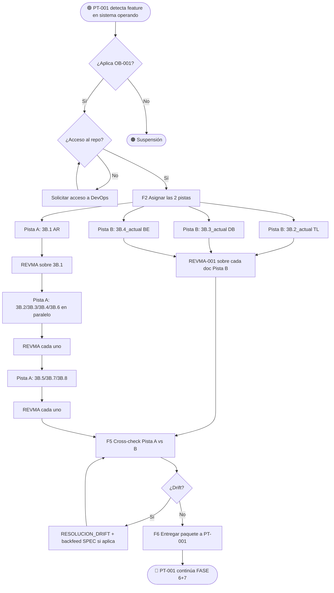

# VTT.PROTOCOL-OB-001 — Onboarding de Feature en Sistema Operando

| Campo | Valor |
|---|---|
| **Código** | `VTT.PROTOCOL-OB-001` |
| **Título** | Onboarding de Feature en Sistema Operando (2 pistas paralelas: diseño + estado actual) |
| **Versión** | 1.0.0 |
| **Fecha** | 2026-05-31 |
| **Autor** | TW-OPS |
| **Dueño** | PM Governance / Process Owner VTT |
| **Aplica a** | TL (orquestador), AR/DB/BE (extractores de SPEC y analistas de repo), PM Revisor (audita), Coordinador |
| **Estado** | Aprobado |
| **Tipo** | Genérico VTT — protocolo del upstream (variante específica) |
| **Reglas aplicables (Nivel 0)** | Ver `00.Rules/rules_catalog.json` |
| **Invoca** | `VTT.PROTOCOL-REVMA-001` (sobre cada doc de cada pista) |
| **Es invocado por** | `VTT.PROTOCOL-PT-001` cuando detecta que la feature vive dentro de sistema operando |

---

## Tabla de Contenido

1. [Propósito](#1-propósito)
2. [Campo de Aplicación](#2-campo-de-aplicación)
3. [Trigger de Inicio y Condiciones de Fin](#3-trigger-de-inicio-y-condiciones-de-fin)
4. [Responsabilidades](#4-responsabilidades)
5. [Definiciones](#5-definiciones)
6. [Artefactos de Entrada y de Salida](#6-artefactos-de-entrada-y-de-salida)
7. [Las Dos Pistas](#7-las-dos-pistas)
8. [Procedimiento](#8-procedimiento)
9. [Resolución de Drift SPEC vs Repo](#9-resolución-de-drift-spec-vs-repo)
10. [Reglas de Aplicabilidad](#10-reglas-de-aplicabilidad)
11. [Referencias Cruzadas](#11-referencias-cruzadas)
12. [Resumen de Revisiones](#12-resumen-de-revisiones)
13. [Anexos](#anexos)

---

## 1. Propósito

Establecer el proceso normativo para **producir el paquete técnico cuando la feature se implementa dentro de un sistema ya operando** (con repo + código vivo + schema activo + endpoints en producción).

A diferencia de un proyecto nuevo desde cero (que recorre el SDLC completo de Fase 0 a Fase 3B), una feature dentro de sistema operando **NO tiene** docs de Fase 2 Analysis ni un paquete técnico previo. Tiene **dos fuentes** que se consultan en paralelo:

- **Pista A — Diseño:** extracción desde SPEC + METODOLOGIA hacia los docs `3B.X_<feature>.md` (qué se va a construir).
- **Pista B — Estado actual:** análisis del repo existente hacia docs `3B.X_actual_<feature>.md` (sobre qué base se construye).

Las dos pistas alimentan `VTT.PROTOCOL-PT-001` y luego `VTT.PROTOCOL-IPL-001` (Routing Index). Sin este Protocol, el TL/agentes ejecutores tendrían que explorar el repo en cada tarea, disparando consumo de tokens innecesario.

> **Regla de oro:** la inversión en docs `3B.X_actual_*` se hace **una vez** por feature. Cada tarea downstream lee solo 2-3 docs ligeros vs explorar repo completo. Es la palanca principal de eficiencia del upstream.

---

## 2. Campo de Aplicación

**Aplica a:**

- Cualquier feature/bloque/release que se desarrolla **dentro de un repositorio existente con código en operación**.
- Migraciones, refactors, extensiones de funcionalidad, parches críticos en sistemas activos.
- Cualquier proyecto donde NO existen los 16 docs de Fase 1 + Fase 2 del SDLC pero SÍ existe SPEC + repo.

**No aplica a:**

- Proyecto nuevo desde cero (cubierto por `VTT.PROTOCOL-PT-001` sin pista paralela B).
- Repos sin código vivo (en greenfield no hay "estado actual" que analizar).
- Features cubiertas íntegramente por documentos de SPEC sin necesidad de tocar código existente (caso raro pero posible).
- Migraciones de datos puras sin cambio de schema (cubierto por sub-doc 3B.9.8 directamente).

---

## 3. Trigger de Inicio y Condiciones de Fin

### 3.1 Trigger de inicio

El Protocol arranca cuando:

1. `VTT.PROTOCOL-PT-001` detecta en su FASE 1.3 que la feature vive dentro de sistema operando.
2. PM Governance solicita explícitamente onboarding de una feature contra un repo activo.
3. Backfeed: una tarea downstream detectó que el "estado actual" no estaba documentado y disparó este Protocol retroactivamente.

### 3.2 Condición de fin (éxito)

El Protocol termina exitosamente cuando se cumplen **todas** estas condiciones:

1. Pista A entregó los docs `3B.X_<feature>.md` aprobados (los 8 docs base de `PT-001`).
2. Pista B entregó los docs `3B.X_actual_*.md` aprobados (típicamente 4 docs: structure, schema, endpoints, patterns).
3. Drift SPEC vs Repo resuelto y documentado (cero contradicciones sin justificación).
4. Routing Index del 3B.9.10 puede ser construido con referencias a docs de ambas pistas.

### 3.3 Condición de fin (suspensión)

El Protocol se suspende si:

1. Acceso al repo no disponible (rama protegida, credenciales no provistas).
2. SPEC contradice masivamente el repo y el PM análisis no puede resolver en tiempo.
3. El repo es tan grande que el análisis no encaja en una sola sesión y requiere descomposición (escalación a PM Governance).

---

## 4. Responsabilidades

### 4.1 TL — Orquestador del Protocol

- Confirmar que aplica este Protocol (feature dentro de sistema operando).
- Asignar las 2 pistas a los roles correspondientes.
- Coordinar la resolución de drift SPEC vs Repo.
- Entregar el conjunto completo (4-8 docs Pista A + 4 docs Pista B) al coordinador.

### 4.2 AR — Owner de extracción de arquitectura desde SPEC (Pista A)

- Producir 3B.1 Solution Architecture extrayendo de SPEC.
- Si SPEC no cubre algún aspecto, consultar al PM análisis (no inventar).

### 4.3 DB — Owner de Pista B "estado actual del schema" + Pista A 3B.3

- **Pista B:** producir `3B.3_actual_<feature>.md` analizando el `schema.prisma` (o equivalente) existente: tablas, campos, relaciones, índices que YA existen.
- **Pista A:** producir `3B.3_<feature>.md` desde SPEC con el delta sobre el schema actual.

### 4.4 BE — Owner de Pista B "endpoints actuales" + Pista A 3B.4

- **Pista B:** producir `3B.4_actual_<feature>.md` analizando `routes/` y controladores existentes: endpoints YA implementados con sus contratos.
- **Pista A:** producir `3B.4_<feature>.md` desde SPEC con el delta de endpoints nuevos.

### 4.5 TL (rol técnico) — Owner de Pista B "estructura y patterns" + Pista A 3B.2

- **Pista B:** producir `3B.2_actual_<feature>.md` analizando `src/`: estructura de carpetas, naming conventions, patterns usados, error handling actual.
- **Pista A:** producir `3B.2_<feature>.md` desde SPEC con extensiones o cambios a la estructura.

### 4.6 Coordinador (PM Governance / Process Owner)

- Invocar `REVMA-001` por cada doc producido (de ambas pistas).
- Detectar y disparar resolución de drift cuando Pista A y Pista B se contradicen.
- Mantener bitácora de las 2 pistas.
- Notificar a `PT-001` cuando ambas pistas estén completas.

### 4.7 PM Revisor — Audita cada doc

- Aplicar `REVMA-001` independiente para cada doc de cada pista.
- Validar específicamente que Pista B referencia archivos/líneas reales del repo (no inventa).

---

## 5. Definiciones

**Pista A "Diseño":** docs que extraen QUÉ se va a construir desde SPEC. Equivalen a los 8 docs base del paquete técnico (3B.1..3B.8), pero **enfocados al delta** que la feature introduce.

**Pista B "Estado actual":** docs que describen SOBRE QUÉ base se construye, analizando el repo existente. Típicamente 4 docs:

- `3B.2_actual_<feature>.md` — estructura de carpetas, naming, patterns que YA existen.
- `3B.3_actual_<feature>.md` — schema de BD que YA existe.
- `3B.4_actual_<feature>.md` — endpoints que YA están implementados.
- `3B.2_actual_patterns_<feature>.md` — patrones de código usados (AppError, logger, middleware chain, etc.).

**Drift SPEC vs Repo:** situación donde SPEC declara X y el repo tiene Y. Ejemplos: SPEC dice "tabla con campos A, B, C" pero el repo tiene "tabla con campos A, B, D". Resolución en §9.

**Inversión única amortizada:** el costo de generar docs Pista B se paga **una vez** por feature. Cada tarea downstream lee solo 2-3 docs vs explorar repo entero, ahorrando tokens en cada tarea de la feature.

**Estado actual auditable:** descripción del repo que cita archivos, líneas, símbolos verificables. No es interpretación libre — es snapshot referenciado.

---

## 6. Artefactos de Entrada y de Salida

### 6.1 Artefactos de entrada

| # | Artefacto | Producido por | Obligatorio |
|---|---|---|---|
| 1 | SPEC aprobada de la feature | PM análisis | ✅ |
| 2 | METODOLOGIA aprobada | PM análisis | ✅ |
| 3 | Acceso lectura al repo existente | DevOps / PM | ✅ |
| 4 | OPERATIVO del proyecto | PM | ✅ |
| 5 | (Si existe) docs de bloques previos del mismo repo | TL | ⚠️ Si aplica |
| 6 | Catálogo SDLC genérico | Referencia | ✅ (input transitivo para `IPL-001` después) |

### 6.2 Artefactos de salida — Pista A "Diseño"

Los 8 docs equivalentes a `PT-001` pero enfocados al delta de la feature. Path canónico sugerido bajo `phases/03-design/deliverables/`. Convención de nombre: `3B.X_<feature>_v<X.Y>.md`.

(Lista completa en §7.1 de `VTT.PROTOCOL-PT-001`.)

### 6.3 Artefactos de salida — Pista B "Estado actual"

| # | Artefacto | Owner | Path canónico sugerido |
|---|---|---|---|
| 1 | `3B.2_actual_<feature>_v<X.Y>.md` — estructura + patterns | TL | `phases/03-design/deliverables/code-architecture/` |
| 2 | `3B.3_actual_<feature>_v<X.Y>.md` — schema BD actual | DB | `phases/03-design/deliverables/database/` |
| 3 | `3B.4_actual_<feature>_v<X.Y>.md` — endpoints actuales | BE | `phases/03-design/deliverables/api-design/` |
| 4 | (Opcional) `3B.7_actual_<feature>_v<X.Y>.md` — controles SEC actuales | SEC | `phases/03-design/deliverables/security/` |
| 5 | (Opcional) `3B.8_actual_<feature>_v<X.Y>.md` — infra actual | DevOps | `phases/03-design/deliverables/infrastructure/` |

### 6.4 Artefacto adicional

| # | Artefacto | Producido por | Obligatorio |
|---|---|---|---|
| 1 | `RESOLUCION_DRIFT_<feature>_v<X.Y>.md` — registro de contradicciones SPEC vs Repo y cómo se resolvieron | Coordinador + TL | ⚠️ Si hay drift detectado |

---

## 7. Las Dos Pistas

### 7.1 Pista A — Diseño desde SPEC

Equivalente a `PT-001` estándar, pero los docs se enfocan al **delta** que la feature introduce sobre el repo existente. NO documenta lo que ya existe (eso es Pista B) — documenta lo que va a cambiar.

Por ejemplo, si la feature agrega 3 endpoints nuevos sobre 11 endpoints existentes, el 3B.4 de Pista A documenta **solo los 3 nuevos** + las modificaciones a los 11 existentes si aplica. La descripción de los 11 existentes vive en `3B.4_actual_*` de Pista B.

### 7.2 Pista B — Estado actual del repo

#### 7.2.1 Qué documenta cada doc

**`3B.2_actual_<feature>.md`:**
- Estructura de carpetas reales de `src/` (o equivalente).
- Naming conventions observadas.
- Patterns recurrentes: cómo se manejan errores, cómo se inicializa el logger, cómo se chainean middlewares.
- Archivos clave que la feature probablemente tocará.

**`3B.3_actual_<feature>.md`:**
- Tablas del `schema.prisma` (o equivalente) que YA existen y son relevantes a la feature.
- Campos, tipos, relaciones, índices, constraints.
- Migraciones aplicadas hasta la fecha.
- Datos seed que la feature puede consumir.

**`3B.4_actual_<feature>.md`:**
- Endpoints que YA están implementados y son relevantes a la feature.
- Métodos, paths, contratos request/response actuales.
- Validators y middleware aplicado.
- Auth/Authz actual aplicada a cada endpoint.

**`3B.2_actual_patterns_<feature>.md` (opcional, puede integrarse al 3B.2_actual):**
- Patrón AppError o equivalente para errores.
- Patrón de logging (Winston, Pino, etc.) con correlationId.
- Patrón de validación (Zod, Joi, etc.).
- Pipeline middleware estándar de la app.

#### 7.2.2 Reglas críticas de la Pista B

- **Solo documentar lo relevante a la feature.** No clonar el repo en markdown.
- **Citar archivos, líneas, símbolos verificables.** Ejemplo: `src/middleware/auth.ts:42-58 — función authenticate()`.
- **No interpretar.** Si el código hace X, escribir que hace X (no "probablemente hace X").
- **Si encuentra inconsistencias internas del repo** (ej. dos servicios con patterns distintos), documentar ambos sin elegir.
- **No proponer cambios.** Eso es Pista A.

### 7.3 Por qué dos pistas y no una

Pista A sin Pista B → el agente downstream que va a implementar tiene SPEC + delta, pero no sabe sobre qué construir. Explora el repo en cada tarea → tokens disparados.

Pista B sin Pista A → el agente sabe qué ya hay pero no qué construir.

Ambas pistas → el agente recibe "esto ya existe (Pista B), esto vas a construir (Pista A), aquí está la dependencia" en 2-3 docs ligeros vía Routing Index.

---

## 8. Procedimiento

### 8.1 FASE 1 — Validación inicial

#### 8.1.1 TL confirma aplicabilidad → **[DECISIÓN]**

¿La feature vive dentro de sistema operando?
- **Sí:** continuar.
- **No:** este Protocol no aplica. Usar `PT-001` directo sin pista B.

#### 8.1.2 TL verifica acceso al repo → **[DECISIÓN]**

- Acceso de lectura confirmado.
- Rama base (típicamente `main`) accesible.
- Permisos de lectura a `src/`, `prisma/`, `routes/`, etc.

Si falta acceso → suspender y solicitar a DevOps/PM.

### 8.2 FASE 2 — Asignación a roles

#### 8.2.1 TL asigna las 2 pistas → **[ACTIVIDAD]**

- Pista A (8 docs delta): AR/TL/DB/BE/SEC/DevOps según `PT-001` §7.
- Pista B (4 docs estado actual): TL (estructura), DB (schema), BE (endpoints), opcionalmente SEC/DevOps.

Las 2 pistas corren en **paralelo** desde el inicio.

### 8.3 FASE 3 — Producción Pista B (estado actual)

#### 8.3.1 Cada owner de Pista B analiza su área → **[ACTIVIDAD]**

- TL analiza `src/` y produce `3B.2_actual_*`.
- DB analiza `schema.prisma` y produce `3B.3_actual_*`.
- BE analiza `routes/` y produce `3B.4_actual_*`.

#### 8.3.2 Coordinador invoca `REVMA-001` sobre cada doc Pista B → **[INVOCACIÓN]**

El PM Revisor verifica específicamente:
- Cada afirmación cita archivo + línea (o símbolo verificable).
- No hay interpretación libre.
- Cobertura es relevante a la feature (no clona repo).

### 8.4 FASE 4 — Producción Pista A (diseño delta)

Equivalente a `PT-001` con orden de dependencias §7.1 de PT-001:

#### 8.4.1 AR produce 3B.1 (raíz Pista A) → **[ACTIVIDAD]**

#### 8.4.2 Una vez 3B.1 aprobado, paralelizar producción de 3B.2, 3B.3, 3B.4, 3B.6 → **[ACTIVIDAD]**

Cada owner produce el delta de su doc usando como referencia el `*_actual_*` correspondiente.

#### 8.4.3 Cuando 3B.4 está aprobado, arrancar 3B.5 y 3B.7 → **[ACTIVIDAD]**

#### 8.4.4 Cuando 3B.6 está aprobado, arrancar 3B.8 → **[ACTIVIDAD]**

#### 8.4.5 Coordinador invoca `REVMA-001` sobre cada doc Pista A → **[INVOCACIÓN]**

### 8.5 FASE 5 — Detección y resolución de drift

#### 8.5.1 Coordinador hace cross-check Pista A vs Pista B → **[ACTIVIDAD]**

Para cada par (Pista A doc X, Pista B doc X correspondiente):

- ¿Hay declaración de Pista A que contradice estado de Pista B?
- ¿Hay supuesto de Pista A que no aparece en Pista B?
- ¿Hay decisión cerrada en Pista A que el repo de Pista B no respeta?

#### 8.5.2 ¿Hay drift detectado? → **[DECISIÓN]**

- **No:** continuar a FASE 6.
- **Sí:** ir a §9 (Resolución de Drift).

### 8.6 FASE 6 — Cross-check con `PT-001`

#### 8.6.1 Coordinador valida que ambas pistas están completas → **[DECISIÓN]**

- Los 8 docs Pista A aprobados.
- Los 4 docs Pista B aprobados.
- Drift resuelto si lo hubo.

#### 8.6.2 Coordinador entrega el paquete a `PT-001` → **[ACTIVIDAD]**

`PT-001` continúa con su FASE 6 (cross-check coherencia del paquete completo) y FASE 7 (entrega al TL para `IPL-001`).

---

## 9. Resolución de Drift SPEC vs Repo

### 9.1 Regla universal U-D1

**SPEC prevalece sobre Repo, SALVO que SPEC esté objetivamente equivocada.**

### 9.2 Casos típicos y resolución

**Caso 1: SPEC dice "tabla T con campos A,B,C" pero repo tiene "tabla T con A,B,D"**

Resolución:
- Si D es campo legacy y SPEC quiere reemplazarlo por C → migración. Documentar en 3B.9.8 (Migration & Rollout).
- Si D es campo válido que SPEC no mencionó → corregir SPEC (backfeed a PM análisis), porque era un olvido.
- Si C y D coexisten → ambos van en 3B.3 final.

**Caso 2: SPEC dice "endpoint POST /api/X" pero el repo tiene "POST /api/x" (case-sensitive)**

Resolución: SPEC se corrige al case real del repo (cosmético, va por "corrección local" de `REVMA`).

**Caso 3: SPEC dice "validar con Zod" pero repo entero usa Joi**

Resolución: el pattern del repo prevalece SALVO que SPEC justifique el cambio. Si no hay justificación → SPEC se ajusta a Joi.

**Caso 4: SPEC declara una arquitectura incompatible con el repo (ej. monolito → microservicios sin migración)**

Resolución: drift mayor. PM Governance interviene. Probablemente la feature es más grande que un bloque y requiere ADR previo.

### 9.3 Documentación de cada resolución

Coordinador escribe `RESOLUCION_DRIFT_<feature>_v<X.Y>.md` con tabla:

| # | Tipo (1/2/3/4) | Ubicación SPEC | Ubicación Repo | Resolución | Acción |
|---|---|---|---|---|---|
| 1 | 1 | SPEC §X | schema.prisma:N | C y D coexisten | Ambos en 3B.3 |
| 2 | 2 | SPEC §Y | routes/X.ts:M | Cosmético | SPEC corregida |
| 3 | 3 | SPEC §Z | validators/* | SPEC se ajusta a Joi | SPEC corregida |

### 9.4 Si la resolución requiere backfeed a SPEC

- Coordinador notifica al PM análisis.
- PM análisis regenera SPEC vía `REVMA-001`.
- Una vez SPEC corregida, este Protocol reanuda.

---

## 10. Reglas de Aplicabilidad

### 10.1 Reglas UNIVERSALES

| # | Regla |
|---|---|
| U-01 | 2 pistas paralelas obligatorias en feature dentro de sistema operando. |
| U-02 | Pista B documenta lo que YA existe, citando archivos/líneas. NO interpreta. |
| U-03 | Pista A documenta el DELTA (qué va a cambiar). NO duplica Pista B. |
| U-04 | Drift se documenta en `RESOLUCION_DRIFT` con tipo de resolución aplicada. |
| U-05 | SPEC prevalece sobre Repo, SALVO que SPEC esté objetivamente equivocada. |
| U-06 | Pista B se hace UNA vez por feature. No por tarea. |
| U-07 | `REVMA-001` se invoca por cada doc de cada pista, independientemente. |
| U-08 | Si SPEC requiere cambio por drift mayor, se regenera SPEC antes de continuar (backfeed). |

### 10.2 Reglas CONFIGURABLES

| # | Regla | Configuración por proyecto |
|---|---|---|
| C-01 | Número y nombre de docs Pista B | Default: 4 (`3B.2_actual`, `3B.3_actual`, `3B.4_actual`, `3B.7_actual` o `3B.8_actual` si aplica). Proyecto puede ajustar. |
| C-02 | Profundidad de análisis del repo en Pista B | Por proyecto. Default: relevante a feature, no exhaustivo. |
| C-03 | Convención de naming `*_actual_*.md` vs `*_existing_*.md` | Por proyecto. Default sugerido: `_actual_`. |
| C-04 | Path canónico de docs Pista B | Por proyecto. Default sugerido: junto a docs Pista A. |
| C-05 | Cuándo se descompone una feature por tamaño | Por proyecto. Default sugerido: si el análisis del repo no encaja en una sesión, escalación. |

### 10.3 Reglas CONDICIONALES

| # | Regla | Condición |
|---|---|---|
| CD-01 | Pista B `3B.7_actual_*` | Proyecto exige documentar controles SEC actuales del repo. |
| CD-02 | Pista B `3B.8_actual_*` | Feature toca infra (CI/CD, despliegue, backups). |
| CD-03 | Pista B `3B.2_actual_patterns_*` | Patrones del repo son lo suficientemente complejos para doc separado. |
| CD-04 | Resolución de drift activa | Cross-check FASE 5 detectó contradicción. |
| CD-05 | Backfeed a SPEC | Drift indica que SPEC tiene error o gap. |

### 10.4 Reglas RETIRADAS

Ninguna. Primer Protocol de onboarding feature dentro de sistema operando.

---

## 11. Referencias Cruzadas

### Protocols relacionados

| Protocol | Relación | Estado |
|---|---|---|
| `VTT.PROTOCOL-PT-001` | **Padre del Protocol.** OB-001 es la pista paralela B + complemento de Pista A. | VIGENTE (1.0.0) |
| `VTT.PROTOCOL-REVMA-001` | **Invocado por cada doc** de cada pista. | VIGENTE (1.0.0) |
| `VTT.PROTOCOL-IPL-001` | **Downstream.** Usa docs de ambas pistas al consolidar 3B.9 + Routing Index. | VIGENTE (1.0.0) |

### Templates referenciados

| Template | Uso |
|---|---|
| Template `3B.X_actual_*.md` | Por proyecto. Sugerido: estructura común con secciones de archivos analizados + tablas/schema/endpoints citados con referencias. |
| Template `RESOLUCION_DRIFT.md` | Por proyecto. Estructura mínima en §9.3. |

### Reglas Nivel 0 aplicables

| Regla | Aplica en |
|---|---|
| `RULE-DOC-*` | §6 artefactos de salida (docs Pista B deben citar fuente verificable). |
| `RULE-WORKFLOW-*` | §8 todas las fases. |

---

## 12. Resumen de Revisiones

| Versión | Fecha | Editor | Cambios |
|---|---|---|---|
| 1.0.0 | 2026-05-31 | TW-OPS | **Versión inicial.** Formaliza el onboarding de feature dentro de sistema operando con 2 pistas paralelas: (A) extracción desde SPEC hacia docs delta `3B.X_<feature>.md`, (B) análisis del repo existente hacia docs `3B.X_actual_<feature>.md`. Codifica: (1) las 2 pistas corren en paralelo; (2) Pista B documenta lo que YA existe citando archivos/líneas, no interpreta ni propone cambios; (3) Pista A documenta el DELTA; (4) resolución de drift SPEC vs Repo con 4 casos típicos y backfeed a SPEC si aplica; (5) inversión única amortizada — Pista B se hace una vez por feature, no por tarea; (6) cross-check obligatorio antes de entregar a `PT-001` FASE 6. Protocol invocado por `PT-001` cuando detecta feature dentro de sistema operando. |

---

## Anexos

### Anexo A — Diagrama de flujo end-to-end

### Anexo B — Checklist consolidado

**Pista B "Estado actual":**
- [ ] `3B.2_actual_*` con estructura + patterns + naming + archivos clave citados.
- [ ] `3B.3_actual_*` con tablas relevantes + campos + relaciones + índices citados desde schema.
- [ ] `3B.4_actual_*` con endpoints relevantes + contratos + validators + middleware citados desde routes.
- [ ] (Opcional) `3B.7_actual_*` con controles SEC actuales.
- [ ] (Opcional) `3B.8_actual_*` con infra actual.
- [ ] Cada afirmación cita archivo + línea o símbolo.
- [ ] Cero interpretación libre.
- [ ] Cada doc aprobado vía `REVMA-001`.

**Pista A "Diseño delta":**
- [ ] 8 docs equivalentes a `PT-001` enfocados al delta de la feature.
- [ ] Referencian Pista B cuando aplica.
- [ ] Cada doc aprobado vía `REVMA-001`.

**Drift:**
- [ ] Cross-check ejecutado.
- [ ] `RESOLUCION_DRIFT_<feature>.md` escrito si hay drift.
- [ ] Backfeed a SPEC ejecutado si aplica.

**Entrega:**
- [ ] Coordinador notifica a `PT-001` que ambas pistas están completas.

### Anexo C — Glosario operativo

| Término | Definición abreviada |
|---|---|
| Pista A | Diseño delta extraído desde SPEC |
| Pista B | Estado actual del repo, citando archivos/líneas |
| Drift | Contradicción SPEC vs Repo |
| Inversión única | Pista B se hace 1 vez por feature, no por tarea |
| Backfeed a SPEC | Drift mayor obliga a regenerar SPEC |
| Estado actual auditable | Snapshot del repo con referencias verificables |

---

| Editor | Dueño | Última Actualización |
|---|---|---|
| TW-OPS (fe1b589c-7cf2-4779-82d4-b7ae536536ce) | PM Governance / Process Owner VTT | 2026-05-31 |

**Versión:** 1.0.0 — Onboarding feature dentro de sistema operando con 2 pistas paralelas + resolución de drift.
**Estado:** Aprobado

*Versión más reciente en `virtual-teams-setup`. No controlada si se imprime.*
