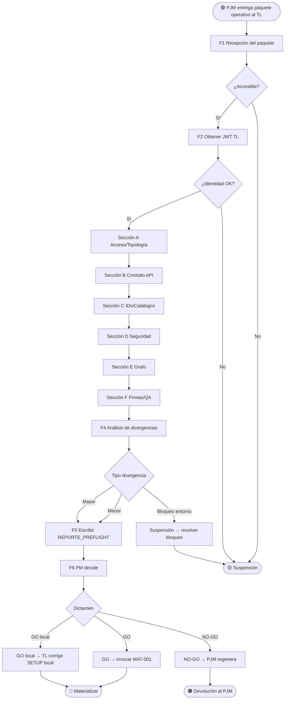

# VTT.PROTOCOL-PRE-001 — Preflight TL antes de Materializar

| Campo | Valor |
|---|---|
| **Código** | `VTT.PROTOCOL-PRE-001` |
| **Título** | Preflight TL — Validación Contractual contra API Real antes de Materializar |
| **Versión** | 1.0.0 |
| **Fecha** | 2026-05-31 |
| **Autor** | TW-OPS |
| **Dueño** | PM Governance / Process Owner VTT |
| **Aplica a** | TL (ejecutor principal), PM (decide GO/NO-GO/corrección local), PJM (recibe devolución si aplica), Coordinador |
| **Estado** | Aprobado |
| **Tipo** | Genérico VTT — protocolo del upstream (gate de calidad pre-materialización) |
| **Reglas aplicables (Nivel 0)** | Ver `00.Rules/rules_catalog.json` |
| **Invoca** | `VTT.PROTOCOL-REVMA-001` (sobre el reporte de preflight si requiere PM Revisor) |
| **Es invocado por** | TL al recibir paquete operativo del PJM, antes de invocar `VTT.PROTOCOL-MAT-001` |

---

## Tabla de Contenido

1. [Propósito](#1-propósito)
2. [Campo de Aplicación](#2-campo-de-aplicación)
3. [Trigger de Inicio y Condiciones de Fin](#3-trigger-de-inicio-y-condiciones-de-fin)
4. [Responsabilidades](#4-responsabilidades)
5. [Definiciones](#5-definiciones)
6. [Artefactos de Entrada y de Salida](#6-artefactos-de-entrada-y-de-salida)
7. [Validaciones Obligatorias del Preflight](#7-validaciones-obligatorias-del-preflight)
8. [Procedimiento](#8-procedimiento)
9. [Política GO / NO-GO / Corrección Local](#9-política-go--no-go--corrección-local)
10. [Reglas de Aplicabilidad](#10-reglas-de-aplicabilidad)
11. [Referencias Cruzadas](#11-referencias-cruzadas)
12. [Resumen de Revisiones](#12-resumen-de-revisiones)
13. [Anexos](#anexos)

---

## 1. Propósito

Establecer el proceso normativo por el cual el TL valida el **paquete operativo del PJM** contra la **API real del backend** y el **estado del repo** ANTES de ejecutar materialización en VTT.

Este Protocol existe porque el paquete del PJM puede contener:
- Contratos API obsoletos o inventados (PJM no validó contra documentación API vigente).
- Endpoints con verbo o path incorrecto.
- Campos obligatorios no documentados.
- Convenciones de naming desactualizadas.
- IDs cliente-asignables que la API ignora.
- Firmas mal asignadas en CLOSURE.
- Conteos de tareas inconsistentes entre INDEX/SETUP/§14.

Sin preflight, el primer POST a la API real falla y el TL se da cuenta DURANTE la materialización — produciendo deuda documental y necesidad de retrabajos.

> **Regla de oro:** ningún POST/PATCH/PUT a la API de producción ocurre antes del preflight aprobado. El preflight es **read-only** (excepto validaciones que la API permita con payloads vacíos para verificar 400/422).

---

## 2. Campo de Aplicación

**Aplica a:**

- TL al recibir el paquete operativo del PJM (`VTT.PROTOCOL-SPRINT-001` cierre).
- Cualquier bloque/release/sprint con paquete operativo del PJM pendiente de materializar.
- Cualquier proyecto VTT que tenga backend en operación con API documentada.

**No aplica a:**

- Proyectos nuevos sin API existente (no hay contratos contra qué validar).
- Re-materializaciones idempotentes que ya pasaron preflight previo (TL puede saltarse con autorización del PM Governance).
- Validaciones de código (cubiertas por `VTT.PROTOCOL-ASG-001` Code Review TL).

---

## 3. Trigger de Inicio y Condiciones de Fin

### 3.1 Trigger de inicio

El Protocol arranca cuando:

1. PJM notifica al TL que el paquete operativo (SETUP + HANDOFFs + CLOSUREs + INDEX) está disponible.
2. PM notifica al TL que debe materializar un sprint cuyo paquete ya estaba listo pero se difirió.
3. Backfeed: una materialización previa falló y el TL debe re-validar antes de reintentar.

### 3.2 Condición de fin (éxito → GO)

El Protocol termina con GO cuando se cumplen **todas** estas condiciones:

1. Las 5 secciones de validación obligatoria (§7) están todas en verde.
2. TL produjo `REPORTE_PREFLIGHT_TL_<bloque>_v<X.Y>.md` con dictamen GO.
3. PM autorizó la materialización (acuse de recibo del reporte).
4. TL puede invocar `VTT.PROTOCOL-MAT-001`.

### 3.3 Condición de fin (NO-GO con corrección local)

El Protocol termina con corrección local cuando:

1. Las divergencias detectadas son **menores** (criterios §9.2).
2. PM autoriza corregir localmente sin devolver al PJM.
3. TL aplica correcciones y produce `SETUP_<bloque>_v<X.Y+1>.md` (versión local corregida).
4. TL puede invocar `VTT.PROTOCOL-MAT-001` con el SETUP corregido.

### 3.4 Condición de fin (NO-GO con devolución al PJM)

El Protocol termina con devolución cuando:

1. Las divergencias detectadas son **mayores** (criterios §9.3).
2. PM decide devolver al PJM para regeneración del paquete operativo.
3. PJM regenera vía `VTT.PROTOCOL-SPRINT-001` con observaciones.
4. Ciclo de preflight reinicia con paquete nuevo.

### 3.5 Condición de fin (suspensión)

El Protocol se suspende si:

1. API no accesible (Nginx caído, JWT no obtenible, backend down).
2. El TL no tiene credenciales suficientes para validar endpoints.
3. Escalación a PM Governance pendiente.

---

## 4. Responsabilidades

### 4.1 TL — Ejecutor principal

- Recibir paquete operativo del PJM.
- Obtener JWT de servicio para validaciones read-only contra API.
- Ejecutar las 5 secciones de validación obligatoria (§7).
- Producir `REPORTE_PREFLIGHT_TL` con dictamen GO / NO-GO LOCAL / NO-GO DEVOLUCIÓN.
- Si dictamen es corrección local: producir versión corregida del SETUP (y de los HANDOFFs si aplica).
- Entregar al PM para autorización de materialización.

### 4.2 PM — Decisor de GO / NO-GO / Corrección Local

- Recibir `REPORTE_PREFLIGHT_TL`.
- Aplicar política §9 para decidir entre:
  - GO directo (sin divergencias).
  - GO con correcciones locales del TL.
  - NO-GO devolución al PJM.
- Autorizar materialización al TL.

### 4.3 PJM — Receptor de devolución (si aplica)

- Si dictamen es NO-GO DEVOLUCIÓN: recibir observaciones del TL y regenerar paquete operativo.
- NO se permite "pelear" la devolución — el TL está validando contra realidad observada.

### 4.4 Coordinador — Bus de mensajes + auditoría

- Disparar `REVMA-001` sobre el reporte de preflight si el PM lo solicita (típicamente solo si TL es nuevo o paquete crítico).
- Mantener bitácora.

### 4.5 PM Revisor — Audita el reporte de preflight (condicional)

- Si PM lo solicita: revisar el reporte para validar que el TL detectó correctamente y propone resoluciones razonables.

---

## 5. Definiciones

**Preflight:** validación previa al "despegue" (materialización). Read-only contra API real + verificación del paquete operativo contra docs API vigentes + verificación del estado del repo.

**Divergencia contractual:** diferencia entre lo que el paquete operativo declara y la API real. Ejemplos: endpoint inexistente, verbo incorrecto, campo obligatorio omitido, ID cliente vs sistema.

**Divergencia menor:** divergencia que se puede corregir editando el SETUP localmente sin afectar la lógica del paquete. Típicamente: ajustes de path, verbo, campo de payload. Ver §9.2.

**Divergencia mayor:** divergencia que afecta la lógica del paquete (estructura del grafo, asignación de firmas, conteo de tareas). Requiere devolución al PJM. Ver §9.3.

**Endpoint canónico:** endpoint que la API real responde con 200/201/4xx (no 404). El TL lo descubre vía exploración o referencia a docs API vigentes.

**API Reference vigente:** documento oficial de la API del backend (típicamente `DOC-XXX_API_REFERENCE`). Si existe, el TL lo cruza contra el paquete del PJM. Si no existe, el TL valida contra la API real con llamadas exploratorias.

**Reporte de preflight:** documento estructurado con tabla PASS/BLOCKED por validación, contratos API reales descubiertos, estrategia de IDs, UUIDs requeridos consolidados, pendientes GATE clasificados, dictamen final.

**Incidente de preflight:** caso donde una validación exploratoria escaló a un POST de escritura accidental. Debe documentarse explícitamente y cancelarse en la misma sesión.

---

## 6. Artefactos de Entrada y de Salida

### 6.1 Artefactos de entrada

| # | Artefacto | Producido por | Obligatorio |
|---|---|---|---|
| 1 | Paquete operativo del PJM completo (SETUP + HANDOFFs + CLOSUREs + INDEX) | PJM vía `SPRINT-001` | ✅ |
| 2 | HO Maestro PM → PJM | PM vía `HOPJM-001` | ✅ |
| 3 | 3B.9 + Routing Index | TL vía `IPL-001` | ✅ |
| 4 | API Reference vigente del backend (si existe) | BE / DocOps | ⚠️ Si existe |
| 5 | Acceso lectura a API de producción (JWT service token TL) | DevOps | ✅ |
| 6 | OPERATIVO del proyecto (UUIDs reales) | PM | ✅ |
| 7 | Catálogos de status, prioridad, etc. consultables vía API | Backend | ✅ |

### 6.2 Artefactos de salida

| # | Artefacto | Path canónico sugerido | Obligatorio |
|---|---|---|---|
| 1 | `REPORTE_PREFLIGHT_TL_<bloque>_v<X.Y>.md` | `_project-management/preflight/REPORTE_PREFLIGHT_TL_<bloque>.md` | ✅ |
| 2 | (Si corrección local) `SETUP_<bloque>_v<X.Y+1>.md` | Mismo path que el SETUP original | ⚠️ Condicional |
| 3 | (Si corrección local) `CLOSURE_S[N]_v<X.Y+1>.md` corregidos | Mismo path que originales | ⚠️ Condicional |
| 4 | Notificación al PM con dictamen | Canal del proyecto | ✅ |
| 5 | (Si incidente) registro del incidente en el reporte §incidente | Sección del reporte | ⚠️ Si aplica |

---

## 7. Validaciones Obligatorias del Preflight

El reporte se estructura en **5 secciones de validación**. Cada una se marca PASS / BLOCKED / NO-CONFORME (esperado) / VERIFICAR.

### 7.1 Sección A — Acceso y Topología

| # | Validación | Cómo |
|---|---|---|
| A.1 | URL pública del backend operativa | `curl https://<dominio>/health → 200 OK` |
| A.2 | Puerto interno no expuesto públicamente (si la política lo exige) | TCP probe al puerto interno |
| A.3 | JWT TL obtenible | `POST /api/auth/service-token` → token devuelto |
| A.4 | Acceso de lectura a endpoints catálogos | `GET /api/catalogs/...` → 200 |

### 7.2 Sección B — Contrato API Real vs Paquete

Por cada endpoint que el SETUP del PJM declara, el TL verifica:

| # | Validación | Cómo |
|---|---|---|
| B.1 | Endpoint existe (path + verbo) | `<verbo> <endpoint>` con body mínimo → 200/201/400/422, NO 404 |
| B.2 | Campos obligatorios coinciden | Payload vacío `{}` → respuesta 400 lista campos requeridos |
| B.3 | Tipo de campo (UUID vs string, enum válido) | Payload con tipo incorrecto → 400 con mensaje |
| B.4 | IDs cliente vs sistema | POST con `id` arbitrario → respuesta indica si el sistema lo asigna o respeta |
| B.5 | Verbo correcto (POST/PATCH/PUT) | Verbo incorrecto → 404 o 405 |

### 7.3 Sección C — IDs y Catálogos

| # | Validación | Cómo |
|---|---|---|
| C.1 | UUIDs reales de status del catálogo | `GET /api/catalogs/status?process=task` |
| C.2 | UUIDs reales de prioridad | `GET /api/catalogs/priority` |
| C.3 | UUID del proyecto | `GET /api/projects/<id>` |
| C.4 | UUIDs de phases existentes | `GET /api/projects/<id>/phases` |
| C.5 | UUIDs de releases existentes | `GET /api/projects/<id>/releases` |
| C.6 | UUIDs de sprints existentes | `GET /api/releases/<id>/sprints` |
| C.7 | UUIDs de agentes del proyecto | `GET /api/users/<id>` por cada rol |

### 7.4 Sección D — Seguridad y Prerrequisitos

| # | Validación | Cómo |
|---|---|---|
| D.1 | Service token TL vigente y no expirado | `GET /api/auth/me` → identidad TL |
| D.2 | Acceso a backup productivo previo a primer migración (si aplica) | Consultar a DevOps/PM |
| D.3 | M-00 / migraciones base no se ejecutarán sin backup | Cruzar con CLOSURE_S00 §evidencia |
| D.4 | Insumos GATE del HO Maestro identificados y owner asignado | Cruzar §15 del HO |
| D.5 | Decisiones cerradas (GAP-* aprobadas por PM) verificadas | Cruzar §INDEX o §HO |

### 7.5 Sección E — Grafo del Paquete Operativo

| # | Validación | Cómo |
|---|---|---|
| E.1 | Único nodo origen (típicamente SETUP-BLOQUE-X) | Inspeccionar grafo del SETUP §grafo |
| E.2 | Único nodo final (típicamente CIERRE-BLOQUE-X) | Idem |
| E.3 | Cero nodos huérfanos | Idem |
| E.4 | Cero nodos hoja abiertos | Idem |
| E.5 | Cero ciclos | Idem |
| E.6 | Cada tarea funcional con entrada y salida explícita | Idem |
| E.7 | Tareas TL-REVIEW-S[N] materializadas en el grafo | Buscar en SETUP §grafo |
| E.8 | Tareas AR-AUDIT-S[N] materializadas (si aplican GAP-GOV-AR) | Buscar en SETUP §grafo |
| E.9 | QA por sprint conectado a CLOSURE_S[N] | Buscar en SETUP §grafo |
| E.10 | Conteo de tareas consistente entre INDEX, SETUP §1, SETUP §grafo | Comparar cifras |
| E.11 | Convergencia de sprints declarada explícitamente | Cruzar §dependencias |

### 7.6 Sección F — Regla QA y Modelo de Firmas

| # | Validación | Cómo |
|---|---|---|
| F.1 | QA tiene proceso de activación por sprint documentado | Cruzar HANDOFF_QA_S[N] |
| F.2 | Tareas QA conectadas a CLOSURE_S[N] antes de cerrar sprint | Cruzar dependencias |
| F.3 | Modelo de firmas correcto en CLOSURE_S[N] | Comparar contra API approvals real: nivel sprint = TL/AR/QA/DL, nivel release = PJM/PM/STAKEHOLDER |
| F.4 | Findings critical/high con status=open son gate de cierre | Cruzar `GET /api/sprints/<id>/findings?severity=critical&status=open` con criterio CLOSURE |

---

## 8. Procedimiento

### 8.1 FASE 1 — Recepción del paquete operativo

#### 8.1.1 TL recibe notificación del PJM con paths del paquete → **[ACTIVIDAD]**

#### 8.1.2 TL verifica accesibilidad → **[DECISIÓN]**

- Todos los archivos del paquete accesibles.
- HO Maestro accesible.
- 3B.9 + Routing Index accesibles.
- API Reference vigente accesible (si existe).

Si falta cualquiera → solicitar al PJM/PM antes de continuar.

### 8.2 FASE 2 — Obtención de credenciales

#### 8.2.1 TL obtiene JWT service token → **[ACTIVIDAD]**

```bash
TOKEN=$(curl -s -X POST <API_URL>/api/auth/service-token \
  -H "Content-Type: application/json" \
  -d '{"userId":"<TL_UUID>","serviceKey":"<SERVICE_KEY>"}' \
  | python3 -c "import sys,json; print(json.load(sys.stdin).get('data',{}).get('token',''))")
```

#### 8.2.2 TL valida identidad → **[ACTIVIDAD]**

```bash
curl -s <API_URL>/api/auth/me -H "Authorization: Bearer $TOKEN"
```

Debe responder con identidad TL. Si no → suspender hasta resolver con DevOps.

### 8.3 FASE 3 — Ejecutar las 5 secciones de validación

#### 8.3.1 TL ejecuta Sección A (Acceso y Topología) → **[ACTIVIDAD]**

#### 8.3.2 TL ejecuta Sección B (Contrato API Real vs Paquete) → **[ACTIVIDAD]**

> **Regla crítica:** todas las validaciones son **read-only** o usan payloads vacíos `{}` para verificar 400/422. NO ejecutar POST/PATCH/PUT con payloads completos que puedan escribir datos.

> **Si ocurre incidente:** un POST exploratorio escaló accidentalmente a 201 → cancelar inmediatamente el recurso creado y documentarlo en §incidente del reporte. Reconocer la falla explícitamente.

#### 8.3.3 TL ejecuta Sección C (IDs y Catálogos) → **[ACTIVIDAD]**

#### 8.3.4 TL ejecuta Sección D (Seguridad y Prerrequisitos) → **[ACTIVIDAD]**

#### 8.3.5 TL ejecuta Sección E (Grafo del Paquete Operativo) → **[ACTIVIDAD]**

#### 8.3.6 TL ejecuta Sección F (Regla QA y Modelo de Firmas) → **[ACTIVIDAD]**

### 8.4 FASE 4 — Análisis de divergencias

#### 8.4.1 TL clasifica cada finding → **[ACTIVIDAD]**

Por cada validación BLOCKED o NO-CONFORME:

- ¿Es divergencia menor (criterios §9.2)?
- ¿Es divergencia mayor (criterios §9.3)?
- ¿Es bloqueo de entorno (Nginx caído, JWT no obtenible)?

#### 8.4.2 TL formula dictamen → **[DECISIÓN]**

- **GO** — sin findings BLOCKED.
- **GO con corrección local** — solo findings menores.
- **NO-GO devolución** — al menos un finding mayor.
- **Suspensión** — bloqueo de entorno.

### 8.5 FASE 5 — Producción del reporte

#### 8.5.1 TL escribe `REPORTE_PREFLIGHT_TL_<bloque>_v<X.Y>.md` → **[ACTIVIDAD]**

Estructura mínima:

1. Encabezado (emisor, receptor, fecha, tipo, estado, documentos base).
2. Tabla PASS/BLOCKED por validación (Secciones A-F).
3. Contratos API reales descubiertos (endpoints canónicos).
4. Estrategia definitiva de IDs (cliente vs sistema).
5. UUIDs consolidados (catálogos, proyecto, agentes).
6. Pendientes GATE clasificados por momento de bloqueo.
7. Bloqueos reales antes de ejecutar Setup (GO/NO-GO).
8. Ajustes mínimos requeridos al SETUP (versión local corregida).
9. Primera acción exacta para materializar (cuando preflight quede liberado).
10. Incidente del preflight (si aplica).
11. Resumen ejecutivo.

#### 8.5.2 TL aplica `REVMA-001` sobre el reporte (condicional) → **[INVOCACIÓN]**

Si el PM lo solicita o si el paquete es crítico (primer bloque, alta volatilidad).

### 8.6 FASE 6 — Decisión PM

#### 8.6.1 TL entrega reporte al PM → **[ACTIVIDAD]**

#### 8.6.2 PM aplica política §9 → **[DECISIÓN]**

- **GO directo:** TL invoca `MAT-001`.
- **GO con corrección local autorizada:** TL produce SETUP v<X.Y+1> + entrega; PM autoriza materialización con la versión corregida.
- **NO-GO devolución:** PM solicita al PJM regenerar paquete vía `SPRINT-001`.

### 8.7 FASE 7 — Activar materialización o devolución

#### 8.7.1 Si GO o GO con corrección local → **[ACTIVIDAD]**

TL invoca `VTT.PROTOCOL-MAT-001`.

#### 8.7.2 Si NO-GO devolución → **[ACTIVIDAD]**

Coordinador notifica al PJM con observaciones. PJM regenera paquete. Preflight reinicia desde FASE 1.

---

## 9. Política GO / NO-GO / Corrección Local

### 9.1 Cuándo es GO directo

Cero validaciones BLOCKED. Cero divergencias contractuales. Grafo coherente. Modelo de firmas correcto. Insumos GATE clasificados con owner.

### 9.2 Cuándo es GO con corrección local

**Todas** estas condiciones deben cumplirse:

1. Las divergencias son contractuales (endpoint path, verbo, nombre de campo, ubicación top-level vs metadata).
2. La corrección NO cambia la lógica del grafo (sigue siendo mismo conjunto de tareas y dependencias).
3. La corrección NO cambia asignación de firmas (mismo modelo TL/AR/QA/DL nivel sprint, PJM/PM/STAKEHOLDER nivel release).
4. La corrección NO cambia conteo de tareas (a menos que solo sea reconciliación entre vistas inconsistentes del mismo paquete).
5. La corrección la puede aplicar el TL en ≤ 2 horas.
6. El PM autoriza explícitamente la corrección local.

**Ejemplos válidos:**
- Cambiar `POST /api/tasks` por `POST /api/phases/{phaseId}/tasks` en el SETUP.
- Cambiar verbo `PUT` por `PATCH` para status changes.
- Mover `complexity` y `category` de `metadata` a top-level.
- Documentar que `id` cliente se ignora y usar `metadata.taskIdPlan`.

> **Precedente operativo:** Bloque 1.A del proyecto VTT — PM autorizó al TL aplicar 7 correcciones locales al SETUP v1.1 sin devolver al PJM.

### 9.3 Cuándo es NO-GO devolución

**Cualquiera** de estas condiciones:

1. El grafo del paquete tiene huérfanos, hojas, ciclos o convergencias mal modeladas.
2. El conteo de tareas es inconsistente entre múltiples documentos del paquete y la diferencia es estructural (no reconciliable).
3. Las firmas del CLOSURE están mal asignadas (ej. PM firmando nivel sprint en lugar de DL).
4. Hay tareas críticas faltantes del grafo (TL-REVIEW, AR-AUDIT, gate de cierre).
5. El Routing Index del 3B.9.10 no cubre 100% de Task IDs.
6. SPEC v X.Y declara funcionalidad que el paquete operativo no contempla.

### 9.4 Cuándo es suspensión

Bloqueo de entorno no resoluble por el TL:

1. Nginx 443 caído.
2. Backend down.
3. JWT no obtenible.
4. Acceso a docs vigentes no disponible.
5. Falta autorización PM Governance.

### 9.5 Decisión documentada

Cualquier decisión del PM (GO / GO local / NO-GO) queda documentada en:

- Comentario en VTT del task SETUP-BLOQUE-X (si ya existe).
- Adjunto del reporte de preflight.
- Bitácora del coordinador.

---

## 10. Reglas de Aplicabilidad

### 10.1 Reglas UNIVERSALES

| # | Regla |
|---|---|
| U-01 | Preflight obligatorio antes de cualquier `MAT-001`. |
| U-02 | Validaciones read-only. Cualquier POST/PATCH/PUT exploratorio debe documentarse como incidente y cancelarse. |
| U-03 | Las 5 secciones de validación (A-F) son obligatorias. Ninguna se omite. |
| U-04 | Dictamen final con 4 valores: GO / GO local / NO-GO devolución / Suspensión. |
| U-05 | Corrección local solo si PM autoriza explícitamente. |
| U-06 | NO-GO devolución obliga al PJM a regenerar paquete vía `SPRINT-001`. |
| U-07 | Incidente exploratorio se reconoce y cancela inmediato. |
| U-08 | Reporte de preflight queda como artefacto del proyecto incluso si fue GO directo. |

### 10.2 Reglas CONFIGURABLES

| # | Regla | Configuración por proyecto |
|---|---|---|
| C-01 | URL pública del backend a validar | Por proyecto |
| C-02 | Política de puertos expuestos | Por proyecto (típicamente solo 443) |
| C-03 | Catálogos a validar en Sección C | Por proyecto |
| C-04 | API Reference vigente | Por proyecto (si existe, citar exactamente) |
| C-05 | Plazo máximo del preflight | Por proyecto. Default: 4 horas. |
| C-06 | Aplicación de `REVMA-001` sobre el reporte | Configurable. Default: solo si PM lo solicita o si bloque crítico. |

### 10.3 Reglas CONDICIONALES

| # | Regla | Condición |
|---|---|---|
| CD-01 | Sección D.2 backup productivo | Bloque tiene migraciones técnicas a producción. |
| CD-02 | Sección E.8 AR-AUDIT en grafo | GAP-GOV-AR aprobado para el proyecto. |
| CD-03 | Corrección local autorizada | PM emite autorización explícita por escrito. |
| CD-04 | Devolución al PJM | Cualquier divergencia mayor §9.3. |
| CD-05 | Incidente de preflight registrado | Algún POST/PATCH/PUT escaló a escritura accidental. |

### 10.4 Reglas RETIRADAS

Ninguna. Primer Protocol formal de preflight TL.

---

## 11. Referencias Cruzadas

### Protocols relacionados

| Protocol | Relación | Estado |
|---|---|---|
| `VTT.PROTOCOL-SPRINT-001` | **Upstream directo.** PJM produce el paquete operativo que el preflight valida. | VIGENTE (2.0.0) |
| `VTT.PROTOCOL-HOPJM-001` | Upstream indirecto. HO Maestro define expectativas que el preflight cruza. | VIGENTE (2.0.1) |
| `VTT.PROTOCOL-IPL-001` | Provee el 3B.9 + Routing Index que el preflight verifica. | VIGENTE (1.0.0) |
| `VTT.PROTOCOL-REVMA-001` | **Invocado** sobre el reporte de preflight si PM lo solicita. | VIGENTE (1.0.0) |
| `VTT.PROTOCOL-MAT-001` | **Downstream directo.** Solo se invoca tras preflight aprobado. | EN DESARROLLO |
| `VTT.PROTOCOL-ASG-001` | Downstream lejano. Materialización + asignación → ejecución. | VIGENTE (1.8.1) |

### Templates referenciados

| Template | Uso |
|---|---|
| Template `REPORTE_PREFLIGHT_TL.md` | Por proyecto. Estructura mínima §8.5.1. Ejemplo real: Bloque 1.A del proyecto VTT. |

### Reglas Nivel 0 aplicables

| Regla | Aplica en |
|---|---|
| `RULE-API-*` | §7 todas las validaciones |
| `RULE-DOC-*` | §8.5 producción del reporte |
| `RULE-FORBID-*` | §10 U-02 (read-only) |

---

## 12. Resumen de Revisiones

| Versión | Fecha | Editor | Cambios |
|---|---|---|---|
| 1.0.0 | 2026-05-31 | TW-OPS | **Versión inicial.** Formaliza el preflight TL que ya operaba informalmente en el proyecto VTT (Bloque 1.A). Codifica: (1) 5 secciones de validación obligatoria (Acceso/Topología, Contrato API, IDs/Catálogos, Seguridad, Grafo, QA/Firmas); (2) dictamen con 4 valores (GO / GO local / NO-GO devolución / Suspensión); (3) política de corrección local con 6 criterios obligatorios; (4) reglas para devolución al PJM; (5) reconocimiento y cancelación de incidentes exploratorios; (6) reporte de preflight como artefacto del proyecto incluso si fue GO directo. Precedente operativo del Bloque 1.A: PM autorizó 7 correcciones locales sin devolver al PJM. |

---

## Anexos

### Anexo A — Diagrama de flujo end-to-end



### Anexo B — Plantilla mínima del reporte de preflight

```markdown
# REPORTE PREFLIGHT TL — <Bloque>

| Campo | Valor |
|---|---|
| Emisor | TL (<UUID>) |
| Receptor | PM, PJM |
| Fecha | YYYY-MM-DD |
| Tipo | Preflight documental y técnico — read-only |
| Estado | 🟢 GO / 🟡 GO local / 🔴 NO-GO devolución / 🟠 Suspensión |
| Documentos base | <lista de archivos del paquete operativo + HO + 3B.9> |

## §1 Tabla PASS/BLOCKED por validación

### Sección A — Acceso y Topología
| # | Validación | Resultado | Estado | Evidencia |
| A.1 | ... | ... | 🟢/🔴/🟡/⚪ | ... |

### Sección B — Contrato API
### Sección C — IDs y Catálogos
### Sección D — Seguridad
### Sección E — Grafo
### Sección F — Firmas/QA

## §2 Contratos API reales descubiertos

<endpoints canónicos verificados>

## §3 Estrategia definitiva de IDs

<cliente vs sistema>

## §4 UUIDs consolidados

<catálogos, proyecto, agentes>

## §5 Pendientes GATE clasificados

| # | Insumo | Bloquea | Estado | Acción NO-GO |

## §6 Bloqueos reales antes de Setup

<lista de bloqueos NO-GO si los hay>

## §7 Ajustes mínimos al SETUP (correcciones locales)

<lista de correcciones que el TL aplicó/aplicará localmente con autorización PM>

## §8 Primera acción exacta para materializar

<bash command exacto>

## §9 Incidente del preflight (si aplica)

<descripción + acción correctiva>

## §10 Resumen ejecutivo

| Pregunta | Respuesta |
| ¿Puede materializar hoy? | SÍ/NO |
| ¿Cuántos cambios necesita el SETUP? | <N> |
| ¿Hay riesgos de seguridad activos? | SÍ/NO |
| ¿Aprueba este reporte la materialización? | SÍ/NO |
```

### Anexo C — Glosario operativo

| Término | Definición abreviada |
|---|---|
| Preflight | Validación pre-materialización, read-only |
| Divergencia contractual | Diferencia paquete vs API real |
| Divergencia menor | Corregible localmente sin alterar lógica |
| Divergencia mayor | Requiere devolución al PJM |
| Endpoint canónico | El que la API real responde correctamente |
| Incidente | POST exploratorio escaló a escritura accidental |
| Corrección local | Cambios del TL al SETUP con autorización PM, sin devolver al PJM |
| Devolución | NO-GO mayor que regresa paquete al PJM para regeneración |

---

| Editor | Dueño | Última Actualización |
|---|---|---|
| TW-OPS (fe1b589c-7cf2-4779-82d4-b7ae536536ce) | PM Governance / Process Owner VTT | 2026-05-31 |

**Versión:** 1.0.0 — Preflight TL con 5 secciones obligatorias + dictamen GO/GO local/NO-GO/Suspensión + política de corrección local.
**Estado:** Aprobado

*Versión más reciente en `virtual-teams-setup`. No controlada si se imprime.*
