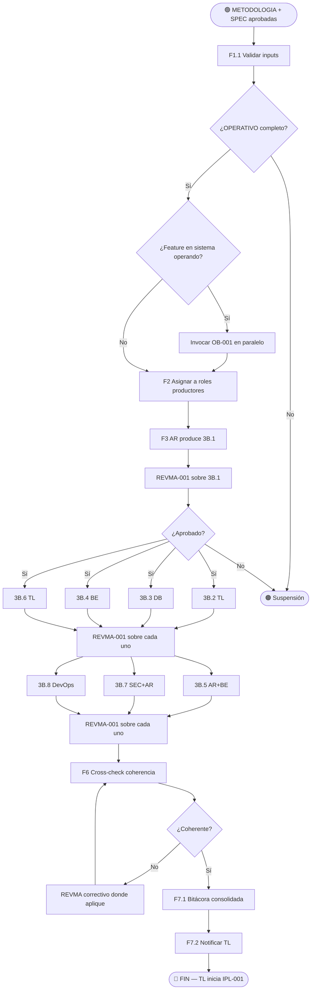

# VTT.PROTOCOL-PT-001 — Generación del Paquete Técnico Base (3B.1..3B.8)

| Campo | Valor |
|---|---|
| **Código** | `VTT.PROTOCOL-PT-001` |
| **Título** | Generación del Paquete Técnico Base (Solution Architecture → Infrastructure Plan) |
| **Versión** | 1.0.0 |
| **Fecha** | 2026-05-31 |
| **Autor** | TW-OPS |
| **Dueño** | PM Governance / Process Owner VTT |
| **Aplica a** | PM análisis (provee inputs), AR / TL / DB / BE / SEC / DevOps (productores), PM Revisor (audita cada doc), Coordinador (orquesta) |
| **Estado** | Aprobado |
| **Tipo** | Genérico VTT — protocolo del upstream |
| **Reglas aplicables (Nivel 0)** | Ver `00.Rules/rules_catalog.json` |
| **Invoca** | `VTT.PROTOCOL-REVMA-001` (una vez por cada doc del paquete) |
| **Es invocado por** | Procedimiento general del upstream cuando METODOLOGIA + SPEC están aprobadas |

---

## Tabla de Contenido

1. [Propósito](#1-propósito)
2. [Campo de Aplicación](#2-campo-de-aplicación)
3. [Trigger de Inicio y Condiciones de Fin](#3-trigger-de-inicio-y-condiciones-de-fin)
4. [Responsabilidades](#4-responsabilidades)
5. [Definiciones](#5-definiciones)
6. [Artefactos de Entrada y de Salida](#6-artefactos-de-entrada-y-de-salida)
7. [Tabla Maestra de Producción (8 docs)](#7-tabla-maestra-de-producción-8-docs)
8. [Procedimiento](#8-procedimiento)
9. [Reglas de Aplicabilidad](#9-reglas-de-aplicabilidad)
10. [Referencias Cruzadas](#10-referencias-cruzadas)
11. [Resumen de Revisiones](#11-resumen-de-revisiones)
12. [Anexos](#anexos)

---

## 1. Propósito

Establecer el proceso normativo para producir el **paquete técnico base** (8 documentos `3B.1..3B.8`) a partir de METODOLOGIA + SPEC aprobadas. Este paquete es el insumo del `VTT.PROTOCOL-IPL-001` (consolidación 3B.9 + Routing Index) y, transitivamente, de todo el downstream del upstream (HOPJM, SPRINT, ASG).

Cada uno de los 8 documentos lo produce un rol especializado (owner primario único) y pasa por su propio ciclo de revisión multiagente bajo `VTT.PROTOCOL-REVMA-001`. El Protocol define el orden de producción según dependencias técnicas, qué docs pueden ir en paralelo, y cómo manejar backfeed cuando un doc downstream rompe uno upstream ya aprobado.

> **Regla de oro:** ningún documento del paquete se considera entregable hasta que pasó por `REVMA-001` con dictamen APROBADO. El TL no puede consolidar 3B.9 con documentos en borrador.

---

## 2. Campo de Aplicación

**Aplica a:**

- Cualquier proyecto VTT que requiera paquete técnico formal antes de la consolidación 3B.9.
- Proyectos nuevos desde cero (con METODOLOGIA + SPEC recién aprobadas).
- Features dentro de sistema operando, en combinación con `VTT.PROTOCOL-OB-001` (que añade pista paralela de "estado actual del repo").
- Cualquier bloque/release del proyecto que requiera paquete técnico propio.

**No aplica a:**

- Generación de METODOLOGIA + SPEC (input, no output de este Protocol).
- Consolidación 3B.9 (cubierta por `VTT.PROTOCOL-IPL-001`).
- Análisis del repo existente cuando es feature dentro de sistema operando (cubierto por la pista paralela de `VTT.PROTOCOL-OB-001`).
- Revisión de código en ejecución.

---

## 3. Trigger de Inicio y Condiciones de Fin

### 3.1 Trigger de inicio

El Protocol arranca cuando se cumple **alguna** de estas condiciones:

1. METODOLOGIA + SPEC están aprobadas (PM análisis confirma con dictamen del PM Revisor).
2. Se recibió addendum técnico aprobado que requiere regenerar uno o más docs del paquete técnico ya emitido.
3. Backfeed de etapa downstream (3B.9 o HO) detectó inconsistencia material en uno o más docs del paquete y requiere regenerar.

### 3.2 Condición de fin (éxito)

El Protocol termina exitosamente cuando se cumplen **todas** estas condiciones:

1. Los 8 documentos del paquete (`3B.1..3B.8`) están aprobados por PM Revisor vía `REVMA-001`.
2. Los 8 documentos viven en su path canónico con versión, fecha, autor.
3. No hay backfeed pendiente (ningún doc downstream reportó inconsistencia sin resolver).
4. El coordinador notifica al TL que el paquete está listo para consolidación 3B.9.

### 3.3 Condición de fin (suspensión)

El Protocol se suspende sin completar si:

1. METODOLOGIA o SPEC requieren cambio material (regenerar METODOLOGIA + SPEC → re-aprobar → reiniciar este Protocol).
2. Algún doc del paquete excede 3 vueltas en su `REVMA-001` y el PM Governance no decide acción correctiva en plazo.
3. Falta de capacidad: el rol productor de algún doc no está disponible y no hay sustituto.

---

## 4. Responsabilidades

### 4.1 PM análisis — Provee inputs y resuelve consultas

- Entregar METODOLOGIA + SPEC aprobadas al coordinador antes de arrancar este Protocol.
- Responder consultas de los agentes generadores cuando alguno detecta ambigüedad en SPEC.
- Si detecta que un cambio en SPEC es necesario por backfeed → regenerar SPEC (re-aprobar vía `REVMA-001`).
- NO produce los docs del paquete técnico.

### 4.2 AR (Architect) — Owner primario de 3B.1, 3B.5, 3B.7

- 3B.1 Solution Architecture: arquitectura de solución, componentes, tech stack, integraciones.
- 3B.5 Sequence Diagrams: flujos críticos end-to-end.
- 3B.7 Security Plan: amenazas, controles, pruebas negativas.
- Colabora en 3B.6 (ADRs) con TL.

### 4.3 TL (Tech Lead) — Owner primario de 3B.2, 3B.6

- 3B.2 Code Architecture: módulos, estructura de carpetas, naming, patterns, error handling, esfuerzo.
- 3B.6 ADRs: decisiones técnicas cerradas con justificación.
- Colabora en 3B.1 con AR (revisa viabilidad técnica).
- Colabora en 3B.5 con AR/BE (revisa flujos de código).

### 4.4 DB (Database Engineer) — Owner primario de 3B.3

- 3B.3 Database Design: schema, migraciones, seeds, índices, constraints, riesgos DB.

### 4.5 BE (Backend Engineer) — Owner primario de 3B.4

- 3B.4 API Design: endpoints, contratos request/response, middleware, errores, breaking changes.
- Colabora en 3B.5 con AR (revisa flujos técnicos).

### 4.6 SEC (Security Engineer) — Owner primario de 3B.7 (compartido con AR)

- 3B.7 Security Plan: amenazas, controles, pruebas negativas, riesgos.

### 4.7 DevOps — Owner primario de 3B.8

- 3B.8 Infrastructure Plan: topología, despliegue, CI/CD, backups, observabilidad, variables.

### 4.8 PM Revisor — Audita cada doc

- Recibir cada doc producido y aplicar `REVMA-001`.
- Emitir dictamen por documento.
- NO produce ningún doc del paquete.

### 4.9 Coordinador (PM Governance / Process Owner)

- Orquestar el orden de producción según dependencias (§7).
- Disparar `REVMA-001` por cada doc.
- Detectar backfeed y disparar regeneración upstream cuando aplique.
- Mantener bitácora de versiones del paquete completo.
- Notificar al TL cuando el paquete está listo.

---

## 5. Definiciones

**Paquete técnico base:** conjunto de 8 documentos `3B.1..3B.8` que cuantifica el alcance técnico de una feature/bloque/release.

**Owner primario:** rol único responsable de la entrega de un doc. **Uno por documento.**

**Colaborador:** rol que aporta al doc pero no es owner. Lista 0..N.

**Documento del paquete:** uno de los 8 docs `3B.1..3B.8`.

**Doc upstream (relativo):** doc del que otro depende. Ej. 3B.1 es upstream de 3B.2, 3B.3, 3B.4, 3B.5.

**Doc downstream (relativo):** doc que depende de otro. Ej. 3B.4 es downstream de 3B.1 y 3B.2.

**Backfeed:** cuando un doc downstream detecta inconsistencia en un doc upstream ya aprobado, dispara regeneración del upstream y propagación a todos los derivados (ver `REVMA-001` §9).

**Drift SPEC vs paquete:** situación donde la SPEC declara X y un doc del paquete escribe Y. Resolución: SPEC prevalece, doc se corrige.

**Pista paralela "estado actual":** cuando es feature dentro de sistema operando, el paquete técnico se complementa con docs `3B.X_actual_*` que describen el repo existente. Cubierto por `VTT.PROTOCOL-OB-001`.

---

## 6. Artefactos de Entrada y de Salida

### 6.1 Artefactos de entrada

| # | Artefacto | Producido por | Obligatorio |
|---|---|---|---|
| 1 | METODOLOGIA aprobada | PM análisis + `REVMA-001` | ✅ |
| 2 | SPEC aprobada | PM análisis + `REVMA-001` | ✅ |
| 3 | OPERATIVO del proyecto (UUIDs reales del equipo) | PM | ✅ |
| 4 | Catálogo SDLC genérico (ANALISIS_FASES_COMPLETO_PARA_PM o equivalente) | Referencia | ⚠️ Para proyecto nuevo; opcional si es feature pequeña |
| 5 | Addendums vigentes (si aplica) | PM | ⚠️ Condicional |
| 6 | Docs 3B "estado actual" del repo (si aplica) | Pista paralela de `OB-001` | ⚠️ Condicional — solo si feature dentro de sistema operando |

### 6.2 Artefactos de salida

| # | Artefacto | Producido por | Path canónico sugerido |
|---|---|---|---|
| 1 | `3B.1_solution_architecture_<feature>_v<X.Y>.md` | AR | `phases/03-design/deliverables/architecture/` |
| 2 | `3B.2_code_architecture_<feature>_v<X.Y>.md` | TL | `phases/03-design/deliverables/code-architecture/` |
| 3 | `3B.3_database_design_<feature>_v<X.Y>.md` | DB | `phases/03-design/deliverables/database/` |
| 4 | `3B.4_api_design_<feature>_v<X.Y>.md` | BE | `phases/03-design/deliverables/api-design/` |
| 5 | `3B.5_sequence_diagrams_<feature>_v<X.Y>.md` | AR (BE colab) | `phases/03-design/deliverables/sequence-diagrams/` |
| 6 | `3B.6_adrs_<feature>_v<X.Y>.md` | TL (AR colab) | `phases/03-design/deliverables/adrs/` |
| 7 | `3B.7_security_plan_<feature>_v<X.Y>.md` | SEC (AR colab) | `phases/03-design/deliverables/security/` |
| 8 | `3B.8_infrastructure_plan_<feature>_v<X.Y>.md` | DevOps | `phases/03-design/deliverables/infrastructure/` |
| 9 | Bitácora consolidada del paquete (8 ciclos `REVMA`) | Coordinador | `_project-management/revma-log/PT_<feature>.md` |
| 10 | Notificación al TL: "paquete listo para 3B.9" | Coordinador | Canal del proyecto |

---

## 7. Tabla Maestra de Producción (8 docs)

> Esta es la **tabla operativa** que el coordinador usa para asignar producción.

| # | Código | Documento | Owner primario | Colaboradores | Inputs (docs internos del paquete + externos) | Función |
|---|---|---|---|---|---|---|
| 1 | 3B.1 | Solution Architecture | **AR** | TL | SPEC + (Fase 2 Analysis si aplica) | Define solución general, componentes, tech stack, integraciones. **Raíz del paquete.** |
| 2 | 3B.2 | Code Architecture | **TL** | — | 3B.1 | Estructura de carpetas, naming, patterns, error handling, esfuerzo estimado. |
| 3 | 3B.3 | Database Design | **DB** | — | SPEC + 3B.1 + (Business Rules + Validation Rules + State Transitions si aplica) | ERD, schema Prisma, migraciones, seeds, índices, riesgos DB. |
| 4 | 3B.4 | API Design | **BE** | — | SPEC + 3B.1 + 3B.2 + (User Stories + Authorization Rules + Performance Req si aplica) | Endpoints, contratos, middleware, errores, breaking changes. |
| 5 | 3B.5 | Sequence Diagrams | **AR** | BE | 3B.1 + 3B.2 + 3B.4 + (User Flows + Error Flows si aplica) | Flujos críticos end-to-end (happy path + error paths). |
| 6 | 3B.6 | ADRs | **TL** | AR | SPEC + 3B.1 + (NFR + Risk Register si aplica) | Decisiones técnicas cerradas con justificación, alternativas, consecuencias. |
| 7 | 3B.7 | Security Plan | **SEC** | AR | SPEC + 3B.1 + 3B.4 + (Security Requirements + Authorization Rules si aplica) | Amenazas, controles, pruebas negativas, riesgos SEC. |
| 8 | 3B.8 | Infrastructure Plan | **DevOps** | — | SPEC + 3B.1 + 3B.6 + (Scalability + Availability Req si aplica) | Topología, deploy, CI/CD, backups, DR, observabilidad. |

### 7.1 Grafo de dependencias

```
                                    SPEC + METODOLOGIA
                                            │
                                            ↓
                                        3B.1 (AR)  ← raíz
                                            │
              ┌──────────────┬──────────────┼──────────────┬──────────────┐
              ↓              ↓              ↓              ↓              ↓
          3B.2 (TL)      3B.3 (DB)      3B.4 (BE)      3B.6 (TL)      3B.8 (DevOps)
              │              │              │              │              ↑
              │              │              ↓              │              │
              │              │          3B.5 (AR) ←────────┘              │
              │              │              │                             │
              │              │              ↓                             │
              │              │          3B.7 (SEC)                        │
              │              │                                            │
              └──────────────┴────────────────────────────────────────────┘
                                            │
                                            ↓
                                    (todos aprobados)
                                            │
                                            ↓
                                  TL inicia VTT.PROTOCOL-IPL-001
                                  (consolidación 3B.9 + Routing Index)
```

### 7.2 Paralelizable

Una vez que **3B.1 está APROBADO**, los siguientes docs pueden producirse en paralelo:

| Track | Docs en paralelo |
|---|---|
| Track 1 (Code) | 3B.2 |
| Track 2 (Data) | 3B.3 |
| Track 3 (API) | 3B.4 (requiere 3B.2 también) |
| Track 4 (Decisions) | 3B.6 |

Luego:

| Track | Después de |
|---|---|
| 3B.5 (Sequence) | 3B.4 aprobado |
| 3B.7 (Security) | 3B.4 aprobado |
| 3B.8 (Infra) | 3B.6 aprobado |

### 7.3 Secuencial obligatorio

- **3B.1 → todo lo demás.** Nada se produce antes de que 3B.1 esté aprobado.
- **3B.4 → 3B.5, 3B.7.** Sequence Diagrams y Security Plan necesitan API definida.
- **3B.6 → 3B.8.** Infrastructure necesita ADRs aprobados (especialmente decisiones de infra).

---

## 8. Procedimiento

```
ENTRADA: METODOLOGIA + SPEC aprobadas
        ↓
FASE 1 — Validación de inputs
        ↓
FASE 2 — Asignación a roles productores
        ↓
FASE 3 — Producción 3B.1 (secuencial, raíz)
        ↓
FASE 4 — Producción 3B.2/3B.3/3B.4/3B.6 (paralelo desde 3B.1)
        ↓
FASE 5 — Producción 3B.5/3B.7/3B.8 (secuencial post-dependencias)
        ↓
FASE 6 — Verificación de coherencia cruzada del paquete
        ↓
FASE 7 — Entrega al TL para 3B.9
```

### 8.1 FASE 1 — Validación de inputs

#### 8.1.1 Coordinador verifica METODOLOGIA + SPEC aprobadas → **[DECISIÓN]**

- Ambas con dictamen APROBADO de `REVMA-001`.
- Ambas versionadas, dateadas, autor identificado.
- Sin contradicciones internas conocidas.

Si falta cualquiera → suspender Protocol y solicitar al PM análisis.

#### 8.1.2 Coordinador verifica OPERATIVO del proyecto → **[ACTIVIDAD]**

- UUIDs de AR/TL/DB/BE/SEC/DevOps disponibles.
- Roles asignados a personas/agentes reales.

Si falta un rol → escalación al PM Governance antes de continuar.

#### 8.1.3 Coordinador determina si aplica pista "estado actual" → **[DECISIÓN]**

- **Es proyecto nuevo desde cero:** no aplica. Continuar.
- **Es feature dentro de sistema operando:** invocar `VTT.PROTOCOL-OB-001` en paralelo para producir docs `3B.X_actual_*`. Continuar.

### 8.2 FASE 2 — Asignación a roles productores

#### 8.2.1 Coordinador notifica a cada owner primario → **[ACTIVIDAD]**

Mensaje incluye:
- Doc a producir (3B.X).
- Inputs requeridos (paths exactos de SPEC, METODOLOGIA, OPERATIVO, docs upstream necesarios).
- Template aplicable (si existe; si no, referenciar doc equivalente de proyecto previo).
- Plazo de primera entrega.
- Colaboradores asignados.

#### 8.2.2 Coordinador asigna colaboradores → **[ACTIVIDAD]**

Por defecto según §7. Configurable por proyecto si el OPERATIVO indica otra cosa.

### 8.3 FASE 3 — Producción 3B.1 (secuencial, raíz)

#### 8.3.1 AR produce 3B.1 v1.0 → **[ACTIVIDAD]**

AR consulta SPEC + METODOLOGIA + (Fase 2 Analysis si aplica) y produce 3B.1.

#### 8.3.2 Coordinador invoca `REVMA-001` sobre 3B.1 → **[INVOCACIÓN]**

Sigue el ciclo completo de `REVMA-001`: hasta 3 vueltas, dictamen APROBADO, bitácora.

#### 8.3.3 ¿3B.1 aprobado? → **[DECISIÓN]**

- **Sí:** continuar a FASE 4.
- **No (escalación REVMA):** suspender Protocol hasta resolver (PM Governance decide).

### 8.4 FASE 4 — Producción paralela (3B.2, 3B.3, 3B.4, 3B.6)

#### 8.4.1 Coordinador dispara producción paralela de 4 docs → **[ACTIVIDAD]**

- TL inicia 3B.2 (input: 3B.1).
- DB inicia 3B.3 (input: SPEC + 3B.1).
- BE inicia 3B.4 (input: SPEC + 3B.1 + 3B.2 — espera 3B.2 si BE necesita naming/patterns).
- TL inicia 3B.6 (input: SPEC + 3B.1).

> **Nota operativa:** TL puede tener carga simultánea de 3B.2 + 3B.6. Si el OPERATIVO indica que TL no puede hacer ambos en paralelo, secuenciar 3B.2 → 3B.6.

#### 8.4.2 Coordinador invoca `REVMA-001` sobre cada doc al entregarse → **[INVOCACIÓN]**

Hasta 4 ciclos `REVMA` en paralelo, cada uno independiente.

#### 8.4.3 Si REVMA detecta backfeed contra 3B.1 → **[DECISIÓN]**

- Suspender el doc downstream que detectó la inconsistencia.
- Regenerar 3B.1 vía nuevo ciclo `REVMA-001`.
- Cuando 3B.1 v1.X aprobada, reanudar producción del doc downstream con la versión nueva.

### 8.5 FASE 5 — Producción secuencial post-dependencias (3B.5, 3B.7, 3B.8)

#### 8.5.1 Cuando 3B.4 está APROBADO → arrancar 3B.5 y 3B.7 → **[ACTIVIDAD]**

- AR (con BE colab) inicia 3B.5 (input: 3B.1 + 3B.2 + 3B.4).
- SEC (con AR colab) inicia 3B.7 (input: SPEC + 3B.1 + 3B.4).

#### 8.5.2 Cuando 3B.6 está APROBADO → arrancar 3B.8 → **[ACTIVIDAD]**

- DevOps inicia 3B.8 (input: SPEC + 3B.1 + 3B.6).

#### 8.5.3 Coordinador invoca `REVMA-001` sobre cada doc al entregarse → **[INVOCACIÓN]**

### 8.6 FASE 6 — Verificación de coherencia cruzada del paquete

#### 8.6.1 Coordinador valida que los 8 docs están aprobados → **[DECISIÓN]**

Si falta alguno → continuar esperando (no se puede entregar paquete incompleto).

#### 8.6.2 Coordinador ejecuta cross-check rápido → **[ACTIVIDAD]**

Verificaciones mínimas:
- Endpoints declarados en 3B.4 referenciados en 3B.5 y 3B.7.
- Modelos de 3B.3 consistentes con componentes de 3B.1 y endpoints de 3B.4.
- Decisiones de 3B.6 reflejadas en 3B.7 y 3B.8.
- Variables de entorno declaradas en 3B.8 cubren las que 3B.4 y 3B.7 necesitan.

Si detecta cross-mismatch → invocar nuevo ciclo `REVMA` con la corrección específica (no es backfeed completo si es solo armonización).

### 8.7 FASE 7 — Entrega al TL para consolidación 3B.9

#### 8.7.1 Coordinador escribe bitácora consolidada del paquete → **[ACTIVIDAD]**

Contiene:
- Por cada doc: versiones producidas, vueltas, fecha aprobación.
- Backfeeds detectados y resueltos.
- Cross-checks ejecutados y resultado.
- Tiempo total del Protocol.

#### 8.7.2 Coordinador notifica al TL → **[ACTIVIDAD]**

Mensaje:
- Lista de los 8 docs con paths y versiones finales.
- Bitácora del paquete.
- Confirmación: "paquete técnico aprobado, listo para iniciar VTT.PROTOCOL-IPL-001".

#### 8.7.3 Fin del Protocol → **[ACTIVIDAD]**

El TL invoca `VTT.PROTOCOL-IPL-001` para consolidar 3B.9 + Routing Index.

---

## 9. Reglas de Aplicabilidad

### 9.1 Reglas UNIVERSALES

| # | Regla |
|---|---|
| U-01 | 3B.1 es raíz. Nada se produce antes. |
| U-02 | Cada doc tiene owner primario único. No se permite "AR/TL" ambiguo. |
| U-03 | Cada doc pasa por `REVMA-001` independientemente. 8 ciclos. |
| U-04 | Backfeed se dispara hacia upstream, no se parchea en downstream. |
| U-05 | Cross-check de coherencia obligatorio antes de entregar al TL. |
| U-06 | El paquete no se entrega incompleto. Los 8 docs aprobados o no se entrega. |
| U-07 | El TL no consolida 3B.9 hasta recibir notificación formal del coordinador. |
| U-08 | Los docs siguen el orden de dependencias §7.1. Saltarse el orden genera backfeed garantizado. |

### 9.2 Reglas CONFIGURABLES

| # | Regla | Configuración por proyecto |
|---|---|---|
| C-01 | Templates por doc | Por proyecto. Si no hay template, referenciar doc equivalente del proyecto previo. |
| C-02 | Paralelismo permitido para roles que tienen múltiples docs (ej. TL en 3B.2 + 3B.6) | Por OPERATIVO. Default: paralelo si el rol declara capacidad. |
| C-03 | Ruta canónica de cada doc | Por proyecto. Default sugerido en §6.2. |
| C-04 | Nombre del feature/bloque en el path del archivo | Por proyecto. |
| C-05 | Plazo entre asignación y primera entrega de un doc | Por proyecto. Default: 1-3 días según complejidad. |

### 9.3 Reglas CONDICIONALES

| # | Regla | Condición de activación |
|---|---|---|
| CD-01 | Pista paralela "estado actual" | Es feature dentro de sistema operando — invocar `VTT.PROTOCOL-OB-001`. |
| CD-02 | Regeneración por addendum técnico | Addendum aprobado modifica scope técnico → regenerar docs afectados. |
| CD-03 | SEC compartido con AR en 3B.7 | Proyecto no tiene rol SEC dedicado → AR asume owner primario de 3B.7. |
| CD-04 | Catálogo SDLC obligatorio | Proyecto nuevo desde cero — el catálogo es input de 3B.9.3 más adelante; aquí solo se referencia si afecta scope. |
| CD-05 | Fase 2 Analysis docs como input | Proyecto tiene fase Analysis formal previa (sin SPEC consolidada que la reemplace). |

### 9.4 Reglas RETIRADAS

Ninguna. Primer Protocol de generación de paquete técnico.

---

## 10. Referencias Cruzadas

### Protocols relacionados

| Protocol | Relación | Estado |
|---|---|---|
| `VTT.PROTOCOL-REVMA-001` | **Invocado por cada doc del paquete.** | VIGENTE |
| `VTT.PROTOCOL-OB-001` | **Invocado en paralelo** cuando es feature dentro de sistema operando. | EN DESARROLLO |
| `VTT.PROTOCOL-IPL-001` | **Downstream directo.** Consume los 8 docs aprobados para consolidar 3B.9. | EN DESARROLLO |
| `VTT.PROTOCOL-HOPJM-001` | Downstream indirecto. Usa 3B.9. | VIGENTE (v2.0.1) |
| `VTT.PROTOCOL-ASG-001` | Downstream lejano. Usa el Routing Index del paquete. | VIGENTE (v1.8.1) |

### Templates referenciados

| Template | Uso |
|---|---|
| Templates por doc del paquete | Por proyecto — sugerido referenciar docs equivalentes de proyectos previos cuando no haya template formal. |

### Reglas Nivel 0 aplicables

| Regla | Aplica en |
|---|---|
| `RULE-WORKFLOW-*` | §8 todas las fases |
| `RULE-DOC-*` | §6 artefactos de salida |

---

## 11. Resumen de Revisiones

| Versión | Fecha | Editor | Cambios |
|---|---|---|---|
| 1.0.0 | 2026-05-31 | TW-OPS | **Versión inicial.** Formaliza la generación del paquete técnico 3B.1..3B.8. Codifica: (1) owner primario único por doc; (2) tabla maestra de producción con inputs/colaboradores/función; (3) orden de dependencias (3B.1 raíz, paralelismo desde 3B.4 una vez aprobado, etc.); (4) invocación de `REVMA-001` por cada doc; (5) backfeed hacia upstream cuando downstream detecta inconsistencia; (6) cross-check de coherencia cruzada antes de entregar; (7) entrega formal al TL para activar `IPL-001`. Pista paralela "estado actual" delegada a `OB-001` para features dentro de sistema operando. |

---

## Anexos

### Anexo A — Diagrama de flujo end-to-end



### Anexo B — Checklist consolidado del paquete

- [ ] METODOLOGIA aprobada vía `REVMA-001`.
- [ ] SPEC aprobada vía `REVMA-001`.
- [ ] OPERATIVO del proyecto verificado (UUIDs reales).
- [ ] 3B.1 Solution Architecture aprobado.
- [ ] 3B.2 Code Architecture aprobado.
- [ ] 3B.3 Database Design aprobado.
- [ ] 3B.4 API Design aprobado.
- [ ] 3B.5 Sequence Diagrams aprobado.
- [ ] 3B.6 ADRs aprobado.
- [ ] 3B.7 Security Plan aprobado.
- [ ] 3B.8 Infrastructure Plan aprobado.
- [ ] Cross-check coherencia ejecutado y OK.
- [ ] Pista "estado actual" completada (si aplica feature en sistema operando).
- [ ] Bitácora consolidada generada.
- [ ] TL notificado para iniciar `IPL-001`.

---

| Editor | Dueño | Última Actualización |
|---|---|---|
| TW-OPS (fe1b589c-7cf2-4779-82d4-b7ae536536ce) | PM Governance / Process Owner VTT | 2026-05-31 |

**Versión:** 1.0.0 — Generación del paquete técnico base con tabla maestra, dependencias, paralelismo y cross-check.
**Estado:** Aprobado

*Versión más reciente en `virtual-teams-setup`. No controlada si se imprime.*
