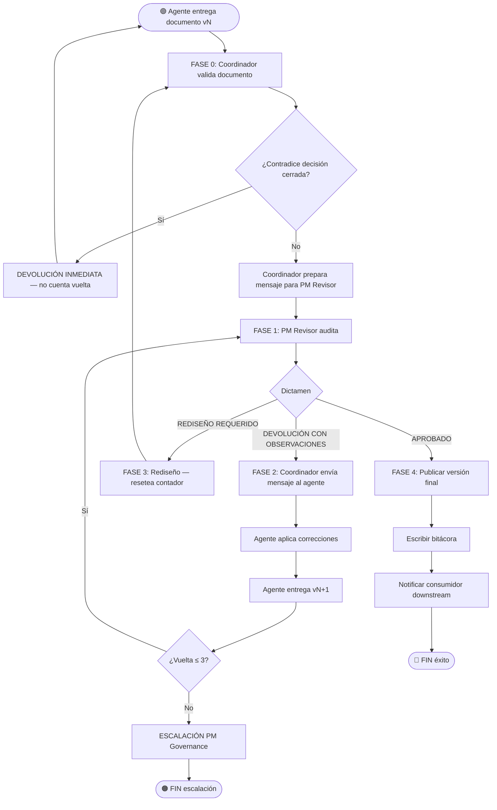

# VTT.PROTOCOL-REVMA-001 — Ciclo de Revisión Multi-Agente

| Campo | Valor |
|---|---|
| **Código** | `VTT.PROTOCOL-REVMA-001` |
| **Título** | Ciclo de Revisión Multi-Agente (PM Revisor + agentes generadores) |
| **Versión** | 1.0.0 |
| **Fecha** | 2026-05-31 |
| **Autor** | TW-OPS |
| **Dueño** | PM Governance / Process Owner VTT |
| **Aplica a** | PM análisis (productor de documentos), PM Revisor (auditor), Agentes generadores especializados (AR/TL/DB/BE/SEC/DevOps/etc.), Coordinador humano (bus de mensajes) |
| **Estado** | Aprobado |
| **Tipo** | Genérico VTT — protocolo transversal invocado por otros Protocols del upstream |
| **Reglas aplicables (Nivel 0)** | Ver `00.Rules/rules_catalog.json` |

---

## Tabla de Contenido

1. [Propósito](#1-propósito)
2. [Campo de Aplicación](#2-campo-de-aplicación)
3. [Trigger de Inicio y Condiciones de Fin](#3-trigger-de-inicio-y-condiciones-de-fin)
4. [Responsabilidades](#4-responsabilidades)
5. [Definiciones](#5-definiciones)
6. [Artefactos](#6-artefactos)
7. [Procedimiento](#7-procedimiento)
8. [Regla de las 3 Vueltas](#8-regla-de-las-3-vueltas)
9. [Backfeed Downstream → Upstream](#9-backfeed-downstream--upstream)
10. [Política "Corregir Local vs Devolver"](#10-política-corregir-local-vs-devolver)
11. [Reglas de Aplicabilidad](#11-reglas-de-aplicabilidad)
12. [Referencias Cruzadas](#12-referencias-cruzadas)
13. [Resumen de Revisiones](#13-resumen-de-revisiones)
14. [Anexos](#anexos)

---

## 1. Propósito

Establecer el ciclo normativo de revisión multi-agente que se aplica a **todo documento del upstream** antes de ser declarado aprobado. El ciclo está diseñado para combinar:

- Independencia de criterio (PM Revisor en modelo distinto al agente generador).
- Control de costo (máximo 3 vueltas por documento).
- Trazabilidad (cada vuelta queda registrada con su dictamen).
- Backfeed (si un agente downstream detecta inconsistencia en un documento upstream ya aprobado, ese documento se regenera arriba y se propaga).

Este Protocol es **transversal**: lo invocan `VTT.PROTOCOL-PT-001`, `VTT.PROTOCOL-OB-001`, `VTT.PROTOCOL-IPL-001`, `VTT.PROTOCOL-HOPJM-001`, `VTT.PROTOCOL-SPRINT-001` y `VTT.PROTOCOL-PRE-001` cada vez que un documento producido pasa a revisión.

---

## 2. Campo de Aplicación

**Aplica a:**

- Cualquier documento normativo o técnico que requiera revisión independiente antes de ser declarado aprobado.
- Cualquier proyecto VTT que use el modelo de agentes multi-modelo (PM Revisor en un modelo, agentes generadores en otro).
- Cualquier fase del upstream donde se produzca documentación: METODOLOGIA+SPEC, paquete técnico 3B.1..3B.8, consolidación 3B.9, HO Maestro, paquete operativo PJM, reporte de preflight TL.

**No aplica a:**

- Revisión de código (cubierta por `VTT.PROTOCOL-ASG-001` FASE 4 — Code Review TL).
- Auditorías de seguridad ejecutadas por SEC sobre código en ejecución.
- Validación de contratos API contra backend (cubierta por `VTT.PROTOCOL-PRE-001`).
- Revisiones unilaterales del PM análisis sobre su propio output (no son multi-agente).

---

## 3. Trigger de Inicio y Condiciones de Fin

### 3.1 Trigger de inicio

El Protocol arranca cuando se cumple **una** de estas condiciones:

1. Un agente generador entrega un documento (versión inicial v1.0 o corregida vN+1) al coordinador para iniciar ciclo de revisión.
2. El PM análisis entrega METODOLOGIA o SPEC para auditoría independiente del PM Revisor.
3. Un agente downstream detecta inconsistencia material en un documento upstream ya aprobado y dispara backfeed (§9).

### 3.2 Condición de fin (éxito)

El Protocol termina exitosamente cuando se cumplen **todas** estas condiciones:

1. PM Revisor emite dictamen "APROBADO" sobre la versión final del documento.
2. El documento queda en su path canónico con versión, fecha y autor.
3. El coordinador notifica al consumidor downstream que el documento está disponible.

### 3.3 Condición de fin (no éxito)

El Protocol termina por suspensión / escalación cuando se cumple **alguna** de estas condiciones:

1. Se alcanzan 3 vueltas sin aprobación (§8) — escalación al PM Governance.
2. El PM Revisor identifica que el documento requiere rediseño de fondo (no correcciones) — el documento se devuelve al agente generador con instrucción de regenerar desde cero, lo que reinicia el ciclo de vueltas pero NO cuenta como vuelta de la versión original.
3. Coordinador detecta que el documento contradice decisiones cerradas (SPEC, ADRs, METODOLOGIA aprobada) — devolución inmediata sin pasar por PM Revisor.

---

## 4. Responsabilidades

### 4.1 Agente generador especializado (AR / TL / DB / BE / SEC / DevOps / PM análisis)

- Producir el documento siguiendo el template y la guía aplicables.
- Versionar y datar cada entrega.
- Atender observaciones del PM Revisor sin reabrir decisiones cerradas.
- Si una observación toca un documento upstream aprobado, disparar backfeed (§9) en lugar de parchear localmente.
- Entregar versión incrementada con changelog de qué cambió respecto a la versión anterior.

### 4.2 PM Revisor (modelo distinto al agente generador — típicamente OpenAI cuando los generadores son Claude)

- Recibir el documento del coordinador.
- Auditar contra criterios documentados (template, regla aplicable, decisión cerrada de referencia).
- Emitir dictamen estructurado: APROBADO / DEVOLUCIÓN CON OBSERVACIONES / REDISEÑO REQUERIDO.
- Generar el **mensaje exacto** que el coordinador debe enviar al agente generador con las observaciones.
- No generar el documento ni proponer reescritura completa — su rol es auditar, no producir.
- No reabrir decisiones cerradas previamente aprobadas en otros documentos.
- Observaciones cosméticas (typo, versión menor) se anotan pero no cuentan como motivo de devolución.

### 4.3 Coordinador (humano, típicamente el PM Governance / Process Owner)

- Operar el bus de mensajes entre PM Revisor y agente generador.
- Adjuntar al agente los archivos referenciados en cada mensaje.
- Mantener trazabilidad de versiones (qué versión revisó qué).
- Aplicar la regla de las 3 vueltas (§8) y escalar si se excede.
- Aplicar política "corregir local vs devolver" (§10) cuando aplique.
- Disparar backfeed (§9) cuando una observación toca upstream.
- Notificar al consumidor downstream cuando el documento queda aprobado.

### 4.4 Consumidor downstream (otro agente que usa el documento aprobado como input)

- Reportar al coordinador cualquier inconsistencia material que detecte en el documento upstream ya aprobado.
- No parchear localmente la inconsistencia — solicitar backfeed (§9).
- Esperar la versión actualizada del upstream antes de continuar si la inconsistencia bloquea su trabajo.

---

## 5. Definiciones

**Agente generador especializado:** rol que produce un documento concreto del upstream. Ejemplos: AR genera 3B.1, DB genera 3B.3, BE genera 3B.4. PM análisis genera METODOLOGIA + SPEC.

**PM Revisor:** rol normativo (no persona) que audita documentos. Se ejecuta en un modelo distinto al agente generador para garantizar independencia de criterio. En el setup actual, PM Revisor corre en OpenAI y agentes generadores en Claude.

**Coordinador:** rol humano que opera el bus de mensajes entre PM Revisor y agentes. Hoy es manual (típicamente el PM Governance). Es la pieza más automatizable a futuro.

**Vuelta de revisión:** un ciclo completo `entrega → audit → dictamen → corrección → re-entrega`. Cada vuelta produce una nueva versión del documento (vN+1).

**Vuelta inicial (v1.0):** la primera entrega no cuenta como vuelta — cuenta como base. Las vueltas se cuentan a partir de la primera devolución con observaciones.

**Dictamen del PM Revisor:** documento estructurado con uno de tres veredictos:
- **APROBADO** — el documento pasa, se publica como versión final.
- **DEVOLUCIÓN CON OBSERVACIONES** — el documento requiere correcciones puntuales, el agente debe regenerar con cambios específicos.
- **REDISEÑO REQUERIDO** — el documento tiene problemas de fondo, debe regenerarse desde cero (resetea contador de vueltas).

**Backfeed:** mecanismo por el cual una inconsistencia detectada en un documento upstream ya aprobado dispara su regeneración + propagación a todos los documentos derivados. NO se parchea localmente en el documento downstream.

**Observación cosmética:** detalle de forma sin impacto operativo. Ejemplos: typo, número de versión visualmente incorrecto, formato de fecha. **No cuenta como motivo de devolución.** Se anota y se corrige en la siguiente vuelta si hay otra, o se ignora si el documento se aprueba.

**Observación material:** detalle que afecta el uso operativo del documento. Ejemplos: regla mal aplicada, referencia a doc inexistente, datos contradictorios entre secciones, decisión cerrada violada. **Sí cuenta como motivo de devolución.**

**Corrección local:** ajuste pequeño que el coordinador o el siguiente agente aplica sin disparar nueva vuelta formal. Aplica solo bajo criterios estrictos (§10).

---

## 6. Artefactos

### 6.1 Artefactos de entrada (por cada vuelta)

| # | Artefacto | Producido por | Obligatorio |
|---|---|---|---|
| 1 | Documento en versión vN | Agente generador | ✅ |
| 2 | Changelog vN vs vN-1 (si N>0) | Agente generador | ✅ |
| 3 | Referencias a fuentes consultadas | Agente generador | ✅ |
| 4 | Mensaje del coordinador al PM Revisor con contexto | Coordinador | ✅ |

### 6.2 Artefactos de salida (por cada vuelta)

| # | Artefacto | Producido por | Obligatorio |
|---|---|---|---|
| 1 | Dictamen estructurado | PM Revisor | ✅ |
| 2 | Mensaje exacto para enviar al agente generador | PM Revisor | ✅ (si DEVOLUCIÓN o REDISEÑO) |
| 3 | Documento vN+1 con correcciones | Agente generador | ✅ (si DEVOLUCIÓN o REDISEÑO) |

### 6.3 Artefactos de cierre (al aprobarse)

| # | Artefacto | Producido por | Obligatorio |
|---|---|---|---|
| 1 | Documento final con versión definitiva | Agente generador | ✅ |
| 2 | Bitácora del ciclo (vueltas, dictámenes, fechas) | Coordinador | ✅ |
| 3 | Notificación al consumidor downstream | Coordinador | ✅ |

---

## 7. Procedimiento

```
ENTRADA INICIAL
       ↓
FASE 0 — Recepción de documento
       ↓
FASE 1 — Auditoría PM Revisor (vuelta N)
       ↓
   ¿Veredicto?
   ├─ APROBADO → FASE 4
   ├─ DEVOLUCIÓN CON OBSERVACIONES → FASE 2
   └─ REDISEÑO REQUERIDO → FASE 3
       ↓
FASE 2 — Corrección y re-entrega
       ↓
   ¿Vuelta ≤ 3?
   ├─ Sí → vuelve a FASE 1 (vuelta N+1)
   └─ No → ESCALACIÓN PM Governance (§8)
       ↓
FASE 3 — Rediseño (resetea contador, regresa a FASE 0)
       ↓
FASE 4 — Cierre del ciclo
```

### 7.1 FASE 0 — Recepción de documento

#### 7.1.1 Coordinador recibe el documento del agente generador → **[ACTIVIDAD]**

El coordinador valida:
- Documento tiene versión, fecha, autor.
- Documento referencia su template fuente.
- Si N>0, viene con changelog vN vs vN-1.

Si falta cualquiera → devuelve al agente generador antes de pasar al PM Revisor.

#### 7.1.2 Coordinador detecta contradicción con decisión cerrada → **[DECISIÓN]**

Si el documento viola una decisión cerrada previa (SPEC, ADR, METODOLOGIA aprobada) → **devolución inmediata** sin pasar por PM Revisor. Mensaje al agente: "respetar decisión X documentada en Y". Esto NO cuenta como vuelta porque el ciclo aún no arrancó formalmente.

#### 7.1.3 Coordinador prepara mensaje para PM Revisor → **[ACTIVIDAD]**

Incluye:
- Path del documento.
- Versión actual.
- Lista de fuentes con las que debe contrastar.
- Foco de revisión específico si aplica.
- Número de vuelta actual (v1.0 si es entrega inicial).

### 7.2 FASE 1 — Auditoría PM Revisor (vuelta N)

#### 7.2.1 PM Revisor recibe documento + contexto → **[ACTIVIDAD]**

#### 7.2.2 PM Revisor ejecuta auditoría → **[ACTIVIDAD]**

Criterios mínimos a verificar:
- Estructura del template respetada.
- Coherencia interna (no contradicciones entre secciones).
- Coherencia cruzada (no contradicciones con docs upstream ya aprobados).
- Decisiones cerradas respetadas.
- Datos numéricos / referencias verificables.
- Regla aplicable cumplida (depende del tipo de documento).

#### 7.2.3 PM Revisor emite dictamen → **[DECISIÓN]**

Tres veredictos posibles:

**APROBADO** — el documento pasa.
- Coordinador continúa a FASE 4.
- No genera mensaje de devolución.

**DEVOLUCIÓN CON OBSERVACIONES** — correcciones puntuales.
- PM Revisor estructura las observaciones por severidad: bloqueante / corrección requerida / observación menor / editorial.
- PM Revisor genera el **mensaje exacto** que el coordinador debe enviar al agente.
- Coordinador continúa a FASE 2.

**REDISEÑO REQUERIDO** — problemas de fondo, no de detalle.
- PM Revisor justifica por qué el documento no es salvable con correcciones puntuales.
- Coordinador continúa a FASE 3 (resetea contador de vueltas).

### 7.3 FASE 2 — Corrección y re-entrega (solo si DEVOLUCIÓN)

#### 7.3.1 Coordinador envía mensaje al agente generador → **[ACTIVIDAD]**

Adjunta:
- Mensaje exacto del PM Revisor.
- Versión vN del documento siendo corregida.
- Cualquier archivo de referencia que el agente necesite.

#### 7.3.2 Agente generador aplica correcciones → **[ACTIVIDAD]**

El agente:
- Atiende cada observación bloqueante y de corrección requerida.
- Considera observaciones menores y editoriales (puede aceptarlas o argumentar).
- Si una observación toca documento upstream aprobado → dispara backfeed (§9) y no corrige localmente.
- Genera versión vN+1 con changelog explícito.

#### 7.3.3 Agente entrega vN+1 al coordinador → **[ACTIVIDAD]**

#### 7.3.4 Verificación de contador de vueltas → **[DECISIÓN]**

- **N+1 ≤ 3** → coordinador devuelve a FASE 1 para nueva auditoría.
- **N+1 > 3** → escalación al PM Governance (§8).

### 7.4 FASE 3 — Rediseño (solo si REDISEÑO REQUERIDO)

#### 7.4.1 Coordinador notifica al agente que se requiere rediseño → **[ACTIVIDAD]**

Mensaje:
- Justificación del PM Revisor.
- Versión vN del documento.
- Lista de fuentes a reconsultar.
- Plazo de re-entrega.

#### 7.4.2 Agente genera versión nueva desde cero → **[ACTIVIDAD]**

La nueva versión es **v(N+1).0** (mayor) y el contador de vueltas se resetea a 0.

#### 7.4.3 Coordinador recibe nueva versión y regresa a FASE 0 → **[ACTIVIDAD]**

### 7.5 FASE 4 — Cierre del ciclo

#### 7.5.1 Coordinador publica versión final del documento → **[ACTIVIDAD]**

- Documento en su path canónico.
- Versión final declarada.
- Marca de "aprobado por PM Revisor con N vueltas" en la bitácora.

#### 7.5.2 Coordinador escribe bitácora del ciclo → **[ACTIVIDAD]**

Mínimo contiene:
- Documento, autor, versiones producidas (v1.0, v1.1, ..., vF).
- Por cada vuelta: fecha, dictamen, número de observaciones por severidad.
- Tiempo total del ciclo.

#### 7.5.3 Coordinador notifica al consumidor downstream → **[ACTIVIDAD]**

Mensaje incluye:
- Path del documento final.
- Confirmación de aprobación.
- Cualquier insumo adicional que el consumidor necesite.

---

## 8. Regla de las 3 Vueltas

**Regla universal U-01:** ningún documento puede ser corregido más de **3 vueltas** sin escalación.

### 8.1 Por qué 3

Si en 3 vueltas el PM Revisor sigue devolviendo con observaciones bloqueantes o de corrección requerida, el problema **no es de redacción** — es de fondo. Posibles causas:

- El agente generador no tiene el contexto suficiente para producir el documento.
- Las decisiones de upstream no son claras o están en conflicto.
- El template aplicable no encaja con el caso real.
- El PM Revisor está aplicando criterios fuera de su rol.

Cualquiera de estas causas requiere intervención del PM Governance, no más iteraciones.

### 8.2 Qué hace la escalación

El coordinador, al detectar que se alcanzaría la vuelta 4, suspende el ciclo y notifica al PM Governance con:

- Bitácora completa de las 3 vueltas.
- Dictamen del PM Revisor en cada vuelta.
- Cambios aplicados por el agente en cada vuelta.
- Hipótesis del coordinador sobre la causa raíz.

El PM Governance decide:

- **Rediseñar:** el documento se regenera desde cero con criterios actualizados (resetea vueltas).
- **Ajustar template o regla:** el problema está en el insumo normativo, no en el documento — se ajusta el template y se reintenta.
- **Cambiar agente generador:** si la hipótesis es que el agente no tiene capacidad de producir el documento.
- **Aceptar versión actual con deuda documentada:** el documento se publica con observaciones explícitas como deuda técnica.

### 8.3 Excepciones a la regla de 3

- **Observaciones cosméticas no cuentan vuelta.** Si la única razón de devolución es cosmética, el coordinador anota la corrección y aprueba el documento.
- **Rediseño resetea contador.** Si el dictamen es REDISEÑO REQUERIDO, la versión nueva arranca con contador en 0.
- **Devolución por contradicción con decisión cerrada (FASE 0) no cuenta.** El ciclo aún no había arrancado formalmente.

---

## 9. Backfeed Downstream → Upstream

### 9.1 Cuándo se dispara

Cuando un agente downstream detecta, durante su trabajo, una inconsistencia material en un documento upstream ya aprobado. Ejemplos:

- BE escribiendo 3B.4 detecta que un endpoint requerido contradice un ADR cerrado en 3B.6.
- TL consolidando 3B.9 detecta que las horas de 3B.3 no cuadran con las de 3B.2.
- PJM generando HANDOFF detecta que un Task ID del Routing Index no existe en el Task Breakdown.

### 9.2 Qué NO se hace

- **No** se parchea localmente el documento downstream con la "interpretación correcta".
- **No** se inventa una decisión técnica para resolver la contradicción.
- **No** se documenta como "deuda" para resolver después.

### 9.3 Qué SÍ se hace

1. El agente downstream **suspende su trabajo** en el doc afectado.
2. El agente reporta al coordinador la inconsistencia con referencia exacta (`doc upstream §X dice A; doc downstream §Y necesita B`).
3. El coordinador valida la inconsistencia.
4. Si es material → el coordinador dispara nuevo ciclo de `REVMA` sobre el documento upstream.
5. El agente upstream genera versión corregida.
6. PM Revisor audita (puede aplicar política "corregir local" §10 si es trivial).
7. Una vez aprobada la versión upstream, el coordinador propaga la actualización a **todos los documentos derivados** que dependían de la versión anterior.
8. El agente downstream original reinicia su trabajo con la versión nueva.

### 9.4 Anti-pattern típico

Documento downstream con frase: *"Nota: este endpoint no coincide con ADR-XYZ pero se asume que la SPEC actualizada lo permite."*

Eso es **parche local**. Genera incoherencia entre fuentes de verdad. Está prohibido.

### 9.5 Impacto en plazos

El backfeed retrasa el trabajo downstream. Es el costo de mantener coherencia. El coordinador comunica al PM Governance el retraso esperado y la decisión upstream queda con prioridad alta.

---

## 10. Política "Corregir Local vs Devolver"

Esta política gobierna cuándo una observación menor puede ser corregida sin disparar nueva vuelta formal.

### 10.1 Umbrales para "corregir local"

Una observación se puede resolver vía corrección local **si cumple TODAS** estas condiciones:

1. **Severidad:** observación menor o editorial (NO bloqueante, NO corrección requerida).
2. **Esfuerzo:** ≤ 5 minutos del coordinador o del siguiente agente en la cadena.
3. **Impacto:** no cambia significado operativo del documento.
4. **Trazabilidad:** la corrección queda anotada en la bitácora con descripción exacta.
5. **Idempotencia:** se puede aplicar sin requerir validación del PM Revisor.

**Ejemplos válidos:**
- Renumerar una sección que está fuera de orden.
- Corregir typo o referencia a versión incorrecta (`v1.2` → `v1.3`).
- Reformatear tabla mal alineada.
- Completar una celda obviamente faltante con valor inferible.

### 10.2 Cuándo NO aplica "corregir local"

Si la observación cumple **cualquiera** de estos criterios, debe devolverse formalmente al agente generador:

- Cambio de datos numéricos o cantidades.
- Cambio de owner o asignación de rol.
- Cambio de dependencia técnica declarada.
- Cambio de criterio de aceptación.
- Cambio que requiere validación del PM Revisor.
- Cambio que toca otro documento (potencial backfeed §9).

### 10.3 Quién aplica la corrección local

Por orden de preferencia:

1. **Coordinador**, si la corrección es puramente editorial (formato, typo).
2. **Siguiente agente en la cadena**, si la corrección la puede absorber sin desviarse de su tarea principal.
3. **Agente generador en su próxima entrega**, si la corrección puede esperar.

Si ninguno de los tres puede absorberla → devolución formal.

### 10.4 Registro obligatorio

Toda corrección local se registra en la bitácora del ciclo con:

- Quién la aplicó.
- Cuándo.
- Texto original vs texto corregido.
- Razón por la cual no requirió nueva vuelta.

### 10.5 Política activada en producción (Bloque 1.A)

Durante la materialización del Bloque 1.A del proyecto VTT, el PM Governance decidió aplicar "corregir local" a 7 divergencias contractuales del SETUP v1.1 detectadas por el TL en preflight, sin devolver el paquete al PJM. Esta decisión queda registrada como **precedente operativo** del que se derivan los umbrales documentados arriba.

---

## 11. Reglas de Aplicabilidad

### 11.1 Reglas UNIVERSALES

| # | Regla |
|---|---|
| U-01 | Máximo 3 vueltas por documento. Si se alcanza vuelta 4, escalación al PM Governance. |
| U-02 | PM Revisor en modelo distinto al agente generador. Si no es posible, se requiere justificación documentada del PM Governance. |
| U-03 | PM Revisor audita, no produce. Su rol no es reescribir el documento. |
| U-04 | Observaciones cosméticas no cuentan vuelta. Se anotan, se aprueba el documento si no hay observaciones materiales. |
| U-05 | Cualquier observación que toca documento upstream aprobado dispara backfeed (§9), no parche local. |
| U-06 | Toda corrección local (§10) queda registrada en la bitácora del ciclo. |
| U-07 | Cada vuelta produce nueva versión del documento con changelog explícito. |
| U-08 | Dictamen REDISEÑO REQUERIDO resetea contador de vueltas. |
| U-09 | El consumidor downstream no recibe el documento hasta que esté formalmente aprobado. |
| U-10 | El coordinador mantiene trazabilidad de qué versión revisó qué — el agente no sigue trabajando sobre versiones obsoletas. |

### 11.2 Reglas CONFIGURABLES

| # | Regla | Configuración por proyecto |
|---|---|---|
| C-01 | Modelo del PM Revisor | Por proyecto. Default actual: OpenAI cuando generadores son Claude. |
| C-02 | Canal del bus de mensajes coordinador → agente | Por proyecto. Default actual: manual (humano). |
| C-03 | Umbrales numéricos de "corregir local" | Default: 5 min, severidad menor/editorial. Proyecto puede ajustar. |
| C-04 | Formato de bitácora del ciclo | Por proyecto. Default: tabla markdown en path `_project-management/revma-log/<doc>.md`. |
| C-05 | Plazo máximo entre vueltas | Por proyecto. Default: 24h hábiles. |

### 11.3 Reglas CONDICIONALES

| # | Regla | Condición de activación |
|---|---|---|
| CD-01 | Devolución inmediata en FASE 0 sin pasar por PM Revisor | El documento viola decisión cerrada documentada. |
| CD-02 | Escalación al PM Governance | Vuelta 4 alcanzada O backfeed con impacto cascada alta. |
| CD-03 | Corrección local autorizada | Observación cumple los 5 criterios de §10.1. |
| CD-04 | Rediseño con contador reseteado | PM Revisor identifica problema de fondo, no de detalle. |
| CD-05 | Propagación obligatoria post-backfeed | Documento upstream regenerado tiene ≥1 documento derivado dependiendo. |

### 11.4 Reglas RETIRADAS

Ninguna. Este es el primer Protocol del ciclo de revisión multiagente — no reemplaza a uno anterior.

---

## 12. Referencias Cruzadas

### Protocols relacionados

| Protocol | Relación | Estado |
|---|---|---|
| `VTT.PROTOCOL-PT-001` | **Invoca este Protocol** por cada doc 3B.1..3B.8 que produce. | EN DESARROLLO |
| `VTT.PROTOCOL-OB-001` | **Invoca este Protocol** por cada doc de las 2 pistas (diseño + estado actual). | EN DESARROLLO |
| `VTT.PROTOCOL-IPL-001` | **Invoca este Protocol** sobre el 3B.9 consolidado. | EN DESARROLLO |
| `VTT.PROTOCOL-HOPJM-001` | **Invoca este Protocol** sobre el HO Maestro (Fase 6.3-6.4 del HOPJM). | VIGENTE (v2.0.1) |
| `VTT.PROTOCOL-SPRINT-001` | **Invoca este Protocol** sobre el trío por sprint (Fase 4.6 del SPRINT). | VIGENTE (v2.0.0) |
| `VTT.PROTOCOL-PRE-001` | **Invoca este Protocol** sobre el reporte de preflight. | EN DESARROLLO |
| `VTT.PROTOCOL-ASG-001` | NO usa este Protocol. ASG tiene su propio ciclo de review (Code Review TL). | VIGENTE (v1.8.1) |

### Templates referenciados

| Template | Uso |
|---|---|
| Template de dictamen del PM Revisor | Por definir (sugerido: `03.templates/normativa/TEMPLATE_REVMA_DICTAMEN.md`) |
| Template de bitácora del ciclo | Por definir (sugerido: `03.templates/normativa/TEMPLATE_REVMA_BITACORA.md`) |

### Reglas Nivel 0 aplicables

| Regla | Aplica en |
|---|---|
| `RULE-WORKFLOW-*` | §7 todas las fases |
| `RULE-DOC-*` | §7.5 publicación versión final |

---

## 13. Resumen de Revisiones

| Versión | Fecha | Editor | Cambios |
|---|---|---|---|
| 1.0.0 | 2026-05-31 | TW-OPS | **Versión inicial.** Formaliza el ciclo de revisión multiagente que ya operaba informalmente en producción (Memory Service, Bloque 1.A del proyecto VTT). Codifica: (1) PM Revisor en modelo distinto al agente generador; (2) máximo 3 vueltas por documento con escalación al PM Governance si se excede; (3) backfeed obligatorio cuando una observación toca documento upstream aprobado; (4) política "corregir local vs devolver" con 5 criterios estrictos; (5) dictamen estructurado en 3 veredictos (APROBADO / DEVOLUCIÓN CON OBSERVACIONES / REDISEÑO REQUERIDO); (6) bitácora obligatoria del ciclo. Protocol transversal — invocado por PT-001, OB-001, IPL-001, HOPJM-001, SPRINT-001, PRE-001. |

---

## Anexos

### Anexo A — Diagrama de flujo end-to-end



### Anexo B — Template de dictamen del PM Revisor

```markdown
# DICTAMEN — REVMA <Doc> v<N>

| Campo | Valor |
|---|---|
| Documento | <path> |
| Versión auditada | v<N> |
| Vuelta | <0..3> |
| Fecha | <YYYY-MM-DD> |
| PM Revisor | <rol> |

## Veredicto

[ ] APROBADO
[ ] DEVOLUCIÓN CON OBSERVACIONES
[ ] REDISEÑO REQUERIDO

## Observaciones

### Bloqueantes 🔴
1. <ubicación>: <descripción + corrección esperada>

### Corrección requerida 🟠
1. ...

### Observaciones menores 🟡
1. ...

### Editorial ⚪
1. ...

## Mensaje exacto para el agente

```
<copiar y pegar al agente generador>
```

## Justificación (solo si REDISEÑO)

<por qué no es salvable con correcciones puntuales>
```

### Anexo C — Template de bitácora del ciclo

```markdown
# BITÁCORA — REVMA <Doc>

## Ciclo completo

| Vuelta | Fecha entrega | Versión | Fecha dictamen | Veredicto | Observaciones (B/CR/M/E) |
|---|---|---|---|---|---|
| 0 | YYYY-MM-DD | v1.0 | YYYY-MM-DD | DEVOLUCIÓN | 2/3/1/0 |
| 1 | YYYY-MM-DD | v1.1 | YYYY-MM-DD | DEVOLUCIÓN | 0/1/2/0 |
| 2 | YYYY-MM-DD | v1.2 | YYYY-MM-DD | APROBADO | 0/0/0/3 |

**Vueltas totales:** 3
**Tiempo total:** <X días>
**Correcciones locales aplicadas:** <N> (ver lista abajo)

## Correcciones locales aplicadas

| # | Vuelta | Quién | Cuándo | Texto original → Texto corregido | Razón |
|---|---|---|---|---|---|

## Versión final publicada

- Path: `<path canónico>`
- Versión: v<final>
- Fecha aprobación: <YYYY-MM-DD>
- Consumidor downstream notificado: <sí/no, fecha>
```

### Anexo D — Glosario operativo

| Término | Definición abreviada |
|---|---|
| Vuelta | Ciclo completo entrega→audit→corrección→re-entrega |
| Backfeed | Inconsistencia detectada downstream regenera upstream |
| Corrección local | Ajuste menor sin nueva vuelta formal |
| Dictamen | Documento estructurado del PM Revisor con veredicto |
| Veredicto | APROBADO / DEVOLUCIÓN / REDISEÑO |
| Bitácora | Registro de todas las vueltas + correcciones locales |
| Coordinador | Humano que opera bus de mensajes entre PM Revisor y agentes |

---

| Editor | Dueño | Última Actualización |
|---|---|---|
| TW-OPS (fe1b589c-7cf2-4779-82d4-b7ae536536ce) | PM Governance / Process Owner VTT | 2026-05-31 |

**Versión:** 1.0.0 — Formalización del ciclo de revisión multiagente transversal del upstream.
**Estado:** Aprobado

*Versión más reciente en `virtual-teams-setup`. No controlada si se imprime.*
