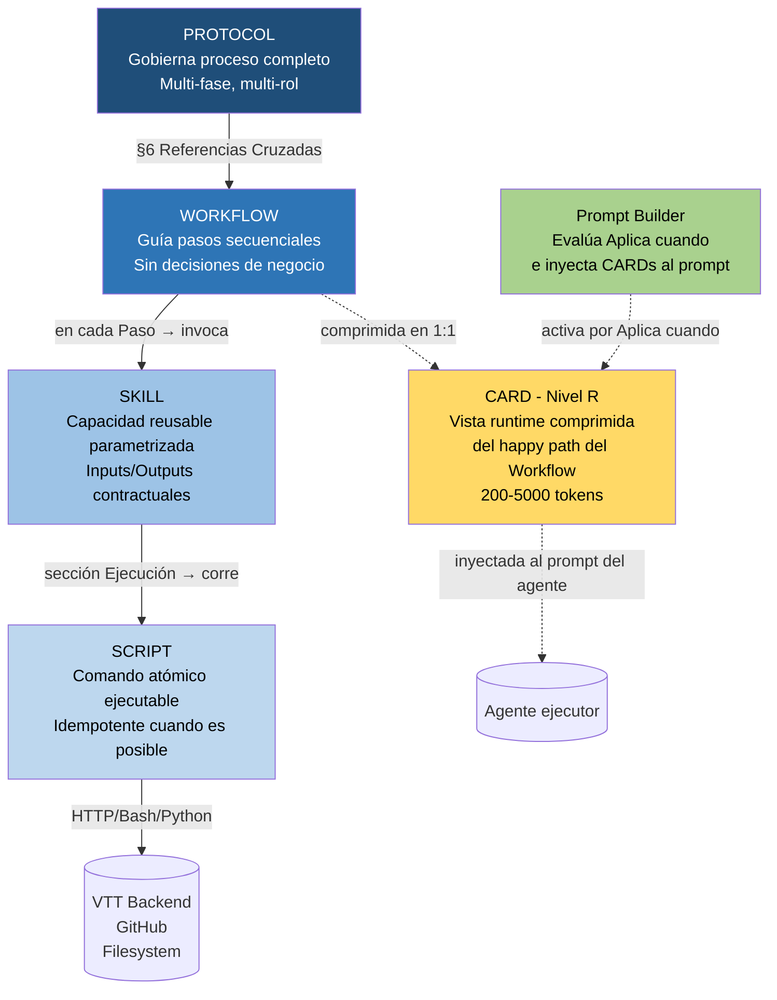

# Guía Normativa VTT — Modelo Operativo de 4 Niveles + Nivel R Runtime

| Campo | Valor |
|---|---|
| **Código** | `VTT.PROTOCOL-GOV-001` |
| **Versión** | 1.2.0 |
| **Fecha** | 2026-05-31 |
| **Autor** | PM Martin Rivas |
| **Aplica a** | Todos los agentes y roles que escriben o ejecutan documentación normativa en VTT |
| **Estado** | Aprobado para uso |

> **v1.2.0 (2026-05-31):** §2.4.bis nueva con Nivel R CARD (runtime, comprimido happy-path inyectable al prompt del agente). §4.2 actualizada con categorías CARD/EXE/ISS/HOTL. §4.4 extensiones incluye CARD=`.md`. §5/6/7/8 sin cambios — CARD tiene su propia §8.bis. Nueva §11.6 checklist CARD. Glosario §13 con CARD, Nivel R, Prompt Builder, Aplica cuando. Nuevo Anexo H con ejemplo mínimo CARD.

---

## Tabla de Contenido

1. [Propósito y alcance](#1-propósito-y-alcance)
2. [Modelo Operativo VTT de 4 niveles](#2-modelo-operativo-vtt-de-4-niveles)
3. [Cómo decidir el nivel correcto](#3-cómo-decidir-el-nivel-correcto)
4. [Convención de nombres](#4-convención-de-nombres)
5. [Estructura obligatoria del Protocol](#5-estructura-obligatoria-del-protocol)
6. [Estructura obligatoria del Workflow](#6-estructura-obligatoria-del-workflow)
7. [Estructura obligatoria del Skill](#7-estructura-obligatoria-del-skill)
8. [Estructura obligatoria del Script](#8-estructura-obligatoria-del-script)
9. [Reglas de invocación entre niveles](#9-reglas-de-invocación-entre-niveles)
10. [Versionado y cambios](#10-versionado-y-cambios)
11. [Cómo crear un documento nuevo](#11-cómo-crear-un-documento-nuevo)
12. [Migración de SOPs existentes](#12-migración-de-sops-existentes)
13. [Glosario](#13-glosario)
14. [Anexos](#14-anexos)

---

## 1. Propósito y alcance

### 1.1 Propósito

Establecer el modelo normativo para documentar todos los procesos operativos de VTT (Virtual Teams Tracking) de manera consistente, jerárquica y reutilizable entre proyectos.

### 1.2 Problema que resuelve

Antes de esta guía, la documentación normativa de VTT mezclaba niveles: un mismo documento describía a la vez **qué se hace, cómo se hace, qué comandos ejecutar y qué reglas aplican**. El resultado:

- Documentos largos difíciles de leer
- Skills específicas que no se reutilizan
- Procesos duplicados entre proyectos
- Agentes que no saben qué nivel de documento están leyendo

Esta guía separa responsabilidades en **4 niveles claros** y los agentes pueden identificar de inmediato qué tipo de documento están consultando por su nombre.

### 1.3 Alcance

Aplica a:

- Toda nueva documentación operativa de VTT (a partir de 2026-05-13)
- Migración progresiva de documentos legacy (SOP-*, FLUJO_*, PROCESO_*)
- Cualquier proyecto que use VTT como sistema de gestión (Memory Service, DesignMine, Prompt AI Studio, futuros)

No aplica a:

- Documentación interna del backend VTT (código, schemas) — eso vive en su propio repo
- Documentos de proyecto específicos (BRIEF, ASSIGNMENT, devlogs) — esos son **artefactos**, no normativa

---

## 2. Modelo Operativo VTT de 4 niveles + Nivel 0 transversal + Nivel R runtime

```
NIVEL 0 — Rules       "restringe transversalmente"  ←── aplica a TODOS los niveles
              │
              ▼ se aplican a
NIVEL 4 — Protocol    "gobierna"
              ↓ invoca
NIVEL 3 — Workflow    "guía"  ───────────────────────►  NIVEL R — CARD
              ↓ usa                                     "runtime comprimido"
NIVEL 2 — Skill       "ejecuta capacidad reusable"      (inyectable al prompt
              ↓ corre                                    del agente — Prompt Builder
NIVEL 1 — Script      "automatiza acción atómica"        activa por Aplica cuando)
```

> **Nivel 0 — Rules** es transversal. No es un nivel operativo (no se invoca por sí solo);
> es una capa de **restricciones y condiciones** que cualquier Protocol/Workflow/Skill/Script
> debe respetar al ejecutarse. Define qué puede hacer cada actor en cada scope.
> Ver `00.Rules/README.md` para el modelo completo de 8 niveles de scope, 4 tipos de actor
> y markers operativos (mandatory, sensitive, human_only, sod_enforcement, blocks_review_gate, auto_detect).

### 2.0 Rules — restringe transversalmente (Nivel 0)

**Restricciones y condiciones que aplican a todos los niveles operativos.**

Responde a: *¿Qué puede hacer cada actor en cada scope, bajo qué condiciones?*

Características:
- **Transversal** — aplica a Protocols, Workflows, Skills, Scripts
- No es un procedimiento (no se "ejecuta")
- Cada regla tiene: scope jerárquico (Platform → Org → Workspace → Project → Phase → Task → Role → Agent), tipo de actor (Human/Agent/Service/External), capabilities requeridas, markers operativos
- Alineada con doc_sec_01..04 (Bloque 1 de autorización VTT)

Ejemplo:
> `RULE-CODE-001 — UN archivo .LOGIC.md por archivo de código`
> Scope: TASK (criterio: has_code_files=true) · Actor: HUMAN+AGENT · Markers: mandatory, blocks_review_gate, auto_detect

Catálogo: `00.Rules/rules_catalog.json` (43 reglas iniciales). Motor: `00.Rules/query_rules.py`.

### 2.1 Protocol — gobierna

**Define la regla operativa completa de un proceso de negocio.**

Responde a: *¿Cuál es el proceso correcto para X?*

Características:
- Proceso end-to-end con principio y fin claros
- Multi-fase (varias etapas secuenciales)
- Multi-rol (involucra distintos actores)
- Contiene **decisiones de negocio**
- Tiene §Propósito, §Responsabilidades, §Definiciones
- Es la **fuente de verdad** del proceso

Ejemplo:
> `VTT.PROTOCOL-ASG-001_ciclo_asignacion_tarea` — "Cómo se asigna y se cierra una tarea en VTT"

### 2.2 Workflow — guía

**Describe el flujo paso a paso de una actividad concreta.**

Responde a: *¿Qué pasos debo seguir para hacer X?*

Características:
- Sub-proceso atómico dentro de un Protocol
- Secuencia fija de pasos
- **Sin decisiones de negocio** — ejecución guiada
- Lleva las **reglas del paso** (qué es válido, qué no)
- Define inputs y outputs estrictos
- Invoca Skills para ejecutar

Ejemplo:
> `VTT.WORKFLOW-ASG-001.003_generar_y_subir_briefs` — "Para generar BRIEFs: por cada tarea, leer template, escribir archivo, subir attachment"

### 2.3 Skill — ejecuta capacidad reusable

**Bloque reusable de ejecución que el agente invoca.**

Responde a: *¿Cómo ejecuto esta capacidad?*

Características:
- Encapsula una acción discreta y reusable
- Inputs/outputs **contractuales** (siempre los mismos para esa skill)
- Inyectable en múltiples Workflows
- Orquesta uno o más Scripts
- Tamaño compacto (60-150 tokens)
- Incluye precondición, ejecución, validación, error común

Ejemplo:
> `VTT.SKILL-ATTACH-001_subir_attachment_a_tarea` — Capacidad "subir cualquier tipo de archivo a una tarea VTT" con `file_type` parametrizado

**Regla de reutilización:** Si dos Workflows hacen lo mismo con datos distintos, **usan la misma Skill** — no se crean skills específicas del contexto.

### 2.4 Script — automatiza acción atómica

**Comando concreto que se ejecuta técnicamente.**

Responde a: *¿Qué comando exacto corro?*

Características:
- Atómico, idempotente (cuando es posible)
- Sin lógica de negocio
- Parámetros bien definidos
- Logging y manejo de errores estándar
- Reusable entre Skills

Ejemplo:
> `VTT.SCRIPT-ATTACH-001_post_attachment_multipart.py` — `POST /api/tasks/:id/attachments` con file binary + fields

### 2.4.bis CARD — runtime comprimido (Nivel R)

**Tarjeta de referencia comprimida que el agente lee durante la ejecución real.**

Responde a: *¿Qué CARD le doy al agente para que ejecute X en runtime sin cargarle todo el Protocol+Workflow+Skill?*

Características:
- **Es Nivel R (Runtime)** — no es un nivel operativo más; es una vista comprimida del happy-path
- **No reemplaza** Protocol/Workflow/Skill/Script — el agente puede consultar el nivel completo si necesita más detalle
- **Comprime ~83-91%** vs cargar Protocol+Workflow+Skill+Script para el mismo proceso
- **Inyectada por el Prompt Builder** (futuro) según el campo `Aplica cuando` que evalúa contexto del agente
- **TODAY (lazy-loading TL):** el TL referencia CARDs en el ASSIGNMENT como rutas de filesystem
- **TOMORROW (Prompt Builder):** consume `cards_catalog.json` y activa CARDs automáticamente
- **4 tipos por presupuesto** (estimador canónico `chars/4`):
  - `CARD-mini` (200-500 tok, hard cap 700)
  - `CARD-std` (500-1200 tok, hard cap 1500)
  - `CARD-large` (1200-2500 tok, hard cap 3000)
  - `CARD-pack` (2500-4500 tok, hard cap 5000)
- **Si excede el tope** → upgrade obligatorio al siguiente tipo o partir en 2 CARDs. **NO se negocia el tope.**
- **Header obligatorio**:
  - `Aplica cuando` (expresión lógica máquina-legible sobre `task.phase` + `agent.role` + `task.category`)
  - `Requiere Cards previas` (lista de CARD IDs predecesoras, para encadenamiento)
- **1:1 con Workflow** (Opción A confirmada por PM): una CARD por workflow, no consolidar packs

Ejemplo:
> `VTT.CARD-EXE-004_agente_ejecuta_workflow_assignment` — Comprime los 13 pasos del WORKFLOW-ASG-001.034 (~2,400 líneas Workflow + Skills + Scripts) en ~2,100 tokens runtime. Aplica cuando `task.phase = execution AND agent.role IN [BE,DB,FE,DO,QA,DL,UX,AR,SA]`.

**Catálogo Prompt Builder:** `02.normativa/05.Cards/cards_catalog.json`
**Template autoría:** `03.templates/normativa/_autoria/TEMPLATE_CARD.md`
**Carpeta canónica:** `02.normativa/05.Cards/<categoria>/`

> **Regla importante:** Una CARD NO se invoca desde Workflow/Skill. La activación es **al revés**: el Prompt Builder (o el TL hoy) decide qué CARD inyectar según `Aplica cuando`. La CARD apunta al Workflow padre en su header pero no es invocada por él.

### 2.5 Diagrama de invocación

```
┌──────────────────────────────────────────┐         ┌─────────────────────────┐
│ PROTOCOL                                 │         │ CARD (Nivel R)          │
│  Define proceso completo                 │         │  Comprimido del happy   │
│  §6 Referencias Cruzadas:                │         │  path de UN Workflow.   │
│    → Workflow A                          │   ◄────►│  Inyectada al prompt    │
│    → Workflow B                          │         │  del agente por Prompt  │
└──────────────────────────────────────────┘         │  Builder según          │
                  ↓ invoca                           │  "Aplica cuando".       │
┌──────────────────────────────────────────┐  ◄─────►│  4 tipos (mini/std/     │
│ WORKFLOW                                 │         │  large/pack) por        │
│  Pasos secuenciales con reglas           │         │  presupuesto chars/4    │
│  "Paso 3: subir BRIEF                    │         └─────────────────────────┘
│   → invocar SKILL-ATTACH-001 con         │
│     file_type='brief'"                   │
└──────────────────────────────────────────┘
                  ↓ usa
┌──────────────────────────────────────────┐
│ SKILL                                    │
│  Capacidad parametrizada                 │
│  Inputs: task_id, file_path,             │
│          file_type, uploaded_by          │
│  Ejecución: corre SCRIPT-ATTACH-001      │
└──────────────────────────────────────────┘
                  ↓ corre
┌──────────────────────────────────────────┐
│ SCRIPT                                   │
│  POST /api/tasks/:id/attachments         │
│  multipart/form-data                     │
└──────────────────────────────────────────┘
```

> La CARD NO se invoca desde Workflow/Skill. La activación va al revés: el Prompt Builder decide qué CARD inyectar según `Aplica cuando`. La CARD apunta al Workflow padre como referencia documental.

### 2.6 Filosofía: nombres interpretables por agentes

La nomenclatura `Protocol / Workflow / Skill / Script` se eligió porque cada palabra **es interpretable por sí sola** para un agente IA:

| Nombre | Lo que entiende el agente |
|---|---|
| Protocol | "Esto gobierna mi conducta en este proceso" |
| Workflow | "Estos son los pasos que debo seguir en orden" |
| Skill | "Esta es una capacidad que puedo invocar" |
| Script | "Esto se ejecuta técnicamente" |

Se evitaron acrónimos como `SOP/WI/ITV` porque requieren explicación previa y no se traducen igual de bien al inglés (donde el agente opera la mayoría del tiempo).

### 2.7 Equivalencias externas (solo para auditoría)

| VTT | Equivalente ISO/9001 | Cuándo usar |
|---|---|---|
| Rules | Policies / Controls | Auditoría de compliance (SOC2, ISO 27001) |
| Protocol | SOP (Standard Operating Procedure) | Auditoría externa, certificación |
| Workflow | WI (Work Instruction) | Equivalencia formal |
| Skill | — (no tiene equivalente directo) | Solo VTT |
| Script | — (sería herramienta o automation) | Solo VTT |

Esta equivalencia solo se menciona cuando hay auditoría externa. **La nomenclatura operativa siempre es la VTT.**

### 2.8 Documentos fuente del modelo de autorización (Nivel 0 Rules)

El Nivel 0 Rules está alineado con el Bloque 1 de autorización VTT documentado en:

- `00-platform/04.Process/01.authorizaton/doc_sec_01_modelo_seguridad_actores_scopes` — actores, recursos, jerarquía
- `00-platform/04.Process/01.authorizaton/doc_sec_02_politicas_permisos_rbac_abac` — 30 capabilities + 9 roles + reglas ABAC
- `00-platform/04.Process/01.authorizaton/doc_sec_03_arquitectura_implementacion_autorizacion` — middleware
- `00-platform/04.Process/01.authorizaton/doc_sec_04_matriz_autorizacion` — matriz RBAC

La implementación operativa de estos documentos vive en:
- `IMPROVE-004_rules_como_feature_vtt.md` (motor + API + Hook Manager)
- `IMPROVE-005_extension_recursos_vtt_especificos.md` (extensión a TIs, manifests, devlogs, LDs)

---

## 3. Cómo decidir el nivel correcto

### 3.1 Tabla decisoria

| Pregunta | Protocol | Workflow | Skill | Script | CARD |
|---|---|---|---|---|---|
| ¿Cubre un proceso de negocio end-to-end? | Sí | No | No | No | No |
| ¿Tiene fases? | Sí (varias) | No (una actividad) | No | No | No |
| ¿Decisiones de negocio? | Sí | No (ejecución guiada) | No | No | No (solo happy path) |
| ¿Orquesta varios scripts? | Sí (a través de skills) | A través de skills | Sí | No | No (referencia, no orquesta) |
| ¿Es un comando atómico? | No | No | No | Sí | No |
| ¿Idempotente? | No | Parcial | Cuando es posible | Sí (obligatorio) | N/A (es vista, no acción) |
| ¿Reusable entre proyectos? | Sí (genérico VTT) | Sí | Sí | Sí | Sí |
| ¿Quién lo escribe? | PM/TL líder | TL | TL técnico | Dev/agente | TL al producir Workflow (1:1) |
| ¿Quién lo lee primero? | Líderes + ejecutores | Ejecutor que planea | Agente que ejecuta | Ejecutor inmediato | **Agente en runtime** vía Prompt Builder |
| ¿Es invocado por niveles superiores? | — | Por Protocol §6 | Por Workflow pasos | Por Skill ejecución | **NO** — activado por Prompt Builder |
| Tamaño típico | 400-700 líneas | 150-300 líneas | 60-150 tokens (~30-80 líneas) | 5-50 líneas | 200-5000 tokens según tipo |

### 3.2 La pregunta clave: ¿Workflow o Skill?

Es la confusión más frecuente. Regla simple:

```
Si lo que escribes contiene PASOS DECISIVOS
   ("primero hacer X, después verificar Y, si Z entonces W")
   → es WORKFLOW

Si lo que escribes contiene una CAPACIDAD PARAMETRIZADA
   ("dame inputs A, B, C — yo ejecuto la acción y devuelvo resultado")
   → es SKILL
```

### 3.3 Regla de reutilización de Skills

> **Las Skills NUNCA son específicas del contexto.**
>
> Si te tienta crear `SKILL-BRIEF-UPLOAD-001` porque "es para subir BRIEFs", esa lógica pertenece al **Workflow** que la invoca, no a una Skill nueva.
>
> Crea `SKILL-ATTACH-001` (subir cualquier tipo de attachment) y deja que el Workflow le pase `file_type="brief"` o `file_type="devlog"` según corresponda.

Anti-patrón:

```
❌ SKILL-BRIEF-UPLOAD-001     "Subir BRIEF a tarea"
❌ SKILL-DEVLOG-UPLOAD-001    "Subir devlog a tarea"
❌ SKILL-MANIFEST-UPLOAD-001  "Subir manifest a tarea"
❌ SKILL-CODELOGIC-UPLOAD-001 "Subir code logic a tarea"
   → 4 skills haciendo casi lo mismo
```

Patrón correcto:

```
✅ SKILL-ATTACH-001 "Subir attachment a tarea"
   Inputs: task_id, file_path, file_type, uploaded_by
   → 1 skill reusable, el Workflow le pasa el file_type que necesita
```

### 3.4 Ejemplo lado a lado (Workflow vs Skill vs Script)

**Caso:** "Generar y subir BRIEFs de un sprint"

```
─────────────────────────────────────────────────────────────
WORKFLOW: VTT.WORKFLOW-ASG-001.003_generar_y_subir_briefs
─────────────────────────────────────────────────────────────
INPUTS:
  - lista_tareas: array de {task_id, titulo, agente}

REGLAS DEL WORKFLOW:
  - El BRIEF es inmutable (no se edita después de creado)
  - Una tarea = un BRIEF
  - Ubicación: knowledge/agent-tasks/briefs/[sprint]/BRIEF_[ID]_[nombre].md
  - Usar VTT.TEMPLATE-ASG-001_brief.md

PASOS:
  Por cada tarea en lista_tareas:
    1. Generar contenido del BRIEF usando el template
       → invoca SKILL-FILE-WRITE-001
    2. Validar formato del BRIEF generado
    3. Subir como attachment a la tarea VTT
       → invoca SKILL-ATTACH-001 con file_type="brief"
    4. Registrar en log local: "BRIEF [ID] subido (attachment_id: ...)"

OUTPUTS:
  - BRIEFs en disco
  - N attachments en VTT con fileType=brief
  - Log con UUIDs de cada attachment

─────────────────────────────────────────────────────────────
SKILL: VTT.SKILL-ATTACH-001_subir_attachment_a_tarea
─────────────────────────────────────────────────────────────
APLICA A: Todos los agentes
TOKENS: ~120

INPUTS (contractuales):
  - task_id        (ej. "MS-286")
  - file_path      (path local del archivo)
  - file_type      (enum: brief|assignment|devlog|code_logic|manifest|attachment)
  - uploaded_by    (UUID del usuario)
  - description    (opcional)

PRECONDICIÓN:
  - TOKEN JWT válido en $TOKEN
  - Archivo existe en file_path
  - file_type ∈ enum permitido

EJECUCIÓN:
  Llamar VTT.SCRIPT-ATTACH-001 con los inputs.

VALIDACIÓN:
  - HTTP 201
  - response.data.id es UUID válido
  - GET /api/tasks/{task_id}/attachments retorna el nuevo archivo

ERROR COMÚN:
  - 400 "uploadedById is required" → falta param
  - 400 "Invalid fileType" → file_type fuera del enum
  - 413 → archivo supera límite

─────────────────────────────────────────────────────────────
SCRIPT: VTT.SCRIPT-ATTACH-001_post_attachment_multipart.py
─────────────────────────────────────────────────────────────
POST {BASE_URL}/api/tasks/{task_id}/attachments
Content-Type: multipart/form-data; boundary=<boundary>
Authorization: Bearer <TOKEN>

Multipart fields:
  file:         <binario>
  fileType:     <file_type>
  uploadedById: <uploaded_by>
  description:  <description> (opcional)

Returns: { data: { id, fileType, fileSize, fileName, createdAt } }
Idempotencia: No (siempre crea un nuevo attachment, no dedup)
```

---

## 4. Convención de nombres

### 4.1 Pattern

```
VTT.<NIVEL>-<CAT>-<NNN>[.MMM]_titulo_snake_case.<ext>
   │  │       │     │    │     │                  │
   │  │       │     │    │     │                  └── md|py|sh|ts|mmd
   │  │       │     │    │     └────────────────────── snake_case minúsculas
   │  │       │     │    └──────────────────────────── sub-ID (solo Workflows)
   │  │       │     └───────────────────────────────── ID 3 dígitos
   │  │       └─────────────────────────────────────── categoría temática
   │  └─────────────────────────────────────────────── nivel: PROTOCOL|WORKFLOW|SKILL|SCRIPT|FLOWCHART|TEMPLATE
   └────────────────────────────────────────────────── prefijo plataforma (siempre "VTT")
```

### 4.2 Categorías estandarizadas

| Categoría | Tema |
|---|---|
| `GOV` | Gobierno operativo (transversal — esta guía vive aquí) |
| `ASG` | Asignación de tareas |
| `ISS` | Issues y on-hold |
| `TRK` | Trackable Items (ADRs, RFs, NFRs, Assumptions) |
| `LD` | Living Documents |
| `EVD` | Evidencias |
| `DEV` | Devlog entries |
| `MAN` | Manifests |
| `EST` | Estimaciones |
| `VEL` | Velocity |
| `RET` | Retrospectivas |
| `AUTH` | Autenticación / tokens |
| `TASK` | CRUD de tareas (script-level) |
| `ATTACH` | Attachments / archivos |
| `STATUS` | Cambios de estado de tareas |
| `COMMENT` | Comentarios en tareas |
| `PB` | Prompt Builder (futuro) |
| `QA` | Quality Assurance |
| `DB` | Operaciones de base de datos |
| `GIT` | Operaciones de Git/GitHub |
| `FILE` | Operaciones de filesystem |
| `EXE` | CARDs runtime FASE 3 ejecución del agente (CARD-EXE-001..009) |
| `HOTL` | Handoff TL (FASE 0 PROTOCOL-ASG-001 §5.0.2) |
| `LD` | Living Documents (skill+script revisión catálogo LDs) |
| `DOCIMP` | Document Impacts (registro en VTT con fallback DEBT-INFRA-VTT-01) |
| `HARDCODE` | Hardcode Security Check (9 patrones canónicos) |
| `CODE` | Code Implementation + `.LOGIC.md` espejo |
| `PR` | Pull Request (gh CLI canónico) |
| `RESUME` | Resume Task tras auto-resume del sistema VTT |
| `CFL` | Canonical File Loader + fulfill CAs |
| `CARD` | (transversal) CARDs sin sub-sistema específico — reservado |

> **Fuente de verdad de los acrónimos:** `02.normativa/00_REGISTRO_ACRONIMOS.md` §3.1 (registro autoritativo con fechas, dueños y estado).

Para agregar una categoría nueva → registrar primero en `00_REGISTRO_ACRONIMOS.md` y luego sincronizar esta tabla.

### 4.3 Numeración

- **3 dígitos** (`001` a `999`) — soporta escala sin renombrado
- **Sub-IDs** para Workflows que pertenecen a un Protocol específico: `.001`, `.002`, etc.
  Ejemplo: `WORKFLOW-ASG-001.003` = tercer workflow del protocol ASG-001

### 4.4 Extensiones por tipo

| Nivel | Extensión |
|---|---|
| Protocol | `.md` |
| Workflow | `.md` |
| Skill | `.md` |
| Script | `.py` (preferido) / `.sh` / `.ts` |
| **CARD** | `.md` (con header obligatorio `Aplica cuando` + `Requiere Cards previas` + `Tipo`) |
| Flowchart | `.mmd` (mermaid) o `.pdf` |
| Template | `.md` (con bloque code para JSON/YAML si aplica) |

### 4.5 Ejemplos

```
VTT.PROTOCOL-GOV-001_modelo_normativo_documental.md       (esta guía)
VTT.PROTOCOL-ASG-001_ciclo_asignacion_tarea.md
VTT.WORKFLOW-ASG-001.001_recibir_handoff.md
VTT.WORKFLOW-ASG-001.003_generar_y_subir_briefs.md
VTT.WORKFLOW-ASG-001.015_aplicar_modelo_dinamico.md
VTT.SKILL-AUTH-001_obtener_jwt.md
VTT.SKILL-ATTACH-001_subir_attachment_a_tarea.md
VTT.SKILL-TRK-001_crear_trackable_item.md
VTT.SCRIPT-ATTACH-001_post_attachment_multipart.py
VTT.SCRIPT-TRK-001_post_trackable_item.py
VTT.CARD-EXE-001_agente_lee_inputs_iniciales.md
VTT.CARD-EXE-004_agente_ejecuta_workflow_assignment.md
VTT.CARD-MAN-001_task_manifest_v10.md
VTT.CARD-ISS-001_crear_issue_vtt.md
VTT.FLOWCHART-ASG-001_ciclo_asignacion.mmd
VTT.TEMPLATE-ASG-001_brief.md
```

---

## 5. Estructura obligatoria del Protocol

Un Protocol siempre tiene 7 secciones + Anexos + Footer.

### 5.1 Header

```markdown
# [Título del Protocol]

| Campo | Valor |
|---|---|
| **Código** | `VTT.PROTOCOL-<CAT>-<NNN>` |
| **Versión** | <X.Y.Z> |
| **Fecha** | YYYY-MM-DD |
| **Autor** | Nombre + rol |
| **Aplica a** | Roles separados por coma |
| **Estado** | Borrador / Aprobado / Deprecated |
```

### 5.2 Secciones §1 a §7

**§1 Propósito** — 1-2 párrafos. El **qué** y el **por qué**.

**§2 Campo de Aplicación** — Dónde y cuándo aplica el protocol.

**§3 Responsabilidades** — Por rol, qué le toca hacer:
```markdown
3.1 PM — recibir handoff, aprobar terminalmente
3.2 TL — planificar y revisar
3.3 Agente ejecutor — implementar y entregar
```

**§4 Definiciones** — Glosario de términos clave usados en el protocol.

**§5 Procedimiento** — El cuerpo del protocol, subdividido en fases:
```markdown
### 5.1 Fase 1 — [nombre]
5.1.1 Paso → ver WORKFLOW-XXX-NNN.001
5.1.2 Paso → ver WORKFLOW-XXX-NNN.002

### 5.2 Fase 2 — [nombre]
...
```

**§6 Referencias Cruzadas** — Tabla con todos los Workflows, Templates y otros documentos invocados:
```markdown
| Código | Documento |
|---|---|
| VTT.WORKFLOW-XXX-NNN.001 | Título |
| VTT.WORKFLOW-XXX-NNN.002 | Título |
| VTT.TEMPLATE-XXX-NNN | Título |
```

**§7 Resumen de Revisiones** — Versionado:
```markdown
| Versión | Fecha | Editor | Cambios |
|---|---|---|---|
| 1.0.0 | YYYY-MM-DD | Nombre | Versión inicial |
```

### 5.3 Anexos

Templates, ejemplos, formatos referenciados desde el cuerpo.

### 5.4 Footer

```markdown
---

| Editor | Dueño | Última Actualización |
|---|---|---|
| Nombre + rol | Nombre + rol | YYYY-MM-DD |
```

---

## 6. Estructura obligatoria del Workflow

Un Workflow es más compacto que un Protocol — no tiene §Responsabilidades ni §Definiciones globales.

```markdown
# [Título del Workflow]

| Campo | Valor |
|---|---|
| **Código** | `VTT.WORKFLOW-<CAT>-<NNN>.<MMM>` |
| **Pertenece a** | `VTT.PROTOCOL-<CAT>-<NNN>` |
| **Versión** | <X.Y.Z> |
| **Fecha** | YYYY-MM-DD |
| **Aplica a** | Rol(es) |

## 1. Propósito
Una línea que dice qué hace este workflow.

## 2. Inputs
- input_1: descripción + formato esperado
- input_2: descripción + formato esperado

## 3. Precondiciones
- Condición que debe ser verdadera antes de ejecutar
- Estados de VTT requeridos
- Recursos necesarios

## 4. Reglas del Workflow
- Regla 1 (ej. "el BRIEF es inmutable")
- Regla 2 (ej. "usar template X")
- Convenciones aplicables (paths, naming)

## 5. Pasos

### Paso 1: [acción]
Descripción del paso.
Decisiones intermedias si las hay.
Si invoca skill: → invoca **VTT.SKILL-XXX-NNN** con inputs (param1=valor1, param2=valor2)

### Paso 2: [acción]
...

### Paso N: [acción]
...

## 6. Outputs
- output_1: descripción + formato
- output_2: descripción + formato

## 7. Validación
Cómo verificar que el workflow se completó correctamente:
- Check 1
- Check 2

## 8. Errores comunes
| Síntoma | Causa probable | Solución |
|---|---|---|

## 9. Skills invocadas
- VTT.SKILL-XXX-NNN
- VTT.SKILL-YYY-NNN
```

---

## 7. Estructura obligatoria del Skill

```markdown
# [Título del Skill]

| Campo | Valor |
|---|---|
| **Código** | `VTT.SKILL-<CAT>-<NNN>` |
| **Versión** | <X.Y> |
| **Aplica a** | Roles (o "Todos") |
| **Tokens estimados** | ~XXX |
| **Cuándo se usa** | Una línea sobre el momento de uso |

## Inputs (contractuales)
- input_1 (tipo): descripción
- input_2 (tipo): descripción

## Precondición
- Qué debe ser cierto antes de ejecutar

## Variables del entorno
- $TOKEN
- $VTT_BASE_URL
- $AGENT_UUID
- etc.

## Ejecución
Descripción de lo que hace la skill, en términos de scripts orquestados.

```bash
# Ejemplo de invocación
python VTT.SCRIPT-XXX-NNN.py --task_id=$TASK_ID --file_path=$PATH
```

## Validación
- Cómo saber si funcionó
- Qué response indica éxito

## Error común
- Error 1 → causa → solución
- Error 2 → causa → solución

## Scripts invocados
- VTT.SCRIPT-XXX-NNN
- VTT.SCRIPT-YYY-NNN
```

---

## 8. Estructura obligatoria del Script

```python
#!/usr/bin/env python3
"""
VTT.SCRIPT-<CAT>-<NNN> — [Título del script]

Propósito: [una línea]
Idempotente: [Sí / No / Parcial — explicar]

Inputs (CLI args o env vars):
  --task_id      ID de la tarea (ej. MS-286)
  --file_path    Path local al archivo
  --file_type    enum: brief|assignment|devlog|...
  $TOKEN         JWT VTT (env var)
  $VTT_BASE_URL  Base URL (env var, default http://77.42.88.106:3000)

Outputs (stdout JSON):
  { "success": true, "data": { "id": "...", "fileSize": N } }

Errores:
  Exit 1: argumentos inválidos
  Exit 2: precondición no cumplida
  Exit 3: respuesta HTTP de error
"""

import argparse
import json
import os
import sys
import urllib.request
import urllib.error


def main():
    parser = argparse.ArgumentParser()
    parser.add_argument("--task_id", required=True)
    # ... resto de args
    args = parser.parse_args()

    # Validación de precondiciones
    token = os.environ.get("TOKEN")
    if not token:
        print(json.dumps({"success": False, "error": "TOKEN env var required"}))
        sys.exit(2)

    # Ejecución (con manejo de errores estándar)
    try:
        # ... lógica
        pass
    except urllib.error.HTTPError as e:
        print(json.dumps({
            "success": False,
            "http_status": e.code,
            "error": e.read().decode()[:300]
        }))
        sys.exit(3)

    # Output
    print(json.dumps({"success": True, "data": result}))


if __name__ == "__main__":
    main()
```

**Requisitos obligatorios de todo Script:**

1. **Header docstring** con propósito, inputs, outputs, errores, idempotencia
2. **Stdout en JSON** — para que las skills puedan parsear el resultado
3. **Exit codes claros** — 0 OK, 1 args, 2 precondición, 3 HTTP error
4. **Sin secrets hardcoded** — usar env vars
5. **Idempotencia documentada** — Sí / No / Parcial + por qué

---

## 8.bis Estructura obligatoria del CARD (Nivel R)

Una CARD es una **vista comprimida runtime** del happy path de un Workflow. No reemplaza ningún nivel — el agente puede consultar Workflow/Skill si necesita más detalle.

### Header obligatorio

```markdown
# VTT.CARD-<CAT>-<NNN> — [Título corto]

| Campo | Valor |
|---|---|
| **Código** | `VTT.CARD-<CAT>-<NNN>` |
| **Tipo** | `CARD-mini` / `CARD-std` / `CARD-large` / `CARD-pack` |
| **Versión** | <X.Y> |
| **Aplica cuando** | <expresión lógica máquina-legible> |
| **Requiere Cards previas** | <lista de CARD IDs o `ninguna`> |
| **Pertenece a** | WORKFLOW-<CAT>-<NNN>.<MMM> |
| **Tokens estimados** | ~XXX (chars/4 canónico) |
```

### Gramática del campo `Aplica cuando`

Expresión lógica máquina-legible. Operadores: `=`, `IN [...]`, `AND`, `OR`.

**Campos válidos:**
- `task.phase` ∈ {`assignment`, `execution_start`, `execution`, `closing`, `review`, `approval`}
- `agent.role` ∈ {`BE`, `DB`, `FE`, `DO`, `QA`, `DL`, `UX`, `AR`, `SA`, `TL`, `PM`, `PJM`}
- `task.category` ∈ {`development`, `deployment`, `devops`, `documentation`, `testing`, `design`, `bugfix`}

**Ejemplos:**
- `task.phase = closing AND agent.role IN [BE,DB,FE,DO,QA,DL,UX,AR,SA]`
- `task.phase = execution_start AND agent.role IN [BE,DB,FE]`
- `task.phase = review AND agent.role = TL`

### Cuerpo

```markdown
## Qué hacer

[Pasos del happy path, comprimidos. Sin bifurcaciones complejas — solo el camino exitoso.]

## Si falla

[Tabla compacta de errores comunes y acción inmediata.]

## Output

[Qué deja en estado consistente cuando termina exitosa. Siguiente CARD opcional.]
```

### Presupuesto canónico (chars/4)

| Tipo | Target | Hard cap |
|---|---|---|
| `CARD-mini` | 200-500 tok | 700 |
| `CARD-std` | 500-1200 tok | 1500 |
| `CARD-large` | 1200-2500 tok | 3000 |
| `CARD-pack` | 2500-4500 tok | 5000 |

**Si excede el hard cap → upgrade al siguiente tipo o partir en 2 CARDs. NO se negocia el tope.**

### Convenciones de paths

- **Carpeta canónica:** `02.normativa/05.Cards/<categoria>/`
- **Catálogo PB:** `02.normativa/05.Cards/cards_catalog.json` (sincronizado al producir/actualizar CARDs)
- **Template autoría:** `03.templates/normativa/_autoria/TEMPLATE_CARD.md`
- **README categoría:** `02.normativa/05.Cards/<categoria>/README.md` (lista CARDs de la categoría)

### Reglas estructurales

1. **1:1 con Workflow** — una CARD por workflow, no consolidar packs (Opción A confirmada por PM)
2. **No invocación inversa** — Workflow/Skill NO invocan CARDs. Las CARDs apuntan a su Workflow padre como referencia documental.
3. **Token measurement obligatorio** — el catálogo `cards_catalog.json` lleva `tokens_measured` (medido al producir, NO estimado).
4. **Estimador canónico**: `chars/4`. Auxiliar `words×1.33` solo de referencia, NO para decisiones de budget.
5. **`Requiere Cards previas`** habilita activación condicional del Prompt Builder (si CARD-X requiere CARD-Y, el PB asegura el orden de inyección).

---

## 9. Reglas de invocación entre niveles

### 9.1 Cómo se invoca cada nivel

| De → A | Mecanismo |
|---|---|
| **Protocol → Workflow** | En §5 Procedimiento: "→ ver `VTT.WORKFLOW-XXX-NNN.MMM`" + listado en §6 Referencias Cruzadas |
| **Workflow → Skill** | En el paso correspondiente: "→ invoca **VTT.SKILL-XXX-NNN** con (param=valor, ...)" |
| **Skill → Script** | En la sección Ejecución de la skill: comando inline `python VTT.SCRIPT-XXX-NNN.py --args` |
| **Script → APIs externas** | El script hace los HTTP calls finales |
| **Prompt Builder → CARD** | El PB evalúa `Aplica cuando` de cada CARD del catálogo y inyecta la(s) coincidente(s) al prompt del agente. **Hoy**: el TL referencia CARDs en el ASSIGNMENT como rutas (lazy-load). |
| **CARD → Workflow padre** | Referencia documental en su header (`Pertenece a:`). NO invocación. |

### 9.2 Prohibido saltar niveles

❌ Un Protocol no invoca skills directamente — siempre pasa por Workflow.
❌ Un Workflow no invoca scripts directamente — siempre pasa por Skill.
❌ Una Skill no contiene scripts inline — siempre referencia un Script existente.
❌ Una CARD NO se invoca desde Workflow/Skill — la activación es al revés (Prompt Builder → CARD).
❌ Un Workflow no debe duplicar el contenido de su CARD ni viceversa — el Workflow tiene el camino completo (incluye errores, ramificaciones), la CARD solo el happy path comprimido.

**Excepciones documentadas** (cuando la regla aplica, registrar en §8 del documento):
- Skills muy simples pueden contener el curl inline (≤5 líneas) sin crear Script aparte
- Para esos casos, agregar nota explícita en la skill

### 9.3 Cómo se propagan variables

Variables del entorno disponibles en todos los niveles:

```
$TOKEN           — JWT VTT (obtenido vía SKILL-AUTH-001)
$VTT_BASE_URL    — Base URL del backend VTT
$AGENT_UUID      — UUID del agente en sesión
$PROJECT_ID      — UUID del proyecto activo
$SERVICE_KEY     — Service key (solo para AUTH)
```

Estas son **comunes a todos los proyectos VTT**. Los IDs específicos del proyecto (UUIDs de tareas, deliveries, etc.) son **inputs explícitos** de cada Workflow/Skill, no env vars.

---

## 10. Versionado y cambios

### 10.1 Esquemas por nivel

| Nivel | Esquema | Razón |
|---|---|---|
| Protocol | SemVer (X.Y.Z) | Cambios de proceso son significativos |
| Workflow | SemVer (X.Y.Z) | Cambian inputs/outputs y secuencia |
| Skill | Incremental (v1, v2) | Cambios atómicos en contrato |
| Script | Incremental (v1, v2) | Cambios técnicos en endpoints |
| **CARD** | Incremental (v1, v2) + `tokens_measured` actualizado | Cualquier cambio que afecte tokens requiere re-medición. Si supera hard cap → upgrade de tipo |

### 10.2 Cuándo es major vs minor

**Protocol / Workflow (SemVer):**

| Cambio | Tipo | Ejemplo |
|---|---|---|
| Major (X) | Cambio incompatible | Agregar fase obligatoria nueva |
| Minor (Y) | Funcionalidad nueva compatible | Paso opcional adicional |
| Patch (Z) | Aclaración o fix de typos | Corregir ejemplo |

**Skill / Script (Incremental):**

| Cambio | Tipo | Acción |
|---|---|---|
| Cambia contrato (inputs/outputs) | Nueva versión | Crear `SKILL-XXX-NNN_v2` |
| Mejora interna sin romper | Mismo número, update | Actualizar contenido + bump fecha |

### 10.3 Quién aprueba cambios

| Nivel | Aprobador |
|---|---|
| Protocol | PM (cambios major) / TL (minor/patch) |
| Workflow | TL del proceso |
| Skill | TL técnico |
| Script | Cualquier dev/agente que sepa que funciona |

### 10.4 Registro de cambios

Todo Protocol y Workflow lleva tabla §7 Resumen de Revisiones con cada versión, fecha, editor y resumen.

Skills y Scripts llevan changelog en el header del documento/archivo.

---

## 11. Cómo crear un documento nuevo

### 11.1 Workflow del autor

```
1. Identifica el nivel correcto (sección §3 de esta guía)
2. Elige código siguiendo §4
3. Copia plantilla del Anexo correspondiente
4. Completa todas las secciones obligatorias
5. Valida con el checklist (§11.5)
6. Sube al repo en la carpeta correcta
7. Notifica al PM si es Protocol nuevo
```

### 11.2 Checklist Protocol

```
[ ] Código sigue pattern VTT.PROTOCOL-<CAT>-<NNN>
[ ] Header con todos los campos
[ ] §1 Propósito (1-2 párrafos)
[ ] §2 Campo de Aplicación
[ ] §3 Responsabilidades (por rol)
[ ] §4 Definiciones (al menos 3 términos clave)
[ ] §5 Procedimiento (subdividido en fases)
[ ] §6 Referencias Cruzadas (tabla completa)
[ ] §7 Resumen de Revisiones (versión inicial registrada)
[ ] Anexos (si aplica)
[ ] Footer con editor/dueño
[ ] Todos los Workflows referenciados existen o están en plan
[ ] Aprobación PM si es Protocol nuevo
```

### 11.3 Checklist Workflow

```
[ ] Código VTT.WORKFLOW-<CAT>-<NNN>.<MMM>
[ ] Header indica a qué Protocol pertenece
[ ] §1 Propósito (1 línea)
[ ] §2 Inputs claros con tipo y formato
[ ] §3 Precondiciones listadas
[ ] §4 Reglas del Workflow
[ ] §5 Pasos numerados con decisiones intermedias
[ ] §6 Outputs definidos
[ ] §7 Validación (cómo verificar éxito)
[ ] §8 Errores comunes
[ ] §9 Skills invocadas (todas listadas)
[ ] Cada paso que ejecuta algo invoca una Skill (no inline scripts)
```

### 11.4 Checklist Skill

```
[ ] Código VTT.SKILL-<CAT>-<NNN>
[ ] Inputs contractuales (siempre los mismos)
[ ] Precondición clara
[ ] Variables del entorno listadas
[ ] Ejecución referencia Scripts (no inline endpoints)
[ ] Validación específica con códigos HTTP esperados
[ ] Error común documentado
[ ] Scripts invocados listados
[ ] No es específica del contexto (es reusable)
[ ] Tokens estimados ≤ 200
```

### 11.5 Checklist Script

```
[ ] Código VTT.SCRIPT-<CAT>-<NNN>
[ ] Header docstring completo
[ ] Argparse o env vars (no hardcode)
[ ] Idempotencia documentada
[ ] Stdout en JSON
[ ] Exit codes 0/1/2/3
[ ] Manejo de HTTPError
[ ] Sin secrets hardcoded
[ ] Testeado con un caso real
```

### 11.6 Checklist CARD

```
[ ] Código VTT.CARD-<CAT>-<NNN>
[ ] Header con Tipo + Aplica cuando + Requiere Cards previas + Pertenece a
[ ] Aplica cuando usa gramática válida (task.phase / agent.role / task.category + operadores =, IN, AND, OR)
[ ] Tokens medidos con chars/4 (no estimados)
[ ] Tokens dentro del rango del tipo declarado (mini ≤700, std ≤1500, large ≤3000, pack ≤5000)
[ ] Si excede hard cap → upgrade al siguiente tipo o partir en 2 CARDs
[ ] Cuerpo: solo happy path comprimido (sin ramificaciones complejas)
[ ] Si falla: tabla compacta de errores comunes + acción
[ ] Output: estado consistente al terminar + CARD siguiente si encadenada
[ ] Pertenece a Workflow existente (referencia documental)
[ ] Entrada agregada a `cards_catalog.json` con tokens_measured + tokens_measured_at
[ ] Path canónico: `02.normativa/05.Cards/<categoria>/`
[ ] Si la categoría es nueva → README de categoría creado + ACRONIMOS actualizado
```

---

## 12. Migración de SOPs existentes

### 12.1 Inventario actual

En el repo `virtual-teams-setup` (al 2026-05-13):

| Archivo legacy | Nivel actual | Migración propuesta |
|---|---|---|
| `SOP-EST-01_technical_estimates.md` | Mezcla SOP + WI | → 1 Protocol + 2 Workflows |
| `SOP-LD-01_living_documents.md` | SOP genérico | → Protocol (genérico) |
| `SOP-TRK-01_trackable_items_workflow.md` | Mezcla SOP + WI | → 1 Protocol + N Workflows |
| `SOP-TRK-02_dynamic_item_creation.md` | Workflow + Skills mezclados | → 1 Workflow + 2 Skills |
| `SOP-VEL-01_velocity_methodology.md` | Conceptual / metodología | → Protocol |
| `SOP-RET-01_retrospective_analysis.md` | SOP genérico | → Protocol + 1 Workflow |
| `PROCESO_ASIGNACION_TAREAS.md` | Híbrido | → 1 Protocol + N Workflows |

### 12.2 Plan progresivo

**No migrar todo de una vez.** La migración se hace cuando un documento se edita por otra razón:

```
1. Si un SOP existente NO necesita cambios → dejarlo como está
2. Si necesita actualización → migrarlo al nuevo modelo en el mismo PR
3. Si es nuevo → siempre nacer en el nuevo modelo
```

### 12.3 Tabla de equivalencias

```
SOP-XXX-NN (legacy)  →  VTT.PROTOCOL-XXX-NNN o VTT.WORKFLOW-XXX-NNN
                        (según contenga proceso de negocio o flujo guiado)

SKL-XXX-NN (legacy)  →  VTT.SKILL-XXX-NNN (renombrado directo)

Curls inline         →  Extraer como VTT.SCRIPT-XXX-NNN
```

---

## 13. Glosario

**Agente**: instancia de modelo IA (Claude/GPT/etc.) operando bajo un rol específico (TL, BE, PM, etc.).

**Aplica cuando**: campo obligatorio del header de toda CARD. Expresión lógica máquina-legible sobre `task.phase` + `agent.role` + `task.category`. Evaluada por el Prompt Builder para decidir qué CARDs inyectar al prompt del agente.

**Artefacto**: documento generado durante la ejecución de un proceso (BRIEF, ASSIGNMENT, devlog, manifest). **No** es normativa.

**CARD**: Nivel R del modelo — vista comprimida runtime del happy path de UN Workflow. Inyectada al prompt del agente por el Prompt Builder según `Aplica cuando`. 4 tipos por presupuesto: `mini` (200-500), `std` (500-1200), `large` (1200-2500), `pack` (2500-4500). Comprime ~83-91% vs Protocol+Workflow+Skill completos.

**Capacidad reusable**: bloque de funcionalidad que se invoca con inputs distintos sin modificar la implementación interna. Equivale a una función parametrizada.

**Chars/4**: estimador canónico de tokens en VTT. Auxiliar `words×1.33` solo de referencia, NO para decisiones de budget. Aplica a CARDs y a presupuesto runtime.

**Contractual (inputs/outputs)**: definidos formalmente — siempre los mismos para esa Skill/Script, sin importar quién la llame.

**Idempotencia**: propiedad de un script que produce el mismo resultado si se ejecuta varias veces con los mismos inputs.

**Marker**: convención textual estructurada que se embebe en datos sin schema dedicado (ej. `[TASK:MS-285] [SPRINT:S1]` en evidencias).

**Nivel R (Runtime)**: la "R" en el modelo VTT denota el nivel runtime de las CARDs. No es un nivel operativo (no se "ejecuta") — es una capa de comprimido que se "lee" o "inyecta" al prompt.

**Normativa**: conjunto de documentos que **gobiernan cómo se opera** (Protocol/Workflow/Skill/Script + CARD).

**Prompt Builder**: componente futuro que evalúa el contexto del agente (`task.phase`, `agent.role`, `task.category`) y consulta `cards_catalog.json` para inyectar las CARDs aplicables al prompt. Hoy el TL ejerce esta función manualmente referenciando CARDs en el ASSIGNMENT.

**Protocol**: nivel 4 del modelo — proceso de negocio end-to-end.

**Pool de transacciones (futuro)**: sistema centralizado que recibe operaciones VTT en JSON, las dedupa y las ejecuta atómicamente. Idea pendiente de implementación.

**Requiere Cards previas**: campo del header de CARD que lista IDs de CARDs predecesoras. Habilita activación condicional + encadenamiento por el Prompt Builder (asegura orden de inyección).

**Skill**: nivel 2 del modelo — capacidad reusable parametrizada.

**Script**: nivel 1 del modelo — comando atómico ejecutable.

**Workflow**: nivel 3 del modelo — secuencia guiada de pasos.

**VTT (Virtual Teams Tracking)**: plataforma de gestión de proyectos con agentes IA.

---

## 14. Anexos

### Anexo A — Ejemplo mínimo de Protocol

Ver `VTT.PROTOCOL-ASG-001_ciclo_asignacion_tarea.md` (cuando exista).

Plantilla mínima:

```markdown
# Ciclo de [proceso]

| Código | VTT.PROTOCOL-XXX-001 |
| Versión | 1.0.0 |
| Fecha | YYYY-MM-DD |
| Autor | Nombre |
| Aplica a | Roles |
| Estado | Borrador |

## 1. Propósito
[1-2 párrafos]

## 2. Campo de Aplicación
[Dónde y cuándo aplica]

## 3. Responsabilidades
3.1 Rol A — qué hace
3.2 Rol B — qué hace

## 4. Definiciones
**Término 1**: definición
**Término 2**: definición

## 5. Procedimiento

### 5.1 Fase 1 — [nombre]
5.1.1 Paso → ver VTT.WORKFLOW-XXX-001.001
5.1.2 Paso → ver VTT.WORKFLOW-XXX-001.002

## 6. Referencias Cruzadas

| Código | Documento |
|---|---|

## 7. Resumen de Revisiones

| Versión | Fecha | Editor | Cambios |
|---|---|---|---|
| 1.0.0 | YYYY-MM-DD | Nombre | Versión inicial |

---

| Editor | Dueño | Última Actualización |
|---|---|---|
```

### Anexo B — Ejemplo mínimo de Workflow

```markdown
# [Acción]

| Código | VTT.WORKFLOW-XXX-001.001 |
| Pertenece a | VTT.PROTOCOL-XXX-001 |
| Versión | 1.0.0 |
| Aplica a | Rol |

## 1. Propósito
[1 línea]

## 2. Inputs
- input_1 (tipo)

## 3. Precondiciones
- [...]

## 4. Reglas
- Regla 1

## 5. Pasos

### Paso 1: [acción]
[Descripción]
→ invoca **VTT.SKILL-XXX-001** con (param=valor)

## 6. Outputs
- output_1

## 7. Validación
- Check 1

## 8. Errores comunes
| Síntoma | Causa | Solución |
|---|---|---|

## 9. Skills invocadas
- VTT.SKILL-XXX-001
```

### Anexo C — Ejemplo mínimo de Skill

```markdown
# [Capacidad]

| Código | VTT.SKILL-XXX-001 |
| Versión | 1.0 |
| Aplica a | Todos |
| Tokens estimados | ~100 |
| Cuándo | [una línea] |

## Inputs (contractuales)
- input_1 (tipo): descripción

## Precondición
- TOKEN válido

## Variables del entorno
- $TOKEN
- $VTT_BASE_URL

## Ejecución
Llamar VTT.SCRIPT-XXX-001 con los inputs.

```bash
python VTT.SCRIPT-XXX-001.py --param=$VALOR
```

## Validación
- HTTP 200/201
- response.data.id existe

## Error común
- Error 1 → causa → solución

## Scripts invocados
- VTT.SCRIPT-XXX-001
```

### Anexo D — Ejemplo mínimo de Script

```python
#!/usr/bin/env python3
"""
VTT.SCRIPT-XXX-001 — [Título]

Propósito: [una línea]
Idempotente: Sí/No/Parcial — [razón]

Inputs:
  --param1   [descripción]
  $TOKEN     JWT VTT

Outputs (stdout JSON):
  { "success": true, "data": {...} }

Errores:
  Exit 1: args inválidos
  Exit 2: precondición no cumplida
  Exit 3: HTTP error
"""

import argparse, json, os, sys
import urllib.request, urllib.error


def main():
    parser = argparse.ArgumentParser()
    parser.add_argument("--param1", required=True)
    args = parser.parse_args()

    token = os.environ.get("TOKEN")
    if not token:
        print(json.dumps({"success": False, "error": "TOKEN required"}))
        sys.exit(2)

    try:
        # lógica HTTP
        result = {"id": "ejemplo"}
        print(json.dumps({"success": True, "data": result}))
    except urllib.error.HTTPError as e:
        print(json.dumps({
            "success": False,
            "http_status": e.code,
            "error": e.read().decode()[:300]
        }))
        sys.exit(3)


if __name__ == "__main__":
    main()
```

### Anexo E — Diagrama de niveles (mermaid)



### Anexo F — Checklist de calidad por nivel

**Antes de publicar cualquier documento normativo, verificar:**

```
[ ] Código sigue pattern VTT.<NIVEL>-<CAT>-<NNN>
[ ] Nombre es interpretable (no acrónimos opacos)
[ ] Nivel correcto (revisar §3 de esta guía)
[ ] Estructura obligatoria completa (revisar §5/6/7/8)
[ ] Sin información específica de proyecto hardcoded
[ ] Variables del entorno con $PREFIX
[ ] Referencias cruzadas válidas (los archivos existen o están en plan)
[ ] Versionado correcto (SemVer o Incremental según nivel)
[ ] Checklist específico del nivel completo (§11.2/3/4/5)
```

### Anexo G — Tabla de equivalencias externa

Para auditoría ISO 9001 o referencia con sistemas externos (KN/CUP, ITIL, etc.):

| VTT | ISO 9001 / Industria | Notas |
|---|---|---|
| Protocol | SOP (Standard Operating Procedure) / PNO | Equivalencia directa |
| Workflow | WI (Work Instruction) | Equivalencia directa |
| Skill | — | Concepto nativo VTT, no tiene equivalente formal |
| Script | Automation / Tool | Nivel técnico |
| Flowchart | Flowchart / Diagrama de Flujo | Igual |
| Template | Formato / Formulario | Igual |

### Anexo H — Ejemplo mínimo de CARD

```markdown
# VTT.CARD-EXE-001 — Agente lee inputs iniciales

| Campo | Valor |
|---|---|
| **Código** | `VTT.CARD-EXE-001` |
| **Tipo** | `CARD-mini` |
| **Versión** | 1.0 |
| **Aplica cuando** | `task.phase = assignment AND agent.role IN [BE,DB,FE,DO,QA,DL,UX,AR,SA]` |
| **Requiere Cards previas** | ninguna |
| **Pertenece a** | WORKFLOW-ASG-001.031 |
| **Tokens estimados** | ~520 |

---

## Qué hacer

Al recibir notificación de asignación, antes de tocar código:

1. **Login VTT** → `export VTT_TOKEN=$(...)` + extrae `AGENT_UUID` del JWT
2. **Leer ASSIGNMENT completo** en `knowledge/agent-assignments/<sprint>/<TASK_ID>/`
3. **Leer BRIEF completo** (referenciado por ASSIGNMENT)
4. **Verificar archivos REFERENCIA OBLIGATORIOS** existen en disco
5. **Revisar sección TIs APLICABLES**: TIs a ATENDER vs TIs a RESPETAR

## Si detectas conflicto TI ↔ ASSIGNMENT

NO improvisar. Crear Issue `type=requirement` `severity=high` via `CARD-ISS-001` ANTES de tocar código.

## Si falla

| Síntoma | Acción |
|---|---|
| Archivo de referencia faltante | STOP + escalar al TL |
| TI contradice ASSIGNMENT | Issue antes de código |
| OPERATIVO no encontrado | Usar guía genérica del rol como fallback |

## Output

Comprensión completa de la tarea. Listo para `CARD-EXE-002` (verificar worktree).
```

**Notas sobre el ejemplo:**
- Header obligatorio con `Aplica cuando` máquina-legible y `Requiere Cards previas`
- Cuerpo en 3 secciones: Qué hacer (happy path), Si falla (tabla compacta), Output (estado consistente)
- Tipo `CARD-mini` con tokens ~520 → dentro del rango (200-500 target, 700 hard cap — el 520 está dentro de target)
- Apunta al Workflow padre `.031` como referencia documental, NO como invocación
- Encadenamiento explícito al final: "Listo para `CARD-EXE-002`"

---

| Editor | Dueño | Última Actualización |
|---|---|---|
| PM Martin Rivas | PM Martin Rivas | 2026-05-31 |

**Versión:** 1.2.0 — Modelo Operativo VTT de 4 niveles + Nivel R Runtime (Protocol / Workflow / Skill / Script + CARD)

**Cambios v1.2.0 (2026-05-31):**
- §2.4.bis NUEVA: Nivel R CARD (runtime comprimido inyectable al prompt)
- §2.5 Diagrama actualizado con CARD y Prompt Builder
- §3.1 Tabla decisoria con columna CARD
- §4.2 Categorías nuevas: EXE, HOTL, LD, DOCIMP, HARDCODE, CODE, PR, RESUME, CFL, CARD
- §4.4 Extensiones incluye CARD = `.md`
- §4.5 Ejemplos incluye `VTT.CARD-*`
- §8.bis NUEVA: Estructura obligatoria del CARD (header, gramática Aplica cuando, presupuesto chars/4, reglas estructurales)
- §9.1 Invocación Prompt Builder → CARD documentada
- §9.2 Prohibido invocación inversa CARD
- §10.1 Versionado CARD incremental con re-medición de tokens
- §11.6 NUEVA: Checklist CARD
- §13 Glosario con CARD, Nivel R, Prompt Builder, Aplica cuando, Chars/4, Requiere Cards previas
- Anexo E diagrama actualizado con CARD y Prompt Builder
- Anexo H NUEVO: Ejemplo mínimo de CARD

**Cambios v1.1.0 (2026-05-13):** Documento inicial con 4 niveles (Protocol/Workflow/Skill/Script) + Nivel 0 Rules transversal.

**Estado:** Aprobado para uso

*Versión más reciente en el repo `virtual-teams-setup`. No controlada si se imprime.*
