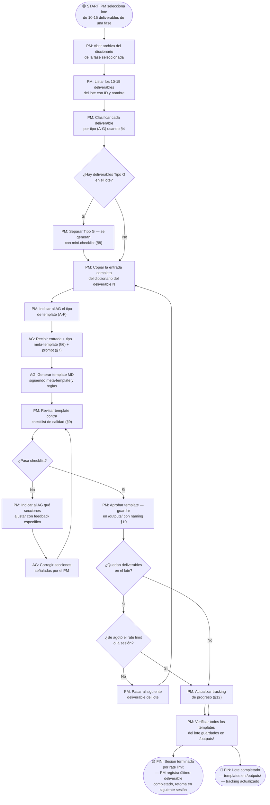

# SOP — Generación de Templates de Deliverables SDLC

**Proceso:** Transformar entradas del Diccionario de Deliverables en templates estandarizados para agentes VTT  
**Versión:** 1.0  
**Fecha:** 2026-05-14  
**Autor:** PM — Martin Rivas  
**Actores:** PM, Agente Generador (AG), Agente Ejecutor (AE)  
**Sistemas:** VTT, Repositorio Git, Diccionario de Deliverables

---

## Leyenda de Simbología

| Elemento | Forma | Uso |
|----------|-------|-----|
| Inicio / Fin | Cápsula | Un inicio, múltiples finales posibles |
| Paso de proceso | Rectángulo | Acción concreta con actor responsable |
| Decisión | Rombo | Bifurcación con salidas etiquetadas |
| Subproceso | Rectángulo doble borde | Referencia a otro proceso |
| Documento | Rectángulo base ondulada | Artefacto que se genera o consume |
| Nota contextual | Borde punteado | Regla de negocio o criterio |

---

## 1. Alcance

**Trigger de inicio:** El PM tiene el Diccionario de Deliverables completo (438 entradas) y necesita generar templates para que los agentes VTT produzcan deliverables estandarizados en proyectos reales.

**Condición de fin (éxito):** Cada deliverable del SDLC tiene su template en el repositorio, validado contra el checklist de calidad, listo para ser consumido por un agente VTT sin necesidad de consultar el diccionario ni al PM.

**Condición de fin (parcial):** Se completa un lote (1 fase) — los templates de esa fase están listos y se continúa con la siguiente en otra sesión.

**Condición de fin (rechazo):** La entrada del diccionario está incompleta (falta "Secciones esperadas" o "Criterio de completitud") — el PM completa la entrada del diccionario antes de generar el template.

---

## 2. Actores

| Actor | Tipo | Responsabilidad |
|-------|------|-----------------|
| **PM** | Humano | Ejecutor principal. Selecciona lotes, provee entradas del diccionario al AG, valida output, aprueba templates. |
| **AG (Agente Generador)** | Agente VTT | Recibe entradas del diccionario y produce templates MD siguiendo el meta-template y las reglas de este SOP. |
| **AE (Agente Ejecutor)** | Agente VTT | Consumidor futuro de los templates. Recibe un template + contexto de proyecto y produce el deliverable real. NO participa en la generación. |

---

## 3. Artefactos

| Artefacto | Tipo | Generado por | Consumido por |
|-----------|------|:------------:|:-------------:|
| Diccionario de Deliverables (40 archivos) | Input | PM (sesiones previas) | PM, AG |
| Entrada individual del diccionario (1 deliverable) | Input | PM (copia del diccionario) | AG |
| Este SOP | Referencia | PM | PM, AG |
| Meta-template (§6 de este SOP) | Referencia | PM | AG |
| **Template individual (.md)** | **Output** | **AG** | **AE** |
| Tracking de progreso (§12) | Control | PM | PM |
| Template verificación Tipo G (.md) | Output | AG | AE |

---

## 4. Clasificación de Deliverables por Tipo de Template

Antes de generar, el PM clasifica cada deliverable en uno de 7 tipos. El tipo determina la estructura del template.

| Tipo | Nombre | Descripción | Cantidad aprox. | Estructura del template |
|:----:|--------|-------------|:---------------:|------------------------|
| **A** | Documento | Análisis, diseño, plan, spec | ~150 | Secciones con prosa + tablas + instrucciones |
| **B** | Reporte | Resultados, métricas, assessment | ~60 | Tablas de datos + métricas + gráficos placeholder + assessment |
| **C** | Checklist / Sign-off | Verificación + aprobación formal | ~25 | Tabla ✅/❌ + sección de decisión + firma |
| **D** | Código / Config | Archivos de código o configuración | ~120 | Archivo del tipo (.yml, .json, .ts, .sh) con comentarios |
| **E** | Proceso / Guía | Proceso step-by-step, runbook | ~25 | Pasos numerados + decisiones + diagrama de flujo |
| **F** | Lista / Backlog | Items trackeados con clasificación | ~18 | Tabla estructurada + campos por item + reglas |
| **G** | Auto-generado | URLs, métricas, logs automáticos | ~40 | Mini-checklist de verificación (no template completo) |

### Regla de clasificación

El PM determina el tipo leyendo el campo **"Formato"** de la tabla de metadatos del diccionario:

| Si el formato dice... | Entonces es tipo... |
|----------------------|:-------------------:|
| MD, PDF, Documento, Report | A o B (A si es plan/design, B si es resultados) |
| Checklist, Sign-off | C |
| Docker, YAML, Shell, TypeScript, Jest, Config | D |
| Documento con "Process", "Guide", "Runbook" en el nombre | E |
| Lista, Jira, GitHub Issues, Backlog | F |
| URL, Métrica, Log, Verificación | G |

---

## 5. Diagrama de Flujo Principal



---

## 6. Meta-Template (Estructura Base)

Todo template generado sigue esta estructura. El AG la usa como esqueleto y la llena según la entrada del diccionario.

### 6.1 Para tipos A, B, E (Documentos, Reportes, Procesos)

```markdown
# {{DELIVERABLE_ID}} — {{DELIVERABLE_NAME}}

## Metadata

| Campo | Valor |
|-------|-------|
| **Proyecto** | {{PROJECT_NAME}} |
| **Fase** | {{PHASE}} |
| **Subfase** | {{SUBPHASE}} |
| **Versión** | 1.0 |
| **Fecha** | {{DATE}} |
| **Autor** | {{AUTHOR_ROLE}}: {{AUTHOR_NAME}} |
| **Aprobador** | {{APPROVER_ROLE}}: {{APPROVER_NAME}} |
| **Estado** | Borrador / En revisión / Aprobado |

## Control de versiones

| Versión | Fecha | Autor | Cambios |
|---------|-------|-------|---------|
| 1.0 | {{DATE}} | {{AUTHOR_NAME}} | Versión inicial |

---

## 1. {{SECTION_1_TITLE}}

<!-- INSTRUCCIÓN VTT:
- Qué escribir: {{INSTRUCTION_1}}
- Formato: {{FORMAT_1}} (prosa / tabla / lista / diagrama)
- Inputs necesarios: {{INPUTS_1}}
- Nivel de detalle: {{DETAIL_LEVEL_1}}
- NO hacer: {{ANTIPATTERN_1}}
-->

{{PLACEHOLDER_CONTENT_1}}

## 2. {{SECTION_2_TITLE}}

<!-- INSTRUCCIÓN VTT: ... -->

{{PLACEHOLDER_CONTENT_2}}

[... repite por cada sección de "Secciones esperadas" ...]

---

## Criterio de completitud

<!-- Este checklist se extrae directamente del diccionario -->

- [ ] {{CRITERION_1}}
- [ ] {{CRITERION_2}}
- [ ] {{CRITERION_N}}

---

## Aprobación

| Rol | Nombre | Fecha | Estado |
|-----|--------|-------|--------|
| {{AUTHOR_ROLE}} | {{AUTHOR_NAME}} | | Entregado |
| {{APPROVER_ROLE}} | {{APPROVER_NAME}} | | Pendiente |

## Referencias

- **Inputs:** {{INPUT_DELIVERABLES_LIST}}
- **Habilita:** {{SUCCESSOR_DELIVERABLES_LIST}}
- **Diccionario:** Entrada {{DELIVERABLE_ID}} del Diccionario de Deliverables SDLC v1.0
```

### 6.2 Para tipo C (Checklist / Sign-off)

```markdown
# {{DELIVERABLE_ID}} — {{DELIVERABLE_NAME}}

## Metadata
[Igual que 6.1]

---

## Checklist de verificación

| # | Criterio | Status | Evidencia | Notas |
|:-:|----------|:------:|-----------|-------|
| 1 | {{CRITERION_1}} | ⬜ | | |
| 2 | {{CRITERION_2}} | ⬜ | | |
| N | {{CRITERION_N}} | ⬜ | | |

## Resultado

- [ ] ✅ **APROBADO** — todos los criterios cumplidos
- [ ] ⚠️ **APROBADO CON CONDICIONES** — condiciones: ___
- [ ] ❌ **RECHAZADO** — criterios no cumplidos: ___

## Decisión y firma

| Rol | Nombre | Decisión | Fecha | Firma |
|-----|--------|----------|-------|-------|
| {{APPROVER_ROLE}} | {{APPROVER_NAME}} | | | |
```

### 6.3 Para tipo D (Código / Config)

```
# Archivo: {{FILENAME}}
# Deliverable: {{DELIVERABLE_ID}} — {{DELIVERABLE_NAME}}
# Generado por: VTT
# Fecha: {{DATE}}
# Proyecto: {{PROJECT_NAME}}
#
# INSTRUCCIONES:
# {{INSTRUCTION_GENERAL}}
#
# VARIABLES A CONFIGURAR:
# {{VARIABLE_1}} — {{DESCRIPTION_1}}
# {{VARIABLE_2}} — {{DESCRIPTION_2}}

{{FILE_CONTENT_WITH_COMMENTS}}
```

### 6.4 Para tipo F (Lista / Backlog)

```markdown
# {{DELIVERABLE_ID}} — {{DELIVERABLE_NAME}}

## Metadata
[Igual que 6.1]

---

## Registro

| # | {{COL_1}} | {{COL_2}} | {{COL_3}} | {{COL_4}} | {{COL_5}} | Status |
|:-:|-----------|-----------|-----------|-----------|-----------|:------:|
| 1 | {{EXAMPLE_1}} | | | | | ⬜ |

<!-- INSTRUCCIÓN VTT:
Agregar una fila por cada item. Campos:
- {{COL_1}}: {{DESCRIPTION_COL_1}}
- {{COL_2}}: {{DESCRIPTION_COL_2}}
- ...
Reglas de clasificación:
- {{CLASSIFICATION_RULE_1}}
- {{CLASSIFICATION_RULE_2}}
-->

## Resumen

| Métrica | Valor |
|---------|-------|
| Total items | {{COUNT}} |
| Por prioridad | Critical: __, High: __, Medium: __, Low: __ |
| Trend | {{TREND}} |
```

### 6.5 Para tipo G (Verificación — mini-checklist)

```markdown
# {{DELIVERABLE_ID}} — {{DELIVERABLE_NAME}} ✓

## Verificación

| Campo | Valor |
|-------|-------|
| **Proyecto** | {{PROJECT_NAME}} |
| **Fecha** | {{DATE}} |
| **Verificado por** | {{VERIFIER}} |

| # | Criterio | Status | Evidencia |
|:-:|----------|:------:|-----------|
| 1 | {{CRITERION_1}} | ⬜ | |
| 2 | {{CRITERION_2}} | ⬜ | |

**Resultado:** ✅ Verificado / ❌ No cumple
```

---

## 7. Prompt para el Agente Generador (AG)

El PM copia este prompt al inicio de cada sesión de generación. Después, por cada deliverable, solo pega la entrada del diccionario.

### 7.1 Prompt de inicio de sesión

```
CONTEXTO:
Eres un agente especializado en generar templates estandarizados para 
deliverables de un SDLC de 8 fases.

Tu output: templates MD que otro agente VTT usará para producir 
deliverables reales de proyectos. Cada template debe ser auto-contenido 
— el agente que lo use NO tendrá acceso al diccionario.

REGLAS:
1. Seguir el meta-template exacto según el tipo (A-G) — ver §6 del SOP
2. Cada sección H2 lleva un comentario HTML con instrucciones para el VTT
3. Las instrucciones deben ser específicas y accionables
4. Usar {{VARIABLES}} para todo lo project-specific
5. Incluir placeholder de contenido que muestre la estructura esperada
6. Incluir el "Criterio de completitud" del diccionario como checklist
7. Incluir anti-patrones como warnings en las instrucciones
8. El template debe ser parseable por un script (estructura consistente)

FORMATO DEL ARCHIVO:
- Nombre: {{ID}}_{{name-kebab-case}}.md
- Encoding: UTF-8
- Headers: H1 para título, H2 para secciones, H3 para sub-secciones

SESIÓN DE HOY:
Voy a generar templates para los deliverables: [LISTA DE IDs].
Te paso la entrada del diccionario de cada uno, junto con su tipo (A-G).
Genera el template y guárdalo en /mnt/user-data/outputs/.

¿Listo? Te paso el primero.
```

### 7.2 Prompt por deliverable

```
DELIVERABLE: {{ID}} — {{NAME}}
TIPO: {{TIPO}} (A/B/C/D/E/F/G)

ENTRADA DEL DICCIONARIO:
[PEGAR ENTRADA COMPLETA DEL DICCIONARIO — desde la tabla de metadatos 
hasta el Template]

Genera el template siguiendo el meta-template tipo {{TIPO}} del SOP.
Guárdalo como: {{ID}}_{{name-kebab}}.md
```

---

## 8. Prompt para el Agente Ejecutor (AE) — Uso futuro

Este prompt se usa cuando un AE necesita producir un deliverable real usando un template.

```
CONTEXTO:
Eres un {{ROLE}} trabajando en el proyecto {{PROJECT_NAME}}.
Necesitas producir el deliverable {{DELIVERABLE_ID}} — {{DELIVERABLE_NAME}}.

TEMPLATE:
[Se inyecta el template generado]

INPUTS DEL PROYECTO:
[Se inyectan los deliverables previos que este deliverable necesita]

PROYECTO:
- Nombre: {{PROJECT_NAME}}
- Dominio: {{DOMAIN_CONTEXT}}
- Stack: {{TECH_STACK}}

TAREA:
1. Lee las instrucciones en comentarios HTML de cada sección
2. Llena cada sección con información real del proyecto
3. Reemplaza todas las {{VARIABLES}} con valores reales
4. Elimina los comentarios HTML del output final
5. Verifica contra el "Criterio de completitud" al final

CONSTRAINTS:
- Cada sección debe cumplir los criterios documentados
- Evitar los anti-patrones advertidos en las instrucciones
- El documento debe ser auto-contenido
- Datos reales, no placeholders genéricos

SALIDA:
Deliverable completo en MD, listo para revisión por {{APPROVER}}.
```

---

## 9. Checklist de Calidad del Template

El PM ejecuta este checklist por cada template generado antes de aprobarlo.

### 9.1 Estructura

- [ ] Header H1 con ID y nombre del deliverable
- [ ] Tabla de metadata completa (proyecto, fase, subfase, versión, fecha, autor, aprobador, estado)
- [ ] Tabla de control de versiones
- [ ] Todas las secciones de "Secciones esperadas" del diccionario presentes como H2
- [ ] Sección "Criterio de completitud" con checklist del diccionario
- [ ] Sección "Aprobación" con tabla de firma
- [ ] Sección "Referencias" con inputs y successors

### 9.2 Instrucciones VTT

- [ ] Cada sección H2 tiene comentario HTML con instrucciones
- [ ] Las instrucciones dicen QUÉ escribir (no solo el título de la sección)
- [ ] Las instrucciones dicen EN QUÉ FORMATO (prosa, tabla, lista, diagrama)
- [ ] Las instrucciones dicen QUÉ INPUTS NECESITA (deliverables previos referenciados)
- [ ] Las instrucciones incluyen al menos 1 anti-patrón como warning
- [ ] Las instrucciones son suficientes para que un agente sin contexto genere output de calidad

### 9.3 Placeholders

- [ ] Cada sección tiene placeholder de contenido (no está vacía)
- [ ] Los placeholders muestran la ESTRUCTURA esperada (tabla con headers, lista con bullets)
- [ ] Todas las variables usan formato {{VARIABLE_NAME}}
- [ ] No hay texto project-specific hardcoded (todo es {{VARIABLE}})

### 9.4 Consistencia

- [ ] El tipo de template (A-G) es correcto para este deliverable
- [ ] El meta-template correspondiente se siguió correctamente
- [ ] El naming del archivo sigue la convención: {{ID}}_{{name-kebab}}.md
- [ ] El formato es consistente con los templates ya generados de la misma fase

### 9.5 Criterios de rechazo

El PM rechaza el template si cualquiera es verdadera:

- Falta una sección del diccionario
- Alguna sección no tiene instrucción VTT
- Las instrucciones son genéricas ("describe esta sección") en vez de específicas
- No hay placeholders de estructura
- El template no es auto-contenido (asume que el agente tiene acceso al diccionario)

---

## 10. Naming Convention y Estructura de Carpetas

### Naming de archivos

```
{{DELIVERABLE_ID}}_{{deliverable-name-kebab-case}}.md
```

Ejemplos:
- `5.1.1_test-plan.md`
- `4.1.1_docker-compose.yml`
- `3A.2.1_personas-document.md`
- `6.4.3_smoke-test-signoff.md`

### Estructura de carpetas

```
templates/
├── fase-00-discovery/
├── fase-01-planning/
├── fase-02-analysis/
├── fase-03a-design-ux/
├── fase-03b-design-technical/
├── fase-04-development/
│   ├── documents/     ← tipos A, B, E, F
│   └── code/          ← tipo D
├── fase-05-testing/
├── fase-06-deploy/
│   ├── documents/
│   └── code/
├── fase-07-operations/
└── _verificaciones/   ← tipo G (mini-checklists)
```

---

## 11. Plan de Ejecución

### Orden de generación (por valor de uso del VTT)

| Prioridad | Fase | Deliverables | Templates reales | Sesiones est. |
|:---------:|------|:------------:|:----------------:|:-------------:|
| 1 | 4 Development | 78 | ~70 | 4-5 |
| 2 | 3B Technical Design | 73 | ~70 | 4-5 |
| 3 | 3A UX/UI Design | 72 | ~65 | 4-5 |
| 4 | 5 Testing | 52 | ~45 | 3 |
| 5 | 2 Analysis | 47 | ~45 | 3 |
| 6 | 6 Deploy | 38 | ~30 | 2 |
| 7 | 1 Planning | 33 | ~32 | 2 |
| 8 | 7 Operations | 23 | ~20 | 1-2 |
| 9 | 0 Discovery | 22 | ~22 | 1-2 |
| | **TOTAL** | **438** | **~400** | **~25** |

### Ritmo

| Modo | Templates/sesión | Sesiones/día | Días totales |
|------|:----------------:|:------------:|:------------:|
| Agresivo | 15-20 | 2 | ~13 días |
| Normal | 10-15 | 1 | ~25 días |
| Conservador | 8-10 | 1 cada 2 días | ~40 días |

### Proceso por sesión

1. PM abre diccionario de la fase del lote
2. PM ejecuta prompt de inicio de sesión (§7.1)
3. Por cada deliverable:
   a. PM pega entrada del diccionario + tipo (§7.2)
   b. AG genera template
   c. PM valida contra checklist (§9)
   d. Si pasa → guardar. Si no → feedback → re-generar
4. Al cerrar sesión: actualizar tracking (§12)

---

## 12. Tracking de Progreso

El PM actualiza esta tabla al final de cada sesión.

| Fase | Total | Tipo G | Templates | Generados | Pendientes | % | Última sesión |
|------|:-----:|:------:|:---------:|:---------:|:----------:|:-:|:-------------:|
| 0 Discovery | 22 | ~2 | ~20 | 0 | 20 | 0% | — |
| 1 Planning | 33 | ~1 | ~32 | 0 | 32 | 0% | — |
| 2 Analysis | 47 | ~2 | ~45 | 0 | 45 | 0% | — |
| 3A Design UX | 72 | ~7 | ~65 | 0 | 65 | 0% | — |
| 3B Design Tech | 73 | ~3 | ~70 | 0 | 70 | 0% | — |
| 4 Development | 78 | ~8 | ~70 | 0 | 70 | 0% | — |
| 5 Testing | 52 | ~7 | ~45 | 0 | 45 | 0% | — |
| 6 Deploy | 38 | ~8 | ~30 | 0 | 30 | 0% | — |
| 7 Operations | 23 | ~3 | ~20 | 0 | 20 | 0% | — |
| **TOTAL** | **438** | **~41** | **~397** | **0** | **397** | **0%** | — |

---

## 13. Notas Contextuales

### 13.1 Regla de oro

> El template debe permitir a un agente VTT producir el deliverable completo **sin consultar el diccionario, sin preguntar al PM, y sin inventar la estructura**. Si el agente necesita adivinar qué secciones incluir o qué formato usar, el template está incompleto.

### 13.2 Primer template de cada tipo

El primer template generado de cada tipo (A-G) requiere más tiempo porque establece el patrón. Una vez aprobado el primero, los siguientes del mismo tipo se generan más rápido porque el AG ya entendió el formato.

**Recomendación:** En la primera sesión, generar 1 template de cada tipo (A-F) como "template piloto" y validarlo antes de producir en masa.

### 13.3 Templates de código (Tipo D)

Los templates tipo D son archivos reales (.yml, .json, .ts, .sh), no markdown. Son project-specific por naturaleza — el template es un starter file con:
- Comentarios explicativos en cada sección
- Variables de configuración marcadas con `{{VARIABLE}}`
- Estructura base funcional (no un archivo vacío)
- Ejemplo de valores para cada variable

### 13.4 Deliverables con dependencia fuerte

Algunos templates referencian outputs de otros deliverables como input. El AG debe incluir en las instrucciones: "Para llenar esta sección, consulta el deliverable {{INPUT_ID}} — {{INPUT_NAME}}". El AE recibirá ese deliverable como contexto al momento de ejecutar.

### 13.5 Cuándo NO generar template

- El deliverable es un subset de otro (e.g., 5.2.2 Test Case IDs es parte de 5.2.1 Test Cases Document)
- El deliverable es un valor simple (URL, métrica) → usar Tipo G mini-checklist
- El deliverable es idéntico a otro con diferente nombre → generar 1 y referenciar

---

## 14. Glosario

| Término | Definición |
|---------|-----------|
| **AG** | Agente Generador — el agente VTT que produce templates a partir del diccionario |
| **AE** | Agente Ejecutor — el agente VTT que usa templates para producir deliverables reales |
| **Diccionario** | Diccionario de Deliverables SDLC — 438 entradas con metadata, descripción, secciones, y criterios |
| **Meta-template** | Estructura base (§6) que define cómo se ve un template según su tipo |
| **Template** | Archivo MD/código que el AE recibe como input para producir un deliverable |
| **Deliverable** | Artefacto concreto que se produce en un proyecto (documento, código, reporte, checklist) |
| **Tipo A-G** | Clasificación de deliverables por estructura de template (§4) |
| **Placeholder** | Contenido de ejemplo en el template que muestra la estructura esperada |
| **{{VARIABLE}}** | Marcador que el AE reemplaza con datos reales del proyecto |
| **Instrucción VTT** | Comentario HTML en el template que guía al AE sobre qué y cómo escribir |
| **Lote** | Grupo de 10-15 deliverables que se procesan en una sesión |
| **Sesión** | Una ejecución del proceso de generación (limitada por rate limit del agente) |

---

**Documento:** SOP_GENERACION_TEMPLATES_SDLC.md  
**Versión:** 1.0  
**Fecha:** 2026-05-14  
**Estado:** Aprobado para ejecución
