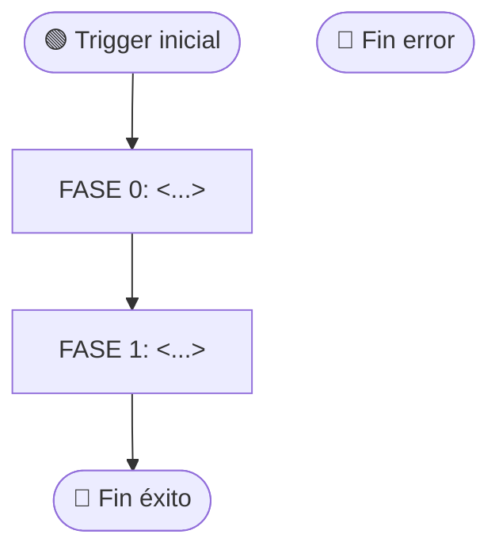

# TEMPLATE_PROTOCOL — Molde para crear un Protocol nuevo (Nivel 4)

> **Cómo usar:** copia este archivo a `02.normativa/01.Protocols/` con nombre `VTT.PROTOCOL-<CAT>-<NNN>_<titulo_snake_case>.md`. Reemplaza los placeholders `<...>`. Borra esta sección de instrucciones antes de publicar.
>
> **Antes de empezar:** verifica que es realmente un Protocol (Nivel 4 — proceso de negocio end-to-end, multi-fase, multi-rol, con decisiones). Si no, ver TEMPLATE_WORKFLOW (Nivel 3) o TEMPLATE_SKILL (Nivel 2).
>
> **Referencias:**
> - `02.normativa/README.md` §3 — Tabla decisoria de niveles
> - `02.normativa/README.md` §5 — Estructura obligatoria del Protocol
> - `02.normativa/GUIA_AUTOR.md` — Cómo decidir + anti-patterns
> - Ejemplo real: `VTT.PROTOCOL-ASG-001_ciclo_asignacion_tarea.md`

---

# VTT.PROTOCOL-<CAT>-<NNN> — <Título descriptivo>

| Campo | Valor |
|---|---|
| **Código** | `VTT.PROTOCOL-<CAT>-<NNN>` |
| **Título** | <título completo> |
| **Versión** | 1.0.0 |
| **Fecha** | YYYY-MM-DD |
| **Autor** | <Nombre + rol> |
| **Aplica a** | <roles afectados separados por coma> |
| **Estado** | Borrador / Aprobado / Deprecated |
| **Tipo** | Genérico VTT — aplica a cualquier proyecto / Instancia |
| **Reglas aplicables (Nivel 0)** | Ver `00.Rules/rules_catalog.json` — `query_rules.py --simulate-task <ID>` |

---

## Tabla de Contenido

1. [Propósito](#1-propósito)
2. [Campo de Aplicación](#2-campo-de-aplicación)
3. [Responsabilidades](#3-responsabilidades)
4. [Definiciones](#4-definiciones)
5. [Procedimiento](#5-procedimiento)
6. [Referencias Cruzadas](#6-referencias-cruzadas)
7. [Resumen de Revisiones](#7-resumen-de-revisiones)
8. [Anexos](#anexos)

---

## 1. Propósito

<1-2 párrafos. Responder:>
- ¿Qué proceso normativo se establece?
- ¿Por qué existe? ¿Qué problema operativo resuelve?
- ¿Cuál es el output principal del proceso completo?

> **Ejemplo:** "Establecer el proceso normativo completo para asignar tareas a agentes, ejecutarlas, revisarlas y cerrarlas en VTT bajo el modelo dinámico V4 con trazabilidad completa de TrackableItems, evidencias y devlog."

---

## 2. Campo de Aplicación

**Aplica a:**
- <Proyectos donde aplica — usualmente "cualquier proyecto VTT">
- <Fases del SDLC donde aplica — usualmente "cualquier fase">
- <Sprints / contextos específicos>
- <Roles ejecutores que pueden iniciarlo>

**No aplica a:**
- <Procesos que aunque parezcan similares, son cubiertos por otros Protocols>
- <Casos límite que no entran en el alcance>

---

## 3. Responsabilidades

### 3.1 <Rol A — ej. PM>
- <Responsabilidad concreta 1>
- <Responsabilidad concreta 2>

### 3.2 <Rol B — ej. TL>
- <...>

### 3.3 <Rol C — ej. Agente ejecutor>
- <...>

> **Tip:** define responsabilidades por rol, no por persona. Listar acciones concretas, no roles genéricos ("responsable de calidad" → mal; "verifica los CAs en VTT antes de mover a `task_completed`" → bien).

---

## 4. Definiciones

Glosario de términos clave usados en este Protocol. Si un término ya está definido en el Glosario maestro (`02.normativa/README.md` §13), no repetirlo aquí — solo referenciar.

**<Término 1>**: <definición concisa>

**<Término 2>**: <definición concisa>

**<Acrónimo>**: <expansión completa + 1 línea de contexto>

> **Tip:** Si tienes más de ~10 definiciones, considera mover algunas al glosario maestro y dejar solo las específicas de este Protocol.

---

## 5. Procedimiento

El proceso completo tiene **<N>** pasos organizados en **<M>** fases secuenciales + **<K>** sub-ciclos opcionales (si aplica).

```
FASE 0   →  FASE 1   →  FASE 2   →  ...
<nombre>   <nombre>    <nombre>
```

### 5.0 FASE 0 — <Nombre de la fase>

> **Trigger de inicio:** <qué evento dispara esta fase>

5.0.1 <Paso> → **[ACTIVIDAD | PROCESO | DECISIÓN]** → invoca `VTT.WORKFLOW-<CAT>-<NNN>.001` (si es PROCESO)

5.0.2 <Paso> → **[ACTIVIDAD]** → invoca `SKL-<CAT>-<NNN>` (si es ACTIVIDAD simple con skill)

5.0.3 ¿<Pregunta de decisión>? → **[DECISIÓN]**
- **SÍ** → continuar al paso 5.0.4
- **NO** → <consecuencia: STOP / escalar / loop>

### 5.1 FASE 1 — <Nombre>

5.1.1 <...>

### 5.2 FASE 2 — <Nombre>

<...>

> **Convención de marcado:**
> - **[ACTIVIDAD]** = acción discreta y guiada. Invoca una Skill directamente.
> - **[PROCESO]** = subproceso con sub-pasos. Invoca un Workflow.
> - **[DECISIÓN]** = bifurcación con sí/no o casos.

---

## 6. Referencias Cruzadas

### Workflows derivados del Protocol (Nivel 3 — Sub-procesos)

| Código | Título | Invocado en |
|---|---|---|
| `VTT.WORKFLOW-<CAT>-<NNN>.001` | <título> | §5.0.1 |
| `VTT.WORKFLOW-<CAT>-<NNN>.002` | <título> | §5.1.2 |
| ... | | |

### Skills referenciadas (Nivel 2)

| Código | Uso |
|---|---|
| `SKL-AUTH-01` | Obtener JWT en cualquier paso |
| `SKL-XXX-NNN` | <uso> |

### Templates referenciados

| Código | Uso |
|---|---|
| `TEMPLATE_<XXX>.md` | <cuándo se usa> |

### Protocols relacionados

| Protocol | Relación |
|---|---|
| `VTT.PROTOCOL-<CAT>-<NNN>` | <upstream / downstream / paralelo> |

### Documentos de soporte

| Documento | Uso |
|---|---|
| `<path>` | <para qué> |

### Reglas Nivel 0 aplicables

Reglas del catálogo `rules_catalog.json` que cualquier ejecución de este Protocol DEBE respetar:

| Regla | Aplica en |
|---|---|
| `RULE-XXX-NNN` <título> | §<X.Y> |

> Lista completa: ejecutar `query_rules.py --simulate-task <TASK_ID>` con el contexto del Protocol.

---

## 7. Resumen de Revisiones

| Versión | Fecha | Editor | Cambios |
|---|---|---|---|
| 1.0.0 | YYYY-MM-DD | <Nombre> | Versión inicial. <Resumen breve de qué cubre>. |

> **Política de versionado** (SemVer):
> - **Major (X.0.0)** — cambio incompatible (agregar fase obligatoria, cambiar contratos)
> - **Minor (1.X.0)** — funcionalidad nueva compatible (paso opcional adicional)
> - **Patch (1.2.X)** — aclaración, fix de typos, ejemplos

---

## Anexos

### Anexo A — Diagrama de flujo end-to-end (mermaid)



### Anexo B — <otros anexos según aplique>

Ejemplos:
- Inputs genéricos por fase del SDLC
- Inventario de templates referenciados
- Inventario de Workflows derivados con status
- Diagrama upstream (origen del trigger)
- Checklist de calidad
- Métricas del Protocol

---

| Editor | Dueño | Última Actualización |
|---|---|---|
| <Nombre + rol> | <Nombre + rol> | YYYY-MM-DD |

**Versión:** 1.0.0 — <descripción corta>
**Estado:** Borrador

*Versión más reciente en `virtual-teams-setup`. No controlada si se imprime.*
