# PNO — Procedimiento Normalizado de Operación

| Campo | Valor |
|-------|-------|
| **Código** | SOP-LD-01 |
| **Título** | Living Documents: Documentos Vivos en Proyectos de Software |
| **Versión** | 2.0 |
| **Fecha** | 2026-05-12 |
| **Autor** | Martin Rivas |
| **Aplica a** | TL, Agente (BE / DB / DO / QA), PJM — cualquier proyecto que use VTT con catálogo SDLC |
| **Tipo** | SOP genérico — base para VTT. Cada proyecto crea su propio catálogo de LDs. |

---

## Tabla de Contenido

1. [Propósito](#10-propósito)
2. [Campo de Aplicación](#20-campo-de-aplicación)
3. [Responsabilidades](#30-responsabilidades)
4. [Definiciones](#40-definiciones)
5. [Procedimiento](#50-procedimiento)
   - 5.1 [Setup del catálogo de LDs](#51-setup-del-catálogo-de-lds-una-vez-por-proyecto)
   - 5.2 [Ciclo por tarea](#52-ciclo-por-tarea)
   - 5.3 [Cierre de sprint](#53-cierre-de-sprint)
6. [Diagrama de Flujo](#60-diagrama-de-flujo)
7. [Referencias Cruzadas](#70-referencias-cruzadas)
8. [Resumen de Revisiones](#80-resumen-de-revisiones)
9. [Anexos](#anexos)

---

## 1.0 Propósito

El propósito de este procedimiento es establecer los pasos para mantener sincronizados los documentos técnicos de un proyecto de software con el estado real del sistema durante la fase de desarrollo.

En proyectos con equipos de agentes IA, los documentos técnicos se generan al inicio del proyecto (Fase de Diseño Técnico: ERD, API spec, schema de BD, etc.) y frecuentemente **no se actualizan** cuando el código cambia. Cuando el equipo necesita consultar el estado actual del sistema, los documentos reflejan el diseño original, no la implementación real.

Este SOP define un mecanismo simple: ciertos documentos son **vivos** — su actualización es parte obligatoria del cierre de cada tarea que los impacta, no una actividad separada.

## 2.0 Campo de Aplicación

Este procedimiento aplica para:

- Cualquier proyecto de software gestionado en VTT que cuente con una Fase de Diseño Técnico (equivalente a Fase 3B).
- Todos los sprints de desarrollo activo (equivalente a Fase 4 en adelante).
- Todos los roles que generan entregables técnicos: Tech Lead, Backend Engineer, Database Engineer, DevOps Engineer.

No aplica para:
- Documentos inmutables post-aprobación (wireframes, ADRs individuales, análisis de requerimientos).
- Sprints exclusivos de discovery o análisis (Fases 0–2).

## 3.0 Responsabilidades

3.1 Es responsabilidad del **Tech Lead (TL)** ejecutar el setup del catálogo de Living Documents al inicio de Fase 4, incluir los checklist de LDs en los ASSIGNMENTS, verificar en cada review que los LDs fueron actualizados, y rechazar tareas donde falten actualizaciones.

3.2 Es responsabilidad del **Tech Lead (TL)** y el **Project Manager (PJM)** revisar el estado de los LDs al cierre de cada sprint y validar que reflejan el estado real del sistema antes de firmar.

3.3 El **Agente Ejecutor** (BE, DB, DO, QA) debe identificar qué Living Documents impacta su tarea, actualizarlos en el mismo commit que el código, registrar el impacto en VTT, y declararlo en el reporte de entrega.

3.4 **VTT** (sistema) genera automáticamente los Review Gates y Document Impacts que permiten al TL verificar el cumplimiento.

## 4.0 Definiciones

**Living Document (LD):** Documento técnico que fue creado en la Fase de Diseño Técnico como especificación inicial y que debe mantenerse sincronizado con el código durante toda la Fase de Desarrollo. Es fuente de verdad del estado actual del sistema.

**Documento estático:** Documento creado en Fases de análisis o diseño que es inmutable post-aprobación. Refleja la intención original, no el estado actual.

**Nivel 1 — Alta frecuencia:** LDs que cambian en prácticamente toda tarea de implementación activa. Si al cierre de un sprint un LD de Nivel 1 no fue actualizado, es señal de falla en el proceso.

**Nivel 2 — Frecuencia media:** LDs que cambian solo cuando una tarea específicamente los impacta. La actualización es obligatoria cuando aplica, pero no en todas las tareas.

**Nivel 3 — Baja frecuencia:** LDs que describen decisiones fundacionales. Solo cambian ante decisiones arquitectónicas mayores. Requieren aprobación del PJM antes de modificarse.

**Document Impact:** Registro en VTT (`POST /api/tasks/{id}/impacts`) que documenta qué LD fue modificado, por qué, y qué cambió. Es parte del reporte de entrega del agente.

**Catálogo de LDs:** Archivo `LIVING_DOCUMENTS_[PROYECTO].md` creado por el TL al inicio de Fase 4 con la tabla de todos los LDs del proyecto, sus niveles, rutas exactas y ownership por rol.

**Review Gate:** Mecanismo de VTT que bloquea el avance de una tarea hasta que todos los Acceptance Criteria marcados como `required: true` estén en estado `met`. Incluye los CAs de actualización de LDs.

---

## 5.0 Procedimiento

### 5.1 Setup del catálogo de LDs — una vez por proyecto

**Gatillo:** Inicio de Fase 4 (primer sprint de desarrollo activo).  
**Responsable:** Tech Lead.  
**Duración estimada:** 2–3 horas.

| Actividad | PJM | TL | VTT |
|-----------|-----|----|-----|
| Autoriza inicio de Fase 4 | ✅ | | |
| Lista todos los entregables de Fase 3B generados | | ✅ | |
| Aplica filtro de vivacidad a cada documento | | ✅ | |
| Asigna nivel (1/2/3) y ownership a cada LD | | ✅ | |
| Crea archivo `LIVING_DOCUMENTS_[PROYECTO].md` | | ✅ | |
| Actualiza template de ASSIGNMENT con sección de LDs | | ✅ | |
| Registra el catálogo como ProjectDocument en VTT | | ✅ | 🔄 |
| Comunica al equipo qué LDs existen y quién los mantiene | | ✅ | |

5.1.1 El TL lista todos los documentos generados en la Fase de Diseño Técnico (ERD, schema de BD, API contract, infrastructure plan, security plan, component diagram, etc.).

5.1.2 Para cada documento, el TL aplica el filtro de vivacidad: "¿Cuando el equipo implemente código, este documento quedará desactualizado si no se modifica?" Si la respuesta es Sí → es un Living Document. Si es No → es un documento estático, no se modifica.

5.1.3 Para cada LD identificado, el TL asigna el nivel de frecuencia:

```
¿Con qué frecuencia cambia este documento?
  En prácticamente toda tarea de implementación → Nivel 1
  Solo en tareas que específicamente lo impactan → Nivel 2
  Solo ante decisiones arquitectónicas mayores → Nivel 3
```

5.1.4 El TL asigna el ownership según el área que genera los cambios:

| Área | Rol responsable | LDs típicos |
|------|----------------|-------------|
| Base de datos | DB Engineer | Schema Prisma, ERD, índices, diccionario de datos |
| Backend / API | Backend Engineer | OpenAPI spec, endpoints list, error codes, ejemplos request/response |
| Infraestructura | DevOps Engineer | Env matrix, server specs |
| Arquitectura | Tech Lead | Component diagram, decision log, folder structure, security plan |

5.1.5 El TL crea el archivo `LIVING_DOCUMENTS_[PROYECTO].md` en `00-agent-setup/06.Documentos_soporte/` con la tabla de LDs. Ver formato en Anexo 1.

5.1.6 El TL actualiza el template de ASSIGNMENT para incluir la sección de Living Documents. Ver formato en Anexo 2. A partir de este momento, todo ASSIGNMENT generado por el TL debe incluir esta sección.

---

### 5.2 Ciclo por tarea

**Gatillo:** El PJM crea una tarea en VTT y el TL genera el ASSIGNMENT.  
**Responsables:** TL (generación y review), Agente ejecutor (implementación y actualización).

| Actividad | PJM | TL | Agente (BE/DB/DO) | VTT |
|-----------|-----|----|--------------------|-----|
| Crea tarea en VTT con CAs de LDs | ✅ | | | 🔄 |
| Genera ASSIGNMENT con sección de LDs aplicables | | ✅ | | |
| Lee ASSIGNMENT y el catálogo de LDs | | | ✅ | |
| Implementa el código | | | ✅ | |
| Identifica qué LDs impacta la tarea | | | ✅ | |
| Actualiza LDs en el MISMO commit que el código | | | ✅ | |
| Registra Document Impact en VTT | | | ✅ | 🔄 |
| Marca CA "LD-XX actualizado" como `met` | | | ✅ | 🔄 |
| Verifica Review Gate antes de mover a in_review | | | ✅ | 🔄 |
| Entrega reporte con sección Document Impacts | | | ✅ | |
| Revisa LDs como parte del review (SKL-TASK-05) | | ✅ | | |
| Aprueba (APR-TL con "LDs verificados ✅") | | ✅ | | |
| Rechaza si falta actualización de LD obligatorio | | ✅ | | |

5.2.1 El TL genera el ASSIGNMENT incluyendo la sección de Living Documents con los LDs que aplican a esa tarea según su tipo (DB, BE, DO). Ver Anexo 2 para el formato.

5.2.2 El Agente lee el ASSIGNMENT completo, incluyendo la sección de Living Documents, antes de comenzar la implementación.

5.2.3 El Agente implementa el código de la tarea.

5.2.4 Al concluir la implementación, el Agente identifica cuáles LDs del catálogo fueron impactados por su tarea. Para cada LD:

```
¿Esta tarea creó, modificó o eliminó algo que este LD describe?
  Sí → el LD debe actualizarse en este commit
  No → declarar "Sin impacto" en el reporte
```

5.2.5 Si la tarea impacta LDs de Nivel 1 (alta frecuencia), la actualización es **siempre obligatoria**. No hay excepción.

5.2.6 Si la tarea impacta LDs de Nivel 2 (frecuencia media), el Agente evalúa si su tarea específicamente modificó el aspecto que ese LD describe. Si sí → actualizar. Si no → declarar "Sin impacto" con justificación.

5.2.7 El Agente actualiza los LDs identificados. **Regla crítica:** La actualización va en el **mismo commit** que el código. Nunca en un commit separado posterior.

5.2.8 El Agente registra cada LD modificado como Document Impact en VTT:

```bash
curl -s -X POST "$VTT_BASE_URL/api/tasks/$TASK_ID/impacts" \
  -H "Content-Type: application/json" \
  -H "Authorization: Bearer $TOKEN" \
  -d "{
    \"type\": \"modified\",
    \"description\": \"[LD-01] schema_prisma.md: agregado modelo Payment con campos amount, currency, status. Ver migración 0005_add_payments.\"
  }"
```

5.2.9 El Agente marca el CA correspondiente como `met` en VTT:

```bash
curl -s -X PATCH "$VTT_BASE_URL/api/tasks/$TASK_ID/acceptance-criteria/$CA_ID" \
  -H "Content-Type: application/json" \
  -H "Authorization: Bearer $TOKEN" \
  -d "{\"status\": \"met\"}"
```

5.2.10 El Agente verifica que el Review Gate esté en estado 🟢 antes de mover la tarea a `task_in_review`. Si el gate está 🔴, resuelve los blockers primero.

5.2.11 El Agente entrega el reporte de tarea (SKL-REPORT-01) incluyendo la sección "Document Impacts" con tabla de LDs modificados y descripción del cambio. Si no hubo impacto, declarar explícitamente: "Sin Living Documents impactados en esta tarea."

5.2.12 El TL revisa la tarea según SKL-TASK-05, verificando en Paso 3.5:

```
¿La tarea impactó algún LD de Nivel 1 o 2?
  → Revisar "Document Impacts" del reporte del Agente
  → Comparar contra catálogo LIVING_DOCUMENTS_[PROYECTO].md

Si actualizó correctamente → incluir en APR-TL: "LDs verificados: LD-01 ✅, LD-03 ✅"
Si falta alguno → RECHAZAR: "Falta actualizar [LD-XX] — [nombre del archivo]"
```

5.2.13 Si el TL detecta que un cambio en la tarea implica actualización de LDs de Nivel 2 o 3 que son de su ownership (component diagram, decision log), el TL los actualiza y registra el cambio como devlog tipo `decision` en VTT antes de aprobar la tarea.

---

### 5.3 Cierre de sprint

**Gatillo:** El sprint llega a su fecha de cierre y el TL debe firmar en VTT (Firma Nivel 2).  
**Responsables:** TL (verificación y firma), AR / QA (revisión de calidad si aplica).

| Actividad | TL | AR | QA | VTT |
|-----------|----|----|----|-----|
| Verifica que todos los LDs de Nivel 1 estén actualizados | ✅ | | | |
| Verifica LDs de Nivel 2 impactados en el sprint | ✅ | | | |
| Revisa consistencia arquitectónica de LDs modificados | | ✅ | | |
| Valida que LDs de testing/QA reflejan estado real | | | ✅ | |
| Registra observaciones antes de firma | ✅ | | | |
| Firma el sprint (Nivel 2) | ✅ | | | 🔄 |
| Sprint queda disponible para firma Nivel 3 (PM/Release) | | | | 🔄 |

5.3.1 Al cierre del sprint, el TL ejecuta el checklist de verificación de LDs (ver Anexo 3 para tabla de señales de falla):

```
[ ] Todos los LDs de Nivel 1 reflejan el estado real del sistema al final del sprint
[ ] Ningún LD de Nivel 2 que fue impactado en el sprint quedó sin actualizar
[ ] Los LDs de Nivel 3 solo fueron modificados con aprobación del PJM
[ ] Todas las actualizaciones están registradas como Document Impacts en VTT
```

5.3.2 Si el TL detecta un LD de Nivel 1 desactualizado al cierre del sprint, **no puede firmar** hasta corregirlo. Asigna la corrección al agente responsable con prioridad urgente.

5.3.3 Si el TL detecta un LD de Nivel 2 o 3 que debió actualizarse pero no lo fue, abre una tarea de corrección antes de la firma del sprint.

5.3.4 El AR (Arquitecto, si el proyecto cuenta con este rol) valida la consistencia arquitectónica de los LDs de Nivel 2 modificados durante el sprint (component diagram, decision log, integration points).

5.3.5 Una vez que el checklist está completo y sin observaciones, el TL firma el sprint en VTT (Firma Nivel 2). El sprint queda disponible para la firma del PJM (Nivel 3) y, si aplica, del Release Manager (Nivel 4).

---

## 6.0 Diagrama de Flujo

```mermaid
flowchart TD
    %% ─────────────────────────────────────────
    %% SETUP — Una vez por proyecto
    %% ─────────────────────────────────────────
    subgraph SETUP["⚙️ SETUP — Una vez por proyecto (§5.1)"]
        direction TB
        A([Inicio Fase 4\nPJM autoriza]) --> B[TL lista entregables\nde Fase 3B]
        B --> C[TL aplica filtro\nde vivacidad\n¿Cambia con el código?]
        C --> D[TL asigna nivel\n1 / 2 / 3\ny ownership por rol]
        D --> E[(Catálogo\nLIVING_DOCUMENTS_PROYECTO.md\ncreado)]
        E --> F[TL actualiza template\nde ASSIGNMENT\ncon sección de LDs]
    end

    %% ─────────────────────────────────────────
    %% CICLO POR TAREA (§5.2)
    %% ─────────────────────────────────────────
    subgraph TAREA["🔄 CICLO POR TAREA (§5.2)"]
        direction TB
        G([PJM crea tarea\nen VTT]) --> H[TL genera ASSIGNMENT\ncon LDs aplicables]
        H --> I[Agente implementa\nel código]
        I --> J{¿Tarea impacta\nalgún LD del\ncatálogo?}

        J -- No --> K[Agente declara\nSin LDs impactados\nen reporte]
        J -- Sí --> L{¿Nivel del LD?}

        L -- Nivel 1\nAlta frecuencia --> M[Actualización\nOBLIGATORIA]
        L -- Nivel 2\nFrecuencia media --> N{¿Esta tarea\ntocó ese aspecto\nespecífico?}

        N -- No --> K
        N -- Sí --> M

        M --> O[Agente actualiza LD\nen el MISMO commit\nque el código]
        O --> P[Agente registra\nDocument Impact\nen VTT]
        P --> Q[Agente marca CA\nLD actualizado\ncomo met]

        K --> R
        Q --> R[Agente verifica\nReview Gate 🟢]
        R --> S{Review Gate\nOK?}

        S -- 🔴 Bloqueado --> T[Agente resuelve\nblockers]
        T --> R

        S -- 🟢 OK --> U[Agente mueve a\ntask_in_review\ny entrega reporte]

        U --> V[TL revisa LDs\nen SKL-TASK-05\nPaso 3.5]
        V --> W{¿LDs obligatorios\nactualizados?}

        W -- No --> X[TL RECHAZA:\nFalta actualizar LD-XX]
        X --> I

        W -- Sí --> Y{¿TL debe actualizar\nLD Nivel 2-3\npor decisión arq?}

        Y -- Sí --> Z[TL actualiza LD\ny registra devlog\ntipo decision]
        Z --> AA

        Y -- No --> AA[TL comenta APR-TL:\nLDs verificados ✅\ntask_completed]
    end

    %% ─────────────────────────────────────────
    %% CIERRE DE SPRINT (§5.3)
    %% ─────────────────────────────────────────
    subgraph SPRINT["📋 CIERRE DE SPRINT (§5.3)"]
        direction TB
        AB([Fin de sprint]) --> AC[TL ejecuta checklist\nde LDs al cierre]
        AC --> AD{¿Todos los LDs\nde Nivel 1 reflejan\nestado real?}

        AD -- No --> AE[TL asigna corrección\nurgente al agente]
        AE --> AD

        AD -- Sí --> AF{¿LDs de Nivel 2\nimpactados en sprint\nactualizados?}

        AF -- No --> AG[TL abre tarea\nde corrección]
        AG --> AF

        AF -- Sí --> AH[TL firma sprint\nNivel 2 en VTT]
        AH --> AI([Sprint cerrado\nDisponible para\nfirma PJM])
    end

    %% Conexiones entre subgraphs
    F --> G
    AA --> AB

    %% ─────────────────────────────────────────
    %% ESTILOS
    %% ─────────────────────────────────────────
    style A fill:#4CAF50,color:#fff
    style AI fill:#4CAF50,color:#fff
    style E fill:#2196F3,color:#fff
    style M fill:#FF9800,color:#fff
    style O fill:#FF9800,color:#fff
    style X fill:#F44336,color:#fff
    style AE fill:#F44336,color:#fff
    style AH fill:#9C27B0,color:#fff
    style AB fill:#9C27B0,color:#fff
```



---

## 7.0 Referencias Cruzadas

| Código | Documento |
|--------|-----------|
| SOP-TRK-01 | Trackable Items Workflow — gestión de ítems trackeables en VTT |
| SOP-TRK-02 | Dynamic Item Creation — creación dinámica de ítems durante ejecución |
| SKL-TASK-02 | Generar ASSIGNMENT — incluye sección de LDs por tipo de tarea |
| SKL-TASK-05 | Review de Tarea — Paso 3.5 verifica LDs actualizados |
| SKL-REPORT-01 | Entrega de Tarea — sección Document Impacts |
| LIVING_DOCUMENTS_[PROYECTO].md | Catálogo de LDs del proyecto específico (instancia de este SOP) |
| CATALOGO_SKILLS_MEMORY_SERVICE.md | Catálogo de skills del equipo — categoría VTT-TRACK |

---

## 8.0 Resumen de Revisiones

| Versión | Fecha | Editor | Detalles |
|---------|-------|--------|---------|
| 1.0 | 2026-05-12 | Martin Rivas | Documento inicial — SOP genérico con diagrama Mermaid y 9 secciones |
| 2.0 | 2026-05-12 | Martin Rivas | Reescritura en formato PNO: swimlane tables por subfase (5.1/5.2/5.3), separación de responsabilidades por rol, Anexos de catálogo/assignment/señales de falla |

---

## Anexos

### Anexo 1 — Formato del Catálogo de LDs

Archivo: `LIVING_DOCUMENTS_[PROYECTO].md` en `00-agent-setup/06.Documentos_soporte/`

```markdown
| ID | Nombre | Archivo (ruta exacta) | Nivel | Owner | Gatillo de actualización |
|----|--------|-----------------------|-------|-------|--------------------------|
| LD-01 | Schema Prisma | phases/03-design/deliverables/database/3B.3.2_schema_prisma.md | 1 | DB | Cada migración de BD |
| LD-02 | ERD | phases/03-design/deliverables/database/3B.3.1_erd_diagram.md | 1 | DB | Cada cambio en entidades o relaciones |
| LD-03 | OpenAPI Spec | phases/03-design/deliverables/api-design/3B.4.1_openapi_spec.md | 1 | BE | Cada endpoint implementado o modificado |
| LD-04 | Endpoints List | phases/03-design/deliverables/api-design/3B.4.2_endpoints_list.md | 1 | BE | Cada endpoint implementado o modificado |
| LD-05 | Error Codes | phases/03-design/deliverables/api-design/3B.4.6_error_codes.md | 1 | BE | Cada nuevo tipo de error implementado |
| LD-06 | Index Strategy | phases/03-design/deliverables/database/3B.3.5_index_strategy.md | 2 | DB | Cuando se agregan o modifican índices |
| LD-07 | Component Diagram | phases/03-design/deliverables/architecture/3B.1.3_component_diagram.md | 2 | TL | Cuando se agrega o elimina un componente |
| LD-08 | Env Matrix | phases/03-design/deliverables/infrastructure/3B.8.4_env_matrix.md | 2 | DO | Cuando se agregan variables de entorno |
| LD-09 | Decision Log | phases/03-design/deliverables/architecture/3B.1.6_decision_log.md | 2 | TL | Cada decisión técnica mayor |
| LD-10 | Security Plan | phases/03-design/deliverables/security/3B.7.1_security_plan.md | 3 | TL | Solo ante cambios de alcance de seguridad |
```

### Anexo 2 — Sección de LDs en el ASSIGNMENT

El TL incluye esta sección en cada ASSIGNMENT generado según el tipo de tarea:

```markdown
## Living Documents a actualizar (obligatorio antes de task_in_review)

Actualizar en el MISMO commit que el código. Declarar en el reporte sección "Document Impacts".
Si la tarea no impacta ningún LD → indicar explícitamente "Sin Living Documents impactados."

**Nivel 1 — Verificar siempre (actualizar si aplica):**
- [ ] **LD-XX** `ruta/exacta/documento.md` — [qué aspecto cubre este LD]

**Nivel 2 — Actualizar solo si esta tarea tocó este aspecto:**
- [ ] **LD-XX** `ruta/exacta/documento.md` — [qué aspecto específico]

**Acceptance Criteria en VTT:**
- CA-XXX: LD-XX actualizado (required: true)
```

**Tabla de LDs por tipo de tarea:**

| Tipo de tarea | LDs de Nivel 1 obligatorios | LDs de Nivel 2 condicionales |
|---------------|----------------------------|------------------------------|
| DB (migraciones) | LD-01 Schema Prisma, LD-02 ERD | LD-06 Index Strategy (si hay índices nuevos) |
| BE (endpoints) | LD-03 OpenAPI Spec, LD-04 Endpoints List | LD-05 Error Codes (si hay nuevos errores) |
| DO (infra/config) | — | LD-08 Env Matrix (si hay variables nuevas) |
| TL (arquitectura) | — | LD-07 Component Diagram, LD-09 Decision Log |

### Anexo 3 — Señales de Falla del Proceso

| Señal | Causa probable | Acción correctiva |
|-------|---------------|-------------------|
| TL rechaza >30% de tareas por LDs no actualizados | El ASSIGNMENT no incluye la sección de LDs | TL revisa y corrige el template de ASSIGNMENT |
| Agente actualiza LD en commit separado días después | El agente no internalizó la regla del mismo commit | Reforzar en el ASSIGNMENT con nota explícita |
| TL actualiza LDs que corresponden al agente frecuentemente | El catálogo no está claro en el ASSIGNMENT | TL incluye checklist más explícito por nombre de LD |
| LDs de Nivel 1 desactualizados al cierre de sprint | TL no verificó en el review de tarea | Agregar paso de verificación al checklist de firma |
| LDs de Nivel 3 modificados sin autorización | Agente no leyó las restricciones del catálogo | Agregar nota de restricción en el ASSIGNMENT para LDs de Nivel 3 |

---

| Elaboró / Revisó | Aprobó | Última actualización |
|------------------|--------|----------------------|
| Martin Rivas, TL Memory Service | Martin Rivas, PM Memory Service | 2026-05-12 |

*Versión: 2.0 — Versión más reciente en repositorio — No controlada si se imprime*  
*Referencia: SOP-LD-01 — Documento base genérico para VTT*
