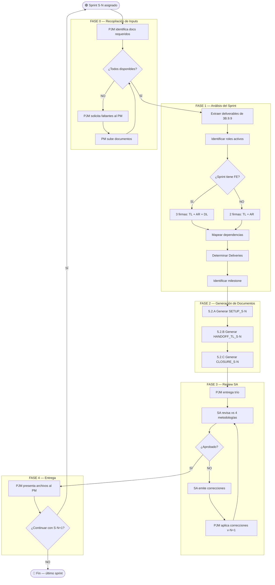

# VTT.PROTOCOL-SPRINT-001 — Generación de Documentación de Sprint (SETUP + HANDOFF + CLOSURE)

| Campo | Valor |
|---|---|
| **Código** | `VTT.PROTOCOL-SPRINT-001` |
| **Título** | Generación de Documentación de Sprint |
| **Versión** | 1.0.0 |
| **Fecha** | 2026-05-18 |
| **Autor** | PJM-Agent (Project Manager Agent) |
| **Aplica a** | PJM, SA, PM, TL |
| **Estado** | Aprobado |
| **Tipo** | Genérico VTT — aplica a cualquier proyecto |
| **Reglas aplicables (Nivel 0)** | R1–R12 documentadas en §5.6 |

---

## Tabla de Contenido

1. [Propósito](#1-propósito)
2. [Campo de Aplicación](#2-campo-de-aplicación)
3. [Responsabilidades](#3-responsabilidades)
4. [Definiciones](#4-definiciones)
5. [Procedimiento](#5-procedimiento)
6. [Referencias Cruzadas](#6-referencias-cruzadas)
7. [Resumen de Revisiones](#7-resumen-de-revisiones)
8. [Anexos](#anexos)

---

## 1. Propósito

Establecer el proceso normativo completo para que el PJM genere el trío de documentos de sprint (SETUP, HANDOFF_TL, CLOSURE) que el TL ejecuta en VTT para crear la estructura de tareas, coordinar agentes y cerrar sprints con firmas formales.

Este Protocol existe porque la generación de documentación de sprint sin proceso estandarizado produce tareas huérfanas en VTT (sin Release, Sprint ni Delivery), métricas MGP que no funcionan, y cierres de sprint que fallan por falta de firmas API. El error se propaga a todos los sprints del proyecto si no se corrige en el primero.

El output principal es un trío de archivos (SETUP_S[N].md, HANDOFF_TL_S[N].md, CLOSURE_S[N].md) verificado contra las 4 metodologías base, listo para que el TL lo ejecute.

---

## 2. Campo de Aplicación

**Aplica a:**
- Cualquier proyecto VTT con sprints definidos en un capacity plan
- Fases 4–7 del SDLC (Development → Operations) o cualquier fase con sprints planificados
- Cada sprint secuencial del proyecto (S1, S2, ..., S[N])
- PJM como ejecutor, SA como reviewer, PM como proveedor de contexto

**No aplica a:**
- Fases 0–2 (Discovery, Planning, Analysis) que no se ejecutan en sprints
- Fases 3A/3B cuando se ejecutan como bloque único sin sprint calendar
- Proyectos sin estructura VTT (Release → Sprint → Delivery → Task)

---

## 3. Responsabilidades

### 3.1 PJM (Project Manager Agent)
- Ejecuta el proceso completo: recopila inputs, analiza scope del sprint, genera los 3 documentos
- Aplica las 12 reglas de negocio (§5.6) en cada documento generado
- Corrige documentos tras review del SA hasta aprobación
- No genera documentación sin todos los inputs — solicita los faltantes al PM

### 3.2 SA (Solution Architect)
- Revisa los 3 documentos contra las 4 metodologías base (SETUP_FASE, PLAN_VTT, EJECUCION_SPRINTS, CIERRE_SPRINT_FASE)
- Emite lista de correcciones con bloques de código cuando rechaza
- Aprueba el trío antes de que se entregue al TL

### 3.3 PM (Project Manager)
- Provee documentos de input (capacity plan, task breakdown, dependencies map, datos VTT)
- Sube documentos faltantes cuando el PJM los solicita
- Da señal de continuar con el siguiente sprint tras recibir el trío aprobado

### 3.4 TL (Tech Lead)
- Consumidor final de los documentos
- Ejecuta SETUP en VTT (crea Release, Sprint, Deliveries, tareas, dependencias)
- Usa HANDOFF para coordinar agentes (briefs, CAs, gates)
- Gestiona CLOSURE para recolectar firmas y cerrar el sprint

---

## 4. Definiciones

**Trío de Sprint**: Conjunto de 3 documentos (SETUP + HANDOFF_TL + CLOSURE) que constituyen la documentación operativa completa de un sprint.

**SETUP_S[N]**: Documento con scripts Python secuenciales para crear la estructura VTT de un sprint (Release, Sprint, Deliveries, tareas, asociaciones, dependencias).

**HANDOFF_TL_S[N]**: Documento técnico con briefs por agente, criterios de aceptación, dependencias, VTT planning data, DoD y gates de aprobación.

**CLOSURE_S[N]**: Template de evidencia de cierre con verificación de deliverables, firmas por stage (API), milestone, métricas y gate final del PM.

**Delivery**: Agrupación de tareas por módulo/rol dentro de un sprint. Las tareas heredan el sprint a través del Delivery (Task.sprintId NO existe en el validador).

**APR-S[N]**: Tarea formal de aprobación del PM en VTT. Depende de CIERRE-S[N]. Es terminal.

**Jerarquía VTT**: Release → Sprint → Delivery → Task. Sin esta cadena completa, las tareas quedan huérfanas.

**4 Metodologías Base**: METODOLOGIA_SETUP_FASE, METODOLOGIA_SETUP_PLAN_VTT, METODOLOGIA_EJECUCION_SPRINTS_V1.1, METODOLOGIA_CIERRE_SPRINT_FASE.

---

## 5. Procedimiento

El proceso completo tiene **18 pasos** organizados en **5 fases** secuenciales + **1 sub-ciclo** de corrección (Fase 4).

```
FASE 0           →  FASE 1       →  FASE 2        →  FASE 3       →  FASE 4
Recopilación        Análisis        Generación       Review SA       Entrega
de Inputs           del Sprint      de Documentos    y Corrección    al PM
```

---

### 5.0 FASE 0 — Recopilación de Inputs

> **Trigger de inicio:** PM asigna un sprint a documentar, o sprint anterior completado y PM da señal de continuar.

5.0.1 PJM identifica documentos requeridos → **[ACTIVIDAD]**

Documentos obligatorios:

| Documento | Contenido clave |
|-----------|----------------|
| `3B.9.9_capacity_plan.md` | Deliverables asignados por sprint, horas, roles |
| `3B.9.3_task_breakdown.md` | Detalle individual de cada deliverable (ID, nombre, horas, SP, complejidad) |
| `3B.9.7_dependencies_map.md` | Dependencias críticas cross-sprint e intra-sprint |
| `CONTEXTO_S[N-1].md` | IDs VTT del sprint anterior (Release, Sprint, Deliveries, tareas) |
| 4 metodologías base | Estructura obligatoria de cada documento |

5.0.2 ¿Todos los inputs disponibles? → **[DECISIÓN]**
- **SÍ** → continuar a Fase 1 (§5.1)
- **NO** → paso 5.0.3

5.0.3 PJM solicita documentos faltantes al PM con nombre exacto → **[ACTIVIDAD]**

5.0.4 PM sube documentos faltantes → **[ACTIVIDAD]** (actor: PM)

5.0.5 Volver a paso 5.0.2

> **Regla R1:** NO generar nada sin todos los inputs. No inventar datos. Otro PJM gastó 10M tokens inventando.

---

### 5.1 FASE 1 — Análisis del Sprint

> **Trigger de inicio:** Todos los inputs disponibles.

5.1.1 PJM extrae deliverables del sprint desde `3B.9.9_capacity_plan.md` → **[ACTIVIDAD]**

Para cada deliverable, obtener de `3B.9.3_task_breakdown.md`:
- ID catálogo (ej: 4.2.3)
- Nombre completo
- Rol responsable (BE, DB, FE, DO, QA, TL)
- Horas estimadas / SP
- Complejidad (LOW / MEDIUM / HIGH / VERY HIGH)
- Aplica (✅ / ⚪ / ❌)
- Dependencias (internas y externas)

> Deliverables ❌ → NO crear tarea. Deliverables ⚪ → crear con flag `[OPCIONAL R1]` en description.

5.1.2 PJM identifica roles activos en el sprint → **[ACTIVIDAD]**

5.1.3 ¿El sprint tiene FE? → **[DECISIÓN]**
- **SÍ** → 3 firmas cierre: TL + AR + DL. Agregar tarea DL-S[N]-REV.
- **NO** → 2 firmas cierre: TL + AR solamente. Justificar en §0 del CLOSURE.

5.1.4 PJM mapea dependencias desde `3B.9.7` + `CONTEXTO_S[N-1]` → **[ACTIVIDAD]**

Tipos de dependencias a mapear:
- **Cross-sprint:** IDs VTT de tareas S[N-1] que bloquean tareas de S[N]
- **Intra-sprint:** cadenas internas (ej: DB → BE convergencia en Services)
- **Gate entre sprints:** CIERRE-S[N-1] → SETUP-S[N]

5.1.5 PJM determina Deliveries (agrupación por módulo/rol) → **[ACTIVIDAD]**

> **Regla:** 1 Delivery por módulo activo por sprint + 1 REV para validación/cierre. Naming: `ROL-S[N]: Descripción`.

5.1.6 PJM identifica milestone del sprint desde `3B.9.9` §11 → **[ACTIVIDAD]**

---

### 5.2 FASE 2 — Generación de Documentos

> **Trigger de inicio:** Análisis completado (Fase 1).

Esta fase tiene 3 sub-procesos secuenciales, uno por documento.

#### 5.2.A Sub-proceso: Generar SETUP_S[N].md

5.2.A.1 ¿Es el primer sprint (S1)? → **[DECISIÓN]**
- **SÍ** → Generar bloque "Crear/verificar Release R1" (`POST /projects/{id}/releases`)
- **NO** → Generar bloque "Recuperar RELEASE_ID de CONTEXTO_S[N-1]"

5.2.A.2 Generar bloque "Crear Sprint S[N]" → **[ACTIVIDAD]**

Endpoint: `POST /releases/{id}/sprints` con campos: number, name, goal, startDate, endDate.

5.2.A.3 Generar bloque "Crear tarea SETUP-S[N]" → **[ACTIVIDAD]**

5.2.A.4 Generar bloque "Crear Deliveries" → **[ACTIVIDAD]**

Endpoint: `POST /deliveries` con campos: phaseId, name, order, createdBy.

5.2.A.5 Generar bloque "Vincular Deliveries al Sprint" → **[ACTIVIDAD]**

Endpoint: `PATCH /deliveries/{id}` con body `{ sprintId }`.

> **Regla R2/R3:** Sin este paso, las tareas quedan sin sprint visible en el dashboard. Task.sprintId NO existe — las tareas heredan sprint a través del Delivery.

5.2.A.6 Generar bloques de creación de tareas (1 bloque por rol) → **[ACTIVIDAD]**

Cada tarea requiere:

| Campo | Fuente |
|-------|--------|
| title | `[ID_CATALOGO] Nombre` |
| description | deliverable + sprint + rol + horas + complejidad + deps |
| assigneeId | UUID del rol desde datos VTT |
| estimatedHours | Del task breakdown |
| priorityId | HIGH si complexity HIGH/VERY HIGH, MEDIUM si no |
| complexity | Del task breakdown (VERY HIGH → mapear a HIGH en API) |
| category | Derivar del tipo (development, deployment, review, documentation) |

> **Regla R6:** VERY HIGH → mapear a HIGH en campo `complexity`. La API no acepta VERY HIGH.

Cada tarea incluye campo "Registrar:" para que TL anote el UUID devuelto.

5.2.A.7 Generar bloque "Tareas de validación + CIERRE + APR" → **[ACTIVIDAD]**

Tareas obligatorias:
- TL-S[N]-REV (Code Review) — assignee: TL
- AR-S[N] (Integration Audit) — assignee: AR
- DL-S[N]-REV (Visual Review, solo si FE) — assignee: DL
- CIERRE-S[N] — assignee: TL
- APR-S[N] (Aprobación PM) — assignee: PM

> **Regla R8:** APR-S[N] es tarea formal en VTT con dependencia a CIERRE-S[N]. No solo texto.

5.2.A.8 Generar bloque "Asociar tareas a Deliveries" → **[ACTIVIDAD]**

Endpoint: `POST /deliveries/{id}/tasks/{taskId}`.

> **Regla R4:** Cada tarea debe estar en exactamente 1 Delivery.

5.2.A.9 Generar bloque "Registrar dependencias" → **[ACTIVIDAD]**

Endpoint: `POST /tasks/{id}/dependencies` con body `{ dependsOnTaskId }`.

Cadena obligatoria:
- Cross-sprint: `SETUP-S[N] ← CIERRE-S[N-1]`
- Validación: `deliverables → TL Review → AR Audit → (DL Review) → CIERRE → APR`

5.2.A.10 Generar template CONTEXTO_S[N].md → **[ACTIVIDAD]**

5.2.A.11 Generar checklist de verificación → **[ACTIVIDAD]**

> **Regla R7:** NO incluir paso de auto-completar SETUP. El TL lo cierra tras verificar.

**Output:** `>> SETUP_S[N].md <<`

---

#### 5.2.B Sub-proceso: Generar HANDOFF_TL_S[N].md

5.2.B.1 Generar §0 Resumen ejecutivo → **[ACTIVIDAD]**

Contenido: horas totales, distribución por rol, milestone, nota si no hay FE/DL/QA en el sprint.

5.2.B.2 Generar §1 Arquitectura del sprint → **[ACTIVIDAD]**

Contenido: diagrama ASCII con Deliveries referenciados, ADRs nuevos/previos, dependencias externas.

5.2.B.3 Generar §2 Briefs por agente → **[ACTIVIDAD]**

Para cada rol activo en el sprint:
- Tabla de tareas (ID, descripción, estimado, depende de)
- Documentos de referencia
- Archivos a crear (estructura de carpetas)
- Criterios de Aceptación verificables

> **Regla R12:** CAs son verificables — no "funciona" sino "X retorna Y cuando Z".

5.2.B.4 Generar §3 Variables de entorno → **[ACTIVIDAD]**

5.2.B.5 Generar §4 Riesgos y mitigaciones (filtrados del 3B.9.6 por sprint) → **[ACTIVIDAD]**

5.2.B.6 Generar §5 Tareas del sprint (tabla completa) → **[ACTIVIDAD]**

5.2.B.7 Generar §6 Dependencias entre tareas → **[ACTIVIDAD]**

5.2.B.8 Generar §7 VTT Planning Data → **[ACTIVIDAD]**

Columnas obligatorias: estimatedHours, complexity, category, **deliveryId**, dependsOn.

> **Regla R10:** §7 incluye columna deliveryId. Sin esto, SETUP no puede asociar tareas a Deliveries.

5.2.B.9 Generar §8–§11 (Docs dinámicos, DoD, Gates, Referencias) → **[ACTIVIDAD]**

**Output:** `>> HANDOFF_TL_S[N].md <<`

---

#### 5.2.C Sub-proceso: Generar CLOSURE_S[N].md

5.2.C.1 Generar §0 con número de firmas y justificación → **[ACTIVIDAD]**

> **Regla R11:** Si sprint tiene FE → firma DL obligatoria. Si no → justificar reducción en §0.

5.2.C.2 Generar §2 Verificación de deliverables por Delivery → **[ACTIVIDAD]**

5.2.C.3 Generar §3 Firma TL con criterios + comando API → **[ACTIVIDAD]**

Comando: `POST /sprints/{id}/stages/development/sign` con body `{ userId, role, comment }`.

5.2.C.4 Generar §4 Firma AR con criterios + comando API → **[ACTIVIDAD]**

Comando: `POST /sprints/{id}/stages/integration/sign`.

5.2.C.5 ¿Sprint tiene FE? → **[DECISIÓN]**
- **SÍ** → Generar §5 Firma DL con criterios + comando API (`POST /sprints/{id}/stages/design/sign`)
- **NO** → Omitir §5

> **Regla R9:** Firmas incluyen comando API real. No solo checklist en papel.

5.2.C.6 Generar §6 Milestone M[N] con criterios GO/NO-GO del 3B.9.9 → **[ACTIVIDAD]**

5.2.C.7 Generar §7–§11 (Métricas, Gate PM, Proceso de cierre, Firmas, Referencias) → **[ACTIVIDAD]**

**Output:** `>> CLOSURE_S[N].md <<`

---

### 5.3 FASE 3 — Review y Corrección

> **Trigger de inicio:** Trío de documentos generado.

5.3.1 PJM entrega 3 documentos al PM/SA → **[ACTIVIDAD]**

5.3.2 SA revisa contra las 4 metodologías base → **[PROCESO]**

Checklist de review:

| Metodología | Verifica |
|-------------|----------|
| METODOLOGIA_SETUP_FASE | ¿Release, Sprint, Deliveries, Task→Delivery presente? |
| METODOLOGIA_SETUP_PLAN_VTT | ¿Grafo sin huérfanos ni hojas sueltas? |
| METODOLOGIA_EJECUCION_SPRINTS | ¿6 secciones obligatorias en HANDOFF? ¿deliveryId en §7? |
| METODOLOGIA_CIERRE_SPRINT_FASE | ¿Firmas API reales? ¿APR formal? |

5.3.3 ¿Aprobado sin correcciones? → **[DECISIÓN]**
- **SÍ** → continuar a Fase 4 (§5.4)
- **NO** → paso 5.3.4

5.3.4 SA emite lista de correcciones con bloques de código → **[ACTIVIDAD]** (actor: SA)

5.3.5 PJM aplica correcciones a los documentos afectados (versión N+1) → **[ACTIVIDAD]**

5.3.6 PJM re-entrega documentos corregidos → **[ACTIVIDAD]**

5.3.7 Volver a paso 5.3.2

> **Regla:** No entregar al TL sin aprobación SA. El error se propaga a los sprints restantes del proyecto.

---

### 5.4 FASE 4 — Entrega

> **Trigger de inicio:** SA aprobó el trío.

5.4.1 PJM presenta 3 archivos al PM → **[ACTIVIDAD]**

Archivos:
- `SETUP_S[N].md`
- `HANDOFF_TL_S[N].md`
- `CLOSURE_S[N].md`

5.4.2 ¿PM confirma continuar con siguiente sprint? → **[DECISIÓN]**
- **SÍ** → Volver a Fase 0 (§5.0) con S[N+1]
- **NO** (último sprint) → **FIN DEL PROCESO**

---

### 5.5 Excepciones y Caminos Alternativos

#### 5.5.1 Sprint con rol nuevo (nunca antes visto en el proyecto)

```
PJM detecta rol nuevo (ej: QA aparece por primera vez en S5)
→ Agregar Delivery para el nuevo rol
→ Agregar firma de cierre si corresponde
→ Agregar brief en HANDOFF §2
→ Documentar en §0 del HANDOFF que el rol es nuevo
```

#### 5.5.2 Deliverables opcionales (⚪)

```
PJM encuentra deliverable marcado ⚪ en 3B.9.3
→ Crear tarea con priorityId = MEDIUM
→ Agregar "[OPCIONAL R1]" en description
→ Incluir en sprint normalmente
```

#### 5.5.3 Sprint sin cierre formal del anterior (urgencia)

```
PM solicita generar S[N+1] sin que S[N] haya cerrado
→ PJM advierte el riesgo (dependencias cross-sprint no verificadas)
→ Si PM confirma → generar con dependencia a SETUP-S[N] en vez de CIERRE-S[N]
→ Documentar la excepción en §0 del SETUP
```

---

### 5.6 Reglas de Negocio (Nivel 0)

| # | Regla | Consecuencia si se viola |
|:-:|-------|-------------------------|
| R1 | No generar sin todos los inputs | Documentos con datos inventados — SA rechaza |
| R2 | Release → Sprint → Delivery → Task (jerarquía obligatoria) | Tareas huérfanas, métricas MGP no funcionan |
| R3 | Vincular Delivery al Sprint vía PATCH (no existe Task.sprintId) | Tareas no aparecen en dashboard de sprint |
| R4 | Cada tarea asociada a exactamente 1 Delivery | Tarea duplicada en métricas o invisible |
| R5 | CIERRE-S[N-1] → SETUP-S[N] (gate entre sprints) | Sprint N puede iniciar sin que N-1 haya cerrado |
| R6 | VERY HIGH → mapear a HIGH en campo `complexity` | Error de validación de API al crear tarea |
| R7 | No auto-completar SETUP — TL lo cierra tras verificar | SETUP completado sin verificación |
| R8 | APR-S[N] como tarea formal en VTT | Sprint sin gate formal de aprobación PM |
| R9 | Firmas con comando API real (POST /sprints/{id}/stages/.../sign) | Cierre sin registro en sistema |
| R10 | §7 VTT Planning Data incluye columna deliveryId | SETUP no puede asociar tareas a Deliveries |
| R11 | Si FE → agregar firma DL + DL-S[N]-REV | FE sin review visual |
| R12 | CAs verificables: no "funciona" sino "X retorna Y cuando Z" | Reviewer no sabe qué verificar |

---

## 6. Referencias Cruzadas

### Workflows derivados del Protocol (Nivel 3)

| Código | Título | Invocado en |
|---|---|---|
| `VTT.WORKFLOW-SPRINT-001.001` | Recopilación de Inputs de Sprint | §5.0 |
| `VTT.WORKFLOW-SPRINT-001.002` | Análisis de Scope y Dependencias | §5.1 |
| `VTT.WORKFLOW-SPRINT-001.003` | Generación de SETUP | §5.2.A |
| `VTT.WORKFLOW-SPRINT-001.004` | Generación de HANDOFF_TL | §5.2.B |
| `VTT.WORKFLOW-SPRINT-001.005` | Generación de CLOSURE | §5.2.C |
| `VTT.WORKFLOW-SPRINT-001.006` | Review SA y Corrección | §5.3 |

### Skills referenciadas (Nivel 2)

| Código | Uso |
|---|---|
| `SKL-AUTH-01` | Obtener JWT para API VTT en scripts Python |
| `SKL-ATTACH-01` | Subir documentos generados como attachments a tareas VTT |

### Templates referenciados

| Código | Uso |
|---|---|
| `TEMPLATE_SETUP_SPRINT.md` | Estructura base del SETUP (pasos 1-13) |
| `TEMPLATE_HANDOFF_TL.md` | Estructura base del HANDOFF (§0-§11) |
| `TEMPLATE_CLOSURE_SPRINT.md` | Estructura base del CLOSURE (§0-§11) |

### Protocols relacionados

| Protocol | Relación |
|---|---|
| `VTT.PROTOCOL-ASG-001` | Downstream — TL ejecuta el SETUP usando el ciclo de asignación de tareas |

### Documentos de soporte

| Documento | Uso |
|---|---|
| `METODOLOGIA_SETUP_FASE.md` | Referencia para validación SA — estructura SETUP |
| `METODOLOGIA_SETUP_PLAN_VTT.md` | Referencia para validación SA — grafo sin huérfanos |
| `METODOLOGIA_EJECUCION_SPRINTS_V1.1.md` | Referencia para validación SA — secciones HANDOFF |
| `METODOLOGIA_CIERRE_SPRINT_FASE.md` | Referencia para validación SA — firmas y cierre |
| `3B.9.9_capacity_plan.md` | Input — deliverables por sprint |
| `3B.9.3_task_breakdown.md` | Input — detalle de cada deliverable |
| `3B.9.7_dependencies_map.md` | Input — dependencias cross-sprint |

### Reglas Nivel 0 aplicables

| Regla | Aplica en |
|---|---|
| R1 — No generar sin inputs | §5.0.2 |
| R2 — Jerarquía Release→Sprint→Delivery→Task | §5.2.A.2–5.2.A.8 |
| R3 — Vincular Delivery vía PATCH | §5.2.A.5 |
| R4 — 1 tarea = 1 Delivery | §5.2.A.8 |
| R5 — Gate CIERRE→SETUP entre sprints | §5.2.A.9 |
| R6 — VERY HIGH → HIGH en API | §5.2.A.6 |
| R7 — No auto-completar SETUP | §5.2.A.11 |
| R8 — APR formal en VTT | §5.2.A.7 |
| R9 — Firmas con API real | §5.2.C.3–5.2.C.5 |
| R10 — deliveryId en §7 | §5.2.B.8 |
| R11 — Firma DL si FE | §5.2.C.5 |
| R12 — CAs verificables | §5.2.B.3 |

---

## 7. Resumen de Revisiones

| Versión | Fecha | Editor | Cambios |
|---|---|---|---|
| 1.0.0 | 2026-05-18 | PJM-Agent | Versión inicial. Cubre proceso completo de generación de trío SETUP+HANDOFF+CLOSURE. 5 fases, 18 pasos, 12 reglas de negocio, 4 excepciones documentadas. Derivado de SOP anterior + lecciones aprendidas S1 v1→v2. |

---

## Anexos

### Anexo A — Diagrama de flujo end-to-end (mermaid)



### Anexo B — Checklist de Completitud por Documento

#### B.1 SETUP_S[N].md

- [ ] Release R1 verificado/creado (solo S1)
- [ ] Sprint S[N] creado con number, name, goal, dates
- [ ] Deliveries creados (1 por módulo/rol)
- [ ] Deliveries vinculados al Sprint (PATCH con sprintId)
- [ ] Tareas con 7 campos obligatorios (title, description, assigneeId, estimatedHours, priorityId, complexity, category)
- [ ] Tareas validación + CIERRE + APR creadas
- [ ] Todas las tareas asociadas a Deliveries
- [ ] Dependencias registradas (cross-sprint + intra-sprint)
- [ ] Template CONTEXTO generado
- [ ] Checklist de verificación incluido
- [ ] No se auto-completa el SETUP

#### B.2 HANDOFF_TL_S[N].md

- [ ] §0 con nota de roles ausentes (si no hay FE/DL/QA)
- [ ] §1 Diagrama con Deliveries referenciados
- [ ] §2 Brief por agente con CAs verificables + archivos a crear
- [ ] §3 Variables de entorno
- [ ] §4 Riesgos filtrados del 3B.9.6
- [ ] §5 Tabla completa de tareas
- [ ] §6 Dependencias con tipo FS
- [ ] §7 VTT Planning Data con columna deliveryId
- [ ] §8 Documentos dinámicos
- [ ] §9 DoD con gate milestone
- [ ] §10 Gates de aprobación
- [ ] §11 Referencias a documentos 3B

#### B.3 CLOSURE_S[N].md

- [ ] §0 con número de firmas y justificación si <4
- [ ] §2 Verificación por Delivery
- [ ] §3 Firma TL con criterios + comando API stage development
- [ ] §4 Firma AR con criterios + comando API stage integration
- [ ] §5 Firma DL con criterios + comando API stage design (si FE)
- [ ] §6 Milestone con criterios GO/NO-GO
- [ ] §7 Métricas estimado vs real
- [ ] §8 Gate final con checklist
- [ ] §9 Proceso de firmas secuencial + APR como tarea VTT
- [ ] §10 Tabla de firmas con fecha

### Anexo C — Métricas del Protocol

| Métrica | Target |
|---------|--------|
| Tiempo de generación del trío | ≤30 min por sprint |
| Ciclos de corrección SA | ≤1 (idealmente 0) |
| Completitud del checklist Anexo B | 100% |
| Documentos faltantes solicitados al PM | ≤1 por sprint |

---

| Editor | Dueño | Última Actualización |
|---|---|---|
| PJM-Agent | PM Martin Rivas | 2026-05-18 |

**Versión:** 1.0.0 — Proceso completo de generación de documentación de sprint
**Estado:** Aprobado

*Versión más reciente en `virtual-teams-setup`. No controlada si se imprime.*
