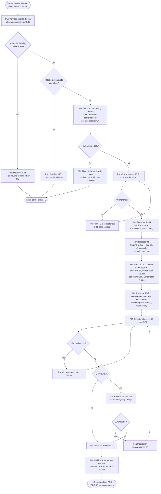

# SOP — Generación de Handoff (HO) para PJM

**Proceso:** Transformar documentos de estimación técnica en un plan operativo ejecutable para el PJM
**Versión:** 2.0
**Fecha:** 2026-05-19
**Autor:** PM — Martin Rivas
**Estado:** APROBADO
**Cambios v2.0:** Integración del routing index (3B.9.10) como input obligatorio. Formato HO corregido. Outputs formalizados.

---

## 1. Alcance

**Trigger:** El TL completa los documentos de estimación de Design Technical Y entrega el routing index (3B.9.10).

**Fin (éxito):** El PJM recibe un HO que le permite crear sprints en VTT, generar HANDOFFs por sprint para el TL, y monitorear avance — sin inventar contenido técnico y sin preguntar al PM ni al TL.

**Fin (rechazo):** Los inputs están incompletos — el PM devuelve al TL con lista de faltantes.

---

## 2. Actores

| Actor | Responsabilidad en este proceso |
|-------|--------------------------------|
| **PM** | Ejecutor. Valida inputs, produce el HO, entrega al PJM. |
| **TL** | Productor de inputs. Consultado si hay inconsistencias. |
| **PJM** | Receptor. Consume el HO para crear sprints y HANDOFFs. |
| **SA** | Reviewer opcional del HO si PM lo solicita. |

---

## 3. Inputs Obligatorios

### 3.1 Del TL (Design Technical)

| # | Documento | Qué contiene | Para qué se usa en el HO |
|:-:|-----------|-------------|--------------------------|
| 1 | **3B.9.10 Routing Index** | Mapeo de cada deliverable a su spec source, sección, D-MEM y docs para el agente | **Columna "Spec Source" en cada tabla de sprint.** Sin esto el PJM inventa. |
| 2 | 3B.9.1 Estimates Document | Resumen ejecutivo: total horas, escenarios, milestones | §2 Números clave del HO |
| 3 | 3B.9.3 Task Breakdown | 174 deliverables con ID, nombre, rol, horas, dependencias | Tablas de deliverables por sprint |
| 4 | 3B.9.4 Effort Matrix | Horas por rol × fase × subfase | §12 Equipo (horas por rol) |
| 5 | 3B.9.5 Complexity Analysis | Top 10 deliverables complejos, riesgos por stack | Gates con ⚠️ mayor riesgo |
| 6 | 3B.9.6 Risk-Adjusted Estimates | Riesgos cuantificados con probabilidad, buffer, mitigación | §8 Riesgos del HO |
| 7 | 3B.9.7 Dependencies Map | Critical path, gates entre fases, orden de implementación | §7 (si existe) o notas en gates |
| 8 | 3B.9.9 Capacity Plan | Calendario de sprints con deliverables asignados por sprint | Estructura completa de §6 Sprints |

### 3.2 Del PM (ya disponibles)

| # | Documento | Para qué |
|:-:|-----------|----------|
| 9 | SPEC del proyecto | Decisiones cerradas (D-MEM) para §4 del HO |
| 10 | OPERATIVO del proyecto | UUIDs del equipo para §12 del HO |
| 11 | Addendums (si existen) | Integrar sprints/tareas adicionales |

### 3.3 Criterios de rechazo — cuándo devolver al TL

El PM devuelve al TL si cualquiera de estas condiciones es verdadera:

- **3B.9.10 no existe** — sin routing index no se puede generar HO. Este es el documento más crítico.
- Falta cualquier otro documento del §3.1
- El routing index no cubre todos los deliverables ✅ del task breakdown
- Los totales del estimates document no coinciden con la suma del task breakdown
- El critical path no está explícito
- Algún documento no tiene versión ni fecha

---

## 4. Output: Estructura del HO

El HO sigue el formato de handoff de continuidad (no plan de gestión). El PJM debe poder abrir el HO, leerlo de arriba a abajo, y saber exactamente dónde está el proyecto, qué hacer y cómo hacerlo.

### 4.1 Secciones obligatorias

| § | Sección | Contenido | Fuente |
|:-:|---------|-----------|--------|
| 1 | Perfil y Rol | Quién es el PJM, UUID, qué hace y qué NO hace | OPERATIVO |
| 2 | Contexto del Proyecto | Tech stack, repos, URLs, SPEC de referencia | SPEC + OPERATIVO |
| 3 | Lo que se Completó | Tabla de fases completadas con gates | Estado actual del proyecto |
| 4 | Decisiones YA Aprobadas | Tabla de D-MEM clave — NO reabrir | SPEC §2 |
| 5 | Documento Clave: Routing Index | Qué es 3B.9.10, cómo usarlo, ejemplo concreto | 3B.9.10 |
| 6 | Plan de Sprints | **Una subsección por sprint** con tabla de deliverables + gate | 3B.9.9 + 3B.9.3 + 3B.9.10 |
| 7 | Lo que Falta Definir | Pendientes que bloquean o condicionan la ejecución | Análisis del PM |
| 8 | Riesgos | Top 10-15 con probabilidad, buffer, sprint afectado | 3B.9.6 |
| 9 | Documentos de Referencia | Tabla de todos los docs con cuándo consultar cada uno | Todos los inputs |
| 10 | Flujo Pendiente | Diagrama texto: dónde estamos → qué sigue → quién hace qué | — |
| 11 | Próximo Paso | Lista numerada de las acciones inmediatas del PJM | — |
| 12 | Equipo | Tabla: Rol, UUID, horas, función | OPERATIVO + 3B.9.4 |
| 13 | Reglas de Escalación | Tabla: situación → acción | — |

### 4.2 Formato de cada sprint (§6)

Cada sprint tiene esta estructura:

```markdown
### S[N]: [Nombre] (~[X]h)

**Objetivo:** [1 línea — qué se construye en este sprint]
**Agentes:** [roles activos] ([N] en paralelo)

| ID | Deliverable | Rol | Horas | Spec Source (3B.9.10) |
|----|-------------|:---:|:-----:|----------------------|
| X.X.X | [nombre] | [ROL] | [N] | [doc] §[sección] |
| ... | ... | ... | ... | ... |

**Gate M[N]:** ✓ [criterio 1] ✓ [criterio 2] ✓ [criterio N]
```

**Regla crítica:** La columna "Spec Source (3B.9.10)" se llena abriendo el routing index y copiando las columnas "Spec Source" y "Sección" del deliverable correspondiente. NO se inventa. Si el deliverable no está en 3B.9.10, se marca como `[FALTA EN ROUTING INDEX]` y se notifica al TL.

### 4.3 Referencia obligatoria al routing index

El HO debe incluir en §5 una explicación de qué es 3B.9.10 y un ejemplo concreto de cómo usarlo. Formato:

```markdown
## 5. Documento Clave: Routing Index (3B.9.10)

**Ruta:** [ruta en repo]

Este documento es obligatorio para generar cualquier HANDOFF o ASSIGNMENT.
Mapea cada deliverable a su spec source, sección, D-MEM y docs para el agente.

**Cómo usarlo:**

  Ejemplo: deliverable 4.2.3 Seed Data

  Routing index dice:
    Spec Source: 3B.3.7_seed_plan.md
    Sección: §catálogos — 10 tablas
    D-MEM: D-MEM-14, D-MEM-20, D-MEM-16
    Docs para el agente: 3B.3.7, 3B.3.2, 3B.3.5

**Regla:** si un doc referenciado no existe → task_on_hold + notificar TL.
```

---

## 5. Diagrama de Flujo



---

## 6. Checklist de Completitud

### 6.1 Estructura

- [ ] El HO tiene las 13 secciones (§1 a §13)
- [ ] Ninguna sección vacía ni con placeholders
- [ ] Encabezado con fecha, emisor, receptor

### 6.2 Routing Index

- [ ] §5 existe y explica qué es 3B.9.10
- [ ] §5 tiene ejemplo concreto de cómo usarlo
- [ ] Cada tabla de sprint tiene columna "Spec Source (3B.9.10)"
- [ ] Cada celda de esa columna referencia un doc 3B real (no genérica)
- [ ] No hay celdas con contenido inventado — todo sale de 3B.9.10

### 6.3 Sprints

- [ ] Cada sprint tiene: objetivo (1 línea), agentes, tabla deliverables, gate
- [ ] Cada gate tiene criterios verificables
- [ ] Los sprints son secuenciales sin gaps
- [ ] Los deliverables por sprint coinciden con 3B.9.9

### 6.4 Datos numéricos

- [ ] Suma de horas por sprint ≈ total del proyecto (±5%)
- [ ] Suma de horas por rol = total del proyecto
- [ ] Cada deliverable tiene exactamente 1 rol

### 6.5 Coherencia

- [ ] Decisiones §4 coinciden con SPEC
- [ ] UUIDs §12 coinciden con OPERATIVO
- [ ] Riesgos §8 coinciden con 3B.9.6
- [ ] Si hay addendums, están integrados en horas y sprints

---

## 7. Flujo Downstream — Qué pasa después del HO

```
PM entrega HO al PJM
    ↓
PJM crea sprints en VTT (usa §6 del HO)
    ↓
PJM genera HANDOFF por sprint para TL
    — para cada deliverable abre 3B.9.10
    — copia Spec Source + Sección + D-MEM + Docs para el agente
    — NO inlinea el contenido de los 3B
    ↓
TL recibe HANDOFF del sprint
    — abre los docs 3B referenciados
    — genera ASSIGNMENT por tarea con brief técnico real
    ↓
Agente ejecutor recibe ASSIGNMENT
    — lee los docs listados en "Docs para el agente"
    — si un doc no existe → task_on_hold + notificar TL
    — ejecuta con spec real
```

**Regla:** En ningún punto de esta cadena alguien inventa contenido técnico. Todo sale de los documentos 3B via el routing index.

---

## 8. Cuándo activar review SA

- Proyecto > 500h estimadas
- Addendums que modifican scope original
- Riesgos con probabilidad > 0.30 e impacto > 20h
- PM tiene dudas de coherencia con Analysis

---

## 9. Outputs del Proceso

| Output | Quién lo produce | Quién lo consume | Cuándo |
|--------|:----------------:|:----------------:|--------|
| **HO para PJM** | PM | PJM | Al cierre de Design Technical |
| **3B.9.10 Routing Index** | TL | PJM, TL, Agentes | Companion obligatorio del HO — siempre |
| HANDOFF por sprint | PJM | TL | Al inicio de cada sprint |
| ASSIGNMENT por tarea | TL | Agente ejecutor | Al inicio de cada tarea |

---

## 10. Glosario

| Término | Definición |
|---------|-----------|
| **HO** | Handoff — documento que transfiere contexto y plan de un rol a otro |
| **Routing Index (3B.9.10)** | Índice que mapea cada deliverable a su spec source, sección, decisiones y docs para el agente |
| **Spec Source** | El documento 3B donde está la especificación técnica de un deliverable |
| **D-MEM** | Decisión cerrada del proyecto Memory Service (D-MEM-01 a D-MEM-43) |
| **Gate GO/NO-GO** | Punto donde se evalúa si el sprint cumplió criterios para avanzar |
| **Critical path** | Secuencia de deliverables donde cualquier retraso retrasa todo |
| **HANDOFF por sprint** | Documento del PJM al TL con deliverables del sprint y sus referencias 3B |
| **ASSIGNMENT** | Instrucción del TL al agente con brief técnico extraído del doc 3B referenciado |
| **task_on_hold** | Estado de tarea bloqueada — se usa cuando un doc referenciado no existe |

---

**Documento:** SOP_GENERACION_HO_PJM.md
**Versión:** 2.0
**Fecha:** 2026-05-19
**Estado:** Aprobado
