# SOP — Generación de Handoff (HO) para PJM

**Proceso:** Transformar documentos de estimación técnica en un plan operativo ejecutable para el PJM
**Versión:** 1.0
**Fecha:** 2026-05-12
**Autor:** PM — Martin Rivas
**Actores:** PM, TL, PJM, SA
**Sistemas:** VTT, Repositorio Git

---

## Leyenda de Simbología

| Elemento | Forma | Uso |
|----------|-------|-----|
| Inicio / Fin | Cápsula | Un inicio, múltiples finales posibles |
| Paso de proceso | Rectángulo | Acción concreta con actor responsable |
| Decisión | Rombo | Bifurcación con salidas etiquetadas |
| Subproceso | Rectángulo doble borde | Referencia a otro proceso |
| Documento | Rectángulo base ondulada | Artefacto que se genera o consume |
| Nota contextual | Borde punteado | Regla de negocio o criterio |

---

## 1. Alcance

**Trigger de inicio:** El TL completa los documentos de estimación de una fase de Design Technical y los entrega al PM para revisión.

**Condición de fin (éxito):** El PJM recibe un HO completo y puede crear tareas en VTT y emitir ASSIGNMENTs sin consultar al PM ni al TL.

**Condición de fin (rechazo):** Los documentos del TL están incompletos — el PM devuelve con observaciones.

---

## 2. Actores

| Actor | Tipo | Responsabilidad |
|-------|------|-----------------|
| **PM** | Humano/Agente | Ejecutor principal. Lee estimaciones del TL, valida, transforma en HO, entrega al PJM. |
| **TL** | Agente | Productor de los documentos de estimación (input). Consultado si hay dudas técnicas. |
| **PJM** | Agente | Receptor del HO. Ejecuta el plan: crea sprints, tareas, ASSIGNMENTs en VTT. |
| **SA** | Agente | Reviewer opcional del HO si el PM lo solicita. |

---

## 3. Artefactos

| Artefacto | Tipo | Generado por | Consumido por |
|-----------|------|:------------:|:-------------:|
| Documentos de estimación (3B.9.x) | Input | TL | PM |
| SPEC del proyecto | Referencia | SA/TL | PM |
| Addendums pendientes (si existen) | Input | PM/SA | PM |
| **HO para PJM** | **Output** | **PM** | **PJM** |
| Tareas en VTT | Output downstream | PJM | Equipo |
| ASSIGNMENTs por tarea | Output downstream | PJM/TL | Agentes ejecutores |

---

## 4. Diagrama de Flujo Principal

```mermaid
flowchart TD
    START([🟢 START: PM recibe documentos<br/>de estimación del TL])

    %% ═══════════════════════════════════════
    %% FASE 1: RECEPCIÓN Y VALIDACIÓN
    %% ═══════════════════════════════════════

    P1["PM: Identificar documentos recibidos<br/>— listar cada documento con versión y fecha"]
    P2["PM: Verificar completitud del paquete<br/>de estimación contra checklist"]

    D1{¿Paquete completo?}

    P3["PM: Documentar qué falta<br/>con referencias específicas"]
    P4["PM: Devolver al TL con lista<br/>de documentos faltantes"]

    %% ═══════════════════════════════════════
    %% FASE 2: EXTRACCIÓN DE DATOS
    %% ═══════════════════════════════════════

    P5["PM: Extraer números clave<br/>— total horas, deliverables, sprints,<br/>roles, escenarios best/expected/worst"]
    P6["PM: Extraer calendario de sprints<br/>— número, duración, fechas, fase,<br/>roles activos por sprint"]
    P7["PM: Extraer deliverables por sprint<br/>— ID, nombre, rol, horas, dependencias"]
    P8["PM: Extraer milestones y gates<br/>— criterios GO/NO-GO por milestone"]
    P9["PM: Extraer riesgos cuantificados<br/>— ID, probabilidad, impacto, buffer,<br/>sprint afectado, mitigación"]
    P10["PM: Extraer critical path<br/>— deliverables que bloquean todo"]
    P11["PM: Extraer paralelismo por sprint<br/>— agentes simultáneos, tracks paralelos"]

    %% ═══════════════════════════════════════
    %% FASE 3: VALIDACIÓN CRUZADA
    %% ═══════════════════════════════════════

    P12["PM: Verificar coherencia interna<br/>— ¿suman las horas por sprint = total?<br/>— ¿cada deliverable tiene rol asignado?<br/>— ¿cada milestone tiene criterios?"]

    D2{¿Datos coherentes<br/>internamente?}

    P13["PM: Documentar inconsistencias<br/>encontradas con referencias"]
    P14["PM: Consultar al TL para resolver<br/>discrepancias en estimaciones"]

    P15["PM: Cruzar contra SPEC<br/>— ¿los endpoints coinciden?<br/>— ¿el modelo de datos coincide?<br/>— ¿las decisiones cerradas se respetan?"]

    D3{¿Coherente con SPEC?}

    P16["PM: Documentar contradicciones<br/>SPEC vs estimaciones"]
    P17["PM: Resolver con TL — prevalece SPEC<br/>y se ajustan estimaciones"]

    %% ═══════════════════════════════════════
    %% FASE 4: VERIFICACIÓN DE ADDENDUMS
    %% ═══════════════════════════════════════

    D4{¿Hay addendums pendientes<br/>que impactan el plan?}

    P18["PM: Integrar addendums al plan<br/>— ajustar horas, agregar sprint/tareas,<br/>actualizar budget"]

    %% ═══════════════════════════════════════
    %% FASE 5: COMPOSICIÓN DEL HO
    %% ═══════════════════════════════════════

    P19["PM: Redactar §1 Contexto<br/>— qué se completó, qué inicia,<br/>fuentes de verdad"]
    P20["PM: Redactar §2 Números Clave<br/>— tabla resumen de métricas globales"]
    P21["PM: Redactar §3 Equipo y Roles<br/>— UUID, horas, %, fases activas,<br/>picos de carga por rol"]
    P22["PM: Redactar §4 Calendario de Sprints<br/>— tabla sprint × semanas × fase ×<br/>horas × roles × milestone"]
    P23["PM: Redactar §5 Detalle por Sprint<br/>— para CADA sprint: objetivo,<br/>tabla deliverables con ID/rol/horas/dep,<br/>gate de salida con checklist"]
    P24["PM: Redactar §6 Milestones y Gates<br/>— tabla con criterios GO/NO-GO,<br/>quién valida, acciones si NO-GO"]
    P25["PM: Redactar §7 Critical Path<br/>— diagrama lineal + lista de<br/>deliverables bloqueantes"]
    P26["PM: Redactar §8 Riesgos<br/>— tabla completa con probabilidad,<br/>buffer, sprint afectado, mitigación"]
    P27["PM: Redactar §9 Paralelismo<br/>— tabla sprint × agentes × tracks"]
    P28["PM: Redactar §10 Indicadores<br/>— métricas de tracking con umbrales<br/>verde/amarillo/rojo + reglas escalación"]
    P29["PM: Redactar §11 Opcionales<br/>— deliverables ⚪ con condición<br/>de inclusión"]
    P30["PM: Redactar §12 Contingencias<br/>— tabla situación → acción"]
    P31["PM: Redactar §13 Referencias<br/>— tabla de documentos fuente<br/>con cuándo consultar cada uno"]
    P32["PM: Redactar §14 Definition of Done<br/>— checklist por deliverable"]

    %% ═══════════════════════════════════════
    %% FASE 6: VALIDACIÓN FINAL
    %% ═══════════════════════════════════════

    P33["PM: Ejecutar checklist de completitud<br/>— ver §5 de este SOP"]

    D5{¿Pasa checklist?}

    P34["PM: Corregir secciones<br/>que fallaron el checklist"]

    D6{¿Requiere review SA?}

    P35["PM: Enviar HO al SA<br/>para review de coherencia"]
    P36["SA: Revisar HO contra<br/>documentos de Analysis y Design"]

    D7{¿SA aprueba?}

    P37["SA: Devolver con observaciones"]
    P38["PM: Incorporar observaciones<br/>del SA al HO"]

    %% ═══════════════════════════════════════
    %% FASE 7: ENTREGA
    %% ═══════════════════════════════════════

    P39["PM: Guardar HO en repo<br/>— ruta: Release2.0/01-PM/"]
    P40["PM: Notificar al PJM<br/>— mensaje con ruta del HO,<br/>resumen de sprints y primera acción"]

    END_OK([🔵 FIN: HO entregado al PJM<br/>— PJM puede crear tareas y ASSIGNMENTs])
    END_REJECT([🔴 FIN: Documentos devueltos al TL<br/>— paquete incompleto])

    %% ═══════════════════════════════════════
    %% CONEXIONES
    %% ═══════════════════════════════════════

    START --> P1 --> P2 --> D1
    D1 -->|No| P3 --> P4 --> END_REJECT
    D1 -->|Sí| P5

    P5 --> P6 --> P7 --> P8 --> P9 --> P10 --> P11

    P11 --> P12 --> D2
    D2 -->|No| P13 --> P14 --> P12
    D2 -->|Sí| P15 --> D3
    D3 -->|No| P16 --> P17 --> P15
    D3 -->|Sí| D4

    D4 -->|Sí| P18 --> P19
    D4 -->|No| P19

    P19 --> P20 --> P21 --> P22 --> P23
    P23 --> P24 --> P25 --> P26 --> P27
    P27 --> P28 --> P29 --> P30 --> P31 --> P32

    P32 --> P33 --> D5
    D5 -->|No| P34 --> P33
    D5 -->|Sí| D6

    D6 -->|No| P39
    D6 -->|Sí| P35 --> P36 --> D7
    D7 -->|No| P37 --> P38 --> P33
    D7 -->|Sí| P39

    P39 --> P40 --> END_OK
```

---

## 5. Checklist de Completitud del HO

El PM ejecuta este checklist antes de entregar. Cada ítem debe ser verdadero.

### 5.1 Estructura

- [ ] El HO tiene todas las secciones (§1 a §14)
- [ ] Ninguna sección está vacía ni tiene placeholders
- [ ] El documento tiene encabezado con fecha, emisor, receptor y UUIDs

### 5.2 Datos numéricos

- [ ] La suma de horas por sprint ≈ total de horas del proyecto (±5% por redondeo)
- [ ] La suma de horas por rol = total de horas del proyecto
- [ ] Cada deliverable tiene exactamente 1 rol asignado
- [ ] Cada deliverable tiene horas estimadas > 0
- [ ] Los % por rol suman 100%

### 5.3 Sprints

- [ ] Cada sprint tiene: objetivo, tabla de deliverables, gate de salida
- [ ] Cada gate tiene criterios verificables (no cualitativos)
- [ ] Las fechas de sprints son secuenciales sin gaps ni overlaps
- [ ] Los deliverables de cada sprint son ejecutables con los roles listados

### 5.4 Dependencias

- [ ] El critical path está documentado como diagrama lineal
- [ ] Cada deliverable del critical path tiene su impacto documentado si se retrasa
- [ ] No hay dependencias circulares
- [ ] Las dependencias entre sprints son explícitas (gate de entrada)

### 5.5 Riesgos

- [ ] Cada riesgo tiene: probabilidad, impacto en horas, sprint afectado, mitigación
- [ ] El buffer total de riesgo está calculado
- [ ] Los 3 riesgos de mayor impacto tienen plan de contingencia explícito

### 5.6 Operativo

- [ ] Los indicadores de tracking tienen umbrales (verde/amarillo/rojo)
- [ ] Las reglas de escalación al PM están definidas
- [ ] Las contingencias cubren al menos: fallo de SLA, fallo de deploy, agente bloqueado
- [ ] La Definition of Done es verificable por el PJM sin consultar al PM

### 5.7 Coherencia externa

- [ ] Los endpoints mencionados coinciden con la SPEC
- [ ] Los roles y UUIDs coinciden con el OPERATIVO del proyecto
- [ ] Las decisiones cerradas (D-MEM-*) no se contradicen
- [ ] Si hay addendums (ej. Bloque 0 Lite), están integrados en el plan

---

## 6. Checklist de Completitud del Paquete de Estimación (Fase 1)

El PM verifica que el TL entregó todos los documentos necesarios antes de iniciar la extracción.

### 6.1 Documentos obligatorios

| # | Documento | Qué contiene | Obligatorio |
|:-:|-----------|-------------|:-----------:|
| 1 | Estimates Document (3B.9.1) | Resumen ejecutivo, escenarios, milestones | ✅ |
| 2 | Story Points (3B.9.2) | SP por fase, por rol, distribución por complejidad | ✅ |
| 3 | Task Breakdown (3B.9.3) | Catálogo completo de deliverables con horas/rol/dependencias | ✅ |
| 4 | Effort Matrix (3B.9.4) | Rol × Fase × Subfase en horas | ✅ |
| 5 | Complexity Analysis (3B.9.5) | Top 10 deliverables complejos, riesgos por stack | ✅ |
| 6 | Risk-Adjusted Estimates (3B.9.6) | Riesgos cuantificados, buffers, worst case | ✅ |
| 7 | Dependencies Map (3B.9.7) | Critical path, gates entre fases | ✅ |
| 8 | Velocity Assumptions (3B.9.8) | SP/sprint por rol, supuestos | ✅ |
| 9 | Capacity Plan (3B.9.9) | Calendario detallado por sprint | ✅ |

### 6.2 Criterios de rechazo

El PM devuelve al TL si cualquiera de estas condiciones es verdadera:

- Falta uno o más documentos obligatorios
- Algún documento no tiene versión ni fecha
- El Task Breakdown no cubre todas las fases del proyecto
- Los totales del Estimates Document no coinciden con la suma del Task Breakdown
- No hay escenario worst case documentado
- El critical path no está explícito

---

## 7. Notas Contextuales

### 7.1 Tiempo estimado del proceso

| Complejidad del proyecto | Documentos de input | Tiempo estimado |
|:------------------------:|:-------------------:|:---------------:|
| Baja (1-2 fases, <100h) | 3-5 docs | 1-2h |
| Media (3-4 fases, 100-400h) | 6-9 docs | 2-4h |
| Alta (5+ fases, >400h) | 9+ docs | 4-6h |

Memory Service R1 (719h, 4 fases, 9 docs de input) = complejidad alta → ~4-6h.

### 7.2 Regla de oro

> El HO debe permitir al PJM crear todas las tareas en VTT y emitir todos los ASSIGNMENTs **sin hacer una sola pregunta al PM ni al TL**. Si el PJM necesita preguntar algo, el HO está incompleto.

### 7.3 Cuándo se activa el review SA

El PM solicita review al SA cuando:
- El proyecto tiene más de 500h estimadas
- Hay addendums que modifican el scope original
- Hay riesgos con probabilidad >0.30 que afectan más de 20h
- El PM tiene dudas sobre coherencia con el Analysis

### 7.4 Addendums

Si existen addendums (ejemplo: Bloque 0 Lite para Memory Service), el PM los integra al HO como si fueran parte del plan original. El addendum se refleja en: horas totales, sprint adicional (si aplica), deliverables adicionales, y ajuste de budget.

---

## 8. Glosario

| Término | Definición |
|---------|-----------|
| **HO** | Handoff — documento que transfiere contexto y plan de acción de un rol a otro |
| **PJM** | Project Manager — gestiona sprints, tareas y seguimiento operativo |
| **PM** | Product Manager — define qué construir, aprueba tareas, controla alcance |
| **TL** | Tech Lead — produce estimaciones técnicas, revisa código, valida arquitectura |
| **SA** | Solution Analyst — revisa coherencia de entregables contra la SPEC |
| **Gate GO/NO-GO** | Punto de decisión donde se evalúa si el sprint/milestone cumplió criterios para avanzar |
| **Critical path** | Secuencia de deliverables donde cualquier retraso retrasa el proyecto completo |
| **Deliverable** | Artefacto concreto (código, documento, configuración) que se produce y se puede verificar |
| **ASSIGNMENT** | Instrucción formal para un agente con scope, fuentes, criterios de aceptación y pasos |
| **Definition of Done** | Checklist que determina cuándo un deliverable cuenta como completado |
| **Buffer de riesgo** | Horas adicionales reservadas para absorber materialización de riesgos cuantificados |
| **SP** | Story Points — unidad de estimación de esfuerzo (en Memory Service: 1 SP ≈ 1h) |

---

**Documento:** SOP_GENERACION_HO_PJM.md
**Versión:** 1.0
**Fecha:** 2026-05-12
**Estado:** Aprobado
