# SOP-LD-01 — Living Documents: Documentos Vivos en Proyectos de Software

**Versión:** 1.0  
**Fecha:** 2026-05-12  
**Autor:** TL Memory Service — `92225290-6b6b-4c1f-a940-dcb4262507aa`  
**Aplica a:** TL, PM, BE, DB, DO, QA — cualquier proyecto que use el catálogo SDLC estándar en VTT  
**Tipo:** SOP genérico — base para VTT. Cada proyecto crea su propio catálogo de LDs a partir de este SOP.

---

## 1. Problema que resuelve

En proyectos de software con equipos de agentes IA, los documentos técnicos se generan al inicio del proyecto (Fase 3B: ERD, API spec, schema de BD, etc.) y luego **nunca se actualizan**. Cuando el equipo necesita consultar el estado actual del sistema, los documentos están desactualizados.

Este SOP define un mecanismo simple: ciertos documentos son **vivos** — su actualización es parte obligatoria del cierre de cada tarea, no una actividad separada.

> "El esquema de BD está documentado... hace tres semanas." — Este SOP existe para que eso no ocurra.

---

## 2. Qué es un Living Document

Un Living Document (LD) es un documento técnico que cumple las tres condiciones:

| Condición | Descripción |
|-----------|-------------|
| **Origen en diseño** | Fue creado en Fase 3B como especificación inicial del sistema |
| **Evoluciona con el código** | Cada vez que el código cambia algo que ese documento describe, el documento se actualiza en el mismo commit |
| **Es fuente de verdad** | Cualquier agente puede leerlo y confiar en que refleja el estado actual — no el diseño original |

### 2.1 Diferencia entre Living Document y documento estático

| Tipo | Cuándo se crea | Se modifica después | Fuente de verdad de... |
|------|---------------|---------------------|------------------------|
| **Living Document** | Fase 3B | Sí — en cada tarea que lo impacta | Estado actual del sistema |
| **Documento estático** | Fase 2–3B | No — es inmutable post-aprobación | Intención original del diseño |
| **Devlog / ADR** | Durante ejecución | No — cada entrada es permanente | Decisiones tomadas en el tiempo |

### 2.2 Ejemplos de Living Documents por tipo de proyecto

| Tipo de documento | ¿Por qué es vivo? |
|------------------|-------------------|
| Schema de BD (ERD, Prisma schema) | Cambia con cada migración |
| API Contract (OpenAPI spec, endpoints list) | Cambia con cada endpoint implementado o modificado |
| Error codes / códigos de error | Crece con cada nuevo tipo de error implementado |
| Environment matrix (.env por entorno) | Cambia cuando se agregan variables o servicios |
| Component diagram (C4 Level 3) | Cambia cuando se agrega o elimina un componente |
| Decision log | Crece cuando se toman nuevas decisiones arquitectónicas |
| Index strategy | Cambia cuando se agregan índices de performance |

### 2.3 Documentos que NUNCA son Living Documents

| Tipo | Razón |
|------|-------|
| ADRs individuales | Son inmutables — si la decisión cambia, se crea un nuevo ADR que supersede al anterior |
| Wireframes y mockups | Artefactos de diseño — post-aprobación son históricos |
| Estimaciones (task breakdown) | Son históricas — los cambios van en velocity y retrospectivas |
| Análisis Fase 2 (SRS, Use Cases, User Stories) | Inmutables post-aprobación — reflejan los requerimientos originales |
| Sequence diagrams | Artefactos de diseño — cambios se documentan en devlogs |
| Personas, Site Map | Documentos estáticos de UX |

---

## 3. Clasificación de Living Documents por frecuencia

Todo proyecto debe clasificar sus LDs en tres niveles:

### Nivel 1 — Alta frecuencia (actualizar en cada sprint activo)

Estos documentos cambian casi garantizado cuando hay tareas de desarrollo activas. Si al final de un sprint un LD de Nivel 1 no fue actualizado, es una señal de que algo falló en el proceso.

**Criterio para Nivel 1:** El documento describe algo que cambia en prácticamente toda tarea de implementación (BD, endpoints, servicios).

### Nivel 2 — Frecuencia media (actualizar cuando la tarea específicamente lo toca)

Estos documentos no cambian en todas las tareas, pero cuando una tarea los afecta, la actualización es obligatoria.

**Criterio para Nivel 2:** El documento describe un aspecto específico del sistema que solo ciertas tareas modifican.

### Nivel 3 — Baja frecuencia (solo cambios de alcance significativo)

Estos documentos rara vez cambian en R1. Si cambian, es porque hubo una decisión mayor que el TL debe escalar al PM antes de actualizar.

**Criterio para Nivel 3:** El documento describe decisiones fundacionales que no deberían cambiar dentro de un release.

---

## 4. Proceso de identificación: cómo el TL define el catálogo de LDs para su proyecto

Al inicio de Fase 4, el TL ejecuta este proceso una sola vez:

### Paso 1 — Listar todos los entregables de Fase 3B

Revisar todos los documentos generados en Fases 3A y 3B.

### Paso 2 — Aplicar el filtro de vivacidad

Para cada documento, responder:

```
¿Cuando el equipo implemente código en Fase 4, este documento 
quedará desactualizado si no se modifica?

  SÍ → Es un Living Document
  NO → Es un documento estático (no modificar)
```

### Paso 3 — Asignar nivel de frecuencia

Para cada LD identificado:

```
¿Con qué frecuencia cambia?
  Cada tarea de implementación → Nivel 1
  Solo tareas específicas → Nivel 2
  Solo decisiones mayores → Nivel 3
```

### Paso 4 — Asignar ownership

Para cada LD:

```
¿Quién genera el código que hace que este documento cambie?
  → Ese rol es el responsable de actualizarlo
```

Regla general por área:

| Área | Rol responsable | LDs típicos |
|------|----------------|-------------|
| Base de datos | DB Engineer | Schema, ERD, índices, diccionario de datos |
| Backend / API | Backend Developer | OpenAPI spec, endpoints list, error codes |
| Infraestructura | DevOps Engineer | Env matrix, server specs |
| Arquitectura | Tech Lead | Component diagram, decision log, folder structure |

### Paso 5 — Documentar el catálogo

Crear el archivo `LIVING_DOCUMENTS_[PROYECTO].md` en `00-agent-setup/06.Documentos_soporte/` con la tabla de LDs, niveles y ownership.

**Formato mínimo del catálogo:**

```markdown
| ID | Archivo | Nivel | Quién actualiza | Gatillo |
|----|---------|-------|-----------------|---------|
| LD-01 | ruta/exacta/documento.md | 1 | DB | Cada migración de BD |
| LD-02 | ruta/exacta/documento.md | 1 | BE | Cada endpoint implementado |
| LD-03 | ruta/exacta/documento.md | 2 | TL | Cuando se agrega un componente |
```

---

## 5. Diagrama de flujo completo

```mermaid
flowchart TD
    %% ─────────────────────────────────────────
    %% SETUP (una vez por proyecto)
    %% ─────────────────────────────────────────
    A([Inicio Fase 4]) --> B[TL ejecuta identificación\nde Living Documents\nSOP-LD-01 §4]
    B --> C[TL clasifica LDs\nen Nivel 1 / 2 / 3]
    C --> D[TL asigna ownership\npor rol y área]
    D --> E[(Catálogo\nLIVING_DOCUMENTS_PROYECTO.md\ncreado)]
    E --> F[TL incluye checklist\nde LDs en template\nde ASSIGNMENT]

    %% ─────────────────────────────────────────
    %% CICLO POR TAREA
    %% ─────────────────────────────────────────
    F --> G([PJM crea tarea\nen VTT])
    G --> H[TL genera ASSIGNMENT\ncon sección de LDs\naplicables]
    H --> I[Agente recibe\nASSIGNMENT]

    I --> J[Agente implementa\nel código]
    J --> K{¿La tarea\nimpacta algún LD\ndel catálogo?}

    K -- No --> L[Agente indica\n'Sin LDs impactados'\nen reporte]
    K -- Sí --> M[Agente identifica\ncuáles LDs aplican\nNivel 1 / 2]

    M --> N{¿Nivel 1\no Nivel 2?}

    N -- Nivel 1\nAlta frecuencia --> O[Actualización\nOBLIGATORIA\nen este sprint]
    N -- Nivel 2\nFrecuencia media --> P{¿Esta tarea\ntocó ese aspecto\nespecífico?}

    P -- No --> L
    P -- Sí --> O

    O --> Q[Agente actualiza LD\nen el MISMO commit\nque el código]
    Q --> R[Agente registra\nDocument Impact\nen VTT\nPOST /tasks/id/impacts]

    R --> S[Agente marca CA\n'LD-XX actualizado'\ncomo met en VTT]
    L --> S

    S --> T[Agente verifica\nReview Gate]
    T --> U{Review Gate\n🟢 o 🔴?}

    U -- 🔴 Bloqueado --> V[Agente resuelve\nblockers\ndevlog entries]
    V --> T

    U -- 🟢 OK --> W[Agente mueve a\ntask_in_review\nSKL-STATUS-02]
    W --> X[Agente envía\nreporte SKL-REPORT-01\ncon Document Impacts]

    %% ─────────────────────────────────────────
    %% REVIEW DEL TL
    %% ─────────────────────────────────────────
    X --> Y[TL revisa tarea\nSKL-TASK-05]
    Y --> Z[TL lee sección\nDocument Impacts\ndel reporte]
    Z --> AA{¿Los LDs\nobligatorios\nfueron actualizados?}

    AA -- No --> AB[TL RECHAZA tarea\ncon feedback:\nFalta actualizar LD-XX]
    AB --> I

    AA -- Sí --> AC{¿Hay cambio\narquitectónico que\nel TL debe actualizar?\nNivel 2-3}

    AC -- Sí --> AD[TL actualiza LD\nde Nivel 2 o 3]
    AD --> AE[TL registra devlog\ntipo 'decision' en VTT]
    AE --> AF

    AC -- No --> AF[TL comenta APR-TL:\nLDs verificados ✅]
    AF --> AG[TL aprueba:\ntask_completed\nSKL-STATUS-03]

    %% ─────────────────────────────────────────
    %% CIERRE DE SPRINT
    %% ─────────────────────────────────────────
    AG --> AH{¿Fin de sprint?}
    AH -- No --> G
    AH -- Sí --> AI[TL verifica checklist\nde firma de sprint]

    AI --> AJ{¿Todos los LDs\nde Nivel 1 reflejan\nestado real del sistema?}

    AJ -- No --> AK[TL identifica\nLDs desactualizados]
    AK --> AL[TL asigna corrección\nantes de firmar]
    AL --> AJ

    AJ -- Sí --> AM[TL firma sprint\nen VTT\nFirma Nivel 2]
    AM --> AN([Siguiente sprint])

    %% ─────────────────────────────────────────
    %% ESTILOS
    %% ─────────────────────────────────────────
    style A fill:#4CAF50,color:#fff
    style AN fill:#4CAF50,color:#fff
    style E fill:#2196F3,color:#fff
    style AB fill:#F44336,color:#fff
    style AK fill:#FF9800,color:#fff
    style AM fill:#9C27B0,color:#fff
    style O fill:#FF9800,color:#fff
    style Q fill:#FF9800,color:#fff
```



---

## 6. Proceso detallado de actualización: quién hace qué y cuándo

### 6.1 El agente ejecutor actualiza el LD (caso normal)

**Cuándo:** La tarea que ejecuta el agente impacta directamente un LD de su área.

**Secuencia:**

```
1. Agente implementa el código (migración, endpoint, configuración)
2. Agente identifica qué LDs impacta su tarea (ver catálogo del proyecto)
3. Agente actualiza los LDs en el MISMO commit que el código
4. Agente registra en el reporte de entrega (SKL-REPORT-01):
   Sección "Document Impacts" → tipo: modified, descripción del cambio
5. El Acceptance Criterion de la tarea incluye:
   "Living Document LD-XX actualizado" (required: true)
```

**Regla crítica:** La actualización va en el **mismo commit** que el código. No en un commit separado posterior.

### 6.2 El TL actualiza el LD (cambios arquitectónicos)

**Cuándo:** El cambio es de nivel arquitectónico (componente nuevo, decisión de integración, cambio de folder structure).

**Secuencia:**

```
1. TL detecta que una decisión tomada durante el review impacta un LD de Nivel 2 o 3
2. TL actualiza el LD
3. TL registra el cambio como devlog entry tipo "decision" en VTT
4. TL menciona la actualización en el comentario APR-TL de la tarea que lo disparó
```

### 6.3 El TL rechaza si el agente no actualizó

**Cuándo:** El agente entregó la tarea pero no actualizó el LD que le correspondía.

```
TL en SKL-TASK-05 (review):
  → Verifica sección "Document Impacts" del reporte del agente
  → Compara contra el catálogo de LDs del proyecto
  → Si falta un LD de Nivel 1 o 2 que debía actualizarse:
     RECHAZAR con feedback: "Falta actualizar [LD-XX] — [nombre del archivo]"
  → No mover a task_completed hasta que el agente lo corrija
```

---

## 7. Integración con el workflow de VTT

### 7.1 En el ASSIGNMENT (SKL-TASK-02)

El TL incluye en cada assignment la sección de Living Documents aplicables:

```markdown
## Living Documents a actualizar (obligatorio antes de task_in_review)

Identificar cuáles de los siguientes aplican a esta tarea y actualizarlos en el mismo commit:

- [ ] **LD-XX** `ruta/exacta/documento.md`
      Qué actualizar: [descripción específica]
      
- [ ] **LD-XX** `ruta/exacta/documento.md` (si aplica)
      Qué actualizar: [descripción específica]

Incluir en el reporte de entrega sección "Document Impacts" con descripción del cambio.
Si la tarea no impacta ningún LD → indicar "Sin Living Documents impactados."
```

### 7.2 En el reporte de entrega del agente (SKL-REPORT-01)

El agente reporta en la sección "Document Impacts":

```markdown
### Document Impacts:
| Documento | Tipo | Cambio realizado |
|-----------|------|-----------------|
| 3B.3.2_schema_prisma.md | modified | Agregado modelo Payment con campos amount, currency, status |
| 3B.4.2_endpoints_list.md | modified | Actualizado endpoint POST /payments — agregado campo metadata |
```

Si no hay impacto: `Sin Living Documents impactados en esta tarea.`

### 7.3 En el review del TL (SKL-TASK-05)

El TL verifica como parte del Paso 3 del review:

```
¿La tarea impactó algún LD de Nivel 1 o 2?
  → Revisar sección "Document Impacts" del reporte del agente
  → Comparar contra catálogo LIVING_DOCUMENTS_[PROYECTO].md §2

Si actualizó correctamente → incluir en APR-TL: "LDs verificados: LD-01 ✅, LD-03 ✅"
Si falta alguno → RECHAZAR con feedback específico
```

### 7.4 Registro en VTT (Document Impacts feature)

```bash
# El agente registra cada LD modificado como Document Impact en VTT
POST /api/tasks/{TASK_ID}/impacts
{
  "type": "modified",
  "description": "[LD-01] 3B.3.2_schema_prisma.md: agregado modelo Payment. Ver migración 0005_add_payments."
}
```

---

## 8. Señales de que el proceso está fallando

| Señal | Causa probable | Acción |
|-------|---------------|--------|
| TL rechaza >30% de tareas por LDs no actualizados | El ASSIGNMENT no incluye la sección de LDs | TL revisa template de assignment |
| Agente actualiza LD en commit separado días después | El agente no entiende la regla del mismo commit | Reforzar en ASSIGNMENT |
| TL actualiza LDs en lugar del agente frecuentemente | El catálogo de LDs no está en el ASSIGNMENT | TL incluye checklist explícito |
| Los LDs están desactualizados al final del sprint | El TL no verificó en el review | Agregar al checklist de firma de sprint |

---

## 9. Checklist de firma de sprint — verificación de LDs

Al firmar el sprint (Nivel 2 de Firmas en VTT), el TL verifica:

```
[ ] Todos los LDs de Nivel 1 reflejan el estado real del sistema al final del sprint
[ ] Ningún LD de Nivel 2 que fue impactado quedó sin actualizar
[ ] Los LDs de Nivel 3 solo fueron modificados con aprobación del PM
[ ] Todas las actualizaciones están registradas como Document Impacts en VTT
```

Si algún LD de Nivel 1 está desactualizado al cierre del sprint → el TL NO puede firmar el sprint hasta que se corrija.

---

## 10. Pasos para adoptar este SOP en un proyecto nuevo

```
1. TL ejecuta Paso 4 de §4 (identificar LDs del proyecto)
2. TL crea LIVING_DOCUMENTS_[PROYECTO].md con el catálogo
3. TL actualiza el template de ASSIGNMENT para incluir la sección de LDs
4. TL comunica al equipo qué LDs existen y quién es responsible de cada uno
5. A partir del primer sprint: el proceso es parte del workflow normal
```

**Tiempo estimado de setup:** 2–3 horas del TL al inicio de Fase 4.

---

**Documento:** SOP-LD-01_living_documents.md | **Versión:** 1.0 | **Fecha:** 2026-05-12  
**Tipo:** SOP genérico — subir a VTT como documento base reutilizable  
**Relacionado con:** SOP-TRK-01 (Trackable Items), SOP-TRK-02 (items dinámicos), SOP-EST-01 (estimación)  
**Instancia específica:** `LIVING_DOCUMENTS_MEMORY_SERVICE.md` (catálogo de LDs del proyecto Memory Service)
