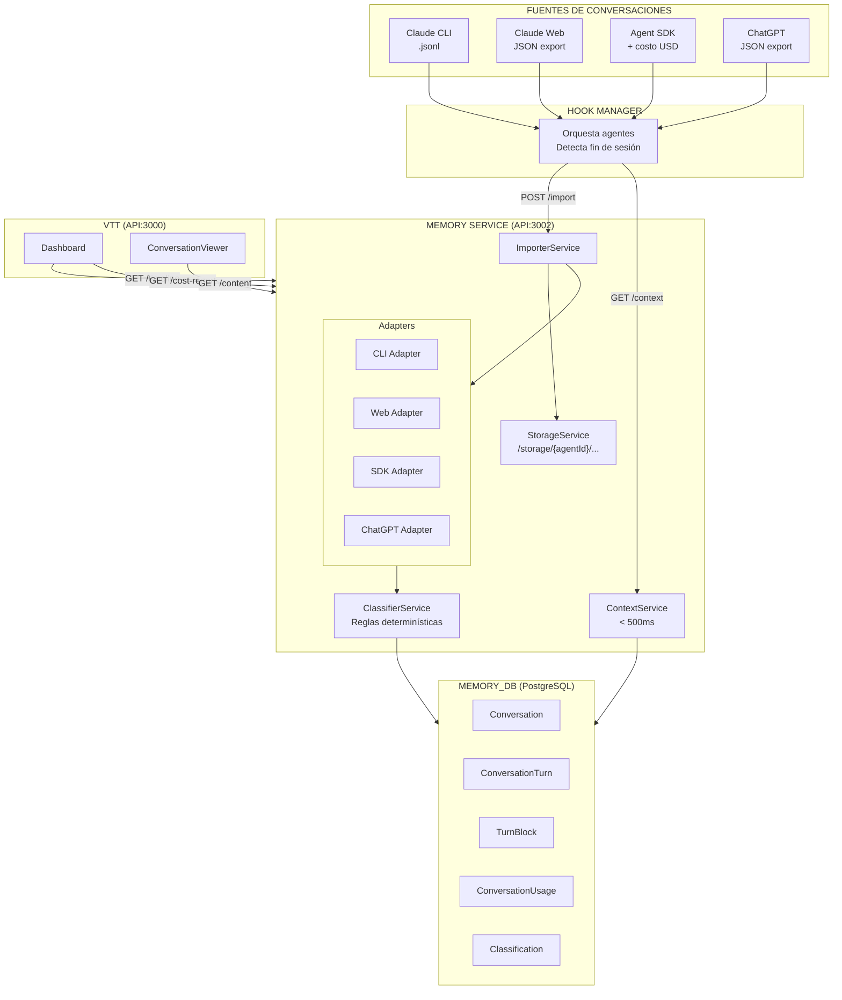
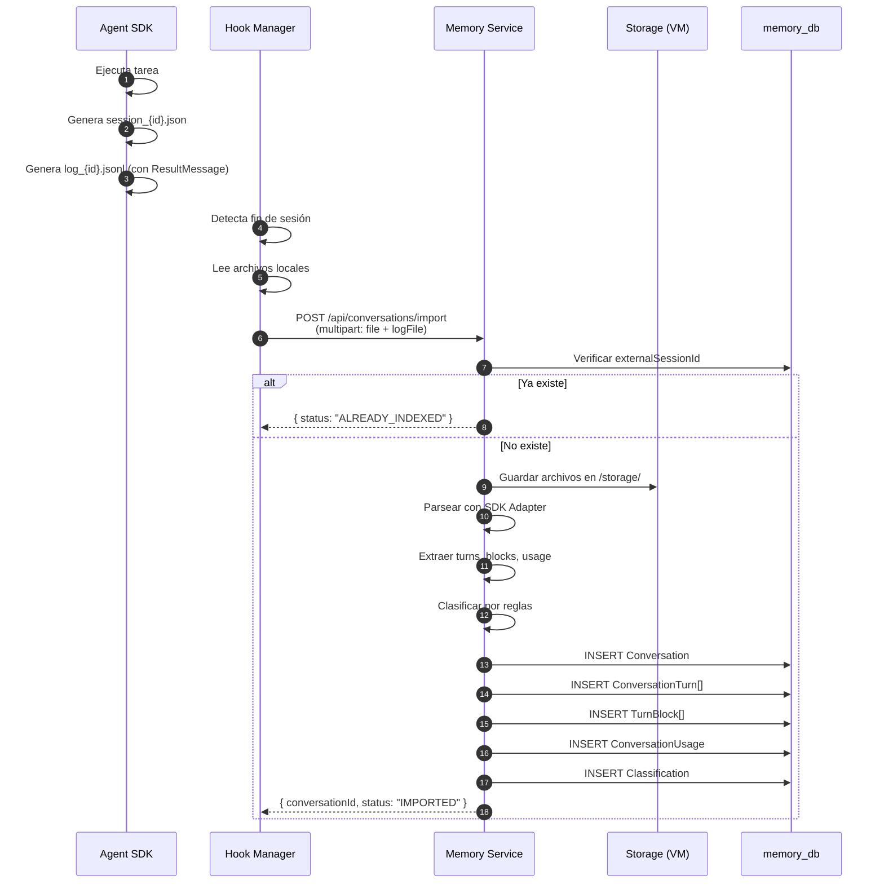
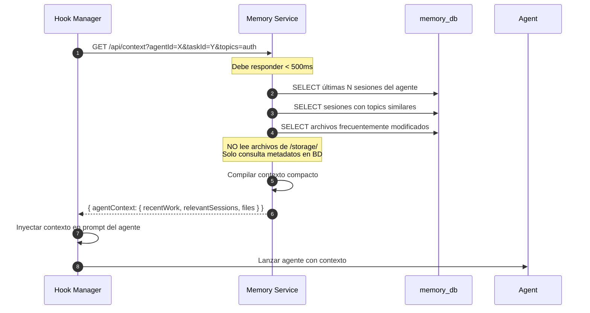

# MEMORY SERVICE — Documento Consolidado

**Proyecto:** Virtual Teams Memory (VTM)  
**Versión:** 1.2
**Fecha:** 2026-04-10
**Estado:** LISTO PARA REVISIÓN SA → AR → TL
**Basado en:** ANALISIS_PM_S01_memory-service.md v1.2 + Specs de SDK + PROCESO_ORQUESTADOR_ESTANDARES_v1.0.md
**Changelog v1.1:** Decisiones DB integradas (C-02 a C-05) — tipos STRING, taskKey/taskTitle, status, atomicidad
**Changelog v1.2:** Conversaciones multi-agente — nueva fuente VTT_CHANNEL, ConversationParticipant, AgentMessage, platformRefs, endpoint import-review, D-16

---

## ÍNDICE

1. [Resumen Ejecutivo](#1-resumen-ejecutivo)
2. [Contexto y Decisión de Arquitectura](#2-contexto-y-decisión-de-arquitectura)
3. [Objetivo del Módulo](#3-objetivo-del-módulo)
4. [Fuentes de Conversaciones](#4-fuentes-de-conversaciones)
5. [Arquitectura](#5-arquitectura)
6. [Modelo de Datos](#6-modelo-de-datos)
7. [Flujos Principales](#7-flujos-principales)
8. [API del Memory Service](#8-api-del-memory-service)
9. [Clasificación y Búsqueda](#9-clasificación-y-búsqueda)
10. [Relación con Otros Módulos](#10-relación-con-otros-módulos)
11. [Decisiones Tomadas (PM)](#11-decisiones-tomadas-pm)
12. [Preguntas Abiertas para SA/AR](#12-preguntas-abiertas-para-saar)
13. [Secuencia de Implementación](#13-secuencia-de-implementación)
14. [Diagramas Mermaid](#14-diagramas-mermaid)
15. [Referencias](#15-referencias)

---

## 1. RESUMEN EJECUTIVO

### 1.1 Qué es

El **Memory Service** es un servicio independiente responsable de:

1. **Recibir y persistir** conversaciones de agentes IA desde múltiples fuentes
2. **Clasificar e indexar** el contenido para búsqueda rápida
3. **Proveer contexto runtime** al Hook Manager antes de lanzar un agente
4. **Exponer historial acumulado** por agente para auditoría y métricas

### 1.2 Por qué es independiente

- **Proyecto propio** con repositorio separado
- **BD propia** (`memory_db`) — NO en `vtt_db`
- **Deploy independiente** en la VM
- **Sin dependencia de VTT en runtime** — trabaja solo con IDs como referencias

### 1.3 Qué NO es este módulo

| Elemento | Dónde vive |
|----------|------------|
| Tracking de costos CLI para VTT | Submódulo 5F (en VTT, sync manual) |
| Dashboard UI de costos | VTT Frontend |
| RBAC y permisos | VTT (cuando se active) |
| Hook Manager | Módulo separado (consume Memory Service) |

---

## 2. CONTEXTO Y DECISIÓN DE ARQUITECTURA

### 2.1 Lo que existía (VTM legacy)

Existía un módulo llamado **VTM (virtual-teams-memory)** que:

- Corre en `localhost:3002` — no está en la VM
- Almacena datos en archivos locales (JSONL, JSON) — no tiene persistencia en BD
- Fue diseñado para **visualizar** conversaciones históricas, no para ser consumido por agentes
- No tiene API de contexto runtime
- El schema de BD existente fue diseñado para clasificación semántica, no para el modelo que necesita el Hook Manager

### 2.2 Decisión

> **El Memory Service se diseña como proyecto independiente desde cero.**
> 
> El repo `virtual-teams-memory` existente **se descarta como base de implementación** — puede consultarse como referencia de lógica de parseo, pero no se migra ni se reutiliza su estructura.

---

## 3. OBJETIVO DEL MÓDULO

### 3.1 Consumidores del servicio

| Consumidor | Qué necesita | Endpoint |
|-----------|-------------|----------|
| **Hook Manager** | Contexto relevante ANTES de lanzar agente | `GET /api/context` |
| **Hook Manager** | Importar conversación DESPUÉS de que termina | `POST /api/conversations/import` |
| **Dashboard VTT** | Historial de conversaciones por agente | `GET /api/agents/:id/timeline` |
| **TL-Agent** | Contexto histórico para armar assignments | `GET /api/context` |
| **PM** | Métricas de costo por agente/tarea/proyecto | `GET /api/projects/:id/cost-report` |
| **ConversationViewer** | Texto completo para render | `GET /api/conversations/:id/content` |

### 3.2 Principios de diseño

| Principio | Decisión |
|-----------|---------|
| Proyecto independiente | Repo propio, BD propia, deploy independiente |
| BD propia | PostgreSQL `memory_db` en shared-postgres |
| Sin dependencia de VTT en runtime | No llama a VTT para funcionar |
| Referencia por ID | Usa `projectId`, `taskId`, `agentId` de VTT como referencias, sin FK cruzadas |
| Historial acumulado por agente | Conversaciones se acumulan en línea de tiempo, no aisladas |
| Contenido en archivos, metadatos en BD | BD liviana: guarda metadatos; contenido completo vive en archivos en la VM |
| Idempotencia | Si el mismo `externalSessionId` se importa dos veces, se ignora |
| Extensible a cualquier fuente | Campo `source` es string extensible, no enum cerrado |

---

## 4. FUENTES DE CONVERSACIONES

El Memory Service soporta **4 fuentes en R1** y es extensible a más:

### 4.1 Claude CLI (`CLAUDE_CLI`)

| Campo | Valor |
|-------|-------|
| **Origen** | Sesiones de Claude Code (`~/.claude/projects/{dir}/{sessionId}.jsonl`) |
| **Formato** | JSONL — una línea por evento (`user`, `assistant`, `tool_use`, `tool_result`) |
| **Datos** | Historial completo de turns, tool calls, archivos tocados, branch git |
| **Archivos** | 1 archivo `.jsonl` por sesión |
| **Costo** | ❌ No disponible |

### 4.2 Claude Web (`CLAUDE_WEB`)

| Campo | Valor |
|-------|-------|
| **Origen** | Export manual desde claude.ai |
| **Formato** | JSON único con `chat_messages[]` |
| **Datos** | Historial completo, timestamps, attachments |
| **Archivos** | 1 archivo `.json` |
| **Costo** | ❌ No disponible |

### 4.3 Agent SDK (`CLAUDE_SDK`)

| Campo | Valor |
|-------|-------|
| **Origen** | Agentes ejecutados via `claude_agent_sdk` (Python) |
| **Formato** | DOS archivos por sesión |
| **Archivos** | `session_{id}.json` (historial) + `log_{id}.jsonl` (eventos + ResultMessage) |
| **Datos** | Historial completo + **costo USD + tokens desagregados** |
| **Costo** | ✅ Disponible via `ResultMessage.total_cost_usd` |

**Estructura del ResultMessage (SDK):**

```python
ResultMessage:
  session_id          # UUID de la sesión
  total_cost_usd      # Costo total en USD
  usage               # Dict con tokens desagregados
  duration_ms         # Duración total en ms
  duration_api_ms     # Duración solo de llamadas API
  num_turns           # Número de turnos
  is_error            # True si terminó en error
  result              # Texto del resultado final
```

**Estructura del usage:**

```json
{
  "input_tokens": 1200,
  "output_tokens": 850,
  "cache_creation_input_tokens": 4500,
  "cache_read_input_tokens": 9800
}
```

### 4.4 ChatGPT Export (`CHATGPT`)

| Campo | Valor |
|-------|-------|
| **Origen** | Export manual desde ChatGPT (OpenAI) |
| **Formato** | JSON con estructura `mapping` (árbol de nodos) |
| **Datos** | Historial de turns |
| **Archivos** | 1 archivo `.json` |
| **Costo** | ❌ No disponible |

### 4.5 Canal del Orquestador (`VTT_CHANNEL`)

| Campo | Valor |
|-------|-------|
| **Origen** | Canal de comunicación entre agentes via Google Docs (protocolo `[VTT_MESSAGE]`) |
| **Formato** | Google Doc importado como `.md` — bloques `[VTT_MESSAGE]...[/VTT_MESSAGE]` |
| **Datos** | Mensajes estructurados con from/to/type/status, múltiples participantes, thread de respuestas |
| **Archivos** | `.md` importado desde Drive via `import-gdocs.ts` |
| **Costo** | ❌ No disponible |
| **Diferencia clave** | Es la única fuente con **múltiples agentes participantes** en la misma conversación |

### 4.6 Extensibilidad futura

El campo `source` es un **string extensible** para soportar:
- Gemini, Copilot, otros modelos de IA
- Importación manual desde cualquier formato

---

## 5. ARQUITECTURA

### 5.1 Vista de componentes

```
VM (Hetzner 77.42.88.106)
├── VTT Backend (API:3000) ─── PostgreSQL vtt_db
├── Hook Manager (orquesta agentes)
│     ├── PRE-corrida:  GET /api/context → Memory Service
│     └── POST-corrida: POST /api/conversations/import → Memory Service
│
└── Memory Service (API:3002) ─── PostgreSQL memory_db
      ├── ImporterService (recibe archivos, parsea, persiste)
      ├── Adapters (CLI, Web, SDK, ChatGPT)
      ├── ClassifierService (reglas determinísticas)
      ├── ContextService (contexto runtime < 500ms)
      ├── StorageService (archivos en filesystem VM)
      └── /storage/{agentId}/{YYYY-MM}/{externalSessionId}/
```

### 5.2 Separación de bases de datos

| Base de datos | Contenido | Puerto |
|---------------|-----------|--------|
| `vtt_db` | Proyectos, fases, tareas, usuarios, permisos, costos CLI | 5432 |
| `memory_db` | Conversaciones, turns, clasificaciones, índices, timeline | 5432 |

**Beneficio:** Memory Service es reutilizable para múltiples proyectos.

### 5.3 Almacenamiento de archivos

Los archivos originales se **copian físicamente a la VM** y quedan almacenados permanentemente:

```
/storage/
└── {agentId}/
    └── {YYYY-MM}/
        └── {externalSessionId}/
            ├── session.jsonl      # CLI
            ├── session.json       # SDK/Web
            ├── log.jsonl          # SDK (con ResultMessage)
            └── attachments/       # Web (si hay)
```

---

## 6. MODELO DE DATOS

### 6.1 Entidades principales

```
┌─────────────────────────────────────────────────────────────────────────┐
│                              memory_db                                   │
├─────────────────────────────────────────────────────────────────────────┤
│                                                                         │
│  ┌─────────────────────┐                                               │
│  │    Conversation     │                                               │
│  │─────────────────────│                                               │
│  │ id (PK)             │                                               │
│  │ externalSessionId   │ ← sessionId original (deduplicación)          │
│  │ source              │ ← CLAUDE_CLI | CLAUDE_WEB | CLAUDE_SDK | ...  │
│  │ agentId             │ → String (Task.id de VTT — TEXT, no UUID)     │
│  │ projectId           │ → String (Project.id de VTT — TEXT)           │
│  │ taskId              │ → String? (Task.id de VTT — TEXT, nullable)   │
│  │ taskKey             │ ← String? campo auxiliar (ej: "VTT-123")      │
│  │ taskTitle           │ ← String? enviado por Hook Manager en import   │
│  │ conversationType    │ ← TASK_EXECUTION | AGENT_REVIEW | AGENT_CLARIFICATION │
│  │ platformRefs        │ ← JSON? { claude_web, claude_code, chatgpt }   │
│  │ reviewRound         │ ← Int? ronda de revisión (1,2,3 — solo REVIEW) │
│  │ outputFilePath      │ ← String? doc generado por la revisión         │
│  │ startedAt           │                                               │
│  │ endedAt             │                                               │
│  │ turnCount           │                                               │
│  │ status              │ ← PENDING | PROCESSING | IMPORTED | ERROR     │
│  │ filePath            │ ← ruta al archivo en /storage/ (set en paso 3)│
│  │ logFilePath         │ ← ruta al log (solo SDK)                      │
│  └──────────┬──────────┘                                               │
│             │ 1:N                                                       │
│             ▼                                                           │
│  ┌─────────────────────┐                                               │
│  │  ConversationTurn   │                                               │
│  │─────────────────────│                                               │
│  │ id (PK)             │                                               │
│  │ conversationId (FK) │                                               │
│  │ turnIndex           │ ← 0, 1, 2...                                  │
│  │ role                │ ← USER | ASSISTANT | SYSTEM                   │
│  │ timestamp           │                                               │
│  │ contentPreview      │ ← primeros 500 chars (para búsqueda rápida)   │
│  └──────────┬──────────┘                                               │
│             │ 1:N                                                       │
│             ▼                                                           │
│  ┌─────────────────────┐                                               │
│  │     TurnBlock       │ ← Metadatos, NO contenido completo            │
│  │─────────────────────│                                               │
│  │ id (PK)             │                                               │
│  │ turnId (FK)         │                                               │
│  │ blockIndex          │                                               │
│  │ blockType           │ ← TEXT | TOOL_USE | TOOL_RESULT | THINKING    │
│  │ toolName            │ ← Read, Edit, Write, Bash, Glob, Grep...      │
│  │ filePath            │ ← archivo tocado (si aplica)                  │
│  │ success             │ ← para TOOL_RESULT                            │
│  │ contentLength       │ ← tamaño del contenido                        │
│  └─────────────────────┘                                               │
│                                                                         │
│  ┌──────────────────────────┐                                          │
│  │ ConversationParticipant  │ ← Solo para conversationType != TASK_EXECUTION │
│  │──────────────────────────│                                          │
│  │ id (PK)                  │                                          │
│  │ conversationId (FK)      │                                          │
│  │ agentId                  │ ← String (VTT User.id)                   │
│  │ agentRole                │ ← PM_REVISOR | AR | TL | DB | SA | ...   │
│  │ platform                 │ ← CLAUDE_WEB | CLAUDE_CODE | CHATGPT     │
│  └──────────────────────────┘                                          │
│                                                                         │
│  ┌──────────────────────────┐                                          │
│  │      AgentMessage        │ ← Solo para source=VTT_CHANNEL           │
│  │──────────────────────────│ ← captura protocolo [VTT_MESSAGE]        │
│  │ id (PK)                  │                                          │
│  │ conversationId (FK)      │                                          │
│  │ messageId                │ ← "AR-001", "PM-002"                     │
│  │ inReplyTo                │ ← messageId referenciado (nullable)      │
│  │ fromAgentId              │ ← String (VTT User.id)                   │
│  │ toAgentId                │ ← String (VTT User.id)                   │
│  │ messageType              │ ← REVIEW_REQUEST | REVIEW_RESPONSE |     │
│  │                          │   CLARIFICATION | DECISION | BLOCKER     │
│  │ messageStatus            │ ← OPEN | ACK | IN_PROGRESS | BLOCKED |  │
│  │                          │   DONE | REJECTED                        │
│  │ priority                 │ ← HIGH | MEDIUM | LOW                    │
│  │ topic                    │                                          │
│  │ body                     │ ← contenido del mensaje                  │
│  │ expectedOutput           │ ← nullable                               │
│  │ timestamp                │                                          │
│  └──────────────────────────┘                                          │
│                                                                         │
│  ┌─────────────────────┐                                               │
│  │ ConversationUsage   │ ← Solo para source=CLAUDE_SDK                 │
│  │─────────────────────│                                               │
│  │ id (PK)             │                                               │
│  │ conversationId (FK) │ ← UNIQUE                                      │
│  │ inputTokens         │                                               │
│  │ outputTokens        │                                               │
│  │ cacheCreationTokens │                                               │
│  │ cacheReadTokens     │                                               │
│  │ costUsd             │ ← del ResultMessage                           │
│  │ durationMs          │                                               │
│  │ modelId             │                                               │
│  │ isError             │                                               │
│  └─────────────────────┘                                               │
│                                                                         │
│  ┌─────────────────────┐                                               │
│  │   Classification    │ ← Clasificación automática por reglas         │
│  │─────────────────────│                                               │
│  │ id (PK)             │                                               │
│  │ conversationId (FK) │                                               │
│  │ topics[]            │ ← authentication, database, frontend...       │
│  │ workType            │ ← implementation, bug-fix, review, migration  │
│  │ filesModified[]     │ ← lista de archivos tocados                   │
│  │ entities[]          │ ← AuthService, PrismaClient...                │
│  │ confidence          │ ← 0.0 - 1.0                                   │
│  │ classifiedAt        │                                               │
│  │ classifiedBy        │ ← rules-v1                                    │
│  └─────────────────────┘                                               │
│                                                                         │
└─────────────────────────────────────────────────────────────────────────┘
```

### 6.2 Índices recomendados

```sql
-- Deduplicación
CREATE UNIQUE INDEX idx_conversation_external ON conversation(externalSessionId);

-- Búsqueda por agente
CREATE INDEX idx_conversation_agent ON conversation(agentId);

-- Búsqueda por proyecto
CREATE INDEX idx_conversation_project ON conversation(projectId);

-- Timeline ordenado
CREATE INDEX idx_conversation_timeline ON conversation(agentId, startedAt DESC);

-- Búsqueda por archivos modificados
CREATE INDEX idx_turnblock_filepath ON turn_block(filePath) WHERE filePath IS NOT NULL;

-- Clasificación por topics (GIN para array)
CREATE INDEX idx_classification_topics ON classification USING GIN(topics);

-- Clasificación por archivos modificados (GIN para array)
CREATE INDEX idx_classification_files ON classification USING GIN(files_modified);

-- Conversaciones multi-agente por participante
CREATE INDEX idx_participant_agent ON conversation_participant(agentId);

-- Timeline por tipo de conversación
CREATE INDEX idx_conversation_type ON conversation(agentId, conversationType, startedAt DESC);

-- AgentMessage por conversación y estado
CREATE INDEX idx_agent_message_conv ON agent_message(conversationId, messageStatus);
```

---

## 7. FLUJOS PRINCIPALES

### 7.1 Flujo A: Importación automática (Hook Manager)

```
Agente termina corrida (SDK)
    │
    ├─ Genera session_{id}.json + log_{id}.jsonl
    │
    ▼
Hook Manager detecta fin de sesión
    │
    ├─ Lee archivos locales
    │
    ▼
POST /api/conversations/import (multipart/form-data)
    │
    ├─ source: "CLAUDE_SDK"
    ├─ agentId: UUID
    ├─ projectId: UUID
    ├─ taskId: UUID (opcional)
    ├─ externalSessionId: session_id
    ├─ file: session_{id}.json
    └─ logFile: log_{id}.jsonl
    │
    ▼
Memory Service ImporterService
    │
    ├─ 1. Verificar idempotencia (externalSessionId no existe)
    ├─ 2. INSERT Conversation { status: PENDING }         ← paso 1 atomicidad
    ├─ 3. Escribir archivo(s) en /storage/{agentId}/{YYYY-MM}/{externalSessionId}/
    │      Si falla → registro queda en PENDING → job de cleanup lo reintenta o marca ERROR
    ├─ 4. Detectar formato por source
    ├─ 5. Parsear con adapter correspondiente
    ├─ 6. Extraer metadatos (turns, blocks, usage)
    ├─ 7. Clasificar por reglas determinísticas
    ├─ 8. Persistir turns, blocks, usage, classification en memory_db
    ├─ 9. UPDATE Conversation { status: IMPORTED, filePath, logFilePath } ← paso 3 atomicidad
    └─ 10. Retornar { conversationId, status: "IMPORTED" }
```

### 7.2 Flujo B: Contexto runtime (pre-corrida)

```
Hook Manager prepara lanzar agente
    │
    ▼
GET /api/context?agentId=X&taskId=Y&projectId=Z&topics=auth,jwt&limit=5
    │
    ▼
Memory Service ContextService (< 500ms)
    │
    ├─ 1. Buscar últimas N sesiones del agente (query BD)
    ├─ 2. Buscar sesiones con topics similares (query BD)
    ├─ 3. Extraer filesModified frecuentes (query BD)
    ├─ 4. Compilar contexto compacto (NO lee archivos)
    │
    ▼
Response:
{
  "agentContext": {
    "recentWork": [...],
    "relevantSessions": [...],
    "filesFrequentlyModified": ["src/auth.service.ts"],
    "lessonsLearned": [],
    "estimatedCost": 0.50
  }
}
    │
    ▼
Hook Manager inyecta contexto en prompt del agente
```

### 7.3 Flujo C: Importación manual (UI)

```
Usuario sube archivo desde ConversationViewer en VTT
    │
    ▼
POST /api/conversations/upload (multipart/form-data)
    │
    ▼
Mismo proceso que Flujo A desde paso 1
    │
    ▼
UI muestra confirmación con conversationId
```

### 7.5 Flujo E: Importación de conversación multi-agente (VTT_CHANNEL)

```
Poller detecta cambio en Google Doc (modifiedTime)
    │
    ▼
import-gdocs.ts importa Doc → docs/inbox/drive/imported/channels/CANAL_PM_REVISOR.md
    │
    ▼
parse-vtt.ts extrae bloques [VTT_MESSAGE]
    │ (strip escapes: \[VTT\_MESSAGE\] → [VTT_MESSAGE])
    ▼
POST /api/conversations/import-review (JSON)
    │
    ├─ conversationId: "VTT-VTT-345-S01-REVIEW-20260411-a3f2"
    ├─ channelId: "CANAL_PM_REVISOR"
    ├─ projectId: string
    ├─ taskId?: string
    ├─ taskKey?: string
    ├─ taskTitle?: string
    ├─ participants: [{ agentId, agentRole, platform }]
    ├─ messages: [{ messageId, inReplyTo, from, to, type, status, priority, topic, body, timestamp }]
    └─ platformRefs?: { claude_web, claude_code, chatgpt }
    │
    ▼
Memory Service ReviewImporterService
    │
    ├─ 1. Verificar idempotencia por conversationId
    ├─ 2. INSERT Conversation { conversationType: AGENT_REVIEW, status: PENDING }
    ├─ 3. Guardar .md en /storage/channels/{channelId}/{conversationId}/
    ├─ 4. INSERT ConversationParticipant[] por cada participante
    ├─ 5. INSERT AgentMessage[] por cada bloque [VTT_MESSAGE]
    ├─ 6. Clasificar por topics y workType
    ├─ 7. UPDATE Conversation { status: IMPORTED, filePath }
    └─ 8. Retornar { conversationId, status: "IMPORTED", messageCount }
```

> **Nota:** Si el mismo Google Doc se vuelve a importar con nuevos mensajes al final (append-only), el sistema detecta mensajes nuevos por `messageId` y solo inserta los que no existen — la conversación se actualiza incrementalmente.

### 7.4 Flujo D: Lectura para render (ConversationViewer)

```
ConversationViewer en VTT Frontend
    │
    ├─ GET /api/agents/{agentId}/timeline (metadatos — BD)
    │
    ▼
Usuario selecciona conversación específica
    │
    ├─ GET /api/conversations/{id}/content (texto completo — lee archivo de VM)
    │
    ▼
ConversationViewer renderiza los turns
```

---

## 8. API DEL MEMORY SERVICE

### 8.1 Endpoints de importación

#### POST /api/conversations/import

Importación automática desde Hook Manager.

```
Content-Type: multipart/form-data

source: "CLAUDE_CLI" | "CLAUDE_WEB" | "CLAUDE_SDK" | "CHATGPT" | string
agentId: string             // Task.id de VTT — TEXT
projectId: string           // Project.id de VTT — TEXT
taskId?: string             // Task.id de VTT — TEXT (nullable)
taskKey?: string            // Task.key legible, ej: "VTT-123" (auxiliar, no FK)
taskTitle?: string          // Título de la tarea — enviado por Hook Manager, desnormalizado
externalSessionId: string
file: [archivo principal]
logFile?: [log_{id}.jsonl]  // solo para CLAUDE_SDK
```

**Response 200:**
```json
{
  "conversationId": "uuid",
  "status": "IMPORTED",
  "turnCount": 12,
  "hasUsage": true,
  "costUsd": 0.82
}
```

**Response 200 (duplicado):**
```json
{
  "status": "ALREADY_INDEXED",
  "existingConversationId": "uuid"
}
```

#### POST /api/conversations/upload

Importación manual desde UI (mismo procesamiento que `/import`).

---

#### POST /api/conversations/import-review

Importación de conversaciones multi-agente desde canal `[VTT_MESSAGE]`.

```
Content-Type: application/json

{
  "conversationId": "VTT-VTT-345-S01-REVIEW-20260411-a3f2",
  "channelId": "CANAL_PM_REVISOR",
  "projectId": "string",
  "taskId": "string (optional)",
  "taskKey": "VTT-345 (optional)",
  "taskTitle": "string (optional)",
  "platformRefs": {
    "claude_web": "uuid (optional)",
    "claude_code": "uuid (optional)",
    "chatgpt": "uuid (optional)"
  },
  "participants": [
    { "agentId": "string", "agentRole": "AR", "platform": "CLAUDE_WEB" },
    { "agentId": "string", "agentRole": "PM_REVISOR", "platform": "CLAUDE_CODE" }
  ],
  "messages": [
    {
      "messageId": "PM-001",
      "inReplyTo": null,
      "from": "PM_REVISOR",
      "to": "AR",
      "type": "REVIEW_REQUEST",
      "status": "OPEN",
      "priority": "HIGH",
      "topic": "Validar modelo dinámico v4",
      "body": "...",
      "expectedOutput": "ANALISIS_AR_S01_VTT-345.md",
      "timestamp": "2026-04-11T03:00:00"
    }
  ]
}
```

**Response 200:**
```json
{
  "conversationId": "VTT-VTT-345-S01-REVIEW-20260411-a3f2",
  "status": "IMPORTED",
  "messageCount": 4,
  "participantCount": 2
}
```

> **Decisión arquitectónica (D-16):** El ingress es separado (`/import` vs `/import-review`) pero la capa de storage es compartida — ambos llaman `storage.saveConversation()` con el mismo modelo en BD.

---

### 8.2 Endpoints de consulta

#### GET /api/agents/{agentId}/timeline

Historial acumulado del agente — incluye tanto ejecuciones de tareas como conversaciones de revisión donde el agente participó.

```
Query params:
  projectId?: string
  conversationType?: TASK_EXECUTION | AGENT_REVIEW | AGENT_CLARIFICATION
  limit?: number (default 10)
  offset?: number
```

**Response 200:**
```json
{
  "agentId": "uuid",
  "projectId": "uuid",
  "totalSessions": 47,
  "totalCostUsd": 12.45,
  "timeline": [
    {
      "conversationId": "uuid",
      "conversationType": "TASK_EXECUTION",
      "source": "CLAUDE_SDK",
      "date": "2026-04-01",
      "taskId": "uuid",
      "taskKey": "VTT-123",
      "taskTitle": "Implementar auth service",
      "turnCount": 18,
      "filesModified": ["src/auth.service.ts"],
      "topics": ["authentication", "jwt"],
      "costUsd": 0.82
    },
    {
      "conversationId": "VTT-VTT-345-S01-REVIEW-20260411-a3f2",
      "conversationType": "AGENT_REVIEW",
      "source": "VTT_CHANNEL",
      "date": "2026-04-11",
      "taskKey": "VTT-345",
      "taskTitle": "Modelo dinámico v4",
      "messageCount": 6,
      "reviewRound": 1,
      "topics": ["data-model", "architecture"],
      "costUsd": null
    }
  ]
}
```

#### GET /api/context

Contexto runtime para Hook Manager (< 500ms).

```
Query params:
  agentId: UUID (required)
  projectId: UUID (required)
  taskId?: UUID
  topics?: string (comma-separated)
  limit?: number (default 5)
```

**Response 200:**
```json
{
  "agentContext": {
    "recentWork": [
      {
        "conversationId": "uuid",
        "conversationType": "TASK_EXECUTION",
        "date": "2026-04-01",
        "taskKey": "VTT-122",
        "summary": "Implementó middleware de auth"
      }
    ],
    "relevantSessions": [...],
    "relevantReviews": [
      {
        "conversationId": "VTT-VTT-345-S01-REVIEW-...",
        "conversationType": "AGENT_REVIEW",
        "date": "2026-04-11",
        "taskKey": "VTT-345",
        "topic": "Validar modelo dinámico v4",
        "outcome": "DONE"
      }
    ],
    "filesFrequentlyModified": ["src/auth.service.ts", "src/middleware/auth.ts"],
    "lessonsLearned": [],
    "estimatedCostUsd": 0.50
  }
}
```

#### GET /api/conversations/{id}/content

Texto completo de la conversación (lee archivo de VM).

**Response 200:**
```json
{
  "conversationId": "uuid",
  "source": "CLAUDE_SDK",
  "turns": [
    {
      "turnIndex": 0,
      "role": "user",
      "content": "Implementa el auth service...",
      "timestamp": "2026-04-01T10:00:00Z"
    },
    {
      "turnIndex": 1,
      "role": "assistant",
      "content": "Voy a crear el archivo...",
      "timestamp": "2026-04-01T10:00:15Z",
      "blocks": [
        {
          "type": "text",
          "content": "..."
        },
        {
          "type": "tool_use",
          "tool": "Write",
          "filePath": "src/auth.service.ts"
        }
      ]
    }
  ]
}
```

#### GET /api/projects/{projectId}/cost-report

Reporte de costos por proyecto.

**Response 200:**
```json
{
  "projectId": "uuid",
  "totalCostUsd": 45.67,
  "totalSessions": 120,
  "byAgent": [
    {
      "agentId": "uuid",
      "agentName": "BE-Agent",
      "sessions": 45,
      "costUsd": 18.30
    }
  ],
  "byTask": [
    {
      "taskId": "VTT-123",
      "sessions": 3,
      "costUsd": 2.46
    }
  ]
}
```

---

## 9. CLASIFICACIÓN Y BÚSQUEDA

### 9.1 Clasificación R1 (reglas determinísticas)

Para R1, la clasificación usa **reglas determinísticas** (sin LLM, sin embeddings):

| Clasificación | Método |
|---------------|--------|
| Topics | Keywords en tool calls y archivos (`auth`, `prisma`, `migration`, `docker`) |
| Tipo de trabajo | Patrones (`implementation`, `bug-fix`, `review`, `migration`, `deploy`) |
| Archivos modificados | Extraídos de `tool_use` blocks con `toolName = Write/Edit` |
| Entidades | Nombres de clases/servicios detectados en paths |

Las reglas son **configurables** — lista de keywords por topic guardada en archivo de configuración.

### 9.2 Evolución futura (R2+)

| Versión | Funcionalidad |
|---------|---------------|
| R1 | Reglas determinísticas |
| R2 | Full-text search sobre contenido |
| R3 | Embeddings + búsqueda semántica |
| R4 | Graph search + relaciones entre entidades |

---

## 10. RELACIÓN CON OTROS MÓDULOS

### 10.1 Diagrama de integración

```
┌─────────────────────────────────────────────────────────────────────────┐
│                              VM (Hetzner)                                │
│                                                                         │
│  ┌─────────────────┐    ┌─────────────────┐    ┌─────────────────────┐ │
│  │   VTT Backend   │    │  Hook Manager   │    │   Memory Service    │ │
│  │    (API:3000)   │    │                 │    │     (API:3002)      │ │
│  │                 │    │                 │    │                     │ │
│  │ - Proyectos     │    │ - Orquesta      │◄──►│ - Almacena          │ │
│  │ - Tareas        │    │ - Lanza agentes │    │ - Clasifica         │ │
│  │ - Usuarios      │    │ - Reporta       │    │ - Indexa            │ │
│  │ - Costos (5F)   │    │                 │    │ - Provee contexto   │ │
│  └────────┬────────┘    └────────┬────────┘    └──────────┬──────────┘ │
│           │                      │                        │            │
│           │                      │                        │            │
│           └──────────────────────┼────────────────────────┘            │
│                                  │                                      │
│                                  ▼                                      │
│                    ┌─────────────────────────┐                         │
│                    │   Agent Runtime (SDK)   │                         │
│                    │                         │                         │
│                    │ Genera:                 │                         │
│                    │ - session_{id}.json     │                         │
│                    │ - log_{id}.jsonl        │                         │
│                    └─────────────────────────┘                         │
│                                                                         │
└─────────────────────────────────────────────────────────────────────────┘
```

### 10.2 Interacciones

| De | A | Qué | Endpoint |
|----|---|-----|----------|
| Hook Manager | Memory Service | Obtener contexto pre-corrida | `GET /api/context` |
| Hook Manager | Memory Service | Importar conversación post-corrida (individual) | `POST /api/conversations/import` |
| Orquestador RunTime | Memory Service | Importar canal multi-agente ([VTT_MESSAGE]) | `POST /api/conversations/import-review` |
| VTT Frontend | Memory Service | Obtener timeline de agente (todos los tipos) | `GET /api/agents/:id/timeline` |
| VTT Frontend | Memory Service | Obtener contenido de conversación | `GET /api/conversations/:id/content` |
| VTT Dashboard | Memory Service | Obtener reporte de costos | `GET /api/projects/:id/cost-report` |

### 10.3 Diferencia con Submódulo 5F (Costos VTT)

| Aspecto | Memory Service | Submódulo 5F |
|---------|----------------|--------------|
| **Ubicación** | Proyecto independiente | Dentro de VTT |
| **BD** | `memory_db` | `vtt_db` |
| **Fuentes** | 4 (CLI, Web, SDK, ChatGPT) | Solo CLI JSONL |
| **Carga** | Automática via Hook Manager | Manual via endpoint |
| **Propósito** | Contexto runtime + historial | Auditoría de costos |
| **Costo** | Solo SDK tiene costo real | Calcula desde pricing catalog |

---

## 11. DECISIONES TOMADAS (PM + DB Engineer)

| # | Decisión | Detalle | Owner |
|---|---------|---------|-------|
| D-01 | Archivos se copian a la VM | Hook Manager envía archivo via multipart. Memory Service lo almacena en filesystem. No hay lectura remota. | PM |
| D-02 | SDK envía dos archivos | `session_{id}.json` + `log_{id}.jsonl`. Ambos en el mismo request multipart. | PM |
| D-03 | Idempotencia por externalSessionId | Si el mismo archivo llega dos veces, retorna `ALREADY_INDEXED` sin error. | PM |
| D-04 | Storage organizado por agente/fecha | `/storage/{agentId}/{YYYY-MM}/{externalSessionId}/` | PM |
| D-05 | ConversationViewer permanece en VTT | Se rediseña para consumir la API del Memory Service. Tarea FE separada. | PM |
| D-06 | VTM existente se descarta | No se migra. Se parte de cero. | PM |
| D-07 | AgentTimeline = query ordenado | No es estructura especial — es `ORDER BY startedAt DESC` sobre `Conversation`. | PM |
| D-08 | Contexto runtime < 500ms | El endpoint `/api/context` debe responder en menos de 500ms. Solo consulta BD, no lee archivos. | PM |
| D-09 | Clasificación R1 sin LLM | Reglas determinísticas. Embeddings y búsqueda semántica son R2+. | PM |
| D-10 | Campo source extensible | String, no enum cerrado. Permite agregar fuentes sin migración. | PM |
| D-11 | IDs como `String` (TEXT), no UUID nativo | `agentId`, `projectId`, `taskId` son `String` en Prisma — consistente con VTT donde todos los IDs son `TEXT`. No usar `@db.Uuid`. | DB |
| D-12 | `taskId` almacena `Task.id` (UUID) | FK real. Agregar `taskKey String?` como campo auxiliar para el código legible (`VTT-123`). No usar `taskKey` como FK. | DB |
| D-13 | `taskTitle` se guarda en el import | Hook Manager envía `taskTitle` en `POST /import`. Se almacena en `Conversation.taskTitle String?`. Campo desnormalizado deliberado — evita llamar a VTT en runtime. El valor histórico al momento del import es suficiente. | DB |
| D-14 | Status: `PENDING \| PROCESSING \| IMPORTED \| ERROR` | `IMPORTED` reemplaza `INDEXED`. Se agrega `PENDING` como estado inicial antes de procesar. | DB |
| D-15 | Atomicidad por compensación (save-then-write) | 1) `INSERT Conversation { status: PENDING }` → 2) escribir archivo en filesystem → 3) `UPDATE { status: IMPORTED, filePath }`. Si paso 2 falla → queda en `PENDING` → job de cleanup reintenta o marca `ERROR`. Evita inconsistencias sin visibilidad. | DB |
| D-16 | Endpoints de importación separados por tipo | `POST /import` para archivos JSONL/JSON de agentes individuales. `POST /import-review` para canales `[VTT_MESSAGE]` multi-agente. Payloads incompatibles (multipart vs JSON, 1 agente vs N agentes, parser JSONL vs parser VTT). La unificación ocurre en la capa de storage — ambos llaman `storage.saveConversation()` con el mismo modelo en BD. | AR |
| D-17 | `conversationType` define el tipo de conversación | `TASK_EXECUTION` = un agente ejecuta una tarea (actual). `AGENT_REVIEW` = múltiples agentes revisando un entregable. `AGENT_CLARIFICATION` = aclaración puntual entre agentes. Solo `AGENT_REVIEW` y `AGENT_CLARIFICATION` crean registros en `ConversationParticipant` y `AgentMessage`. | PM |
| D-18 | Import incremental para canales VTT_CHANNEL | Los Google Docs son append-only. Si el mismo `conversationId` se reimporta con nuevos mensajes, se insertan solo los `messageId` que no existen. La conversación se actualiza sin duplicar mensajes anteriores. | PM |
| D-19 | `platformRefs` vincula la misma conversación lógica entre plataformas | Permite rastrear que la sesión de Claude Web `01e4b085-...` y la sesión de Claude Code `04841bcf-...` son parte del mismo trabajo lógico. Campo JSON nullable en `Conversation`. | PM |

---

## 12. PREGUNTAS ABIERTAS PARA SA/AR

| # | Pregunta | Para quién | Estado |
|---|---------|-----------|--------|
| Q-01 | ¿`agentId` en Memory Service es el mismo `User.id` de VTT, o se crea un catálogo propio de agentes? | SA | 🟡 Pendiente |
| Q-03 | ¿Cómo se autentica el Hook Manager contra Memory Service? ¿Service key compartida o token independiente? | AR | 🟡 Pendiente |
| Q-04 | ~~¿Memory Service necesita consultarle algo a VTT en runtime?~~ **RESUELTO (D-13):** Hook Manager envía `taskTitle` en el import. Memory Service no llama a VTT. | SA | ✅ Resuelto |
| Q-05 | ¿El contexto runtime (RF-003) puede ser asíncrono o siempre debe ser síncrono (< 500ms)? | AR | 🟡 Pendiente |

---

## 13. SECUENCIA DE IMPLEMENTACIÓN

| Sprint | Contenido | Owner |
|--------|-----------|-------|
| S01 | Schema Prisma `memory_db` + migraciones | DB Engineer |
| S01 | POST /import — CLI adapter + storage en VM | BE |
| S02 | POST /import — SDK adapter (dos archivos, costo) | BE |
| S02 | GET /agents/:id/timeline | BE |
| S03 | GET /conversations/:id/content (para render VTT) | BE |
| S03 | GET /context (contexto runtime < 500ms) | BE |
| S04 | POST /import — Web + ChatGPT adapters | BE |
| S04 | GET /cost-report endpoints | BE |
| S05 | POST /upload (importación manual) | BE |
| S06 | Deploy en VM + integración Hook Manager | DevOps + BE |
| S07 | Rediseño ConversationViewer en VTT | FE |

**Estimación total:** ~6-7 sprints

---

## 14. DIAGRAMAS MERMAID

### 14.1 Arquitectura High-Level



### 14.2 Flujo de Importación



### 14.3 Flujo de Contexto Runtime



### 14.4 Modelo de Datos (ERD)

```mermaid
erDiagram
    Conversation ||--o{ ConversationTurn : "tiene"
    ConversationTurn ||--o{ TurnBlock : "contiene"
    Conversation ||--o| ConversationUsage : "tiene métricas"
    Conversation ||--o| Classification : "clasificada como"

    Conversation {
        string id PK
        string externalSessionId UK "sessionId original"
        string source "CLAUDE_CLI, CLAUDE_SDK..."
        string agentId "→ VTT User.id (TEXT)"
        string projectId "→ VTT Project.id (TEXT)"
        string taskId "nullable → VTT Task.id (TEXT)"
        string taskKey "nullable → VTT Task.key (VTT-123)"
        string taskTitle "nullable → desnormalizado, enviado en import"
        datetime startedAt
        datetime endedAt
        int turnCount
        string status "PENDING, PROCESSING, IMPORTED, ERROR"
        string filePath "ruta en /storage/ (set en paso 3)"
        string logFilePath "solo SDK"
    }
    
    ConversationTurn {
        uuid id PK
        uuid conversationId FK
        int turnIndex "0, 1, 2..."
        string role "USER, ASSISTANT, SYSTEM"
        datetime timestamp
        string contentPreview "primeros 500 chars"
    }
    
    TurnBlock {
        uuid id PK
        uuid turnId FK
        int blockIndex
        string blockType "TEXT, TOOL_USE, TOOL_RESULT, THINKING"
        string toolName "Read, Edit, Write, Bash..."
        string filePath "archivo tocado"
        boolean success "para TOOL_RESULT"
        int contentLength
    }
    
    ConversationUsage {
        uuid id PK
        uuid conversationId FK UK
        int inputTokens
        int outputTokens
        int cacheCreationTokens
        int cacheReadTokens
        decimal costUsd "del ResultMessage"
        int durationMs
        string modelId
        boolean isError
    }
    
    Classification {
        uuid id PK
        uuid conversationId FK
        array topics "authentication, database..."
        string workType "implementation, bug-fix..."
        array filesModified
        array entities "AuthService, PrismaClient..."
        float confidence "0.0 - 1.0"
        datetime classifiedAt
        string classifiedBy "rules-v1"
    }
```

### 14.5 Comparativa Memory Service vs Submódulo 5F

```mermaid
flowchart LR
    subgraph MS["MEMORY SERVICE"]
        direction TB
        MS1["Proyecto independiente"]
        MS2["BD: memory_db"]
        MS3["4 fuentes: CLI, Web, SDK, ChatGPT"]
        MS4["Carga automática via Hook Manager"]
        MS5["Propósito: Contexto runtime + historial"]
        MS6["Costo: Solo SDK tiene real"]
    end
    
    subgraph F5["SUBMÓDULO 5F (VTT)"]
        direction TB
        F51["Dentro de VTT"]
        F52["BD: vtt_db"]
        F53["Solo CLI JSONL"]
        F54["Carga manual via endpoint"]
        F55["Propósito: Auditoría de costos"]
        F56["Costo: Calcula desde pricing catalog"]
    end
    
    MS -.->|"Diferentes propósitos"| F5
```



---

## 15. REFERENCIAS

| Documento | Uso |
|-----------|-----|
| `ANALISIS_PM_S01_memory-service.md` | Documento maestro de requerimientos |
| `1_CONVERSATION_SPEC.md` | Schema de conversation.jsonl (SDK) |
| `1_USAGE_TRACKER_SPEC.md` | Schema de usage.jsonl + ResultMessage |
| `1_METRICS_SPEC.md` | Métricas de costo y tokens |
| `2_DISENO_MEMORY_SERVICE_VTT.md` | Diseño anterior (supersedido) |
| `2_SPEC_SUBMODULO_5F_COSTOS_TOKENS.md` | Módulo separado de costos en VTT |
| `3_agent_session_LOGIC.md` | Code logic del SDK (session + log) |

---

## PRÓXIMOS PASOS

```
01-PM  ✅ Este documento consolidado (v1.0)
02-SA  → Responder Q-01 y Q-04 — modelo funcional detallado
03-AR  → Responder Q-03 y Q-05 — decisiones de autenticación y async/sync
04-TL  → Schema Prisma, contratos de API, secuencia confirmada
05-PJM → Plan de sprints, estimación, handoff formal
```

---

**Documento:** MEMORY_SERVICE_CONSOLIDADO_v1.1.md
**Versión:** 1.1
**Estado:** LISTO PARA REVISIÓN SA → AR → TL
**Fecha:** 2026-04-10
**Autor:** PM (Martin Rivas) + DB Engineer
**Changelog v1.1:** D-11 a D-15 integradas — tipos STRING, taskKey/taskTitle, status PENDING→IMPORTED, atomicidad por compensación, Q-04 resuelta
