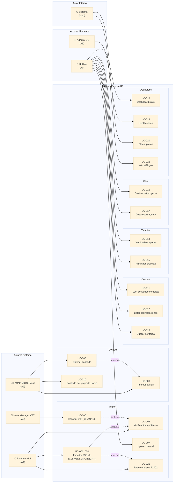
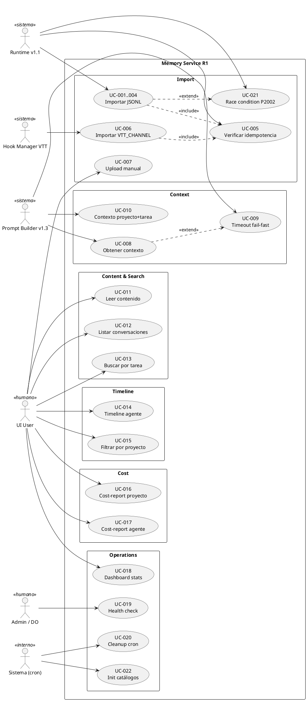

# 2.3.2 — Use Case Diagram

**Proyecto:** Memory Service
**Fase:** Analysis (Phase 4)
**Tarea VTT:** MS-020
**Autor:** SA Ejecutor (`0c128e3b-db3b-4e31-b107-0379b5791233`)
**Fecha:** 2026-05-05

---

## Diagrama UML — Notación Mermaid

---

## Diagrama Alternativo — PlantUML

---

## Leyenda

| Símbolo | Significado |
|---------|-------------|
| `→` (línea sólida) | Actor inicia el caso de uso |
| `..> <<include>>` | UC siempre ejecuta otro UC como sub-flujo |
| `..> <<extend>>` | UC condicionalmente ejecuta otro UC |
| `🤖` | Actor sistema (automático) |
| `👤` | Actor humano |
| `⏰` | Actor interno (cron/timer) |

---

## Fuentes

- 2.3.3_use_case_list.md (MS-020) — inventario de UCs
- 2.3.5_actor_definitions.md (MS-020) — definición de actores
