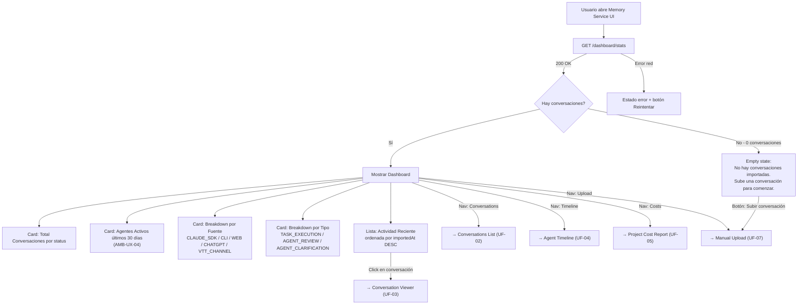
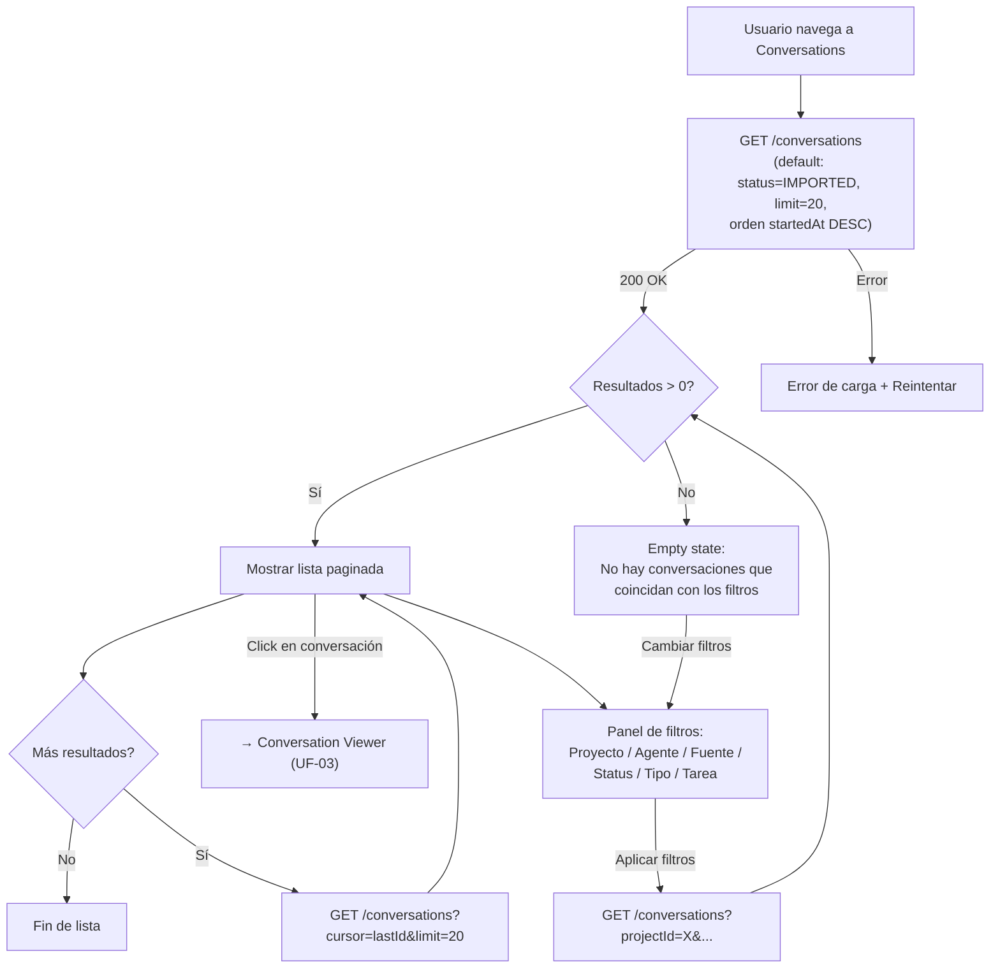
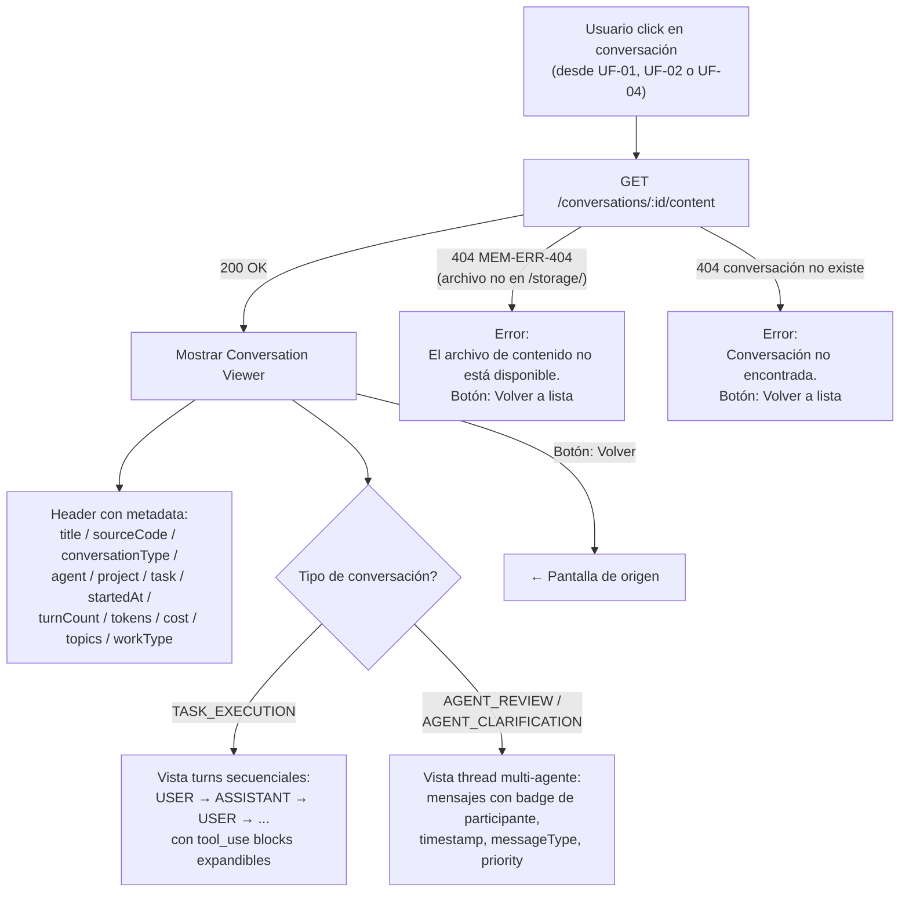
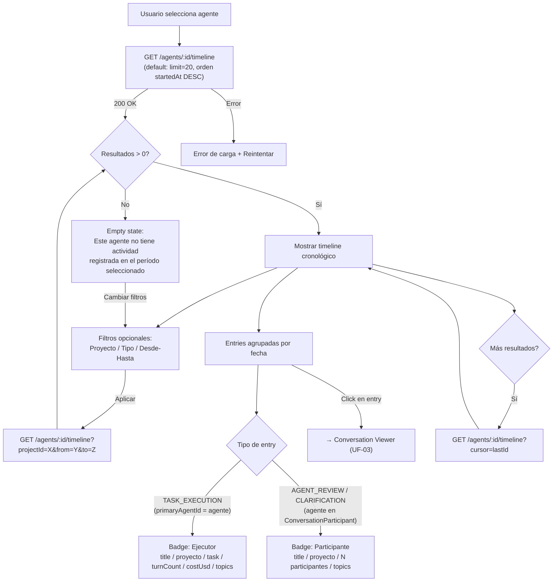
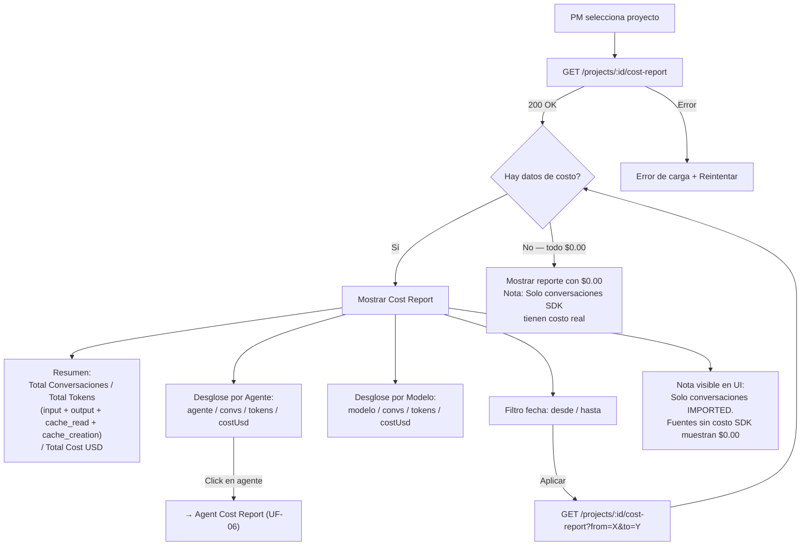
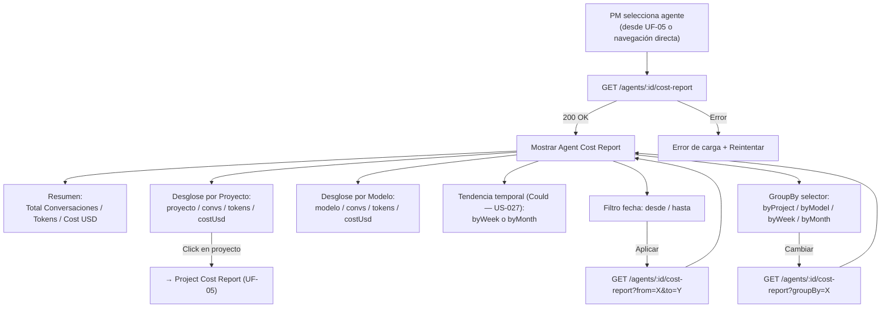
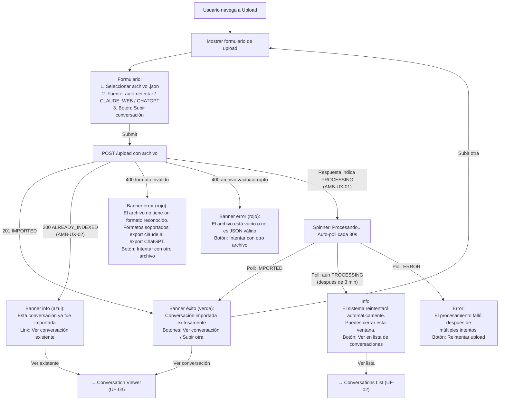
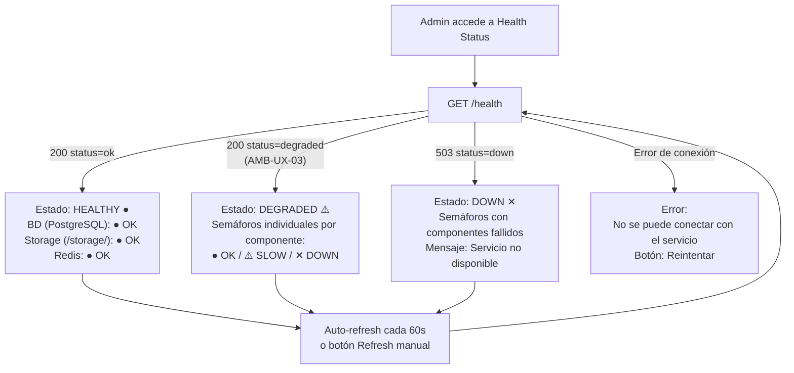

# 2.6.1 — User Flow Diagrams

**Proyecto:** Memory Service  
**Fase:** Analysis (Phase 4)  
**Tarea VTT:** MS-023  
**Autor:** UX Designer — `a75a1dae-754a-4b6f-a3ff-db8d51f6a91b`  
**Fecha:** 2026-05-06

---

## 1. Resolución de Ambigüedades UX

Antes de los diagramas, se documentan las decisiones UX que aplican transversalmente a los flujos.

| AMB | Decisión | Justificación |
|-----|----------|---------------|
| **AMB-UX-01** | POST /upload muestra spinner "Procesando..." con auto-poll cada 30s al estado de la conversación. Si tras 3 minutos sigue en PROCESSING, muestra "El sistema reintentará automáticamente. Puedes cerrar esta ventana." | El cleanup cron reintenta cada 5 min (BR-006). El usuario no necesita esperar indefinidamente. 3 min = 6 polls, suficiente para el happy path (<10s). |
| **AMB-UX-02** | ALREADY_INDEXED se muestra como banner informativo (azul) con texto "Esta conversación ya fue importada" y link "Ver conversación" que navega al Conversation Viewer. No es error. | Reimportar no es fallo del usuario — es idempotencia funcionando (BR-001). Rojo sería confuso. |
| **AMB-UX-03** | Health parcial muestra semáforos individuales por componente (BD, Storage, Redis). Verde = OK, Amarillo = SLOW/DEGRADED, Rojo = DOWN/UNREACHABLE. El estado global es el peor de los tres. | El Admin necesita diagnosticar qué componente falla sin revisar logs (US-030). |
| **AMB-UX-04** | Dashboard muestra "Agentes activos (últimos 30 días)" con la ventana temporal visible en la UI. Coordinado con SA: BR-015 define 30 días fijos, no configurable en R1. | Consistente con AMB-UC-05 (resuelta por PM) y BR-015. El usuario debe saber qué ventana se usa. |

---

## 2. Diagrama por Pantalla

### UF-01 · Dashboard

**Endpoint:** `GET /api/dashboard/stats`  
**Actor:** TL, PM (A4)  
**UC:** UC-018 | **US:** US-028 | **BR:** BR-015  
**Auth:** Ninguna (R1)

**Datos mostrados (RF-028):**
- `totalConversations`: conteo por status (IMPORTED, PENDING, PROCESSING, ERROR)
- `bySource`: conteo por sourceCode (5 fuentes)
- `byType`: conteo por conversationType (3 tipos)
- `activeAgents`: COUNT DISTINCT primaryAgentId con IMPORTED en últimos 30 días
- `recentActivity`: últimas N conversaciones ordenadas por importedAt DESC

---

### UF-02 · Conversations List

**Endpoint:** `GET /api/conversations`  
**Actor:** TL (A4)  
**UC:** UC-012, UC-013 | **US:** US-018, US-020 | **BR:** BR-012 (solo IMPORTED por default)  
**Auth:** Ninguna (R1)

**Datos por card (RF-018):**
- title, sourceCode, agentRole, projectId, taskKey, startedAt
- turnCount, totalTokens, costUsd
- topics[], workType
- contentPreview (500 chars — BR-020)

**Reglas aplicadas:**
- Default status = IMPORTED (RF-020). Para ver otros estados, selección explícita.
- Orden startedAt DESC siempre (RF-019). Sin ordenamiento configurable en R1.
- Paginación cursor-based, limit 20 default, max 100.

---

### UF-03 · Conversation Viewer

**Endpoint:** `GET /api/conversations/:id/content`  
**Actor:** TL (A4)  
**UC:** UC-011 | **US:** US-017, US-021 | **BR:** BR-003, BR-004  
**Auth:** Ninguna (R1)

**Comportamiento técnico:**
- El contenido completo se lee del filesystem, no de BD (D-MEM-43)
- La BD solo almacena contentPreview (500 chars del primer turno asistente — D-MEM-18)
- TASK_EXECUTION: `/storage/{sourceCode}/{conversationId}.jsonl`
- VTT_CHANNEL: `/storage/_reviews/{conversationId}.jsonl`
- Archivos JSONL grandes pueden tardar — mostrar skeleton + spinner para el contenido

---

### UF-04 · Agent Timeline

**Endpoint:** `GET /api/agents/:id/timeline`  
**Actor:** TL (A4)  
**UC:** UC-014, UC-015 | **US:** US-016, US-019 | **BR:** BR-021  
**Auth:** Ninguna (R1)

**Reglas aplicadas:**
- Timeline incluye conversaciones como primaryAgentId (TASK_EXECUTION) **O** como participante en ConversationParticipant (REVIEW/CLARIFICATION) per RF-021
- Cada entry incluye: conversationId, title, sourceCode, conversationTypeCode, projectId, taskId, startedAt, turnCount, classification, topics, costUsd (RF-023)
- Paginación cursor-based, limit 20 default
- Filtros opcionales: projectId, conversationTypeCode, from/to (RF-022)

---

### UF-05 · Project Cost Report

**Endpoint:** `GET /api/projects/:id/cost-report`  
**Actor:** PM (A4)  
**UC:** UC-016 | **US:** US-022, US-023, US-025, US-026 | **BR:** BR-014, BR-016  
**Auth:** Ninguna (R1)

**Reglas aplicadas:**
- Solo conversaciones IMPORTED cuentan en totales (BR-016, RF-027)
- Costo importado del SDK, no recalculado (BR-014, RF-026)
- Conversaciones CLAUDE_WEB, CHATGPT, VTT_CHANNEL tienen totalCostUsd = null → muestran $0.00, NO se excluyen (BR-014)
- Desglose por agente y por modelo

---

### UF-06 · Agent Cost Report

**Endpoint:** `GET /api/agents/:id/cost-report`  
**Actor:** PM (A4)  
**UC:** UC-017 | **US:** US-024, US-027 | **BR:** BR-014, BR-016, BR-017  
**Auth:** Ninguna (R1)

**Nota técnica:** byWeek usa DATE_TRUNC SQL raw (BR-017, TL-08). Formato de salida: YYYY-W##.

---

### UF-07 · Manual Upload

**Endpoint:** `POST /api/conversations/upload`  
**Actor:** Cualquier rol (A4)  
**UC:** UC-007 | **US:** US-006 | **BR:** BR-001, BR-002, BR-019  
**Auth:** Ninguna (R1)

**Flujo de estados post-upload:**
1. POST /upload → respuesta inmediata con conversationId y status
2. Si status = IMPORTED → éxito inmediato
3. Si status = PROCESSING → UI inicia auto-poll cada 30s a GET /conversations/:id
4. Si después de 6 polls (3 min) sigue PROCESSING → mostrar mensaje informativo
5. El cleanup cron (BR-006) reintentará cada 5 min en background

---

### UF-08 · Health Status

**Endpoint:** `GET /api/health`  
**Actor:** Admin / DO (A5)  
**UC:** UC-019 | **US:** US-029, US-030  
**Auth:** Ninguna (R1)

**Semáforos (AMB-UX-03):**
- ● Verde = OK
- ⚠ Amarillo = SLOW / DEGRADED
- ✕ Rojo = DOWN / UNREACHABLE
- Estado global = el peor de los tres componentes

---

## 3. Cobertura

| Pantalla | Diagrama | UCs cubiertos | USs cubiertos | Endpoint |
|----------|----------|---------------|---------------|----------|
| Dashboard | UF-01 | UC-018 | US-028 | GET /dashboard/stats |
| Conversations List | UF-02 | UC-012, UC-013 | US-018, US-020 | GET /conversations |
| Conversation Viewer | UF-03 | UC-011 | US-017, US-021 | GET /content |
| Agent Timeline | UF-04 | UC-014, UC-015 | US-016, US-019 | GET /timeline |
| Project Cost Report | UF-05 | UC-016 | US-022, US-023, US-025, US-026 | GET /projects/:id/cost-report |
| Agent Cost Report | UF-06 | UC-017 | US-024, US-027 | GET /agents/:id/cost-report |
| Manual Upload | UF-07 | UC-007 | US-006 | POST /upload |
| Health Status | UF-08 | UC-019 | US-029, US-030 | GET /health |

**Cobertura total:** 8/8 pantallas · 11 UCs · 15 USs · 8 endpoints UI

---

## 4. Fuentes

- SPEC_MEMORY_SERVICE_v1.9_CONSOLIDADO.md §8, §17
- 2.3.3_use_case_list.md (MS-020) — inventario de UCs
- 2.3.4_detailed_use_cases.md (MS-020) — flujos detallados
- 2.3.5_actor_definitions.md (MS-020) — actores A4, A5
- 2.4.2_user_stories.md (MS-021) — 33 US
- 2.5.2_rules_list.md (MS-022) — BR-001..BR-023
- 2.5.6_state_transition_rules.md (MS-022) — máquina de estados
- ASSIGNMENT_MS-023_user-flows.md — criterios y ambigüedades
- OPERATIVO_UX §9 — constraints R1 (LIM-08 desktop only, LIM-07 sin auth)
