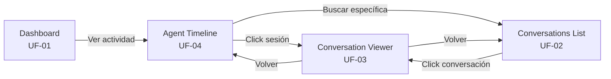
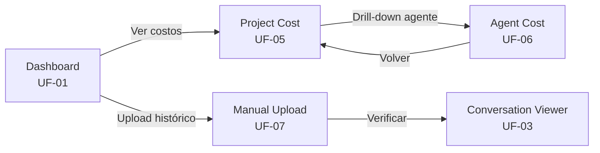
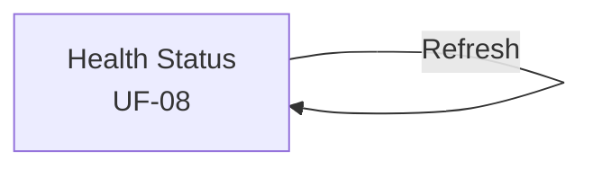

# 2.6.5 — User Journey Maps

**Proyecto:** Memory Service  
**Fase:** Analysis (Phase 4)  
**Tarea VTT:** MS-023  
**Autor:** UX Designer — `a75a1dae-754a-4b6f-a3ff-db8d51f6a91b`  
**Fecha:** 2026-05-06

---

## 1. Propósito

Documentar el journey completo de los dos actores humanos principales de Memory Service UI: el Tech Lead (TL) y el Product Manager (PM). Cada journey cubre desde la motivación inicial hasta la resolución del objetivo, incluyendo las pantallas visitadas, las emociones del usuario, los pain points y las oportunidades de mejora.

El Admin/DO tiene un journey simple y acotado (Health check) que se incluye como journey complementario.

---

## 2. Journey Map — Tech Lead (TL)

### 2.1 Perfil del Actor

| Campo | Valor |
|-------|-------|
| **Rol** | Tech Lead del proyecto |
| **Frecuencia de uso** | Diaria (2-5 veces por día) |
| **Objetivo principal** | Auditar qué hicieron los agentes, revisar calidad de sesiones, detectar anomalías |
| **Pantallas principales** | Agent Timeline, Conversation Viewer, Conversations List |
| **Conocimiento técnico** | Alto — entiende JSONL, tool_use blocks, tokens |

### 2.2 Journey: "Revisar qué hizo el agente BE hoy"

```
┌─────────────────────────────────────────────────────────────────────────────┐
│  JOURNEY: TL revisa la actividad del agente BE del día                      │
├──────────┬──────────┬──────────┬──────────┬──────────┬──────────────────────┤
│  FASE 1  │  FASE 2  │  FASE 3  │  FASE 4  │  FASE 5  │  FASE 6            │
│ Contexto │ Localizar│ Explorar │ Profun-  │ Cruzar   │ Conclusión          │
│ rápido   │ agente   │ timeline │ dizar    │ datos    │                      │
├──────────┼──────────┼──────────┼──────────┼──────────┼──────────────────────┤
│          │          │          │          │          │                      │
│ Abre UI  │ Navega a │ Ve lista │ Click en │ Vuelve a │ Tiene visión        │
│ Ve Dash- │ Timeline │ de       │ sesión   │ timeline │ completa de lo      │
│ board    │ Selec-   │ sesiones │ específ. │ Revisa   │ que hizo BE hoy     │
│          │ ciona BE │ del día  │ Lee turns│ review   │                      │
│          │          │          │ completos│ multi-ag │                      │
│          │          │          │          │          │                      │
├──────────┼──────────┼──────────┼──────────┼──────────┼──────────────────────┤
│PANTALLAS │          │          │          │          │                      │
│          │          │          │          │          │                      │
│ UF-01    │ UF-04    │ UF-04    │ UF-03    │ UF-04    │ —                    │
│Dashboard │Timeline  │Timeline  │Viewer    │→ UF-03   │                      │
│          │          │          │          │Viewer    │                      │
│          │          │          │          │(REVIEW)  │                      │
├──────────┼──────────┼──────────┼──────────┼──────────┼──────────────────────┤
│ACCIONES  │          │          │          │          │                      │
│          │          │          │          │          │                      │
│ GET      │ Selec-   │ Scroll   │ GET      │ Click    │ Cierra UI o         │
│ /dash-   │ cionar   │ entries  │ /content │ otra     │ navega a otra       │
│ board/   │ agente   │ Filtrar  │ Leer     │ entry    │ sección             │
│ stats    │ "BE" del │ por      │ USER →   │ tipo     │                      │
│          │ dropdown │ proyecto │ ASSIST.  │ REVIEW   │                      │
│          │          │ o fecha  │ Expandir │ Ver      │                      │
│          │          │          │ tool_use │ thread   │                      │
├──────────┼──────────┼──────────┼──────────┼──────────┼──────────────────────┤
│PIENSA    │          │          │          │          │                      │
│          │          │          │          │          │                      │
│"¿Cuántas │"Necesito │"Hizo 4   │"Bien, el │"También  │"BE trabajó bien     │
│ sesiones │ ver qué  │ sesiones │ approach │ participó│ hoy. La sesión de   │
│ hubo     │ hizo BE  │ hoy, más │ del POST │ en el    │ import necesita     │
│ hoy?"    │ específi-│ un       │ /import  │ review   │ revisión del        │
│          │ camente" │ review"  │ es       │ del      │ approach de         │
│          │          │          │ correcto"│ schema"  │ error handling"     │
├──────────┼──────────┼──────────┼──────────┼──────────┼──────────────────────┤
│EMOCIÓN   │          │          │          │          │                      │
│          │          │          │          │          │                      │
│ 😐       │ 🙂      │ 🙂      │ 🤔→😊   │ 😊      │ ✅ Satisfecho        │
│Neutral   │Orientado │Informado │Analizando│Completo  │Tiene la info        │
│          │          │          │→Conforme │          │que necesitaba       │
├──────────┼──────────┼──────────┼──────────┼──────────┼──────────────────────┤
│PAIN      │          │          │          │          │                      │
│POINTS    │          │          │          │          │                      │
│          │          │          │          │          │                      │
│Dashboard │Necesita  │Si hay    │JSONL     │Necesita  │—                    │
│no indica │saber     │muchas    │grande    │distinguir│                      │
│actividad │el UUID   │entries,  │puede     │entries   │                      │
│por       │del       │scroll    │tardar en │donde BE  │                      │
│agente    │agente    │largo     │cargar    │es ejecu- │                      │
│específ.  │(no solo  │          │(EC-09)   │tor vs    │                      │
│          │nombre)   │          │          │partici-  │                      │
│          │          │          │          │pante     │                      │
├──────────┼──────────┼──────────┼──────────┼──────────┼──────────────────────┤
│OPORTUNI- │          │          │          │          │                      │
│DADES     │          │          │          │          │                      │
│          │          │          │          │          │                      │
│Link      │Dropdown  │Agrupar   │Skeleton  │Badges    │Bookmark             │
│directo   │con nombre│por fecha │loader    │claros    │sesiones             │
│Dashboard │+ rol     │con       │rápido    │"Ejecutor"│importantes          │
│→Timeline │visible   │collapse/ │para      │vs        │(R2)                 │
│por       │          │expand    │header    │"Partici- │                      │
│agente    │          │          │          │pante"    │                      │
└──────────┴──────────┴──────────┴──────────┴──────────┴──────────────────────┘
```

### 2.3 Journey: "Encontrar una sesión específica por tarea"

```
┌─────────────────────────────────────────────────────────────────────────────┐
│  JOURNEY: TL busca las sesiones del agente DB en la tarea MEM-048          │
├──────────┬──────────────┬──────────────┬──────────────┬─────────────────────┤
│  FASE 1  │  FASE 2      │  FASE 3      │  FASE 4      │  FASE 5            │
│ Necesidad│ Buscar       │ Filtrar      │ Revisar      │ Resultado          │
├──────────┼──────────────┼──────────────┼──────────────┼─────────────────────┤
│          │              │              │              │                     │
│ TL necesi│ Navega a     │ Aplica       │ Click en     │ Encontró la info   │
│ ta saber │ Conversations│ filtros:     │ conversación │ que necesitaba     │
│ qué hizo │ List         │ Agente: DB   │ relevante    │                     │
│ DB en el │              │ Tarea: 048   │ Lee contenido│                     │
│ schema   │              │              │              │                     │
├──────────┼──────────────┼──────────────┼──────────────┼─────────────────────┤
│PANTALLAS │              │              │              │                     │
│ —        │ UF-02        │ UF-02        │ UF-03        │ —                   │
│          │ Conv. List   │ Conv. List   │ Viewer       │                     │
│          │              │ (filtrada)   │              │                     │
├──────────┼──────────────┼──────────────┼──────────────┼─────────────────────┤
│ACCIONES  │              │              │              │                     │
│          │ GET          │ GET          │ GET          │                     │
│          │ /conversa-   │ /conversa-   │ /content     │ Volver o cerrar    │
│          │ tions        │ tions?       │              │                     │
│          │              │ agentId=X    │ Leer turns   │                     │
│          │              │ &taskId=Y    │ Expandir     │                     │
│          │              │              │ tool_use     │                     │
├──────────┼──────────────┼──────────────┼──────────────┼─────────────────────┤
│EMOCIÓN   │ 🤔 Necesito  │ 🙂 Encontré │ 😊 Exacto    │ ✅ Resuelto         │
│          │ encontrarlo  │ 3 resultados │ esto buscaba │                     │
├──────────┼──────────────┼──────────────┼──────────────┼─────────────────────┤
│PAIN      │No hay        │Si no sabe    │contentPreview│                     │
│POINTS    │búsqueda      │el taskId,    │(500 chars)   │                     │
│          │full-text     │no puede      │a veces no    │                     │
│          │(LIM-01)      │filtrar       │es suficiente │                     │
│          │              │por tarea     │para decidir  │                     │
├──────────┼──────────────┼──────────────┼──────────────┼─────────────────────┤
│OPORTUNI- │Filtro por    │Autocompletar │Preview       │                     │
│DADES     │taskKey       │de taskKey    │expandible    │                     │
│          │(MEM-048)     │en filtro     │en la lista   │                     │
│          │además de     │              │(R2)          │                     │
│          │taskId UUID   │              │              │                     │
└──────────┴──────────────┴──────────────┴──────────────┴─────────────────────┘
```

---

## 3. Journey Map — Product Manager (PM)

### 3.1 Perfil del Actor

| Campo | Valor |
|-------|-------|
| **Rol** | Product Manager del proyecto |
| **Frecuencia de uso** | 2-3 veces por semana |
| **Objetivo principal** | Controlar presupuesto de tokens, ver estado general del sistema, detectar tendencias de costo |
| **Pantallas principales** | Dashboard, Project Cost Report, Agent Cost Report |
| **Conocimiento técnico** | Medio — entiende métricas, no necesariamente JSONL |

### 3.2 Journey: "Control semanal de costos del proyecto"

```
┌─────────────────────────────────────────────────────────────────────────────┐
│  JOURNEY: PM hace control semanal de costos de Memory Service              │
├──────────┬──────────┬──────────┬──────────┬──────────┬──────────────────────┤
│  FASE 1  │  FASE 2  │  FASE 3  │  FASE 4  │  FASE 5  │  FASE 6            │
│ Vista    │ Costo    │ Identificar│ Profun- │ Tendencia│ Decisión            │
│ general  │ proyecto │ top agent │ dizar   │ temporal │                      │
├──────────┼──────────┼──────────┼──────────┼──────────┼──────────────────────┤
│          │          │          │          │          │                      │
│ Abre UI  │ Navega a │ Ve tabla │ Click en │ Cambia   │ Decide si el        │
│ Dashboard│ Project  │ desglose │ agente   │ GroupBy  │ consumo es          │
│ Ve total │ Cost     │ por      │ más      │ a byWeek │ aceptable o         │
│ de convs │ Report   │ agente   │ costoso  │ Ve       │ necesita ajuste     │
│ y agentes│          │          │          │ tendencia│                      │
├──────────┼──────────┼──────────┼──────────┼──────────┼──────────────────────┤
│PANTALLAS │          │          │          │          │                      │
│          │          │          │          │          │                      │
│ UF-01    │ UF-05    │ UF-05    │ UF-06    │ UF-06    │ —                    │
│Dashboard │Project   │Project   │Agent     │Agent     │                      │
│          │Cost      │Cost      │Cost      │Cost      │                      │
│          │Report    │Report    │Report    │(byWeek)  │                      │
├──────────┼──────────┼──────────┼──────────┼──────────┼──────────────────────┤
│ACCIONES  │          │          │          │          │                      │
│          │          │          │          │          │                      │
│ GET      │ GET      │ Revisar  │ GET      │ GET      │ Exportar datos      │
│ /dash-   │ /projects│ tabla    │ /agents/ │ /agents/ │ (manual,            │
│ board/   │ /:id/    │ desglose │ :id/     │ :id/     │ copy-paste)         │
│ stats    │ cost-    │ Filtrar  │ cost-    │ cost-    │                      │
│          │ report   │ from/to  │ report   │ report?  │                      │
│          │          │ semana   │          │ groupBy= │                      │
│          │          │          │          │ byWeek   │                      │
├──────────┼──────────┼──────────┼──────────┼──────────┼──────────────────────┤
│PIENSA    │          │          │          │          │                      │
│          │          │          │          │          │                      │
│"¿Cuánto  │"$12.34   │"BE gasta │"¿Está   │"El costo │"El incremento       │
│ estamos  │ esta     │ más que  │ crecien- │ subió en │ es esperado por     │
│ gastan-  │ semana.  │ todos.   │ do o es  │ W21.     │ el inicio de Dev.   │
│ do?"     │ ¿Es      │ Tiene    │ estable?"│ Coincide │ Monitorear W22."    │
│          │ mucho?"  │ sentido?"│          │ con Dev" │                      │
├──────────┼──────────┼──────────┼──────────┼──────────┼──────────────────────┤
│EMOCIÓN   │          │          │          │          │                      │
│          │          │          │          │          │                      │
│ 😐       │ 🤔      │ 🤔      │ 🧐      │ 😊      │ ✅ Informado         │
│ Neutral  │ Evaluan- │ Investi- │ Anali-   │ Entiende │ Puede tomar         │
│          │ do       │ gando    │ zando    │ la causa │ decisión             │
├──────────┼──────────┼──────────┼──────────┼──────────┼──────────────────────┤
│PAIN      │          │          │          │          │                      │
│POINTS    │          │          │          │          │                      │
│          │          │          │          │          │                      │
│Dashboard │No indica │Fuentes   │No hay    │byWeek    │No hay export        │
│no muestra│si el     │sin costo │alerta    │depende   │a CSV/PDF            │
│costo     │gasto es  │($0.00)   │automática│de SQL    │en R1                │
│total     │mayor o   │pueden    │si el     │raw       │                      │
│directo   │menor que │confundir │costo     │(BR-017)  │                      │
│          │semana    │          │sube      │          │                      │
│          │anterior  │          │mucho     │          │                      │
├──────────┼──────────┼──────────┼──────────┼──────────┼──────────────────────┤
│OPORTUNI- │          │          │          │          │                      │
│DADES     │          │          │          │          │                      │
│          │          │          │          │          │                      │
│Card de   │Compara-  │Nota      │Alertas   │Gráfico   │Export CSV           │
│costo     │ción vs   │explicati-│de umbral │de línea  │(R2)                 │
│total en  │período   │va para   │de costo  │visual    │                      │
│Dashboard │anterior  │$0.00     │(R2)      │(R2)      │                      │
│          │(R2)      │(EC-02)   │          │          │                      │
└──────────┴──────────┴──────────┴──────────┴──────────┴──────────────────────┘
```

### 3.3 Journey: "Importar conversaciones históricas al inicio del proyecto"

```
┌─────────────────────────────────────────────────────────────────────────────┐
│  JOURNEY: PM sube 5 exports de claude.ai al inicio del proyecto            │
├──────────┬──────────────┬──────────────┬──────────────┬─────────────────────┤
│  FASE 1  │  FASE 2      │  FASE 3      │  FASE 4      │  FASE 5            │
│ Motivación│ Primer      │ Verificar    │ Subir resto  │ Confirmar          │
│          │ upload      │              │              │                     │
├──────────┼──────────────┼──────────────┼──────────────┼─────────────────────┤
│          │              │              │              │                     │
│ PM tiene │ Navega a     │ Ve banner    │ Sube 4       │ Ve las 5 en la     │
│ 5 exports│ Upload       │ éxito        │ archivos más │ lista de           │
│ históri- │ Sube primer  │ Click "Ver"  │ Uno retorna  │ conversaciones     │
│ cos en   │ archivo      │ para verif.  │ ALREADY_     │                     │
│ su disco │              │ contenido    │ INDEXED      │                     │
├──────────┼──────────────┼──────────────┼──────────────┼─────────────────────┤
│PANTALLAS │              │              │              │                     │
│ —        │ UF-07        │ UF-03        │ UF-07        │ UF-02              │
│          │ Upload       │ Viewer       │ Upload (×4)  │ Conv. List         │
├──────────┼──────────────┼──────────────┼──────────────┼─────────────────────┤
│ACCIONES  │              │              │              │                     │
│          │ Drag & drop  │ GET /content │ POST /upload │ GET                │
│          │ archivo      │ Verificar    │ ×4           │ /conversations     │
│          │ POST /upload │ que el       │ Uno da       │ Filtrar por        │
│          │              │ contenido    │ ALREADY_     │ CLAUDE_WEB         │
│          │              │ es correcto  │ INDEXED      │                     │
├──────────┼──────────────┼──────────────┼──────────────┼─────────────────────┤
│EMOCIÓN   │ 😐 Tarea     │ 😊 Funciona  │ 🤔 ¿Error?   │ ✅ Todo importado   │
│          │ necesaria    │              │ → ℹ️ Ah, ya   │                     │
│          │              │              │ estaba. OK.  │                     │
├──────────┼──────────────┼──────────────┼──────────────┼─────────────────────┤
│PAIN      │No hay batch  │              │ALREADY_      │                     │
│POINTS    │upload — debe │              │INDEXED puede │                     │
│          │subir 1 por 1 │              │confundir si  │                     │
│          │              │              │no se explica │                     │
├──────────┼──────────────┼──────────────┼──────────────┼─────────────────────┤
│OPORTUNI- │Batch upload  │              │Banner azul   │Contador de         │
│DADES     │(R2)          │              │con fecha     │"importados hoy"    │
│          │              │              │del import    │                     │
│          │              │              │original      │                     │
│          │              │              │(AMB-UX-02)   │                     │
└──────────┴──────────────┴──────────────┴──────────────┴─────────────────────┘
```

---

## 4. Journey Map — Admin / DO (Complementario)

### 4.1 Perfil del Actor

| Campo | Valor |
|-------|-------|
| **Rol** | DevOps Engineer |
| **Frecuencia de uso** | Bajo demanda (pre-deploy, post-incidente) |
| **Objetivo principal** | Verificar que el servicio y sus componentes están operativos |
| **Pantallas principales** | Health Status |
| **Conocimiento técnico** | Alto — entiende BD, storage, Redis, docker |

### 4.2 Journey: "Verificación pre-deploy"

```
┌─────────────────────────────────────────────────────────────────────────────┐
│  JOURNEY: Admin verifica health antes de deploy de Runtime                  │
├──────────┬──────────────┬──────────────┬────────────────────────────────────┤
│  FASE 1  │  FASE 2      │  FASE 3      │  FASE 4                           │
│ Verificar│ Revisar      │ Confirmar    │ Proceder                          │
├──────────┼──────────────┼──────────────┼────────────────────────────────────┤
│          │              │              │                                    │
│ Abre     │ Ve semáforos │ Todos en     │ Da luz verde al deploy            │
│ Health   │ por compo-   │ verde        │ del Runtime                       │
│ Status   │ nente        │              │                                    │
├──────────┼──────────────┼──────────────┼────────────────────────────────────┤
│PANTALLAS │              │              │                                    │
│ UF-08    │ UF-08        │ UF-08        │ (Sale de Memory Service UI)       │
├──────────┼──────────────┼──────────────┼────────────────────────────────────┤
│ACCIONES  │              │              │                                    │
│ GET      │ Leer estado  │ Click        │ Comunicar al equipo               │
│ /health  │ de cada      │ Refresh para │                                    │
│          │ componente   │ confirmar    │                                    │
├──────────┼──────────────┼──────────────┼────────────────────────────────────┤
│EMOCIÓN   │ 😐 Rutina    │ 🙂 Conforme  │ ✅ Listo                           │
├──────────┼──────────────┼──────────────┼────────────────────────────────────┤
│PAIN      │No hay        │No puede ver  │                                    │
│POINTS    │historial     │si el cleanup │                                    │
│          │de health     │cron está     │                                    │
│          │(solo actual) │ejecutándose  │                                    │
├──────────┼──────────────┼──────────────┼────────────────────────────────────┤
│OPORTUNI- │Health        │Indicador de  │                                    │
│DADES     │history       │último cleanup│                                    │
│          │(R2)          │run (R2)      │                                    │
└──────────┴──────────────┴──────────────┴────────────────────────────────────┘
```

---

## 5. Mapa de Touchpoints por Actor

### 5.1 TL — Flujo Típico Diario



**Pantallas frecuentes:** UF-04 (Timeline) → UF-03 (Viewer) — loop principal.  
**Pantallas ocasionales:** UF-02 (List) cuando necesita filtrar por campos específicos.  
**Pantallas raras:** UF-01 (Dashboard) solo como punto de entrada.

### 5.2 PM — Flujo Típico Semanal



**Pantallas frecuentes:** UF-01 (Dashboard) → UF-05 (Project Cost) → UF-06 (Agent Cost).  
**Pantallas ocasionales:** UF-07 (Upload) al inicio del proyecto.  
**Pantallas raras:** UF-03 (Viewer) solo para verificar uploads.

### 5.3 Admin — Flujo Bajo Demanda



**Pantalla única:** UF-08 (Health). Acceso puntual pre-deploy o post-incidente.

---

## 6. Resumen de Pain Points Detectados

| # | Pain Point | Actor | Pantalla | Severidad | Resolución R1 | Oportunidad R2 |
|---|-----------|-------|----------|-----------|----------------|----------------|
| PP-01 | No hay búsqueda full-text | TL | Conversations List | Media | Filtros por campos indexados (LIM-01) | Embeddings + búsqueda semántica |
| PP-02 | No hay batch upload | PM | Manual Upload | Baja | Upload de 1 archivo a la vez | Batch upload con progress |
| PP-03 | JSONL grande carga lento | TL | Viewer | Media | Skeleton loader + mensaje | Lazy rendering de turns |
| PP-04 | No hay comparación temporal en cost | PM | Cost Reports | Media | Filtro from/to manual | Comparación automática vs período anterior |
| PP-05 | No hay alertas de costo | PM | — | Baja | — | Alertas de umbral configurable |
| PP-06 | No hay export de datos | PM | Cost Reports | Baja | Copy-paste manual | Export CSV/PDF |
| PP-07 | No hay historial de health | Admin | Health | Baja | Solo estado actual | Timeline de health checks |
| PP-08 | $0.00 en fuentes sin SDK confunde | PM | Cost Reports | Media | Nota informativa (EC-02) | Separar visualmente fuentes con/sin costo |

**Nota:** Todos los pain points marcados como "Oportunidad R2" están fuera del scope R1 y NO deben diseñarse en esta fase. Se documentan para el roadmap de producto.

---

## 7. Fuentes

- ASSIGNMENT_MS-023_user-flows.md — "journey completo del TL y del PM"
- 2.3.5_actor_definitions.md — perfiles A4 (UI User), A5 (Admin)
- 0.4.4_target_customer_profile.md — segmentos de usuario
- 2.4.2_user_stories.md — US por actor
- 2.6.1_user_flow_diagrams.md — pantallas y navegación
- 2.6.3_error_flows.md — pain points de error
- 2.6.4_edge_case_flows.md — EC-02 ($0.00), EC-09 (JSONL grande)
- SPEC_MEMORY_SERVICE_v1.9_CONSOLIDADO.md §17 (prioridades de pantalla)
- OPERATIVO_UX §9 — LIM-01 (sin full-text), LIM-08 (desktop only)
