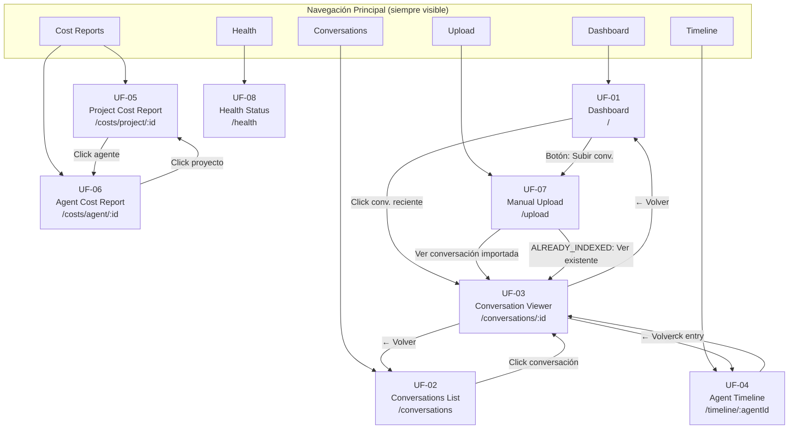
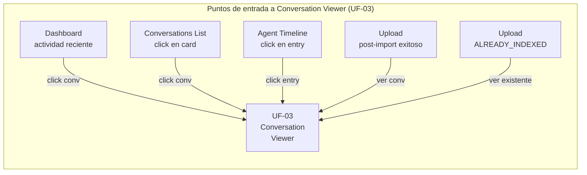
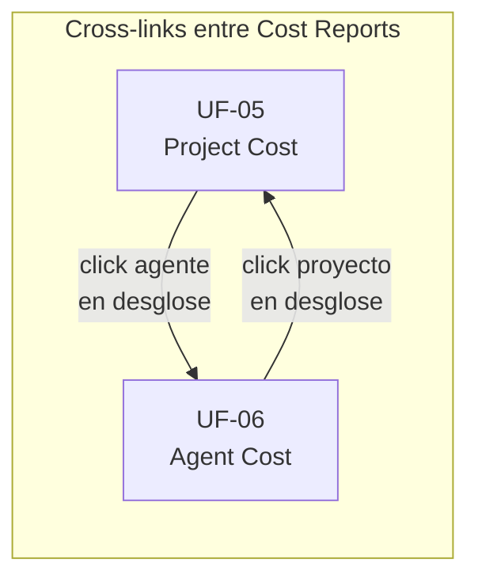
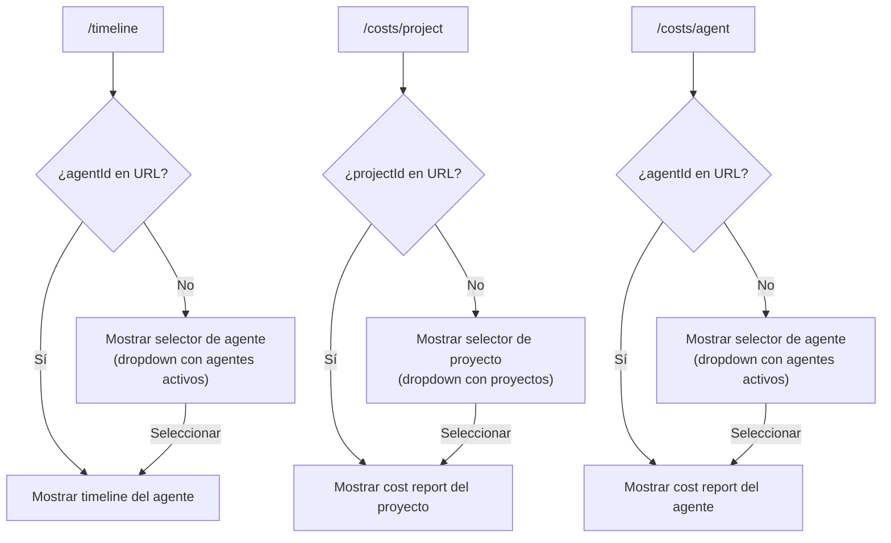

# 2.6.7 — Navigation Map

**Proyecto:** Memory Service  
**Fase:** Analysis (Phase 4)  
**Tarea VTT:** MS-023  
**Autor:** UX Designer — `a75a1dae-754a-4b6f-a3ff-db8d51f6a91b`  
**Fecha:** 2026-05-06

---

## 1. Propósito

Mapa completo de navegación entre las 8 pantallas de Memory Service UI R1. Define la estructura de navegación principal, los cross-links contextuales entre pantallas y los puntos de entrada al sistema.

---

## 2. Estructura de Navegación Principal

### 2.1 Sidebar / Top Navigation

La UI tiene una navegación global persistente (sidebar o top nav) con acceso directo a todas las secciones principales:

```
┌──────────────────────────────────┐
│  MEMORY SERVICE                  │
│                                  │
│  ● Dashboard          (UF-01)   │  ← Home / default
│  ● Conversations      (UF-02)   │
│  ● Timeline           (UF-04)   │
│  ● Cost Reports       ▾         │
│    ├─ Por Proyecto     (UF-05)  │
│    └─ Por Agente       (UF-06)  │
│  ● Upload             (UF-07)   │
│  ● Health             (UF-08)   │
│                                  │
└──────────────────────────────────┘
```

**Notas:**
- Dashboard es la pantalla por defecto al abrir la UI (ruta `/`)
- Conversation Viewer (UF-03) NO aparece en el nav — se accede contexualmente desde otras pantallas
- Cost Reports tiene submenu con dos opciones
- Health puede posicionarse separado (footer o sección "Admin")
- La nav se mantiene visible en todas las pantallas (SPA, no cambia entre rutas)

### 2.2 Rutas Propuestas

| Pantalla | Ruta URL | Nav Item |
|----------|----------|----------|
| Dashboard | `/` | ● Dashboard |
| Conversations List | `/conversations` | ● Conversations |
| Conversation Viewer | `/conversations/:id` | (sin nav item — acceso contextual) |
| Agent Timeline | `/timeline/:agentId` | ● Timeline |
| Project Cost Report | `/costs/project/:id` | ● Cost Reports → Por Proyecto |
| Agent Cost Report | `/costs/agent/:id` | ● Cost Reports → Por Agente |
| Manual Upload | `/upload` | ● Upload |
| Health Status | `/health` | ● Health |

**Nota:** Timeline y Cost Reports requieren seleccionar un agente/proyecto. La ruta base (`/timeline`, `/costs/project`) muestra un selector. La ruta con ID muestra los datos.

---

## 3. Mapa Completo de Navegación

### 3.1 Diagrama General



### 3.2 Diagrama de Cross-Links





---

## 4. Tabla de Navegación Completa

### 4.1 Navegación Directa (desde Nav Principal)

| Desde | Hacia | Acción | Siempre disponible |
|-------|-------|--------|--------------------|
| Cualquier pantalla | Dashboard (UF-01) | Click "Dashboard" en nav | ✅ |
| Cualquier pantalla | Conversations (UF-02) | Click "Conversations" en nav | ✅ |
| Cualquier pantalla | Timeline (UF-04) | Click "Timeline" en nav | ✅ |
| Cualquier pantalla | Project Cost (UF-05) | Click "Cost Reports → Por Proyecto" | ✅ |
| Cualquier pantalla | Agent Cost (UF-06) | Click "Cost Reports → Por Agente" | ✅ |
| Cualquier pantalla | Upload (UF-07) | Click "Upload" en nav | ✅ |
| Cualquier pantalla | Health (UF-08) | Click "Health" en nav | ✅ |

### 4.2 Navegación Contextual (Cross-Links)

| Desde | Hacia | Trigger | Dato transportado |
|-------|-------|---------|-------------------|
| Dashboard (UF-01) | Viewer (UF-03) | Click en conversación reciente | conversationId |
| Dashboard (UF-01) | Upload (UF-07) | Click "Subir conversación" (empty state) | — |
| Conversations List (UF-02) | Viewer (UF-03) | Click en card de conversación | conversationId |
| Agent Timeline (UF-04) | Viewer (UF-03) | Click en entry del timeline | conversationId |
| Project Cost (UF-05) | Agent Cost (UF-06) | Click en agente en tabla desglose | agentId |
| Agent Cost (UF-06) | Project Cost (UF-05) | Click en proyecto en tabla desglose | projectId |
| Upload (UF-07) | Viewer (UF-03) | "Ver conversación" post-IMPORTED | conversationId |
| Upload (UF-07) | Viewer (UF-03) | "Ver existente" post-ALREADY_INDEXED | conversationId |
| Upload (UF-07) | Conversations List (UF-02) | "Ver en lista" post-timeout 3min | — |

### 4.3 Navegación de Retorno (Back)

| Desde | Hacia | Acción | Comportamiento |
|-------|-------|--------|----------------|
| Viewer (UF-03) | Pantalla de origen | Click "← Volver" | Regresa a la pantalla desde donde se navegó (Dashboard, List o Timeline). Preserva filtros si venía de List o Timeline. |
| Agent Cost (UF-06) | Project Cost (UF-05) | Click "← Volver" (si vino de UF-05) | Regresa con proyecto preservado |

**Regla de "← Volver":** El botón volver regresa a la pantalla de origen, no siempre a la misma pantalla. Si el usuario llegó a UF-03 desde el Dashboard, volver va al Dashboard. Si llegó desde Timeline, volver va al Timeline. Implementación: usar browser history o estado de navegación.

---

## 5. Puntos de Entrada al Sistema

### 5.1 URL Directa

| URL | Pantalla | Comportamiento |
|-----|----------|----------------|
| `http://{host}:3003/` | Dashboard | Home por defecto |
| `http://{host}:3003/conversations` | Conversations List | Lista con defaults |
| `http://{host}:3003/conversations/{id}` | Conversation Viewer | Carga directa de una conversación |
| `http://{host}:3003/timeline/{agentId}` | Agent Timeline | Timeline de un agente específico |
| `http://{host}:3003/costs/project/{id}` | Project Cost Report | Cost de un proyecto específico |
| `http://{host}:3003/costs/agent/{id}` | Agent Cost Report | Cost de un agente específico |
| `http://{host}:3003/upload` | Manual Upload | Formulario de upload |
| `http://{host}:3003/health` | Health Status | Estado del servicio |

**Deep linking:** Todas las pantallas son accesibles por URL directa. Esto permite:
- Compartir links a conversaciones específicas entre miembros del equipo
- Bookmarear el cost report de un proyecto
- Scripts de monitoring que abren la health page

### 5.2 Ruta No Encontrada (404 de UI)

Si el usuario accede a una ruta que no existe (ej: `/settings`, `/admin`):

```
┌─────────────────────────────────────────────────────┐
│                                                      │
│           404                                        │
│  Página no encontrada                               │
│                                                      │
│  La ruta solicitada no existe.                      │
│                                                      │
│  [Ir al Dashboard]                                   │
│                                                      │
└─────────────────────────────────────────────────────┘
```

---

## 6. Matriz de Adyacencia

Tabla que muestra qué pantallas son alcanzables desde cada pantalla (nav + contextual):

| Desde ↓ / Hacia → | UF-01 | UF-02 | UF-03 | UF-04 | UF-05 | UF-06 | UF-07 | UF-08 |
|---------------------|:-----:|:-----:|:-----:|:-----:|:-----:|:-----:|:-----:|:-----:|
| **UF-01** Dashboard | — | nav | ctx | nav | nav | nav | nav+ctx | nav |
| **UF-02** Conv. List | nav | — | ctx | nav | nav | nav | nav | nav |
| **UF-03** Viewer | nav+back | nav+back | — | nav+back | nav | nav | nav | nav |
| **UF-04** Timeline | nav | nav | ctx | — | nav | nav | nav | nav |
| **UF-05** Project Cost | nav | nav | — | nav | — | ctx | nav | nav |
| **UF-06** Agent Cost | nav | nav | — | nav | ctx | — | nav | nav |
| **UF-07** Upload | nav | ctx | ctx | nav | nav | nav | — | nav |
| **UF-08** Health | nav | nav | — | nav | nav | nav | nav | — |

**Leyenda:**
- `nav` = accesible via navegación principal (siempre)
- `ctx` = accesible via cross-link contextual (click en dato)
- `back` = accesible via botón "← Volver"
- `nav+ctx` = ambos caminos disponibles
- `—` = misma pantalla (no aplica)

---

## 7. Flujo de Selección de Entidad

Varias pantallas requieren seleccionar una entidad (agente o proyecto) antes de mostrar datos:



**Fuente del dropdown de agentes:** Se puede derivar de `GET /dashboard/stats → activeAgents` o de un endpoint auxiliar. En R1, el dropdown puede ser un campo de texto con UUID (el equipo conoce los UUIDs). En R2, un selector con nombres legibles.

---

## 8. Constraints de Navegación R1

| Constraint | Impacto en navegación |
|-----------|----------------------|
| **LIM-08** Desktop only | No hay menú hamburger, no hay responsive. Nav sidebar siempre visible. Resolución mínima 1280x800. |
| **LIM-07** Sin autenticación | No hay pantalla de login. No hay logout. No hay rutas protegidas. Todas las pantallas son accesibles directamente. |
| **LIM-01** Sin full-text search | No hay barra de búsqueda global. La búsqueda es por filtros de campos indexados en Conversations List (UF-02). |
| **LIM-05** Sin RBAC | No hay diferenciación de nav por rol. TL, PM y Admin ven el mismo menú. Health no está oculto. |

---

## 9. Fuentes

- ASSIGNMENT_MS-023_user-flows.md — "mapa de navegación completo con rutas entre todas las pantallas"
- SPEC_MEMORY_SERVICE_v1.9_CONSOLIDADO.md §17 (pantallas por prioridad P0-P3)
- 2.3.5_actor_definitions.md — endpoints por actor
- 2.6.1_user_flow_diagrams.md — diagramas con navegación entre pantallas
- 2.6.2_happy_path_flows.md — flujos con transiciones entre pantallas
- 2.6.5_user_journey_maps.md — touchpoints por actor
- 2.6.6_task_flows.md — secuencias de pantallas por tarea
- OPERATIVO_UX §9 — LIM-01, LIM-05, LIM-07, LIM-08
